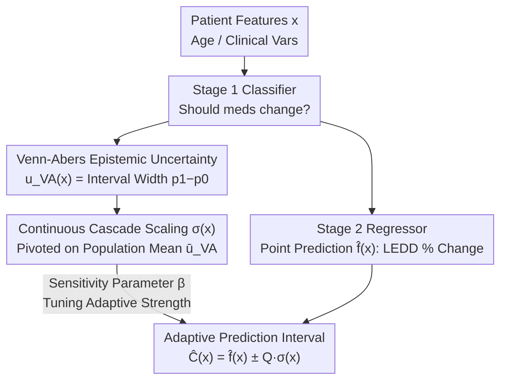

# CASCADE Conformal Prediction: Uncertainty-Adaptive Prediction Intervals for Two-Stage Clinical Decision Support

**Conference**: ICML2026  
**arXiv**: [2605.20468](https://arxiv.org/abs/2605.20468)  
**Code**: https://github.com/rdiazrincon/cascade_conformal_pd  
**Area**: Medical AI / Clinical Decision Support  
**Keywords**: Conformal Prediction, Uncertainty Quantization, Two-Stage Decision Making, Venn-Abers Calibration, Parkinson's Disease

## TL;DR
The CASCADE framework is proposed to propagate epistemic uncertainty from a first-stage classifier (quantified via Venn-Abers predictors) into second-stage regression prediction intervals. This enables a 38.9% reduction in interval width for high-confidence patients while automatically expanding safety buffers for uncertain cases, achieving adaptive coverage guarantees.

## Background & Motivation

**Background**: Medication management for Parkinson’s Disease (PD) is a typical two-stage decision problem—first determining if a patient needs a medication adjustment (classification), then predicting the dose adjustment magnitude (regression). Levodopa Equivalent Daily Dose (LEDD) is the standard metric for medication load, but the optimal titration process remains highly dependent on clinical trial-and-error. Recently, AI-driven clinical decision support systems have adopted two-stage architectures to assist this process.

**Limitations of Prior Work**: Standard Conformal Prediction (CP) methods operate independently during the regression stage, entirely ignoring the uncertainty of the first-stage classification decision. This implies that for patient A (where the classifier is 99% certain of an adjustment) and patient B (a borderline case with 55% confidence), the regression model provides prediction intervals of identical width. Predictions for patient B carry extreme clinical risk, as overconfident dose recommendations can lead to Levodopa-Induced Dyskinesia (LID).

**Key Challenge**: Two-stage architectures suffer from **information loss** at the decision boundary. Once a patient crosses the classification threshold, the probabilistic ambiguity of the first stage is discarded, causing a disconnection between the reliability of downstream regression and the certainty of upstream decisions. Standard conformal methods assume homoscedasticity, applying a globally consistent non-conformity threshold that fails to adjust intervals based on local epistemic risk.

**Goal**: Design a conformal prediction framework capable of explicitly propagating classification uncertainty into regression interval calibration, tightening intervals for high-confidence cases and expanding them for ambiguous ones to achieve risk-adaptive uncertainty quantification.

**Core Idea**: Use a Venn-Abers predictor to extract an epistemic uncertainty score from the first-stage classifier and map it as a scaling factor for the second-stage non-conformity score. This achieves cross-task uncertainty transfer without requiring the training of additional error-prediction models.

## Method

### Overall Architecture
CASCADE (Calibrated Adaptive Scaling via Conformal And Distributional Estimation) addresses the "decision boundary information loss" in two-stage clinical decisions. Patient features $x \in \mathbb{R}^d$ (age, clinical variables, etc.) enter the first-stage classifier to determine if a medication change is needed, followed by the second-stage regressor to predict the percentage change in LEDD. Data is split 80/20 into training set $D_{\text{train}}$ and calibration set $D_{\text{cal}}$. Crucially, instead of a binary decision, the classifier outputs an epistemic uncertainty score $u_{\text{VA}}(x)$ via Venn-Abers calibration. This score is passed to the second stage to dynamically scale the regression interval width—the "cascade effect."

### Key Designs

**1. Venn-Abers Epistemic Uncertainty Extraction: Quantifying "Model Hesitation"**

Standard softmax probabilities are often poorly calibrated in non-linear models, and a single scalar collapses too much information. CASCADE utilizes Venn-Abers predictors, which are distribution-free and output a multi-probability interval $[p_0(x), p_1(x)]$ for each $x$. The uncertainty score is defined as the width $u_{\text{VA}}(x) = p_1(x) - p_0(x)$. A wider interval indicates a more ambiguous classification decision. Venn-Abers is chosen because it provides a theoretically rigorous epistemic uncertainty measure that serves as a proxy for downstream regression reliability without needing an auxiliary model.

**2. Continuous Cascade Scaling: Population Mean as a Pivot to Avoid Fragmentation**

To map $u_{\text{VA}}(x)$ to a scaling factor, CASCADE defines a mean-centered scaling function $\sigma(x) = 1 + \beta \left( \frac{u_{\text{VA}}(x)}{\bar{u}_{\text{VA}}} - 1 \right)$, where $\bar{u}_{\text{VA}}$ is the average VA uncertainty in the calibration set and $\beta \geq 0$ is the sensitivity parameter. When uncertainty equals the population mean, $\sigma(x) \approx 1$, yielding a standard length interval. Higher uncertainty expands the interval, while lower uncertainty contracts it. Non-conformity scores are normalized as $S_i = |y_i - \hat{f}(x_i)| / \sigma(x_i)$. The final interval is:

$$\hat{C}(x) = \left[\hat{f}(x) \pm Q_{1-\alpha} \cdot \sigma(x)\right]$$

This continuous approach avoids the issues of discrete Mondrian CP, which partitions the calibration set into $K$ bins, leading to sample fragmentation ($N_{\text{cal}}/K$) and noisy quantile estimation. Continuous scaling uses the full calibration set to estimate a single quantile $Q_{1-\alpha}$, eliminating discretization artifacts while preserving statistical power.

**3. Sensitivity Parameter $\beta$: An Interpretable "Adaptive Knob"**

$\beta$ controls the system's responsiveness to uncertainty: $\beta = 0$ results in $\sigma(x) \equiv 1$, where CASCADE reduces to standard CP. Larger $\beta$ values increase the intensity of interval expansion/contraction. This parameter allows clinicians to tune the "accuracy vs. safety" tradeoff explicitly. Ablation shows that at $\beta = 0.7$, the Cascade Ratio (CR) reaches 4.23 while maintaining 80.1% marginal coverage, whereas $\beta \geq 0.9$ violates coverage guarantees.

## Key Experimental Results

### Main Results

Data includes ten years of records from 631 PD inpatients at UF Health. XGBoost serves as the base classifier and regressor. Evaluation focuses on patients requiring medication adjustment ($y_i \neq 0$) with a target coverage $1-\alpha = 80\%$.

| Method | Marginal Coverage | Avg Interval Length | Cascade Ratio (CR) |
|------|-----------|-------------|----------|
| Naïve | 52.5% | 0.031 | 1.00 |
| Standard CP | 84.0% | 0.113 | 1.00 |
| CV+ | 83.5% | 0.100 | 1.06 |
| J+aB | 60.6% | 0.132 | 0.97 |
| Mondrian (K=3) | 86.5% | 0.118 | 2.02 |
| **Cont. CASCADE (β=0.7)** | **80.1%** | **0.148** | **4.23** |

### Ablation Study (By Uncertainty Tiers)

| Uncertainty Tier | Method | Coverage | Interval Length | Relative Change |
|-----------|------|--------|---------|---------|
| Low (Bottom 33%) | Standard CP | 81.1% | 0.113 | — |
| Low (Bottom 33%) | CASCADE | 69.7% | 0.069 | **−38.9%** |
| Mid | Standard CP | 86.5% | 0.113 | — |
| Mid | CASCADE | 82.0% | 0.100 | −10.9% |
| High (Top 33%) | Standard CP | 85.4% | 0.113 | — |
| High (Top 33%) | CASCADE | 91.7% | 0.292 | **+158.9%** |

### Key Findings
- **Significant Cascade Effect**: CASCADE narrows intervals for low-uncertainty patients by 38.9% (0.113→0.069) and expands them for high-uncertainty patients by 158.9% (0.113→0.292), with coverage increasing from 85.4% to 91.7%.
- **Statistical Validation**: KS test $D=0.62$ ($p<10^{-54}$) confirms CASCADE produces a significantly different interval distribution compared to standard CP; Spearman correlation $\rho=0.999$ validates the monotonic relationship between interval length and VA scores.
- **Continuous > Discrete**: Increasing Mondrian bins to $K=7$ causes interval length to inflate to 0.170 (44% increase over $K=3$), while Continuous CASCADE maintains CR=6.83 without fragmentation penalties.
- **$\beta$ Sensitivity**: $\beta \leq 0.5$ results in under-adaptation (CR<3.0); $\beta \in [0.9, 1.0]$ violates coverage limits; $\beta=0.7$ is the optimal adaptive point under safety constraints.

## Highlights & Insights
- **Cross-task uncertainty transfer is the core innovation**: Instead of training additional residual models, reusing the first-stage Venn-Abers uncertainty as a scaling signal incurs near-zero computational overhead and is theoretically sound, as classification ambiguity is a direct proxy for regression reliability.
- **Elegant Mean-Centered Scaling**: Pivoting $\sigma(x)$ on the population mean ensures "standard patients" receive standard intervals while adjusting for "easy" or "hard" cases, maintaining the statistical efficiency of the global calibration set.
- **Plug-and-play for Two-Stage Architectures**: This framework can be applied to any "classify-then-regress" system (e.g., Deep Brain Stimulation settings, Botox dosage) simply by extracting Venn-Abers scores from the classification phase.

## Limitations & Future Work
- Current **symmetric scaling** does not account for asymmetric clinical risks where overdosing and underdosing have different consequences.
- Evaluation was primarily on the **subset requiring adjustments** ($y_i \neq 0$); error propagation from the first stage needs further holistic study.
- Validated on **single-center PD data** (631 cases); lacks multi-center or multi-disease generalization testing.
- Absence of a **rejection mechanism**: For cases with extreme uncertainty, the system should ideally defer to a human expert.
- The $\beta$ parameter currently requires empirical tuning via ablation; a theoretical guide for automatic selection is needed.

## Related Work & Insights
- **CP Foundations**: Vovk et al. (2005) provide distribution-free guarantees; Mondrian CP achieves group-conditional validity; Normalized CP (Lei et al., 2018) uses local scaling for adaptation.
- **Venn-Abers Predictors**: Vovk & Petej (2012) proposed this for multi-probability calibration; this work innovatively treats it as a signal source for uncertainty propagation.
- **Two-Stage Clinical Systems**: The PD architecture by Diaz-Rincon et al. (2025) is the direct precursor; CASCADE addresses the information loss at their decision boundaries.
- **Insight**: Combining CP with epistemic uncertainty can be generalized to other cascaded pipelines like "detection → planning" in autonomous driving or "segmentation → diagnosis" in medical imaging.

<!-- RELATED:START -->

## Related Papers

- [\[AAAI 2026\] Provably Minimum-Length Conformal Prediction Sets for Ordinal Classification](../../AAAI2026/medical_imaging/provably_minimum-length_conformal_prediction_sets_for_ordinal_classification.md)
- [\[ICLR 2026\] COMPASS: Robust Feature Conformal Prediction for Medical Segmentation Metrics](../../ICLR2026/medical_imaging/compass_robust_feature_conformal_prediction_for_medical_segmentation_metrics.md)
- [\[CVPR 2026\] LATA: Laplacian-Assisted Transductive Adaptation for Conformal Uncertainty in Medical VLMs](../../CVPR2026/medical_imaging/lata_laplacian-assisted_transductive_adaptation_for_conformal_uncertainty_in_med.md)
- [\[ICML 2026\] Auditing Sybil: Explaining Deep Lung Cancer Risk Prediction Through Generative Interventional Attributions](auditing_sybil_explaining_deep_lung_cancer_risk_prediction_through_generative_in.md)
- [\[CVPR 2025\] Surg-R1: A Hierarchical Reasoning Foundation Model for Scalable and Interpretable Surgical Decision Support](../../CVPR2025/medical_imaging/surg-r1_a_hierarchical_reasoning_foundation_model_for_scalable_and_interpretable.md)

<!-- RELATED:END -->
