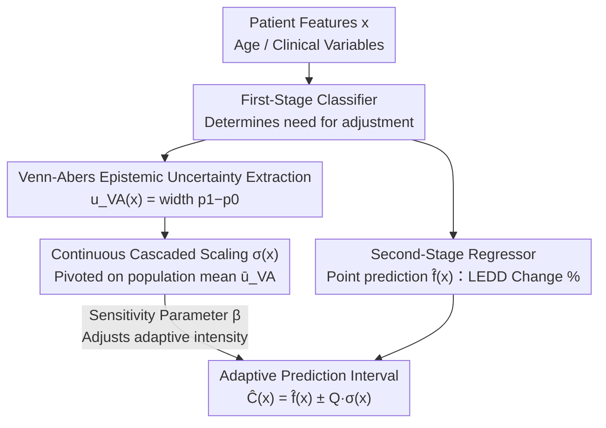

# CASCADE Conformal Prediction: Uncertainty-Adaptive Prediction Intervals for Two-Stage Clinical Decision Support

**Conference**: ICML2026  
**arXiv**: [2605.20468](https://arxiv.org/abs/2605.20468)  
**Code**: https://github.com/rdiazrincon/cascade_conformal_pd  
**Area**: Medical AI / Clinical Decision Support  
**Keywords**: Conformal Prediction, Uncertainty Quantification, Two-stage Decision Making, Venn-Abers Calibration, Parkinson’s Disease

## TL;DR
The CASCADE framework is proposed to propagate epistemic uncertainty from a first-stage classifier (quantified via Venn-Abers predictors) into second-stage regression prediction intervals. This narrows intervals for high-confidence patients by 38.9% while automatically expanding safety buffers for uncertain cases, achieving adaptive coverage guarantees.

## Background & Motivation

**Background**: Medication management for Parkinson’s Disease (PD) is a typical two-stage decision problem: first determining if a patient needs a medication adjustment (classification), then predicting the required dosage change (regression). Levodopa Equivalent Daily Dose (LEDD) is the standard metric for medication burden, but the optimal titration process remains highly dependent on clinical trial-and-error. Recently, AI-based clinical decision support systems have adopted two-stage architectures to assist this workflow.

**Limitations of Prior Work**: Standard Conformal Prediction (CP) methods operate independently during the regression stage, entirely ignoring the uncertainty of the first-stage classification decision. Consequently, a patient A (where the classifier is 99% certain of an adjustment) and a borderline patient B (55% confidence) receive prediction intervals of the same width. Patient B’s prediction poses high clinical risk, as overconfident dosage recommendations can lead to Levodopa-Induced Dyskinesia (LID).

**Key Challenge**: Two-stage architectures suffer from **information loss** at the decision boundary. Once a patient crosses the classification threshold, the probabilistic ambiguity of the first stage is discarded, causing the reliability of downstream regression to be disconnected from the certainty of upstream decisions. Standard conformal methods assume homoscedasticity, applying a globally uniform non-conformity threshold to all samples, failing to adjust intervals based on local epistemic risk.

**Goal**: To design a conformal prediction framework capable of explicitly propagating classification uncertainty into regression interval calibration, allowing prediction intervals to tighten for high-confidence cases and expand for ambiguous cases, thereby achieving risk-adaptive uncertainty quantification.

**Core Idea**: Use Venn-Abers predictors to extract epistemic uncertainty scores from the first-stage classifier and map them as scaling factors for the second-stage non-conformity scores. This enables cross-task uncertainty transfer without requiring the training of additional error-prediction models.

## Method

### Overall Architecture
CASCADE (Calibrated Adaptive Scaling via Conformal And Distributional Estimation) addresses the "information loss at the decision boundary" in two-stage clinical decisions. Patient feature vectors $x \in \mathbb{R}^d$ (age, clinical variables, etc.) first enter a classifier to determine the need for adjustment, followed by a regressor predicting the percentage change in LEDD. Data is split 80/20 into a training set $D_{\text{train}}$ and a calibration set $D_{\text{cal}}$. The critical innovation is that the classifier provides more than a binary decision; it outputs an epistemic uncertainty score $u_{\text{VA}}(x)$ via Venn-Abers calibration. This score is propagated to the second stage to dynamically scale the width of regression intervals—narrowing for certain patients and expanding for ambiguous ones—creating a "cascade effect."

### Key Designs

**1. Venn-Abers Epistemic Uncertainty Extraction: Quantifying "Hesitation" as a Distribution-Free Scalar**

Standard softmax probabilities are often poorly calibrated in non-linear models, and a single scalar collapses information regarding model confidence. CASCADE utilizes Venn-Abers predictors, which do not rely on distribution assumptions and output a multi-probability interval $[p_0(x), p_1(x)]$ for each $x$. The uncertainty score is defined as the interval width $u_{\text{VA}}(x) = p_1(x) - p_0(x)$. A wider interval indicates higher ambiguity in the classification—the system is uncertain if the patient truly needs adjustment. Venn-Abers is selected because it provides a theoretically rigorous distribution-free uncertainty measure that serves as a direct proxy for downstream regression reliability.

**2. Continuous Cascaded Scaling: Using Population Mean Uncertainty as a Pivot to Avoid Fragmentation**

After obtaining $u_{\text{VA}}(x)$, it is mapped to a scaling factor for the regression interval. CASCADE defines a mean-centered scaling function $\sigma(x) = 1 + \beta \left( \frac{u_{\text{VA}}(x)}{\bar{u}_{\text{VA}}} - 1 \right)$, where $\bar{u}_{\text{VA}}$ is the average VA uncertainty on the calibration set and $\beta \geq 0$ is a sensitivity parameter. When a patient's uncertainty equals the population mean, $\sigma(x) \approx 1$, yielding a standard interval length. Scores above the mean expand the interval, while scores below shrink it. Non-conformity scores are normalized as $S_i = |y_i - \hat{f}(x_i)| / \sigma(x_i)$, and the final prediction interval is:

$$\hat{C}(x) = \left[\hat{f}(x) \pm Q_{1-\alpha} \cdot \sigma(x)\right]$$

This continuous approach addresses the weaknesses of discrete Mondrian CP, which partitions the calibration set into $K$ bins based on $u_{\text{VA}}$ quantiles for independent calibration. This fragmentation reduces the effective sample size per bin ($N_{\text{cal}}/K$), leading to unstable quantile estimates. Continuous scaling uses the entire calibration set to estimate a single quantile $Q_{1-\alpha}$, eliminating discretization artifacts while preserving statistical power.

**3. Sensitivity Parameter $\beta$: An Interpretable "Adaptive Knob" for Clinicians**

The $\beta$ parameter controls the system's responsiveness to uncertainty: at $\beta = 0$, $\sigma(x) \equiv 1$, and CASCADE reverts to standard conformal prediction with no adaptation. Increasing $\beta$ causes the interval to expand or contract more aggressively based on uncertainty. This parameter allows the "precision vs. safety" trade-off to be an explicitly tunable knob rather than a fixed global threshold. However, this must be tuned under coverage constraints; ablations show that at $\beta = 0.7$, the Cascade Ratio (CR) reaches 4.23 while maintaining a marginal coverage of 80.1%, whereas $\beta \geq 0.9$ violates coverage guarantees.

## Key Experimental Results

### Main Results

Data includes ten years of records from 631 PD inpatients at the University of Florida Health. XGBoost was used as the classifier and regressor, evaluating performance on the subset of patients requiring medication adjustment ($y_i \neq 0$). The target coverage $1-\alpha = 80\%$.

| Method | Marginal Coverage | Avg Interval Length | Cascade Ratio (CR) |
|------|-----------|-------------|----------|
| Naïve | 52.5% | 0.031 | 1.00 |
| Standard CP | 84.0% | 0.113 | 1.00 |
| CV+ | 83.5% | 0.100 | 1.06 |
| J+aB | 60.6% | 0.132 | 0.97 |
| Mondrian (K=3) | 86.5% | 0.118 | 2.02 |
| **Cont. CASCADE (β=0.7)** | **80.1%** | **0.148** | **4.23** |

### Ablation Study (By Uncertainty Tiers)

| Uncertainty Tier | Method | Coverage | Interval Length | Relative Change |
|-----------|------|--------|---------|---------|
| Low (Bottom 33%) | Standard CP | 81.1% | 0.113 | — |
| Low (Bottom 33%) | CASCADE | 69.7% | 0.069 | **−38.9%** |
| Mid | Standard CP | 86.5% | 0.113 | — |
| Mid | CASCADE | 82.0% | 0.100 | −10.9% |
| High (Top 33%) | Standard CP | 85.4% | 0.113 | — |
| High (Top 33%) | CASCADE | 91.7% | 0.292 | **+158.9%** |

### Key Findings
- **Significant Cascade Effect**: CASCADE narrows intervals for low-uncertainty patients by 38.9% (0.113→0.069) while expanding them for high-uncertainty patients by 158.9% (0.113→0.292), improving coverage in the high-risk group from 85.4% to 91.7%.
- **Statistical Significance**: A KS test with $D=0.62$ ($p<10^{-54}$) confirms that CASCADE produces an interval distribution statistically distinct from standard CP. Spearman correlation $\rho=0.999$ verifies a monotonic relationship between interval length and VA uncertainty scores.
- **Continuous vs. Discrete**: When Mondrian bins increase to $K=7$, average interval length inflates to 0.170 (a 44% increase over $K=3$), whereas Continuous CASCADE maintains CR=6.83 without fragmentation penalties.
- **$\beta$ Ablation**: $\beta \leq 0.5$ results in insufficient adaptation (CR<3.0); $\beta \in [0.9, 1.0]$ violates coverage guarantees; $\beta=0.7$ represents the maximum adaptation point under safety constraints.

## Highlights & Insights
- **Cross-task uncertainty transfer is the core innovation**: Instead of training additional residual regression models to estimate difficulty, the framework reuses Venn-Abers uncertainty from the first-stage classifier as a scaling signal. This involves near-zero computational overhead and is theoretically sound, as classification ambiguity is a direct proxy for regression reliability.
- **Pivot-based mean-centered scaling**: The design of $\sigma(x)$ around the population mean ensures that "standard" patients receive standard intervals, while "difficult" or "simple" patients receive scaled intervals, maintaining the statistical efficiency of the global calibration set.
- **Plug-and-play module for two-stage architectures**: The framework can be applied to any "classify-then-regress" system (e.g., Deep Brain Stimulation parameter tuning, Botox dosage calculation) simply by extracting Venn-Abers scores from the classification stage.

## Limitations & Future Work
- The current method uses **symmetric scaling**, which may not be ideal for clinical scenarios where the risks of overdosing and underdosing are asymmetric; non-symmetric scaling strategies are required.
- Evaluation was primarily conducted on a **filtered subset of ground-truth labels** ($y_i \neq 0$), without fully accounting for error propagation from the first-stage classifier to the overall system.
- Validated only on **single-center data (PD)** with 631 cases; larger multi-center and multi-disease validation is needed for generalization.
- Lack of a **rejection mechanism**: For cases of extreme uncertainty, the system should ideally defer the prediction to a human expert.
- The $\beta$ parameter currently requires determination via ablation experiments on specific datasets; a theoretical guide for automatic selection is lacking.

## Related Work & Insights
- **Conformal Prediction Foundations**: Vovk et al. (2005) established distribution-free coverage guarantees; Mondrian CP achieves group-conditional validity via stratification; Normalized CP (Lei et al., 2018) enables adaptation through local scaling.
- **Venn-Abers Predictors**: Proposed by Vovk & Petej (2012) for multi-probability calibration, this work transforms it from a calibration tool into a signal source for uncertainty propagation.
- **Two-Stage Clinical Systems**: The PD architecture by Diaz-Rincon et al. (2025) serves as the direct precursor; CASCADE addresses the specific issue of information loss at its decision boundaries.
- **Inspiration**: The coupling of conformal prediction with epistemic uncertainty can be extended to various cascaded scenarios, such as "detection-then-planning" in autonomous driving or "segmentation-then-diagnosis" in medical imaging.

<!-- RELATED:START -->

## Related Papers

- [\[AAAI 2026\] Provably Minimum-Length Conformal Prediction Sets for Ordinal Classification](../../AAAI2026/medical_imaging/provably_minimum-length_conformal_prediction_sets_for_ordinal_classification.md)
- [\[ICLR 2026\] COMPASS: Robust Feature Conformal Prediction for Medical Segmentation Metrics](../../ICLR2026/medical_imaging/compass_robust_feature_conformal_prediction_for_medical_segmentation_metrics.md)
- [\[ICML 2026\] Auditing Sybil: Explaining Deep Lung Cancer Risk Prediction Through Generative Interventional Attributions](auditing_sybil_explaining_deep_lung_cancer_risk_prediction_through_generative_in.md)
- [\[CVPR 2025\] Surg-R1: A Hierarchical Reasoning Foundation Model for Scalable and Interpretable Surgical Decision Support](../../CVPR2025/medical_imaging/surg-r1_a_hierarchical_reasoning_foundation_model_for_scalable_and_interpretable.md)
- [\[NeurIPS 2025\] MTBBench: A Multimodal Sequential Clinical Decision-Making Benchmark in Oncology](../../NeurIPS2025/medical_imaging/mtbbench_a_multimodal_sequential_clinical_decision-making_benchmark_in_oncology.md)

<!-- RELATED:END -->
