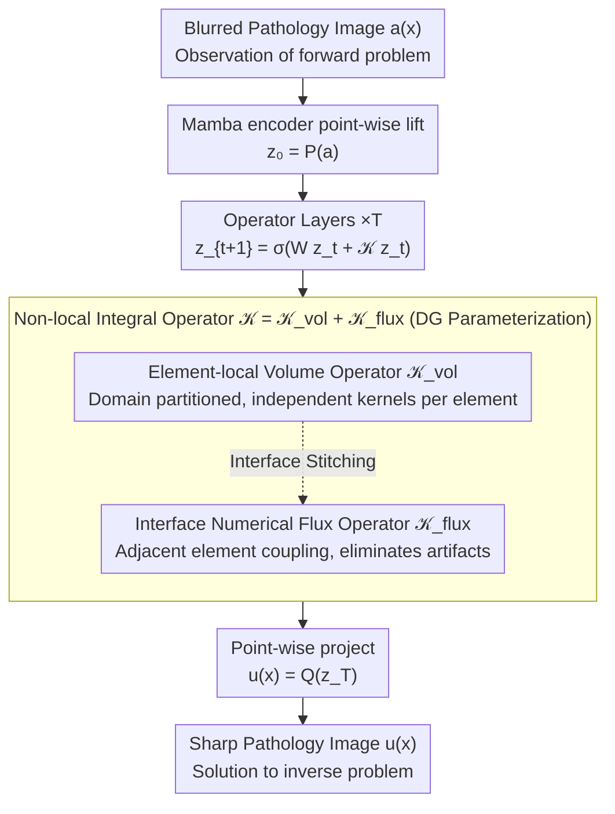

# DGNO: Discontinuous Galerkin Neural Operator for Pathology Defocus Deblurring

**Conference**: ICML 2026  
**arXiv**: [2605.23282](https://arxiv.org/abs/2605.23282)  
**Code**: https://github.com/DeepMed-Lab-ECNU/Single-Image-Deblur  
**Area**: Medical Image / Neural Operator / Image Restoration  
**Keywords**: Pathological Image Deblurring, Neural Operator, Discontinuous Galerkin, Element-wise Local Operator, Interface Flux

## TL;DR
DGNO reformulates defocus deblurring of pathological microscopy images as an inverse problem of "spatially varying integral operators." Using a Discontinuous Galerkin (DG) style, it decomposes the global kernel into element-local integral operators and interface numerical fluxes. This preserves the physical interpretability of neural operators while effectively handling the inherently local discontinuous blur in pathological images, surpassing SOTAs such as NAFNet, Restormer, and MambaIRv2 on datasets like BBBC006w1.

## Background & Motivation

**Background**: Defocus deblurring of pathological microscopy images is critical for downstream tasks like cell detection and segmentation (e.g., StarDist). Mainstream deep learning methods employ CNNs (NAFNet, Cho et al.), Transformers (Restormer, MPT), or Mamba (MambaIRv2) for end-to-end learning. Recent works have also introduced Neural Operators (NO) to low-level vision (SRNO, DiffFNO).

**Limitations of Prior Work**: (1) CNNs imply shift-invariance, but pathological defocus is **spatially varying** due to depth variations, tissue heterogeneity, refractive index non-uniformity, and aberrations; shift-invariant convolution is fundamentally unsuitable. (2) Global attention in Transformers lacks physical significance and lacks explicit modeling of the blur formation process. (3) Mamba operates at the feature-sequence level and remains physically unstructured. (4) Existing NOs (FNO, SRNO) use globally parameterized kernels assuming smoothness/stationarity, making them unsuitable for **local discontinuous blur** (where the PSF jumps at transitions between different tissue regions).

**Key Challenge**: Pathological defocus physically corresponds to a spatially varying integral operator $g(x,y) = \iint K(x,y;\xi,\eta) h(\xi,\eta)\,d\xi d\eta$, which degrades to convolution only under shift-invariance. In reality, the PSF is both spatially varying and locally discontinuous. However, existing NOs assume smooth global kernels. Maintaining the physical consistency of NOs while acknowledging local discontinuity remains an open problem.

**Goal**: (1) Formalize defocus deblurring as an NO (function-to-function map) for the first time. (2) Design an NO architecture capable of explicitly handling local discontinuous blur. (3) Capture local heterogeneity while maintaining global coherence and avoiding tiling artifacts.

**Key Insight**: In numerical solutions for partial differential equations (PDEs), the "Discontinuous Galerkin (DG)" method partitions the domain into non-overlapping elements, solves independently within elements, and couples them using interface numerical fluxes. This approach is naturally suited for locally discontinuous fields, matching the "locally stable + consistent regional transition" characteristics of pathological images.

**Core Idea**: Decompose the global integral kernel into **element-local volume operators** and **interface numerical fluxes**. The former captures spatial local heterogeneity, while the latter controls information exchange between elements to avoid over-smoothing. This retains the physical consistency of NOs while gaining the local discontinuous modeling capabilities of DG.

## Method

### Overall Architecture

DGNO aims to resolve the "spatially varying and locally discontinuous" blur in pathological images—where nuclei, cytoplasm, and extracellular matrix within a single slide have distinct PSFs, often with abrupt changes at transitions. It follows the general framework of neural operators: the input image $a(x)$ is first lifted point-wise by a Mamba encoder into an implicit feature field $z_0 = P(a)$, then processed through $T$ operator layers for progressive deblurring, and finally projected point-wise back to a sharp image $u(x) = Q(z_T)$. The update at each layer is $z_{t+1}(x) = \sigma(W z_t(x) + (\mathcal{K} z_t)(x))$, where the non-local integral operator $\mathcal{K}$ is the primary innovation. It is parameterized using a DG approach: the domain is partitioned into non-overlapping elements $\{E_e\}$, and the operator is defined as $\mathcal{K} = \mathcal{K}_{\text{vol}} + \mathcal{K}_{\text{flux}}$, combining "intra-element volume integration" and "inter-element numerical flux." The entire pipeline strictly aligns with the forward and inverse problems of defocus in Fourier optics, providing design rationale and interpretability.

### Key Designs

**1. Element-local Volume Integral Operator: Learning Region-Specific Blur Kernels**

Global FNOs treat the integral kernel as spatially stationary, sharing a single set of parameters across the image—this fails for pathological images where PSFs for nuclei, cytoplasm, and matrix differ significantly. DGNO restricts integration within elements: for features on element $E_e$, it computes $(\mathcal{K}_{\text{vol}} z)(x) = \int_{E_e} k_e(x, y) z(y)\,dy$, where each kernel $k_e$ is **learned independently**. Implementation uses Galerkin-type attention for adaptive token aggregation within elements. This allows different tissue regions to learn distinct kernels, naturally capturing spatially varying blur.

**2. Interface Numerical Flux Operator: Stitching Element Boundaries**

Independence between elements causes issues—without communication, deblurring results exhibit visible blocking artifacts. Conversely, reverting to global kernels would smooth out local discontinuities. Following the standard DG paradigm for discontinuous fields in numerical PDEs, DGNO introduces the numerical flux $\mathcal{K}_{\text{flux}}$ to couple adjacent elements. Two forms are provided: (a) General face-based flux, assigning an independent learnable operator to each interface for maximum expressivity; (b) Zero-order DG (P0DG), which derives interface coupling directly from volume operators without additional parameters. Flux allows information to flow across boundaries to eliminate artifacts while preserving local discontinuities by only coupling at the interfaces.

**3. Physical Alignment: Optical Correspondence for Each Module**

Unlike black-box end-to-end methods like CNNs or Transformers, DGNO's pipeline directly corresponds to the forward problem of defocus in Fourier optics $g(x,y) = \iint K(x,y;\xi,\eta) h(\xi,\eta)\,d\xi d\eta$; deblurring is its inverse. Element partitioning corresponds to the "piecewise structural heterogeneity" of pathological images: the volume operator reflects slowly varying PSFs within regions, and interface fluxes reflect regional transitions. This alignment improves interpretability and allows for future physical refinements, such as explicit PSF priors.

## Key Experimental Results

### Main Results: BBBC006w1 Pathology Defocus Deblurring

| Method | PSNR↑ | SSIM↑ | Params(M) | FLOPs(G) |
|------|------|------|------|---|
| NAFNet | 28.92 | 0.879 | 17.1 | 16 |
| Restormer | 29.47 | 0.886 | 26.1 | 141 |
| MPT | 29.78 | 0.891 | 14.7 | 23 |
| MambaIRv2 | 30.12 | 0.895 | 25.9 | 24 |
| SRNO (NO Baseline) | 30.05 | 0.893 | 16.3 | 19 |
| **DGNO** | **30.86** | **0.907** | 15.8 | **18** |

DGNO significantly leads in both PSNR and SSIM, with parameters and FLOPs comparable to or lower than existing methods.

### Ablation Study: Element Partitioning Granularity

| Number of Elements | PSNR | Remarks |
|------|------|------|
| 1 (Global kernel, SRNO variant) | 30.05 | Lacks locality |
| 4 × 4 | 30.42 | Elements too large |
| 8 × 8 | **30.86** | Optimal |
| 16 × 16 | 30.71 | Flux overhead too high |
| 32 × 32 | 30.34 | Excessive grain, blocking artifacts |

An optimal granularity exists, verifying the balance between "locality + flux."

### Ablation Study: Interface Flux vs. P0DG

| Configuration | PSNR | Params |
|------|------|------|
| General Interface Flux | 30.86 | 15.8M |
| P0DG (Zero-order approx) | 30.62 | 12.3M |
| No Flux (Pure independent elements) | 29.97 | 14.2M (Blocking artifacts) |

P0DG retains most performance with ~22% parameter savings. Purely independent elements produce visible blocking artifacts, proving the necessity of flux.

### Key Findings
- **Spatially varying blur is a key bottleneck for pathology SOTA**: Methods assuming shift-invariance are significantly outperformed by DGNO.
- **Sweet spot for element granularity**: Elements that are too large lose locality, while those that are too small increase flux overhead and introduce artifacts.
- **Flux is essential**: Removing flux results in learnable but blocked outputs; the DG mathematical structure holds in neural networks.
- **Physical alignment provides interpretability**: Visualizing kernels for each element intuitively shows the direction of blur variation (PSF visualizations are provided in the appendix).

## Highlights & Insights
- **First work to introduce DG numerical methods to Neural Operators**: Employs mature tools from numerical PDEs (DG) to handle local discontinuous fields that standard NOs cannot.
- **Physical framing as the true differentiator**: Unlike other end-to-end methods, DGNO explicitly formulates defocus as an inverse problem of integral operators, making design choices (local elements + flux) physically traceable.
- **Structural Inductive Bias via element partitioning**: While CNNs rely on translation invariance and local connectivity, DGNO utilizes a "piecewise stable + interface coupled" bias, which is more suitable for pathological images and generalizable to other heterogeneous problems (e.g., remote sensing clouds, multimodal microscopy).
- **P0DG provides a practical performance sweet spot**: A -22% parameter reduction with only -0.24 PSNR loss is favorable for practical deployment.

## Limitations & Future Work
- Element partitioning is currently a fixed grid; adaptive partitioning based on tissue boundaries could further improve performance.
- Validation was limited to 2D pathological slides; DGNO extensions for 3D pathological volumes (e.g., confocal stacks) have not been attempted.
- The PSF is learned implicitly; joint estimation of PSF and deblurring could be considered.
- A rigorous comparison with traditional two-stage methods (PSF estimation + non-blind deconvolution) is missing; physical baselines could be strengthened.
- DG involves element discretization; future work could explore "higher-order DG" (hp-refinement) using different basis functions for different elements.

## Related Work & Insights
- **vs. CNN / Transformer / Mamba Deblurring**: These methods imply shift-invariance or lack physical structure; DGNO explicitly models spatially varying integral operators.
- **vs. FNO / SRNO (Global NO)**: These assume kernel smoothness and cannot handle local discontinuities; DGNO achieves local representation through element partitioning.
- **vs. DG Numerical Methods**: DG is used in numerical PDE solutions (fluids, electromagnetics); this work represents its first systematic application within Neural Operators.
- **Insight**: Numerical PDE discretization schemes (FEM, DG, HHO, etc.) can serve as a library of inductive biases for Neural Operators. This strategy of "borrowing math-physics tools" can be extended to all scenarios requiring operator learning.

## Rating
- Novelty: ⭐⭐⭐⭐⭐ First DG-NO; introducing numerical PDE discretization to NO for discontinuous fields is a truly new direction.
- Experimental Thoroughness: ⭐⭐⭐⭐ Main results and ablations are complete; lacks 3D pathology validation.
- Writing Quality: ⭐⭐⭐⭐ Derivations from physics to math to neural networks are clear; Fig 2 explains the DG concept intuitively.
- Value: ⭐⭐⭐⭐ Pathology image quality directly impacts diagnosis; deblurring is a high-value task; the DG-NO concept is highly generalizable.

<!-- RELATED:START -->

## Related Papers

- [\[CVPR 2025\] NOIR: Neural Operator Mapping for Implicit Representations](../../CVPR2025/medical_imaging/noir_neural_operator_mapping_for_implicit_representations.md)
- [\[NeurIPS 2025\] Self-Supervised Learning via Flow-Guided Neural Operator on Time-Series Data](../../NeurIPS2025/medical_imaging/self-supervised_learning_via_flow-guided_neural_operator_on_time-series_data.md)
- [\[ICML 2026\] PRISM: A 3D Probabilistic Neural Representation for Interpretable Shape Modeling](prism_a_3d_probabilistic_neural_representation_for_interpretable_shape_modeling.md)
- [\[ICML 2026\] PathCTM: Thinking in Scales — Accelerating Gigapixel Pathology Image Analysis via Adaptive Continuous Reasoning](thinking_in_scales_accelerating_gigapixel_pathology_image_analysis_via_adaptive_.md)
- [\[ICML 2026\] Which Anatomy Matters Under Limited Labels? A Data-Efficient Anatomy-Aware Benchmark for Cardiac Pathology Prediction](which_anatomy_matters_under_limited_labels_a_data-efficient_anatomy-aware_benchm.md)

<!-- RELATED:END -->
