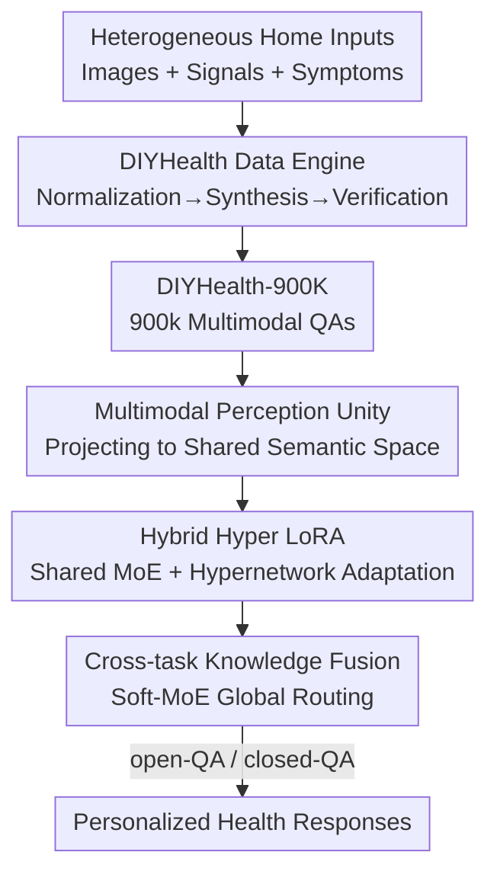

# DIYHealth Suite: Dataset, Model, and Benchmark for Health Management at Home

**Conference**: ICML 2026  
**arXiv**: [2606.07542](https://arxiv.org/abs/2606.07542)  
**Code**: TBD  
**Area**: Medical Imaging / AI for Healthcare  
**Keywords**: Home Health Management, Multimodal Dataset, Parameter-Efficient Fine-Tuning, MoE-LoRA, Hypernetwork

## TL;DR
Addressing the "Diagnosis-It-Yourself" scenario—a field overlooked by existing medical LLMs—this work delivers an integrated suite comprising a dataset (DIYHealth-900K, 900,000 multimodal home health QAs), a model (DIYHealthGPT, centered on the newly proposed H2LoRA parameter-efficient fine-tuning mechanism), and a benchmark (DIYHealthBench, the first evaluation covering 11 home health tasks). The suite achieves SOTA performance across both general and medical-specific baselines.

## Background & Motivation

**Background**: Medical foundation models (LLaVA-Med, HuatuoGPT-Vision, MedGemma, etc.) have advanced rapidly, excelling in radiology report generation, medical image interpretation, and clinical Q&A. However, these models are almost entirely "clinic-centric," relying on high-quality, hospital-grade data and expert annotations, primarily serving professional healthcare providers.

**Limitations of Prior Work**: With the proliferation of wearables, smartphones, and home sensors, healthcare is shifting toward "home-based self-diagnosis and management." Clinical models struggle in this scenario due to: (1) **Heterogeneous and low-quality data**: Inputs from consumer-grade devices and self-reported symptoms are noisy and unstandardized, with no large-scale home health datasets available for training. (2) **Need for personalization**: While cohort-level models suffice in hospitals, home management requires adaptation to individual baselines that vary significantly and drift over time. (3) **Fragemented tasks without uniform metrics**: Tasks ranging from daily monitoring to chronic disease risk assessment lack a unified benchmark for comparative evaluation.

**Key Challenge**: There is a fundamental mismatch between the "high-quality, standardized, and population-level" assumptions of clinical data and the "low-quality, heterogeneous, and highly personalized" reality of home settings. Consequently, existing medical LLMs cannot be directly transferred to home health management.

**Goal**: The work decomposes the problem into three actionable sub-problems: How to construct a reliable multimodal home health dataset? How to enable a foundation model to share knowledge across tasks while providing instance-level adaptation? How to define a benchmark for the fair evaluation of home health AI?

**Key Insight**: The authors argue that these three components must be delivered as an integrated ecosystem—models cannot be trained without data and cannot be assessed without benchmarks. Thus, they propose a "data engine + adaptive model + unified benchmark" framework.

**Core Idea**: A data synthesis engine with human verification is used to create the dataset. A "Shared Low-Rank Mixture-of-Experts + Hypernetwork-driven adaptation" mechanism (H2LoRA) handles cross-task sharing and instance-level personalization. The first home health benchmark provides unified evaluation.

## Method

### Overall Architecture
The DIYHealth Suite is a three-part ecosystem. **Inputs** consist of heterogeneous home-based signals (food/skin/oral images via smartphones, heart rate/sleep data via wearables, and self-reported symptom text). **Outputs** include open-ended advice (open-QA) and structured decisions (closed-QA). Three core components link these: the **DIYHealth Data Engine** synthesizes, normalizes, and verifies 900,000 high-quality multimodal QA pairs (DIYHealth-900K). **DIYHealthGPT** then encodes images and text into a frozen LLM backbone using the **H2LoRA** adaptive fine-tuning mechanism for domain and individual adaptation. Finally, the model is evaluated across 11 tasks in **DIYHealthBench**.

The DIYHealthGPT model utilizes a multi-stage pipeline: multimodal perception unification → H2LoRA task-level adaptation (with cross-task fusion) → four-stage progressive training. The flowchart below illustrates the data flow:

### Key Designs

**1. DIYHealth Data Engine: Transforming Noisy Home Data into Unified Corpora via LLM Synthesis and Human Verification**

The primary issue with home health data is its heterogeneity and lack of large-scale annotations. The engine uses a modular synthesis approach to enforce semantic consistency and realism across tasks. It consists of: a **Language & Signal Normalizer** to standardize medical abbreviations and signals; a **Prompt & Template Library** to encode task objectives and modal constraints; a **Semantic QA Synthesizer** (using Claude 3 Haiku) to batch-generate QA pairs under a shared schema; and a **Human-in-the-loop Verifier** where experts conduct multi-round reviews for clinical consistency and usability. The final dataset integrates 3 private institutional sources and 20 public sources (Kaggle/PhysioNet, etc.), covering 11 tasks across three clusters: personalized health management, chronic disease risk assessment, and daily health monitoring.

**2. Multimodal Perception Unity: Mapping Home Images and Text into a Shared Semantic Space**

Home signals are naturally mixed-modal. Given an image $\mathcal{I}\in\mathbb{R}^{H\times W\times 3}$, a pretrained visual encoder generates patch-level representations $\mathcal{V}=\mathcal{E}_v(\mathcal{I})\in\mathbb{R}^{L_v\times d_v}$. Text input is processed via a tokenizer and embedding layer to obtain $\mathcal{U}=\mathcal{E}_t(\mathcal{T})\in\mathbb{R}^{L_t\times d}$. A learnable projection $\mathcal{P}_v:\mathbb{R}^{d_v}\to\mathbb{R}^{d}$ aligns visual embeddings to the language space, forming a unified representation $\mathcal{Z}=[\mathcal{P}_v(\mathcal{V});\mathcal{U}]\in\mathbb{R}^{(L_v+L_t)\times d}$. This interface $\Phi:(\mathcal{I},\mathcal{T})\mapsto\mathcal{Z}$ allows the LLM backbone to perform downstream reasoning on home signals in a unified space.

**3. H2LoRA: Balancing Cross-Task Sharing and Instance-Level Personalization via Shared MoE and Hypernetwork Offsets**

This is the core technical contribution. Traditional LoRA faces a dilemma: separate adapters for each task prevent knowledge sharing, while a single shared adapter erases task-specific nuances. H2LoRA solves this with two mechanisms. First, **Shared Low-Rank MoE** augments the backbone weights $\Theta\in\mathbb{R}^{d_{out}\times d_{in}}$ with a shared low-rank projection $\mathbf{A}^t$ (acting as an anchor for subspace alignment) and $K$ expert matrices $\{\mathbf{B}^t_1,\dots,\mathbf{B}^t_K\}$. A routing layer generates weights $\mathcal{W}^t\in\mathbb{R}^K$ to produce a task-adaptive projection $\mathbf{B}^t$. Second, **Hyper LoRA Adaptation** captures individual patient differences by adding offsets $\Delta\mathbf{A}^t=\mathcal{H}_A(\mathcal{Z})$ and $\Delta\mathbf{B}^t_k=\mathcal{H}_B(\mathcal{Z})$ dynamically generated by a hypernetwork based on the instance embedding $\mathcal{Z}$. The task-level output is:
$$\mathcal{O}^t_{H^2LoRA}=\mathcal{Z}\mathbf{A}^t\mathbf{B}^t+\mathcal{Z}\Delta\mathbf{A}^t\Delta\mathbf{B}^t$$
This refines adaptation from "task-level" to "instance-aware," matching the heterogeneity of home scenarios.

**4. Cross-task Knowledge Fusion: Mining Correlations via Global Soft-MoE Routing**

Home health tasks are highly correlated (e.g., diet affects both diabetes and obesity risk). The authors introduce a global soft-MoE router $\mathcal{R}$ that treats each H2LoRA block as an expert and assigns mixing weights $\beta=(\beta^1,\dots,\beta^N)=\mathcal{R}(\mathcal{Z})$. The final output is updated as:
$$\mathcal{O}_{H^2LoRA}=\mathcal{Z}\Theta+\sum_{t=1}^N\beta^t\mathcal{O}^t_{H^2LoRA}$$
This allows the model to leverage commonalities via $\mathbf{A}^t$, task specificities via $\mathbf{B}^t_k$, and instance modulation via offsets, while global routing integrates contextual correlations.

### Loss & Training
A four-stage progressive strategy is employed: **Stage 1: Cross-modal Alignment** trains the projector $\mathcal{P}_v$ on PubMedVision and LLaVA-558k. **Stage 2: Medical Domain Adaptation** fine-tunes $\mathcal{P}_v$ and the backbone on a 10% subset of DIYHealth-900K via SFT. **Stage 3: Task Expert Training** trains individual H2LoRA blocks per task, followed by joint optimization using hard-MoE. **Stage 4: Cross-task Knowledge Transfer** replaces hard-MoE with the global soft-MoE router $\mathcal{R}$ for final fine-tuning.

## Key Experimental Results

### Main Results
Evaluation was conducted on DIYHealthBench (12,167 samples). Metrics for closed-QA included Accuracy (ACC) and Matthews Correlation Coefficient (MCC). Open-QA utilized F1-RadGraph and F1-BioBERT for medical fidelity, alongside BLEU and ROUGE-L.

| Closed-QA Avg (10 Tasks) | ACC | MCC | Notes |
|--------|------|------|------|
| InstructBLIP-7B | 14.35 | 8.54 | General model; fails on home tasks |
| Llama 3.2-11B | 47.42 | 33.12 | General LLM |
| Yi-VL-6B | 59.46 | 46.08 | General LVLM |
| InternVL3-8B | 68.79 | 59.59 | Strong general baseline |
| **DIYHealthGPT** | **SOTA** | **SOTA** | Best across general and medical baselines |

### Ablation Study

| Configuration | Function | Expected Impact |
|------|------|---------|
| Full (H2LoRA + Fusion) | Complete model | Optimal performance |
| w/o Shared Low-Rank MoE | Reverts to isolated/shared LoRA | Reduced cross-task sharing or specificity |
| w/o Hypernetwork Offsets | Removes instance-level $\Delta\mathbf{A},\Delta\mathbf{B}$ | Loss of personalization; drop in high-variance tasks |
| w/o Cross-task Soft-MoE | No inter-task synergy | Decreased performance on diet-disease correlations |

### Key Findings
- General LVLMs (e.g., InstructBLIP) nearly fail in home settings (ACC ~14), highlighting the massive distribution shift from general tasks.
- The dual mechanisms of H2LoRA are complementary: shared experts handle task-level commonalities, while hypernetwork offsets handle instance-level heterogeneity.
- Modeling inter-task correlations via soft-MoE significantly improves performance on related health tasks.

## Highlights & Insights
- **Integrated "Data-Model-Benchmark" Delivery**: This provides a complete foundation for a new research scenario (home self-management) rather than a single-point contribution.
- **Dual-tier H2LoRA Design**: Moving LoRA from "task-adaptive" to "instance-adaptive" through shared low-rank anchors and hypernetwork-generated offsets is a portable concept for any PEFT scenario requiring strong personalization.
- **Human-in-the-loop Data Engine**: Using LLMs to synthesize large-scale data while ensuring medical accuracy via expert verification is a scalable and reproducible paradigm for medical corpora.

## Limitations & Future Work
- The reliance on synthetic data (Claude 3 Haiku) may leave a gap between synthetic and real-world home distributions; generation bias requires further investigation.
- Personalization depends on hypernetworks conditioned on instance embeddings $\mathcal{Z}$. The robustness and safety of instance-level advice for sparse or anomalous signals have not been fully assessed.
- The 11 tasks do not yet cover long-tail scenarios like rare diseases or emergency identification. Real-world deployment requires integrated referral and liability mechanisms.

## Related Work & Insights
- **vs. Clinical Medical LLMs**: While models like LLaVA-Med target expert tasks with high-quality data, DIYHealthGPT focuses on consumer-grade, self-reported, and personalized home scenarios.
- **vs. MoELoRA**: Unlike MoELoRA, which focuses on feature-level expert diversity, H2LoRA explicitly models cross-task correlations through shared anchors and global routers.
- **vs. HyperLoRA**: Unlike HyperLoRA, which generates entire weight sets (difficult to optimize), H2LoRA generates "offsets" ($\Delta$) to modulate a shared structure, combining parameter efficiency with individual adaptation.

## Rating
- Novelty: ⭐⭐⭐⭐⭐ (Dataset + H2LoRA + Benchmark)
- Experimental Thoroughness: ⭐⭐⭐⭐⭐ (18+ baselines, 11 tasks, open/closed-QA)
- Writing Quality: ⭐⭐⭐⭐ (Clear hierarchy, though notation is dense)
- Value: ⭐⭐⭐⭐⭐ (Structural foundation for home-based AI healthcare)

<!-- RELATED:START -->

## Related Papers

- [\[ICML 2026\] Seizure-Semiology-Suite (S³): A Clinically Multimodal Dataset, Benchmark, and Models for Seizure Semiology Understanding](seizure-semiology-suite_s3_a_clinically_multimodal_dataset_benchmark_and_models_.md)
- [\[ICML 2026\] Marrying Generative Model of Healthcare Events with Digital Twin of Social Determinants of Health for Disease Reasoning](marrying_generative_model_of_healthcare_events_with_digital_twin_of_social_deter.md)
- [\[ICLR 2026\] MedLesionVQA: A Multimodal Benchmark Emulating Clinical Visual Diagnosis for Body Surface Health](../../ICLR2026/medical_imaging/medlesionvqa_a_multimodal_benchmark_emulating_clinical_visual_diagnosis_for_body.md)
- [\[ICML 2026\] Which Anatomy Matters Under Limited Labels? A Data-Efficient Anatomy-Aware Benchmark for Cardiac Pathology Prediction](which_anatomy_matters_under_limited_labels_a_data-efficient_anatomy-aware_benchm.md)
- [\[AAAI 2026\] Personalization of Large Foundation Models for Health Interventions](../../AAAI2026/medical_imaging/personalization_of_large_foundation_models_for_health_interventions.md)

<!-- RELATED:END -->
