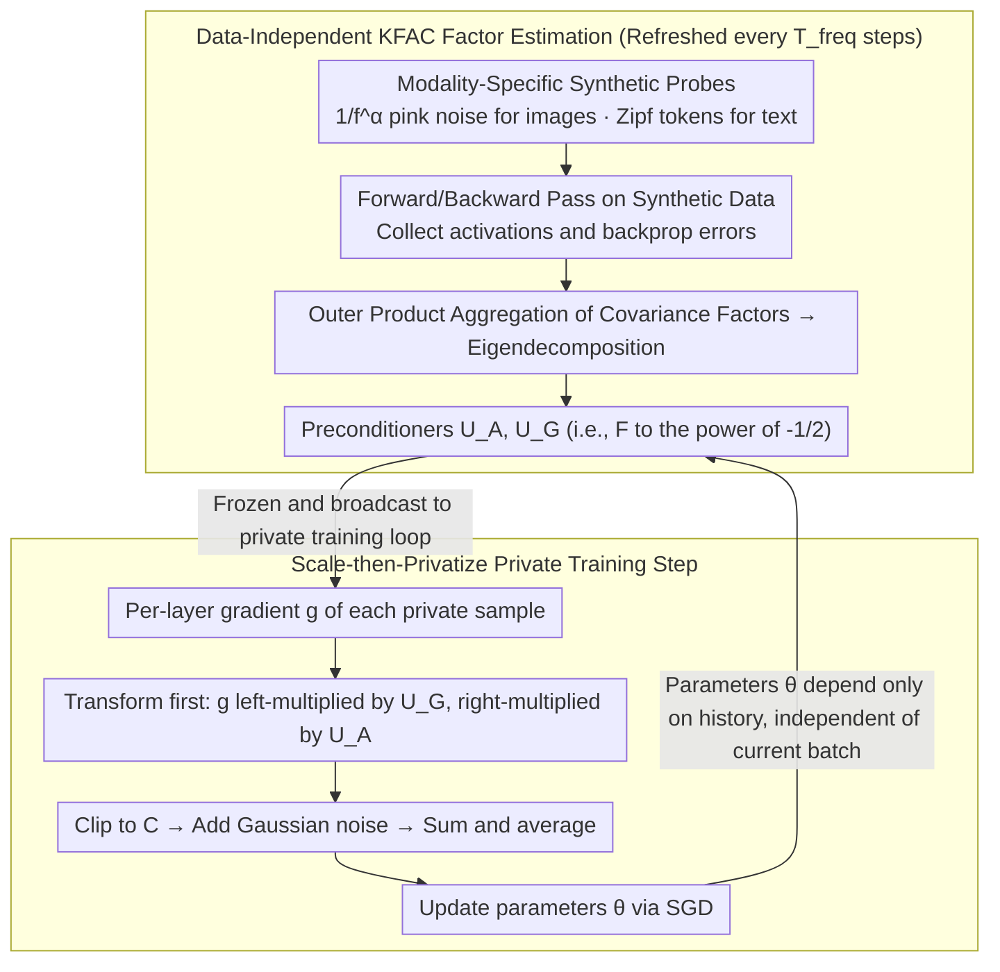

# DP-KFC: Data-Free Preconditioning for Privacy-Preserving Deep Learning

**Conference**: ICML 2026  
**arXiv**: [2605.13418](https://arxiv.org/abs/2605.13418)  
**Code**: https://github.com/molinamarcvdb/DP-KFC (Available)  
**Area**: Differential Privacy / Medical Imaging / Second-order Optimization  
**Keywords**: Differential Privacy, KFAC, Fisher Information Matrix, Preconditioner, Synthetic Noise

## TL;DR
This paper proposes DP-KFC: based on the observation that "the scaling of the Fisher matrix is determined by the architecture, and the correlation structure can be approximated by modality-level spectral statistics," it reconstructs KFAC preconditioners by probing the network with structured synthetic noise (1/f^\alpha pink noise for images, Zipf sampling for text). This approach neither consumes the privacy budget nor introduces distribution shifts, consistently outperforming DP-SGD and public data preconditioning methods under strong privacy ($\varepsilon \le 3$).

## Background & Motivation

**Background**: The standard practice for differentially private deep learning is DP-SGD—injecting isotropic Gaussian noise after $L_2$ clipping of per-sample gradients. The privacy noise scale grows with the model dimension $\sqrt{d}$, causing the advantages of over-parameterization in non-private scenarios to vanish under DP. To alleviate this, the community has turned to adaptive/second-order methods (DP-Adam, KFAC + DP), which either consume the privacy budget to estimate second-order statistics from private data or introduce distribution shifts by estimating them from public data.

**Limitations of Prior Work**: (1) The "isotropic" noise of DP-SGD mismatches the highly "anisotropic" geometry of the neural network loss landscape—low-sensitivity parameters are drowned by noise, while high-sensitivity parameters are over-clipped (SNR collapse in Fig. 1); (2) Ganesh et al. (2025) proved that unbiased second-order estimation under privacy is often counterproductive as the noise in the preconditioner itself hinders performance; (3) The Precondition-then-Privatize paradigm relies on public proxy data, which is often unavailable in specialized domains like medical imaging.

**Key Challenge**: To match the privacy noise of DP-SGD with the loss geometry, gradients must be transformed into an isotropic coordinate system; however, the curvature information required for this transformation must **not** consume the privacy budget and **not** rely on public data.

**Goal**: (1) Demonstrate that key information of the KFAC preconditioner can be recovered from the architecture itself; (2) Design an algorithm to reconstruct the preconditioner using only synthetic noise; (3) Strictly maintain formal DP guarantees (no additional privacy budget consumption).

**Key Insight**: Based on Mean Field Theory, the layer activation variance $q^l$ and the backpropagated gradient variance $\tilde q^l$ of deep networks follow deterministic recursions (determined by initialization and non-linearity) independent of specific inputs; Karakida et al. (2019) proved that $\text{Tr}(F_l) \propto d \cdot q^{l-1} \cdot \tilde q^l$, meaning the trace of Fisher blocks is entirely determined by the architecture.

**Core Idea**: Decouple the Fisher matrix into "architecture sensitivity (recoverable by synthetic noise) + input correlation structure (approximated by modality-level spectra $1/f^\alpha$)." Use synthetic probes to construct the inverse square root $F^{-1/2}$ of KFAC factors and perform a linear transformation (scale-then-privatize) **before** per-sample gradients are clipped and noise-added. This step is transparent to private data and thus consumes no privacy budget.

## Method

### Overall Architecture
DP-KFC addresses the mismatch between the isotropic privacy noise of DP-SGD and the anisotropic geometry of the loss landscape. It transforms gradients into an isotropic coordinate system before adding noise, while ensuring the curvature information for this transformation is budget-free and proxy-free. Training is split into two alternating phases. Every $T_{freq}$ steps, a forward-backward pass is run using a batch of synthetic data (pink noise for images, Zipf sequences for text) to estimate two covariance factors per layer: $\hat A_{l-1}=\mathbb{E}[\tilde a_{l-1}\tilde a_{l-1}^\top]$ and $\hat G_l=\mathbb{E}[\tilde\delta_l\tilde\delta_l^\top]$. After eigendecomposition, rotation/scaling matrices $U_{A,l}, U_{G,l}$ are obtained. During private training steps, for each private sample $i$, the per-layer gradient is transformed as $\tilde g_l^{(i)}=U_{G,l}\,g_l^{(i)}\,U_{A,l}$ before clipping, noising, averaging, and SGD updates. This "transform-then-privatize" order is key—the preconditioner $P_t$ depends only on the architecture and released historical parameters, remaining independent of the current batch, so the RDP accounting perfectly inherits from standard DP-SGD.

### Key Designs

**1. Data-Independent KFAC Factor Estimation: Curvature Recovery from Architecture**

The Achilles' heel of second-order DP methods is that estimating curvature either costs privacy budget (from private data) or suffers from distribution shift (from public data). This work relies on a corollary of Mean Field Theory—Karakida et al. (2019) proved $\text{Tr}(F_l)\propto d\cdot q^{l-1}\cdot \tilde q^l$, implying that the trace of Fisher blocks is determined by the architecture (activation variance recursion defined by initialization and non-linearity) rather than inputs. Since primary curvature information depends on the architecture, synthetic probes only need to maintain consistency in the forward-backward propagation chain. Algorithm 1 generates $M$ synthetic pairs $(\tilde x, \tilde y)$ to collect activations and errors, aggregating them into $\hat A_{l-1}=\frac{1}{M}\sum \tilde a_{l-1}\tilde a_{l-1}^\top+\pi I$ and $\hat G_l=\frac{1}{M}\sum \tilde\delta_l\tilde\delta_l^\top+\pi I$. After decomposition, $U_{X,l}=Q_X(\Lambda_X+\gamma I)^{-1/2}Q_X^\top$ is computed. The preconditioner $F_l^{-1/2}=U_{A,l}\otimes U_{G,l}$ is represented implicitly via Kronecker products. Damping terms $\pi I$ and $\gamma I$ ensure invertibility and control the condition number, corresponding to the lower bound $\lambda_{min}\ge\sqrt\gamma$ in Theorem 5.4.

**2. Modality-Specific Synthetic Probes: Aligning Synthetic Inputs with Modality Priors**

White noise energy is uniformly distributed across all frequencies, but deep networks primarily propagate low-frequency features. Curvature probed with pure white noise would be biased. The solution is to inject "task-independent but modality-dependent" priors. For images, pink noise is used: white noise $Z$ in the frequency domain is weighted by $\tilde Z_\mathbf{u}=Z_\mathbf{u}/(\|\mathbf{u}\|_2^{\alpha/2}+\epsilon)$ followed by an IFFT; setting $\alpha\approx 1$ reproduces the $1/f^\alpha$ spectrum of natural images (Field 1987). For NLP, tokens are sampled from a vocabulary using a Zipfian distribution and placed according to grammatical positions ([CLS] [SEP] [PAD]) to ensure attention and LayerNorm follow realistic propagation paths. This pushes synthetic activation statistics closer to real data without carrying semantic content, thus preventing privacy leakage.

**3. Scale-then-Privatize and DP Integration: Curvature Injection at Zero Privacy Cost**

To integrate the transformation into DP-SGD without violating privacy guarantees, the execution order is critical. Algorithm 2 places the gradient transformation $\tilde g_l=U_{G,l}\,g_l\,U_{A,l}$ **before** clipping. After transformation, the global $L_2$ norm of each sample becomes $\nu_i=\sqrt{\sum_l\|\tilde g_l^{(i)}\|_F^2}$, while the clipping threshold $C$ remains constant. Noise $\mathcal{N}(0,\sigma^2 C^2 I)$ is still added to the sum of clipped gradients. Since $P_t$ is a batch-independent linear operator, Proposition 5.6 proves that the RDP guarantee of the composite mechanism is identical to the standard Gaussian mechanism. Compared to "precondition-after-privatize" (adding noise then multiplying by $P_t$), scale-then-privatize ensures the privacy noise term $d\sigma^2 C^2/B^2$ is **not** amplified by $\lambda_{max}^2$ of the preconditioner (see Theorem 5.4), which is most significant in the high-privacy (small $\varepsilon$) regime.

### Loss & Training
- Standard CE/MSE loss + DP-SGD optimizer; KFAC damping $\pi=\gamma=10^{-2}$; RDP accounting via Opacus; A100 GPU.
- Preconditioner refresh frequency $T_{freq}$ (typically 100–1000 steps); single-step wall-clock is ~2.2× slower than DP-SGD, but each step is more efficient (Remark 5.5 "privacy wall"—since the privacy budget limits the number of steps $T$, more efficient steps are more valuable).
- Models: CNN on MNIST, CrossViT on CIFAR-100, BERT on StackOverflow, Logistic Regression on IMDB; privacy budget $\varepsilon\in[0.5,10]$.
- Convergence Guarantee: Theorem 5.4 $\min_t\mathbb{E}\|\nabla\mathcal{L}\|^2\le \frac{C_1}{\lambda_{min}\sqrt T}+\frac{C_2}{\lambda_{min}\sqrt T}(\lambda_{max}^2\sigma_{sgd}^2+\frac{d\sigma^2 C^2}{B^2})$, achieving the non-convex optimal rate of $O(T^{-1/2})$.

## Key Experimental Results

### Main Results

MNIST CNN (5 seeds, hyperparameters tuned per method):

| Method | $\varepsilon=1$ | $\varepsilon=2$ | $\varepsilon=8$ |
|--------|----------------|----------------|----------------|
| DP-SGD | 91.7 ± 0.2 | 92.5 ± 0.3 | 93.7 ± 0.3 |
| AdaDPS (Public) | 91.3 ± 0.8 | 93.2 ± 1.0 | 93.3 ± 1.4 |
| DiSK (post-priv) | 93.7 ± 0.4 | 94.1 ± 0.3 | 94.3 ± 0.2 |
| DP-AdamBC (post-priv) | 94.0 ± 0.3 | 94.8 ± 0.2 | 95.3 ± 0.1 |
| Public DP-KFC | 95.3 ± 0.4 | 95.7 ± 0.3 | 96.4 ± 0.3 |
| **Synthetic DP-KFC** | **94.2 ± 0.5** | **95.0 ± 0.4** | **95.9 ± 0.3** |
| Synthetic DP-KFC + DP-AdamBC | **95.5 ± 0.3** | **96.1 ± 0.2** | 96.4 ± 0.3 |

Cross-modal results ($\varepsilon=1$):
- CIFAR-100 + CrossViT: Synthetic DP-KFC is nearly identical to Public DP-KFC, both exceeding DP-Adam by ≈1.4%;
- StackOverflow + BERT: Synthetic 91.8% vs. DP-SGD 89.5% (+2.3%), though still ≈4% behind Public DP-KFC (96.1%);
- IMDB + LR: Both Synthetic and Public DP-KFC reach 85.8% vs. DP-SGD 83.1%.

### Ablation Study

Transfer / Domain Mismatch (MNIST training, $\varepsilon=1.0$):

| Method | Fashion←MNIST (Ideal) | Path←MNIST (Texture Disjoint) |
|--------|----------------|----------------|
| Oracle (Private) | 88.3 ± 0.2 | 78.4 ± 1.7 |
| DP-SGD | 83.5 ± 0.7 | 68.5 ± 2.3 |
| AdaDPS (Public) | 84.7 ± 0.3 | 70.5 ± 2.0 |
| Public DP-KFC | 87.6 ± 0.2 | 73.4 ± 1.3 |
| **Synthetic DP-KFC** | **87.8 ± 0.2** | **78.2 ± 1.9** |

### Key Findings
- **Architecture Dominance**: Fig. 2 shows that KFAC eigenvalue decay for MLP/CNN/Attention layers almost overlaps between synthetic, public, and private oracles, validating MFT corollaries.
- **Direction vs. Scale**: Synthetic DP-KFC shows cosine similarity >0.8 with the oracle in shallow layers, dropping to <0.6 in deep layers (deep directions depend on labels). However, Frobenius error remains minimized—the advantage is primarily in scale rather than direction.
- **Domain Mismatch as the Achilles' Heel**: On the PathMNIST task, Public DP-KFC degrades to 73.4%, while Synthetic remains at 78.2% (matching Oracle), proving synthetic probes avoid negative transfer.
- **NLP Gap**: On StackOverflow, Synthetic is inferior to Public because random token sequences fail to fall onto the low-dimensional manifold of real text.
- **Complementarity**: Scale-then-Privatize (DP-KFC) and Post-Privatize (DP-AdamBC, DiSK) methods are orthogonal. Their combination reaches 95.5% at $\varepsilon=1$, surpassing either alone.

## Highlights & Insights
- **Theoretical Bridge**: Bridging the "activation variance is architecture-determined" conclusion from Mean Field Theory to DP preconditioner design is a rare example of deep learning theory directly yielding a practical DP algorithm.
- **Zero Privacy Cost**: The batch-independence of $P_t$ allows RDP to be inherited entirely from standard Gaussian mechanisms with no additional budget—a major selling point over other second-order DP methods.
- **Modality-Level Priors**: The use of $1/f^\alpha$ pink noise and Zipf sampling as "task-independent but modality-dependent" priors is a transferable idea for other modalities like audio ($1/f$ spectrum) or point clouds.
- **"Privacy Wall" Insight**: Remark 5.5 reframes the computation cost of DP training—since the privacy budget limits the number of steps $T$, slower but more effective second-order methods per step are actually more cost-effective.

## Limitations & Future Work
- Poor direction alignment in deep layers suggests synthetic probes might be insufficient for extremely deep networks (e.g., ResNet-152); CrossViT was tested but not ResNet-152 scale.
- The NLP gap indicates synthetic probes only recover architecture factors without reconstructing the real data manifold; token-frequency or embedding-space probes are natural extensions.
- Optimal values for $T_{freq}$ and synthetic batch size $M$ depend on the architecture and task; the appendix ablation lacks closed-form guidance.
- 2.2× per-step overhead may be non-negligible for large models; KFAC's Kronecker structure requires K-FAC-reduce approximations for Q/K/V in attention, which were not strictly validated.
- Lack of empirical evidence in Federated Learning scenarios (though mentioned in the intro).

## Related Work & Insights
- **vs. Public DP-KFC (Public Data Version of this paper)**: Same framework; the public version has a higher upper bound but suffers from negative transfer in domain mismatch (PathMNIST), while Synthetic is more robust.
- **vs. AdaDPS (Li et al. 2022)**: AdaDPS uses a diagonal adaptive preconditioner; DP-KFC uses block-diagonal KFAC, extending from diagonal to block-diagonal second-order methods at zero privacy cost.
- **vs. DP-AdamBC (Tang 2024) / DiSK (Zhang 2025)**: The latter two are post-privatize corrections, orthogonal and stackable with DP-KFC for optimal performance.
- **vs. DP-Newton (Ganesh 2023)**: Requires private Hessians with $O(d)$ noise amplification; DP-KFC avoids this entirely.
- **vs. Mean Field Theory Initialization (Schoenholz, Yang 2017)**: Extends MFT from "data-independent init" to "data-independent preconditioning."

## Rating
- Novelty: ⭐⭐⭐⭐⭐ Reconstructing KFAC preconditioners with synthetic noise and integrating it into DP-SGD with zero privacy cost is a rare theory-to-practice closed loop.
- Experimental Thoroughness: ⭐⭐⭐⭐ 4 datasets × 4 baselines × multiple $\varepsilon$ + domain transfer + ablation, with 10 seeds.
- Writing Quality: ⭐⭐⭐⭐⭐ The narrative (geometry mismatch → architecture dominance → synthetic probes → scale-then-privatize) is seamless with clear theory-algorithm mapping.
- Value: ⭐⭐⭐⭐⭐ Provides a truly usable second-order DP method for domains like medical imaging which require privacy and lack public proxies.

<!-- RELATED:START -->

## Related Papers

- [\[AAAI 2026\] Learning with Preserving for Continual Multitask Learning](../../AAAI2026/medical_imaging/learning_with_preserving_for_continual_multitask_learning.md)
- [\[CVPR 2025\] CycleULM: A Unified Label-Free Deep Learning Framework for Ultrasound Localisation Microscopy](../../CVPR2025/medical_imaging/cycleulm_a_unified_label-free_deep_learning_framework_for_ultrasound_localisatio.md)
- [\[ICML 2026\] Factored Classifier-Free Guidance](factored_classifier-free_guidance.md)
- [\[AAAI 2026\] qa-FLoRA: Data-free Query-Adaptive Fusion of LoRAs for LLMs](../../AAAI2026/medical_imaging/qa-flora_data-free_query-adaptive_fusion_of_loras_for_llms.md)
- [\[ICML 2026\] Auditing Sybil: Explaining Deep Lung Cancer Risk Prediction Through Generative Interventional Attributions](auditing_sybil_explaining_deep_lung_cancer_risk_prediction_through_generative_in.md)

<!-- RELATED:END -->
