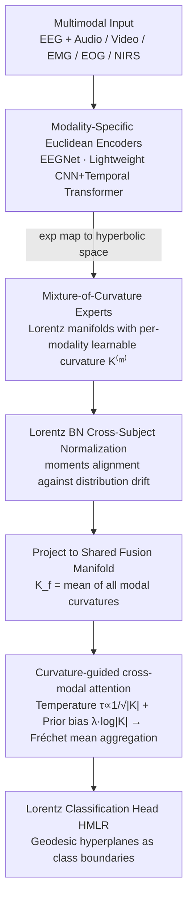

# EEG-Based Multimodal Learning via Hyperbolic Mixture-of-Curvature Experts

**Conference**: ICML 2026  
**arXiv**: [2604.12579](https://arxiv.org/abs/2604.12579)  
**Code**: The paper states "Code will be released", currently not public  
**Area**: Medical Imaging / Brain-Computer Interface / Multimodal Learning / Hyperbolic Geometry  
**Keywords**: EEG, Mixture-of-Curvature, Lorentz Manifold, Cross-subject generalization, δ-hyperbolicity

## TL;DR
EEG-MoCE assigns a Lorentz manifold expert with **learnable curvature** to each modality in EEG-based multimodal learning (emotion/sleep/cognition). It utilizes curvature-aware attention, where "higher curvature signifies richer hierarchical structure and thus higher weight in fusion," to perform cross-modal integration. This approach achieves cross-subject accuracy gains of +14.14%, +3.34%, and +7.98% on the EAV, ISRUC, and Cognitive datasets, respectively.

## Background & Motivation

**Background**: Isolated EEG signals are heavily affected by electrophysiological noise and subject variability. Consequently, increasing research focuses on multimodal learning by combining EEG with video (facial expressions), audio, and EMG/EOG/NIRS to enhance robustness in tasks like emotion recognition, sleep staging, and cognitive load assessment. The current mainstream architectures are Euclidean (CNN+Transformer+Cross-modal attention).

**Limitations of Prior Work**: (1) Neuroscience confirms that EEG and brain-related modalities possess **hierarchical organization** (e.g., emotion ranges from subcortical to limbic to neocortical; frequency bands are also hierarchical); (2) Euclidean embeddings fail to accommodate exponentially expanding hierarchical structures due to linear/quadratic volume growth; (3) Existing hyperbolic EEG work (e.g., HEEGNet) utilizes **fixed curvature** and focuses only on unimodal EEG, ignoring the vast differences in "hierarchical intensity" across different modalities in multimodal scenarios.

**Key Challenge**: Hierarchical complexity varies naturally across modalities (quantified in the paper via δ-hyperbolicity: EEG $\delta_{rel} \approx 0.10$, audio $\approx 0.22$, video $\approx 0.28$). Representing them in the same curvature or the same Euclidean space is suboptimal. To make "adaptive curvature" effective during multimodal fusion, a mechanism is needed to inform the fusion layer which modality is more reliable.

**Goal**: (i) Assign each modality its own Lorentz manifold with a learnable curvature; (ii) Explicitly utilize learned curvatures for weighting during fusion, assigning higher weights to modalities with more hierarchical information.

**Key Insight**: Theoretically, a larger absolute curvature $|K|$ allows for embedding deeper hierarchies with less distortion in fixed dimensions (Sala et al., 2018). Therefore, if a modality's $|K|$ is learned to be large end-to-end, it implies a higher density of hierarchical information, allowing $|K|$ to serve as a fusion weight.

**Core Idea**: Mixture-of-Curvature experts + curvature-aware cross-modal attention (where $|K|$ determines both unimodal geometry and fusion weights).

## Method

### Overall Architecture
The core problem EEG-MoCE addresses is that EEG and its accompanying modalities (audio, video, EMG/EOG/NIRS) exhibit significantly different hierarchical complexities. The model $h_\Theta=g_\psi\circ F_\omega\circ(\bigoplus_{m\in\mathcal{M}}E_\phi^{(m)}\circ e_\theta^{(m)})$ is a four-stage pipeline: each modality first passes through its own Euclidean encoder $e_\theta^{(m)}$ to extract local time-frequency features $\mathbf{x}^{(m)}\in\mathbb{R}^d$ (EEGNet for EEG; variants for EMG/EOG; lightweight CNN+Temporal Transformer for video; 1D CNN + Temporal Transformer for audio mel-spectrograms). These are then projected into an **exclusive learnable-curvature Lorentz manifold expert** $E_\phi^{(m)}$ for hierarchical modeling. All modalities are then integrated into a curvature-oriented fusion module $F_\omega$ using curvature-guided cross-attention. Finally, a Lorentz classification head $g_\psi$ makes decisions directly in hyperbolic space. The entire pipeline from post-encoding to classification is conducted on the Lorentz manifold, utilizing exponential maps only for initial transition into hyperbolic space.

### Key Designs

**1. Mixture-of-Curvature Experts: Per-modality Learnable Curvature**

To address the limitations of "one-size-fits-all" fixed curvature, the authors quantify hierarchical intensity via δ-hyperbolicity, finding EEG $\delta_{rel} \approx 0.10$, audio $\approx 0.22$, video $\approx 0.28$, and NIRS $\approx 0.30$ (Table 1). A shared curvature would under-represent high-hierarchy modalities and over-parametrize low-hierarchy ones. The solution assigns each modality $m$ a learnable curvature $K^{(m)} < 0$. Euclidean features are projected via $\mathbf{h}^{(m)}=\exp_\mathbf{o}^{K^{(m)}}(\mathbf{x}^{(m)})$ to the modality's Lorentz hyperboloid (origin $\mathbf{o}=[\sqrt{-1/K^{(m)}},\mathbf{0}]^\top$). Subsequent BN, activation, and attention are performed on this manifold. This is effective because $|K|$ is learned end-to-end; post-training, the model converges to EEG $|K| = 2.34 >$ Vision $2.29 >$ Audio $1.91$, inversely correlating perfectly with $\delta_{rel}$.

**2. Curvature-guided cross-modal attention: Curvature-driven Temperature and Prior Bias**

The fusion stage must identify which modality is more reliable. Modalities are first projected to a shared fusion manifold (curvature $K_f$ is the mean of modal curvatures): $\mathbf{z}_f^{(m)}=\exp_\mathbf{o}^{K_f}(\sqrt{K^{(m)}/K_f}\cdot\log_\mathbf{o}^{K^{(m)}}(\mathbf{z}^{(m)}))$. Attention uses negative squared geodesic distance $-d_{\mathcal{L}}^2$ instead of dot products. Two curvature-driven couplings are added: temperature $\tau^{(m)}=\tau_0/\sqrt{|K^{(m)}|}$ makes queries from high $|K|$ modalities sharper, and a prior bias $\lambda\cdot\phi(K^{(j)})$ (where $\phi(K)=\log(|K|+\epsilon)$) encourages attention towards keys with high $|K|$. The resulting weights $\tilde{\alpha}_{m\to j}\propto\exp(-d_{\mathcal{L}}^2(\mathbf{q}^{(m)},\mathbf{k}^{(j)})/\tau^{(m)}+\lambda\cdot\phi(K^{(j)}))$ are used for weighted Fréchet mean aggregation. Here, $K$ serves as a learnable indicator of information content.

**3. Full-stack Hyperbolic Processing + Cross-subject Normalization**

To prevent loss of hierarchical information, the model remains in the Lorentz manifold from the encoder onwards. Lorentz fully connected layers $f_\mathcal{L}(\mathbf{p})=(\sqrt{\|\tilde{\mathbf{p}}_s\|^2-1/K},\tilde{\mathbf{p}}_s)$ (where $\tilde{\mathbf{p}}_s=\psi(\mathbf{Wp}+\mathbf{b})$) ensure outputs stay on the manifold. Lorentz BN uses moments alignment to counteract cross-subject distribution drift. Classification utilizes HMLR with geodesic hyperplanes as boundaries. This "compositional design" leverages Euclidean encoders for local features and hyperbolic components for hierarchical modeling and fusion.

### Loss & Training
- Classification loss + auxiliary terms (hyperparameters in appendix), 100 epochs; Adam for Euclidean parameters, Riemannian Adam for hyperbolic parameters; lr=1e-3, early stopping patience=20.
- Training on 4×RTX 4090; evaluated via leave-one-group-out or 10-fold leave-groups-out by subject ID.

## Key Experimental Results

### Main Results

Performance on three EEG multimodal benchmarks (balanced accuracy %):

| Dataset | Task / Modalities | Prev. SOTA | EEG-MoCE | Gain |
|--------|------------|---------|----------|------|
| EAV (n=42) | Emotion / EEG+Audio+Video | HEEGNet 61.74 | **75.88** | **+14.14** |
| ISRUC (n=10) | Sleep Stage / EEG+EMG+EOG | XSleepFusion 75.19 | **78.53** | +3.34 |
| Cognitive (n=26) | N-back Memory / EEG+EOG+NIRS | EF-Net 54.41 | **62.39** | +7.98 |

### Ablation Study

Architecture ablation on EAV (Table 7):

| Encoder | Fusion | Acc (%) | F1 (%) | Description |
|---------|--------|---------|--------|------|
| Euclidean | Euclidean | 60.33 | 57.24 | All-Euclidean baseline |
| Euclidean | Hyperbolic | 61.48 | 58.79 | Hyperbolic fusion only (+1.15) |
| Hyperbolic | Euclidean | 74.17 | 73.41 | Hyperbolic encoder only (+13.84) |
| Hyperbolic | Hyperbolic (Full) | **75.88** | **75.47** | Full hyperbolic model (+1.71) |

Hyperbolic component ablation (Figure 4):

| Configuration | Acc Gain |
|------|---------|
| Fixed K=-2 | Baseline |
| + Learnable K | +2.14% |
| + COMF (curvature prior bias) | +1.38% |
| Full (Learnable K + COMF) | Best |

Modal contribution analysis (Table 2, EAV):

| Modality | $\delta_{rel}$ | Learned $|K|$ | Attention Contribution |
|------|-------|------|-----------|
| EEG | 0.160 | 2.34 | 36.0% |
| Video | 0.278 | 2.29 | 33.6% |
| Audio | 0.293 | 1.91 | 30.5% |

### Key Findings
- **Majority of gains stem from encoder hyperbolization** (+13.84), while fusion hyperbolization adds +1.71. This identifies the Euclidean space's inability to represent EEG hierarchies as the primary bottleneck.
- **Strong correlation exists between $|K|$, $\delta_{rel}$, and attention contribution**. The hypothesis that curvature indicates hierarchical information density is quantitatively validated.
- **Learnable curvature outperforms fixed curvature by 2.14%**, and COMF adds another 1.38%.
- **Emotion recognition on EAV jumped from 61.74 to 75.88**, suggesting hyperbolic geometry is particularly beneficial for tasks with high hierarchical depth like subjective emotion.

## Highlights & Insights
- **Dual utilization of geometric parameters**: Curvature $K$ is used to define the embedding space, the sharpened temperature, and the fusion bias. This turns "modal importance" into a learnable geometric quantity rather than just an extra attention head.
- **Methodological contribution via δ-hyperbolicity**: Using a geometric metric as a profiling tool to decide if a modality warrants hyperbolic treatment.
- **First systematic extension of mixture-of-curvature to EEG multimodal learning**, with robust cross-subject results.
- **Use of weighted Fréchet mean** in fusion ensures manifold semantics are preserved better than Euclidean weighted sums.

## Limitations & Future Work
- **Reliance on HEEGNet's moments alignment** for cross-subject normalization; no new domain adaptation mechanism proposed.
- **Small sample sizes** across datasets ($n=10/26/42$); scalability to large-scale data remains unverified.
- **Training costs of hyperbolic operations**: Riemannian optimizers and Lorentz attention are notably slower than Euclidean standards.
- **Prior bias $\lambda$ sensitivity**: While it learns to emphasize curvature, the initial values for $K$ and $\lambda$ may affect convergence.

## Related Work & Insights
- **vs HEEGNet (Li et al., 2026)**: Extended from unimodal fixed curvature to multimodal learnable curvature with guided fusion, outperforming it by 14.14 points on EAV.
- **vs Hyper-MML (Kang et al., 2025)**: Outperformed by 15.12 points by using per-modality learnable curvature instead of a fixed shared curvature.
- **vs MMML / CTMWA / LMF**: All-Euclidean baselines are significantly outperformed, highlighting geometry selection as a fundamental weakness in prior EEG multimodal research.

## Rating
- Novelty: ⭐⭐⭐⭐⭐ "Curvature = Geometry + Modal Weight" is an elegant design philosophy.
- Experimental Thoroughness: ⭐⭐⭐⭐ Complete cross-task and cross-modal ablations; lacks training cost overhead analysis.
- Writing Quality: ⭐⭐⭐⭐⭐ Rigorous geometric notation and clear motivation.
- Value: ⭐⭐⭐⭐ Bridging the 60% to 75% accuracy gap in EEG emotion recognition is a significant step toward clinical viability.

<!-- RELATED:START -->

[1] Li et al. "HEEGNet: Hyperbolic EEG Network for Emotion Recognition" (2026)
[2] Kang et al. "Hyper-MML: Hyperbolic Multimodal Learning" (2025)

<!-- RELATED:END -->

## Related Papers

- [\[ICLR 2026\] HEEGNet: Hyperbolic Embeddings for EEG](../../ICLR2026/medical_imaging/heegnet_hyperbolic_embeddings_for_eeg.md)
- [\[ICML 2025\] I2MoE: Interpretable Multimodal Interaction-aware Mixture-of-Experts](../../ICML2025/medical_imaging/i2moe_interpretable_multimodal_interaction-aware_mixture-of-experts.md)
- [\[CVPR 2026\] H2-Surv: Hierarchical Hyperbolic Multimodal Representation Learning for Survival Prediction](../../CVPR2026/medical_imaging/h2-surv_hierarchical_hyperbolic_multimodal_representation_learning_for_survival_.md)
- [\[AAAI 2026\] SEMC: Structure-Enhanced Mixture-of-Experts Contrastive Learning for Ultrasound Standard Plane Recognition](../../AAAI2026/medical_imaging/semc_structure-enhanced_mixture-of-experts_contrastive_learning_for_ultrasound_s.md)
- [\[CVPR 2025\] DFLMoE: Decentralized Federated Learning via Mixture of Experts for Medical Data](../../CVPR2025/medical_imaging/dflmoe_decentralized_federated_learning_via_mixture_of_experts_for_medical_data_.md)

<!-- RELATED:END -->
