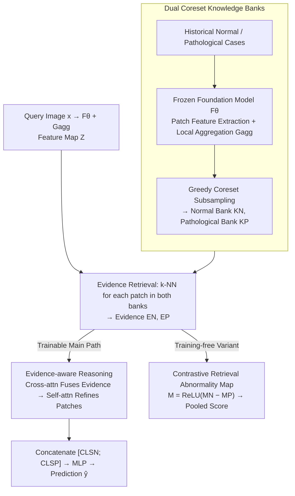

# Evidential Reasoning Advances Interpretable Real-World Disease Screening

**Conference**: ICML 2026  
**arXiv**: [2605.15171](https://arxiv.org/abs/2605.15171)  
**Code**: https://github.com/DopamineLcy/EviScreen (Available)  
**Area**: Medical Imaging / Interpretable AI / Anomaly Detection  
**Keywords**: Dual Knowledge Banks, Evidential Reasoning, Coreset Memory Bank, Contrastive Retrieval, Clinical-Oriented Evaluation

## TL;DR
EviScreen utilizes "Normal + Pathological" dual knowledge banks for region-level evidence retrieval, followed by cross-attention and self-attention to perform evidential reasoning between the current case and retrieved evidence. This approach provides both **retrospective interpretability** (identifying which historical cases support the current judgment) and **localization interpretability** (abnormality maps from contrastive retrieval), achieving SOTA specificity at high recall levels across four real-world external test sets.

## Background & Motivation

**Background**: Current medical imaging disease screening follows two main paradigms: (a) Deviation-based prediction (unsupervised anomaly detection, e.g., PatchCore, SimpleNet), which models only normal samples and alerts upon deviation; (b) Direct prediction (fully supervised binary classification), using post-hoc localization via Grad-CAM.

**Limitations of Prior Work**: (a) These methods fail to utilize the rich information in pathological samples and show limited performance on complex modalities like chest X-rays or dermatoscopy. (b) Multiple studies have proven that post-hoc maps like Grad-CAM provide poor localization quality and cannot explain *why* a region looks like a lesion—lacking **evidential reasoning**. Prototype methods (e.g., ProtoPNet) use a fixed number of prototypes to represent preset classes, which lacks scalability and fails to cover the diverse morphologies in real clinical settings.

**Key Challenge**: Clinical radiologists make decisions by "referring to similar past cases." Existing models either ignore historical cases or rely on "abstract learned prototypes," which disconnects them from the actual diagnostic workflow.

**Goal**: (1) Design a screening framework capable of finding "similar region-level evidence from a scalable case library" like a doctor; (2) Establish real-world clinical evaluation protocols (external testing + specificity at high recall).

**Key Insight**: Reshape anomaly screening into a two-stage "Retrieval + Reasoning" process. Use a foundation model to extract region features and construct two coreset knowledge banks (Normal and Pathological). Each patch of the query image performs $k$-NN retrieval within both banks, allowing the model to perform attention-based reasoning using these evidence tokens.

**Core Idea**: By using "Normal vs. Pathological" dual knowledge banks for **contrastive retrieval**, the model provides both localization (abnormality map $\mathbf M = \text{ReLU}(\mathbf M_N - \mathbf M_P)$) and reasoning (cross-attention to fuse evidence into query features), transforming "post-hoc Grad-CAM" into an "intrinsic evidence flow."

## Method

### Overall Architecture
EviScreen reformulates disease screening as a two-stage process: "retrieve evidence first, then perform evidential reasoning." **Phase 1: Dual Knowledge Bank Construction**: The training set is split into a bank subset $\mathcal X^B_{N/P}$ and a training subset $\mathcal X^R_{N/P}$. A frozen foundation model $F_\theta$ extracts intermediate patch features, which are locally aggregated via $\mathcal G_{agg}$ to obtain region feature sets $\mathcal S_{N/P}$. Greedy coreset subsampling is then used to compress these into compact Normal ($\mathcal K_N$) and Pathological ($\mathcal K_P$) banks. **Phase 2: Reasoning**: For a query image $\mathbf x$, feature maps $\mathbf Z=\mathcal G_{agg}(F_\theta(\mathbf x))\in\mathbb R^{h\times w\times d}$ are extracted. Each patch undergoes $k$-NN retrieval in both banks to obtain evidence $\mathbf E_N,\mathbf E_P\in\mathbb R^{h\times w\times k\times d}$. An evidence-aware reasoning module fuses this evidence into query features layer-by-layer; the concatenated [CLS] tokens of both branches are fed to an MLP for prediction $\hat y$. Additionally, a training-free contrastive retrieval variant is provided, utilizing $\mathbf M = \text{ReLU}(\mathbf M_N - \mathbf M_P)$ to pool an anomaly score.

### Key Designs

**1. Dual Coreset Knowledge Banks: Representing Normal and Pathological Morphologies with Scalable Memory**
Prototype methods like ProtoPNet learn only a fixed number of $K$ abstract prototypes, failing to cover the vast variety of clinical lesion morphologies. Furthermore, pathological images are often "noisy" data containing both normal and lesion areas, making them difficult to fit into preset class prototypes. EviScreen uses coresets: it extracts and aggregates patch features from subsets $\mathcal X^B_N, \mathcal X^B_P$ and applies greedy subsampling to create the banks. The optimization goal for subsampling is $\mathcal K^*=\arg\min_{\mathcal K\subset\mathcal S}\max_{m\in\mathcal S}\min_{n\in\mathcal K}\|m-n\|_2$, ensuring every point in the original set is close to its nearest neighbor in the subset—a classic NP-hard coverage problem solved via iterative greedy approximation. Unlike fixed prototypes, coreset capacity scales freely with data, allowing new cases to be added continuously.

**2. Evidence-aware Reasoning: Embedding Retrieved Evidence into Features for Traceable Predictions**
Retrieving $k$ similar pieces of evidence is insufficient; they must actively influence the judgment. Each layer first performs cross-attention, allowing query patches to aggregate their retrieved evidence:

$$\mathbf T^\ell_N(i,j)=\operatorname{softmax}\big(\mathbf Z^\ell_N(i,j)\mathbf E_N(i,j)^\top/\sqrt d\big)\mathbf E_N(i,j)$$

The aggregated features are reshaped into feature maps, followed by inter-patch self-attention for refinement and contextual consistency. The Normal branch ($\mathbf Z_N$) and Pathological branch ($\mathbf Z_P$) run in parallel, concluding with $\hat y=\text{MLP}([\mathbf Z_N^{\text{CLS}};\mathbf Z_P^{\text{CLS}}])$. This ensures every prediction is backed by traceable nearest-neighbor evidence (identifying which historical cases support the judgment, i.e., retrospective interpretability). Maintaining dual branches rather than a single similarity score preserves a two-dimensional signal of "looking like normal vs. looking like pathological," aligning with clinical differential diagnosis intuition.

**3. Contrastive Retrieval Abnormality Map: Intrinsic Localization without Parameter Training**
Unsupervised methods like PatchCore use only a normal bank $\mathbf M_N$, which often misidentifies rare normal variations as anomalies. EviScreen’s training-free variant uses bank differencing: each patch calculates its average distance to $k$-NN in both banks, yielding $\mathbf M_N, \mathbf M_P \in \mathbb R^{h\times w}$. The abnormality map is defined as $\mathbf M(i,j)=\text{ReLU}(\mathbf M_N(i,j)-\mathbf M_P(i,j))$, highlighting only regions that are "far from normal but close to pathological." This difference filters out non-pathological deviations, resulting in more focused localization. Since the abnormality map is derived directly from retrieval, it serves as an intrinsic explanation, distinct from post-hoc gradient visualizations like Grad-CAM.

### Loss & Training
Only the evidence-aware reasoning module (cross/self-attention + MLP) is trained; the foundation model remains frozen throughout. The objective is binary BCE loss. The training-free variant requires no learnable parameters. Primary hyperparameters include the retrieval parameter $k$, knowledge bank sizes, and the number of cross-attention layers $L$.

## Key Experimental Results

### Main Results
Evaluation on 10 public datasets across three modalities (fundus, chest X-ray, dermatology), focusing on 4 **external** test sets: JSIEC, RIADD, CheXpert, and Derm12345. Clinical-oriented metrics include AUROC, AP, Spe@95%R (Specificity at 95% Recall), and Spe@99%R. Results (in %):

| Metric | EviScreen | EviScreen-TF (Training-free) | FM | PatchCore* | PatchCore | NFM-DRA | DRA | SCRD4AD | EDC | SimpleNet | CIPL |
|---|---|---|---|---|---|---|---|---|---|---|---|
| AUROC | **98.06** | 96.76 | 95.84 | 94.96 | 92.12 | 95.53 | 92.53 | 94.88 | 79.12 | 73.73 | 94.83 |
| AP | **96.10** | 94.20 | 94.24 | 89.61 | 86.62 | 93.23 | 89.53 | 89.85 | 71.44 | 57.66 | 91.36 |
| Spe@95%R | **94.74** | 91.48 | 87.95 | 87.26 | 81.09 | 90.37 | 80.12 | 88.50 | 51.45 | 53.81 | 87.33 |
| Spe@99%R | **91.62** | 87.74 | 79.29 | 83.31 | — | — | — | — | — | — | — |

### Ablation Study

| Configuration | Key Effect | Description |
|---|---|---|
| Full EviScreen | Best overall performance | Dual banks + Reasoning module |
| No Pathological Bank (Only $\mathcal K_N$) | Drop in Spe@95%R | Demonstrates necessity of dual bank contrast |
| Fixed Prototypes (ProtoPNet style) | Performance drop | Coreset capacity exceeds fixed prototypes |
| Cross-attention only (No Self-attn) | Slight drop | Inter-patch refinement provides context |
| Training-free variant | Outperforms PatchCore | Contrastive retrieval alone is a strong baseline |

### Key Findings
- **Larger Gaps in Clinical Metrics**: Compared to AUROC, the proposed method shows a more significant lead over baselines in Spe@95%R and Spe@99%R (e.g., 8.3 points higher than PatchCore* at Spe@99%R), highlighting the advantage of evidential reasoning in high-recall clinical zones.
- **Training-free Superiority**: The variant using only contrastive retrieval outperforms traditional anomaly detection baselines, validating the "dual bank + contrast" concept.
- **Scalability**: Coreset size can scale linearly, facilitating the continuous addition of new cases—something prototype-based methods cannot achieve.

## Highlights & Insights
- **Dual-Track Interpretability**: Simultaneously provides retrospection (clinical case evidence) and localization (abnormality maps)—much closer to the actual workflow of radiologists than a single Grad-CAM heatmap.
- **Clinical-Oriented Evaluation Framework**: Using 10 datasets, external testing, and Spe@high-Recall represents a realistic design for clinical deployment and serves as a community reference.
- **Transferable Paradigm**: The "contrastive retrieval + attention fusion" formula can be applied to other domains (industrial defect detection, satellite change detection) requiring "normal vs. anomaly" differentiation.

## Limitations & Future Work
- Constructing dual banks requires a sufficient and representative set of pathological samples; "pathological bank sparsity" in rare or emerging diseases may cause contrastive retrieval to fail.
- The foundation model is frozen, meaning the performance ceiling is tied to the FM; replacing it with domain-specific medical foundation models could yield gains.
- Patch-wise $k$-NN during inference introduces latency as the bank grows; combining coreset growth with approximate nearest neighbor (ANN) acceleration is a likely extension.
- Current supervision does not explicitly enforce "evidence-prediction consistency"; future work could introduce contrastive terms to ensure retrieved evidence truly dominates the prediction.

## Related Work & Insights
- **vs. PatchCore / SimpleNet**: These also use coreset memory banks but only for normal samples; EviScreen introduces a pathological bank for contrast, improving localization accuracy.
- **vs. ProtoPNet / Prototype Methods**: Fixed prototypes are limited by preset classes; coreset capacity is flexible and provides broader coverage.
- **vs. Grad-CAM Post-hoc Interpretability**: The explanations here are "intrinsic" (derived from retrieval and cross-attention), avoiding the instability of gradient-based visualization techniques.

## Rating
- **Novelty**: ⭐⭐⭐⭐ The combination of dual coreset, contrastive retrieval, and dual-track interpretability is a novel and complete solution for medical screening.
- **Experimental Thoroughness**: ⭐⭐⭐⭐⭐ Extremely comprehensive with 10 datasets, 3 modalities, external testing, clinical metrics, and training-free ablations.
- **Writing Quality**: ⭐⭐⭐⭐ Clear structure with categorized limitations, contributions, and a powerful paradigm comparison in Figure 1.
- **Value**: ⭐⭐⭐⭐⭐ Provides a deployable clinical-oriented pipeline and evaluation protocol, contributing both a method and a benchmark to the medical imaging community.

<!-- RELATED:START -->

## Related Papers

- [\[AAAI 2026\] PulseMind: A Multi-Modal Medical Model for Real-World Clinical Diagnosis](../../AAAI2026/medical_imaging/pulsemind_a_multi-modal_medical_model_for_real-world_clinical_diagnosis.md)
- [\[AAAI 2026\] Experience with Single Domain Generalization in Real World Medical Imaging Deployments](../../AAAI2026/medical_imaging/experience_with_single_domain_generalization_in_real_world_medical_imaging_deplo.md)
- [\[ICML 2026\] Marrying Generative Model of Healthcare Events with Digital Twin of Social Determinants of Health for Disease Reasoning](marrying_generative_model_of_healthcare_events_with_digital_twin_of_social_deter.md)
- [\[AAAI 2026\] DeepGB-TB: A Risk-Balanced Cross-Attention Gradient-Boosted Convolutional Network for Rapid, Interpretable Tuberculosis Screening](../../AAAI2026/medical_imaging/deepgb-tb_a_risk-balanced_cross-attention_gradient-boosted_convolutional_network.md)
- [\[ICLR 2026\] Glance and Focus Reinforcement for Pan-cancer Screening](../../ICLR2026/medical_imaging/glance_and_focus_reinforcement_for_pan-cancer_screening.md)

<!-- RELATED:END -->
