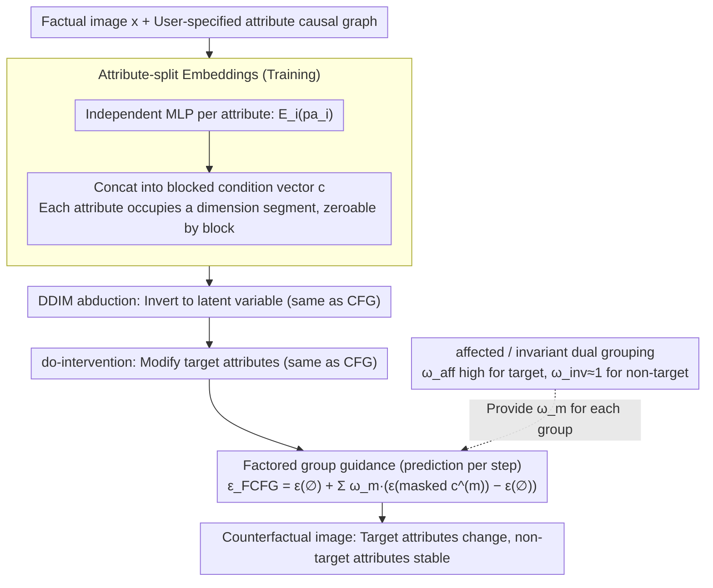

# Factored Classifier-Free Guidance

**Conference**: ICML 2026  
**arXiv**: [2506.14399](https://arxiv.org/abs/2506.14399)  
**Code**: No public link  
**Area**: Diffusion Models / Counterfactual Generation / Medical Imaging  
**Keywords**: Classifier-Free Guidance, Counterfactual Generation, Causal Intervention, Attribute Amplification, DDIM

## TL;DR
This paper identifies the "attribute amplification" failure mode of Classifier-Free Guidance (CFG) in counterfactual generation—where a single global $\omega$ amplifies attributes that should remain unchanged. The authors propose FCFG: grouping attributes based on a causal graph and assigning independent guidance weights to each group. This approach significantly reduces off-target attribute drift and improves counterfactual reversibility on CelebA-HQ, EMBED, and MIMIC-CXR.

## Background & Motivation
**Background**: Diffusion models have become the de facto standard for conditional generation. The standard pipeline for counterfactual generation typically follows a three-stage process: DDIM inversion (abduction) $\to$ do-intervention (action) $\to$ reverse DDIM guided by CFG (prediction). CFG interpolates between conditional and unconditional scores via $\epsilon_\text{CFG}=(1-\omega)\epsilon_\theta(\varnothing)+\omega\epsilon_\theta(\mathbf{c})$, serving as a knob to ensure generated images more significantly reflect target attributes.

**Limitations of Prior Work**: The $\omega$ in CFG is a global scalar acting on the entire condition vector $\mathbf{c}$. In counterfactual scenarios, $\mathbf{c}$ often encodes multiple attributes (e.g., gender, age, smile). If a user wants to intervene on only one attribute, they are forced to apply the same $\omega$ to all. Consequently, doing do(Male=no) might cause "Smiling" to be amplified, or doing do(Young=no) might change identity and expression concurrently. This "off-target" modification violates the invariance axiom of causal graphs and is termed attribute amplification.

**Key Challenge**: There is a fundamental tension between "intervention effectiveness" (changing the target attribute more strongly) and "stability of non-target attributes." As long as the guidance strength is a scalar, these two goals are coupled. While Xia et al. (2024) attribute this to predictor-finetuning during training, this paper argues the guidance mechanism itself is the culprit.

**Goal**: Decouple attributes during inference to assign individual guidance strengths to different semantic/causal groups without modifying training procedures or model architectures.

**Key Insight**: If attribute groups are conditionally independent given $\mathbf{x}_t$, i.e., $p(\mathbf{pa}\mid\mathbf{x}_t)=\prod_m p(\mathbf{pa}^{(m)}\mid\mathbf{x}_t)$, the proxy posterior decomposes naturally as $p^\omega(\mathbf{x}_t\mid\mathbf{pa})\propto p(\mathbf{x}_t)\prod_m p(\mathbf{pa}^{(m)}\mid\mathbf{x}_t)^{\omega_m}$. Each group can then have its own guidance weight $\omega_m$, with standard CFG being the special case where $M=1$.

**Core Idea**: Use "attribute-split embeddings" and "group-wise weights $\omega_m$" to rewrite the CFG score update. This substitutes global amplification with fine-grained, groupable amplification that is effective during inference only.

## Method

### Overall Architecture
FCFG aims to solve the problem where a single global $\omega$ amplifies attributes that should remain unchanged. It replaces the scalar knob with a vector of knobs assigned according to the causal graph, affecting only the inference process. The workflow is embedded in the three steps of DDIM counterfactual reasoning: abduction $\to$ action $\to$ prediction. The abduction and action steps are identical to standard CFG; only in the prediction step is the denoising $\epsilon_\text{CFG}$ replaced with $\epsilon_\text{FCFG}$. During training, a conditional diffusion model is learned using block-wise concatenated attribute embeddings. At inference, these scores are recombined based on user-defined attribute groups and independent guidance strengths.

### Key Designs

**1. Attribute-split Embedding: Assigning unique dimension segments**
Standard conditional diffusion typically crams multiple attributes into a single dense vector, entangling semantics in the embedding space. This makes it impossible to "release" only one attribute during inference. FCFG assigns each attribute $pa_i$ an independent MLP $\mathcal{E}_i:\mathbb{R}^{d_i}\to\mathbb{R}^d$. The outputs are concatenated to form $\mathbf{c}=\text{concat}(\mathcal{E}_1(pa_1),\dots,\mathcal{E}_K(pa_K))\in\mathbb{R}^{Kd}$. Each attribute thus occupies a non-overlapping block. To mask attribute $i$ during inference, its block is multiplied by an indicator $\delta_i^{(m)}\in\{0,1\}$. These MLPs are trained end-to-end with the denoiser, providing a clean mask interface for arbitrary grouping.

**2. Factored Group Guidance: Upgrading global $\omega$ to group-wise $\omega_m$**
The core issue with CFG is the implicit assumption that all attributes are conditionally independent and equally weighted. FCFG relaxes the latter. Assuming attribute groups are conditionally independent given $\mathbf{x}_t$, the proxy posterior decomposes as follows:

$$p^\omega(\mathbf{x}_t\mid\mathbf{pa})\propto p(\mathbf{x}_t)\prod_m p(\mathbf{pa}^{(m)}\mid\mathbf{x}_t)^{\omega_m}$$

Each group $m$ has its own exponent $\omega_m$. Taking the log-gradient, the two-term score difference in CFG is expanded into a weighted sum of $M$ terms:

$$\epsilon_\text{FCFG}=\epsilon_\theta(\varnothing)+\sum_m \omega_m\big(\epsilon_\theta(\underaccent{\rule{4.09723pt}{0.4pt}}{\mathbf{c}}^{(m)})-\epsilon_\theta(\varnothing)\big)$$

where $\underaccent{\rule{4.09723pt}{0.4pt}}{\mathbf{c}}^{(m)}$ is the masked embedding preserving only the $m$-th group. This is a strict generalization of CFG: $M=1$ recovers standard CFG, while $M=K$ allows an independent weight for every attribute.

**3. affected/invariant Grouping: Mapping groups to counterfactual axioms**
FCFG provides a natural grouping strategy based on the causal graph: target attributes and their causal descendants are categorized as the "affected" group, while others are "invariant." By setting $\omega_\text{aff}$ relatively high (e.g., $2.5$) and $\omega_\text{inv}\approx 1$, target changes are enforced while non-target attributes remain stable. This corresponds to the counterfactual axiom that attributes external to the intervention should remain stable, effectively resolving the tension between effectiveness and stability.

### Loss & Training
The training objective follows the standard conditional diffusion loss $\mathbb{E}\|\epsilon-\epsilon_\theta(\mathbf{x}_t,t,\mathbf{c})\|^2$ and employs classic classifier-free dropout (randomly replacing the entire $\mathbf{c}$ with $\varnothing$). No new loss functions are introduced. While this creates a slight train-test mismatch (the model sees full $\mathbf{c}$ or null during training but encounters masked blocks during inference), no stability issues were observed. FCFG is orthogonal to other guidance improvements like CFG++ or APG and can be integrated into their formulas.

## Key Experimental Results

### Main Results

| Dataset | Task | Metric | CFG | FCFG | Note |
| :--- | :--- | :--- | :--- | :--- | :--- |
| CelebA-HQ 64×64 | do(Smiling) | $\Delta$ target ↑ / $\Delta$ off-target ↓ | High target, high off-target | High target, near-zero off-target | Key off-target suppression |
| CelebA-HQ | do(Smiling) | Reconstruction MAE/LPIPS | Increases with $\omega$ | Significantly lower at same $\omega$ | Better identity preservation |
| EMBED 192×192 | do(circle) | $\Delta$ density (off-target) | Increases significantly | Near zero | Avoids halluncinating features |
| MIMIC-CXR | do(finding) | $\Delta$ race/sex (off-target) | Obvious drift | Heavily suppressed | Improved clinical fairness |
| MIMIC-CXR | do(finding) | $\Delta$ target AUC | +18.8 | +18.8 (FCFG) | Off-target only +0.6 |

### Ablation Study

| Configuration | Effect | Note |
| :--- | :--- | :--- |
| $M=1$ (CFG) | Attribute amplification occurs | Confirms FCFG is a strict generalization |
| Two groups ($M=2$) | Best effectiveness/off-target trade-off | Default configuration |
| Per-attribute ($M=K$) | Supports do(Smiling, Male, Young) | Essential for multiple interventions |
| FCFG + CFG++/APG | Improved off-target amplification | Framework compatibility |

### Key Findings
- **Root of Attribute Amplification**: Controlled experiments show that amplification is caused by the guidance mechanism itself, rather than dataset artifacts or causal graph mismatches.
- **FID Gains**: FCFG significantly outperforms global CFG in terms of FID on CelebA-HQ, suggesting that reducing off-target drift helps remain on the data manifold.
- **Counterfactual Reversibility**: After performing do$(A)$ followed by do$(A^{-1})$, CFG shows poor MAE/LPIPS due to residual drift, whereas FCFG maintains initial levels.

## Highlights & Insights
- Decomposing the global $\omega$ into a vector of $\omega_m$ based on causal graphs is a simple but highly effective extension of the CFG formula.
- The attribute-split embedding serves as a lightweight design that pre-emptively provides a mask interface for inference-time grouping.
- The definition of "intervention effectiveness vs. reversibility" provides a evaluation framework more aligned with causal axioms than standard FID.
- Orthogonality to score-based improvements like CFG++ suggests that factorization is a fundamental dimension for all conditional sampling methods.

## Limitations & Future Work
- Dependent on pre-specified causal graphs or semantic groupings; grouping errors may lead to unintended amplification.
- Weights $\omega_m$ still require manual tuning; future work could explore adaptive selection based on input conditions or timesteps.
- A training-testing mismatch exists because the model only sees full or null conditions during training; this might affect stability at very high $M$ or $\omega$.
- Tested on resolutions up to 192x192; effectiveness on high-resolution latent diffusion (e.g., SDXL) remains to be verified.

## Related Work & Insights
- **vs. Standard CFG (Ho & Salimans 2022)**: FCFG is a generalization that upgrades the scalar $\omega$ to a vector $\omega_m$.
- **vs. CFG++ (Chung 2025) / APG (Sadat 2025)**: These refine score shapes, but remain global. FCFG is orthogonal and can be combined with them.
- **vs. HVAE (Ribeiro 2023; Xia 2024)**: These solve amplification via predictor-finetuning; FCFG is a lighter, inference-side solution.
- **vs. SA-DCG (Rasal 2025)**: FCFG achieves lower off-target drift and better FID without heavy optimization or diffusion autoencoders.

## Rating
- Novelty: ⭐⭐⭐⭐ 
- Experimental Thoroughness: ⭐⭐⭐⭐ 
- Writing Quality: ⭐⭐⭐⭐ 
- Value: ⭐⭐⭐⭐ 

<!-- RELATED:START -->

## Related Papers

- [\[ICML 2026\] DP-KFC: Data-Free Preconditioning for Privacy-Preserving Deep Learning](dp-kfc_data-free_preconditioning_for_privacy-preserving_deep_learning.md)
- [\[NeurIPS 2025\] Exploring and Leveraging Class Vectors for Classifier Editing](../../NeurIPS2025/medical_imaging/exploring_and_leveraging_class_vectors_for_classifier_editing.md)
- [\[CVPR 2026\] Virtual Immunohistochemistry Staining with Dual-Aligned Multi-Task Feature Guidance](../../CVPR2026/medical_imaging/virtual_immunohistochemistry_staining_with_dual-aligned_multi-task_feature_guida.md)
- [\[CVPR 2026\] Bridging RGB and Hematoxylin Components: An Interleaved Guidance and Fusion Framework for Point Supervised Nuclei Segmentation](../../CVPR2026/medical_imaging/bridging_rgb_and_hematoxylin_components_an_interleaved_guidance_and_fusion_frame.md)
- [\[CVPR 2026\] Adaptive Anisotropic Gaussian Splatting for Multi-contrast MRI Arbitrary-Scale Super-Resolution with Anatomy Guidance](../../CVPR2026/medical_imaging/adaptive_anisotropic_gaussian_splatting_for_multi-contrast_mri_arbitrary-scale_s.md)

<!-- RELATED:END -->
