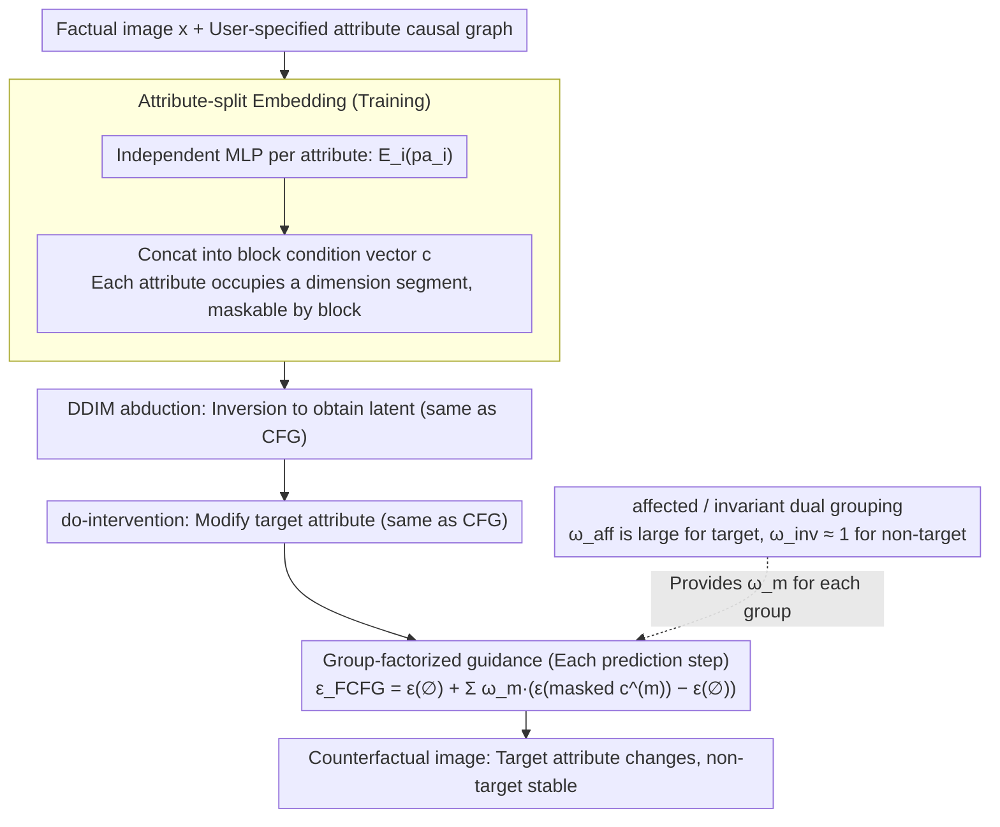

# Factored Classifier-Free Guidance

**Conference**: ICML 2026  
**arXiv**: [2506.14399](https://arxiv.org/abs/2506.14399)  
**Code**: No public link  
**Area**: Diffusion Models / Counterfactual Generation / Medical Imaging  
**Keywords**: Classifier-Free Guidance, Counterfactual Generation, Causal Intervention, Attribute Amplification, DDIM

## TL;DR
This paper identifies the "attribute amplification" failure mode of CFG in diffusion model counterfactual generation—where a single global $\omega$ amplifies attributes that should remain unchanged. The authors propose FCFG: grouping attributes according to a causal graph and assigning independent guidance weights to each group. This significantly reduces off-target attribute drift and improves counterfactual reversibility on CelebA-HQ, EMBED, and MIMIC-CXR.

## Background & Motivation
**Background**: Diffusion models have become the de facto standard for conditional generation. The standard pipeline for counterfactual generation is a three-stage process: DDIM inversion (abduction) $\rightarrow$ do-intervention (action) $\rightarrow$ reverse DDIM guided by CFG (prediction). Classifier-Free Guidance, which interpolates between conditional and unconditional scores via $\epsilon_\text{CFG}=(1-\omega)\epsilon_\theta(\varnothing)+\omega\epsilon_\theta(\mathbf{c})$, is widely used as a knob to make the generated image reflect the target attribute more prominently.

**Limitations of Prior Work**: The $\omega$ in CFG is a global scalar acting on the entire condition vector $\mathbf{c}$. In counterfactual scenarios, $\mathbf{c}$ typically encodes multiple attributes (e.g., gender, age, smile). When a user wants to intervene on only one, they are forced to multiply all attributes by the same $\omega$. Consequently, a do(Male=no) intervention may amplify "Smiling," or a do(Young=no) intervention may change identity and expression. This off-target modification violates the invariance axioms of causal graphs, a phenomenon termed "attribute amplification."

**Key Challenge**: There is a fundamental tension between "intervention effectiveness" (strongly changing the target attribute) and "maintaining the stability of non-target attributes." As long as the guidance is a scalar, these two are inevitably coupled. While Xia et al. (2024) attributed this to predictor-finetuning during training, this paper points out that the guidance mechanism itself is the culprit.

**Goal**: To decouple guidance between attributes at inference time only, assigning independent guidance strengths to each semantic/causal group without modifying training or model architecture.

**Key Insight**: If attribute groups are conditionally independent given $\mathbf{x}_t$ such that $p(\mathbf{pa}\mid\mathbf{x}_t)=\prod_m p(\mathbf{pa}^{(m)}\mid\mathbf{x}_t)$, the proxy posterior naturally factorizes as $p^\omega(\mathbf{x}_t\mid\mathbf{pa})\propto p(\mathbf{x}_t)\prod_m p(\mathbf{pa}^{(m)}\mid\mathbf{x}_t)^{\omega_m}$. Here, each group has its own $\omega_m$, making CFG a special case where $M=1$.

**Core Idea**: Rewrite the CFG score update using "attribute-split embeddings + group-assigned $\omega_m$." This converts global amplification into groupable fine-grained amplification, effective only at inference time without touching the model or training process.

## Method

### Overall Architecture
FCFG aims to solve the issue where a single global $\omega$ amplifies attributes that should remain unchanged. The approach splits the scalar knob in CFG into a set of vector knobs assigned according to a causal graph. This modification is applied only during inference, leaving training and architecture untouched. The pipeline is embedded in the abduction $\rightarrow$ action $\rightarrow$ prediction steps of DDIM counterfactual reasoning. While abduction and action remain identical to standard CFG, the prediction step replaces the denoising score $\epsilon_\text{CFG}$ with $\epsilon_\text{FCFG}$. Essentially, the model learns to concatenate attribute-split embeddings during training, and at inference, these are regrouped with independent guidance strengths to recombine the scores.

### Key Designs

**1. Attribute-split Embedding: Assigning a dedicated dimension segment for each attribute**

Conventional conditional diffusion often packs multiple attributes into a single dense vector, causing semantic entanglement in the embedding space and making it impossible to "release" only one attribute during inference. FCFG assigns an independent MLP $\mathcal{E}_i:\mathbb{R}^{d_i}\to\mathbb{R}^d$ to each attribute $pa_i$. Their outputs are concatenated to form $\mathbf{c}=\text{concat}(\mathcal{E}_1(pa_1),\dots,\mathcal{E}_K(pa_K))\in\mathbb{R}^{Kd}$, so each attribute occupies a non-overlapping block in $\mathbf{c}$. To mask the $i$-th attribute at inference, the corresponding block is simply zeroed out using an indicator $\delta_i^{(m)}\in\{0,1\}$. These $\mathcal{E}_i$ modules are not pre-trained feature extractors but are trained end-to-end with the denoising network. This lightweight training-time design provides a clean mask interface for arbitrary group guidance later.

**2. Group-factorized Guidance: Upgrading global $\omega$ to group-wise $\omega_m$**

The fundamental problem with CFG is its implicit assumption that "all attributes are conditionally independent and weighted equally." FCFG relaxes the latter: assuming attribute groups are conditionally independent given $\mathbf{x}_t$, $p(\mathbf{pa}\mid\mathbf{x}_t)=\prod_m p(\mathbf{pa}^{(m)}\mid\mathbf{x}_t)$, the proxy posterior factorizes as:

$$p^\omega(\mathbf{x}_t\mid\mathbf{pa})\propto p(\mathbf{x}_t)\prod_m p(\mathbf{pa}^{(m)}\mid\mathbf{x}_t)^{\omega_m}$$

Each group carries its own exponent $\omega_m$. Taking the log-gradient, the two-term score difference in CFG is expanded into an $M$-term weighted sum:

$$\epsilon_\text{FCFG}=\epsilon_\theta(\varnothing)+\sum_m \omega_m\big(\epsilon_\theta(\underaccent{\rule{4.09723pt}{0.4pt}}{\mathbf{c}}^{(m)})-\epsilon_\theta(\varnothing)\big)$$

Where $\underaccent{\rule{4.09723pt}{0.4pt}}{\mathbf{c}}^{(m)}$ is the masked embedding keeping only the $m$-th group of attributes while zeroing others. This formula is a strict generalization of CFG: it reverts to standard CFG when $M=1$ and provides independent weights for every attribute when $M=K$. The effectiveness lies in its theoretical alignment with the causal graph at the cost of only a few extra conditional forward passes and a modified linear combination of scores.

**3. affected/invariant Dual Grouping: Mapping abstract groups to counterfactual axioms**

"Factorization" requires a grouping strategy. FCFG proposes a natural one: based on the user-assumed causal graph, attributes are divided into an "affected" group (the intervened attribute and its causal descendants) and an "invariant" group (everything else), controlled by $\omega_\text{aff}$ and $\omega_\text{inv}$ respectively. For a typical do$(A)$ intervention, $\omega_\text{aff}$ is set high (e.g., $2.5$) to drive the target change, while $\omega_\text{inv}\approx 1$ (no amplification) holds non-target attributes steady. This corresponds to the counterfactual axiom that "attributes outside the intervention should remain stable." It suppresses the drift $\Delta$ on invariant attributes to nearly $0$ without sacrificing $\Delta$ on the target, resolving the tension between effectiveness and stability. When all attributes are intervened simultaneously, $M=2$ falls back to global CFG, but the framework naturally supports an $M=K$ per-attribute mode.

### Loss & Training
The training objective strictly follows the standard conditional diffusion loss $\mathbb{E}\|\epsilon-\epsilon_\theta(\mathbf{x}_t,t,\mathbf{c})\|^2$, with standard classifier-free dropout (replacing the entire $\mathbf{c}$ with $\varnothing$). No new losses are introduced as FCFG only modifies the score algorithm during inference. The authors acknowledge a slight train-test mismatch—the model sees either full $\mathbf{c}$ or full null during training but encounters masked embeddings at inference—however, no stability issues were observed in experiments. Since grouping is just a rewrite of the score combination, it is orthogonal to and can be used with advanced guidance like CFG++ or APG.

## Key Experimental Results

### Main Results

| Dataset | Task | Metric | CFG | FCFG | Description |
|--------|------|------|-----|------|------|
| CelebA-HQ 64×64 | do(Smiling) | Δ target ↑ / Δ off-target ↓ | High target, high off-target | High target, near-zero off-target | Key off-target suppression |
| CelebA-HQ | do(Smiling) | Inverse Reconstruction MAE/LPIPS | Increases sharply with $\omega$ | Significantly lower at same $\omega$ | Better identity preservation |
| EMBED 192×192 (Breast) | do(circle) | Δ density (off-target) | Increases significantly | Near 0 | Avoids false medical feature amplification |
| MIMIC-CXR | do(finding) | Δ race/sex (off-target) | Obvious drift observed | Heavily suppressed | High clinical fairness significance |
| MIMIC-CXR | do(finding) | Δ target AUC | +18.8 | +18.8 (FCFG) vs CFG +X | Off-target reduced by an order of magnitude at equal target effectiveness |

### Ablation Study

| Configuration | Effect | Description |
|------|------|------|
| $M=1$ (Degenerate CFG) | Attribute amplification occurs | Validates FCFG as a strict generalization |
| Two groups affected/invariant ($M=2$) | Main experimental setting | Best effectiveness/off-target trade-off |
| Per-attribute independent ($M=K$) | Supports multiple do(Smiling, Male, Young) | Necessary when all attributes are intervened |
| FCFG + CFG++ / FCFG + APG | Stacked on advanced guidance | Also improves off-target amplification; framework compatible |
| Vs SA-DCG / HVAE / HVAE-soft | CelebA-HQ do(Smiling) target +13.1 / off-target -1.5 vs SA-DCG +12.9 / +3.0 | Better target, negative off-target (less drift) |

### Key Findings
- **Root of Attribute Amplification**: Controlled experiments (CelebA-HQ three independent attributes) prove that amplification is not caused by dataset artifacts or causal graph mismatch, but by the guidance mechanism itself—shifting the blame from data/model to the inference algorithm.
- **FID Gains**: While multiple score components might suggest instability, FCFG yields significantly better FID on CelebA-HQ than global CFG, suggesting that reducing off-target drift helps keep samples on the data manifold.
- **Counterfactual Reversibility**: Performing do$(A)$ followed by do$(A^{-1})$ shows that CFG results in poor MAE/LPIPS due to residual off-target drift. FCFG maintains near-initial levels, serving as a strong new metric for counterfactual soundness.
- **Multi-attribute Corner Cases**: When all attributes are intervened, $M=2$ grouping fails. The only solution is $M=K$ per-attribute FCFG, which the authors also discuss.

## Highlights & Insights
- Decoupling "global $\omega$" into "group-wise $\omega_m$" is a simple yet insightful idea that addresses a critical flaw in CFG. The derivation from proxy posterior to score formula is elegant and clean.
- The attribute-split embedding is a lightweight training-time design that pre-configures a "mask interface," a valuable architectural choice for any conditional diffusion framework.
- The introduction of "intervention effectiveness vs. reversibility" evaluation is more aligned with causal axioms than simple FID; this approach could be adapted for video editing and 3D consistency.
- Orthogonality to CFG++ and APG suggests that factorization is a separate dimension for improvement in conditional sampling.

## Limitations & Future Work
- Dependency on pre-specified causal graphs or semantic groupings; FCFG does not solve causal discovery. Mis-grouping in unknown or dynamic relationships might worsen amplification.
- $\omega_m$ still requires manual tuning. Future work could explore adaptive selection of $\omega$ based on input conditions or timesteps (timestep-aware FCFG).
- Train-test mismatch: While stability was high in tests, the model only seeing full or null conditions during training could theoretically cause issues with large $M$ or strong $\omega$ in group-masking scenarios.
- Sensitivity of grouping: When all attributes are intervened, the framework relies on fine-grained $M=K$ grouping, which might be less robust.
- Scaling: Experiments were limited to 192×192. Effectiveness on high-resolution latent diffusion (SDXL) or video diffusion remains to be verified.

## Related Work & Insights
- **vs Standard CFG (Ho & Salimans 2022)**: FCFG is a strict generalization, equivalent when $M=1$. It upgrades $\omega$ to a vector $\omega_m$ via conditional independence.
- **vs CFG++ (Chung 2025) / APG (Sadat 2025)**: These improve score shape or manifold constraints for fidelity but still use global $\omega$; FCFG is orthogonal and combinable.
- **vs Compositional Diffusion (Liu 2022) / Shen 2024**: Those methods use spatial masks or multiple models for local control; FCFG uses a single model and semantic grouping.
- **vs HVAE / HVAE-soft (Ribeiro 2023; Xia 2024)**: These correct amplification during training via predictor-finetuning; FCFG is more lightweight as a purely inference-side fix.
- **vs SA-DCG (Rasal 2025)**: They use diffusion autoencoders and identity-preserving optimization; FCFG achieves lower off-target drift and better FID with less complexity.

## Rating
- Novelty: ⭐⭐⭐⭐ Simple but impactful extension of the CFG formula.
- Experimental Thoroughness: ⭐⭐⭐⭐ Extensive testing on three datasets and comparison with HVAE/SA-DCG/CFG++/APG, though lacking high-res verification.
- Writing Quality: ⭐⭐⭐⭐ Clear mathematical derivations and intuitive visualization of failure modes.
- Value: ⭐⭐⭐⭐ Plug-and-play value for medical counterfactuals and fairness assessments with low adoption costs.

<!-- RELATED:START -->

## Related Papers

- [\[NeurIPS 2025\] Exploring and Leveraging Class Vectors for Classifier Editing](../../NeurIPS2025/medical_imaging/exploring_and_leveraging_class_vectors_for_classifier_editing.md)
- [\[ICML 2026\] DP-KFC: Data-Free Preconditioning for Privacy-Preserving Deep Learning](dp-kfc_data-free_preconditioning_for_privacy-preserving_deep_learning.md)
- [\[CVPR 2026\] Virtual Immunohistochemistry Staining with Dual-Aligned Multi-Task Feature Guidance](../../CVPR2026/medical_imaging/virtual_immunohistochemistry_staining_with_dual-aligned_multi-task_feature_guida.md)
- [\[CVPR 2026\] Bridging RGB and Hematoxylin Components: An Interleaved Guidance and Fusion Framework for Point Supervised Nuclei Segmentation](../../CVPR2026/medical_imaging/bridging_rgb_and_hematoxylin_components_an_interleaved_guidance_and_fusion_frame.md)
- [\[CVPR 2026\] Adaptive Anisotropic Gaussian Splatting for Multi-contrast MRI Arbitrary-Scale Super-Resolution with Anatomy Guidance](../../CVPR2026/medical_imaging/adaptive_anisotropic_gaussian_splatting_for_multi-contrast_mri_arbitrary-scale_s.md)

<!-- RELATED:END -->
