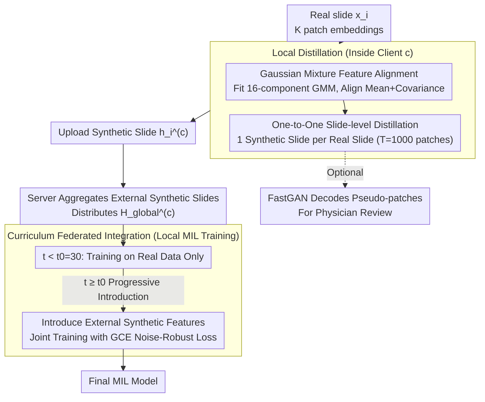

# Federated Distillation for Whole Slide Image via Gaussian-Mixture Feature Alignment and Curriculum Integration

**Conference**: ICML 2026  
**arXiv**: [2605.00578](https://arxiv.org/abs/2605.00578)  
**Code**: No public link  
**Area**: Federated Learning / Pathology / Dataset Distillation  
**Keywords**: WSI, Multi-instance Learning, Gaussian Mixture, Federated Distillation, Curriculum Learning

## TL;DR
This paper proposes FedHD: In heterogeneous federated pathology scenarios, it employs Gaussian-mixture feature alignment for "one-to-one" WSI feature-level distillation. It then progressively injects cross-institutional synthetic features into local training via curriculum learning. This allows institutions to collaborate without sharing raw data or exchanging model parameters. Compatible with heterogeneous MIL architectures and feature extractors, it comprehensively outperforms existing federated and distillation baselines on TCGA-IDH, CAMELYON16, and CAMELYON17.

## Background & Motivation
**Background**: Cancer diagnosis using WSI (gigapixel Whole Slide Images) relies on MIL (such as CLAM, TransMIL, ACMIL). However, data scarcity at single centers and privacy regulations restricting cross-institutional sharing make Federated Learning (FL) a natural solution. Nevertheless, real-world hospitals vary significantly in computational power and modeling preferences, often utilizing different feature extractors (ResNet50/UNI/PhV2) and MIL architectures, leading to "non-alignable parameter spaces" for traditional parameter averaging (FedAvg, FedMut, FedImpro).

**Limitations of Prior Work**: (1) Federated Data Distillation (FedDD) addresses parameter incompatibility by sharing synthetic datasets, but existing methods designed for natural images face issues: (a) Single Gaussian/mean matching assumptions fail to characterize the **multi-component distribution** of patch features within WSIs (where different morphological components coexist); (b) Pursuing extreme compression (reducing thousands of patches into a few synthetic images) causes over-compression for WSIs, which already have small sample sizes and high inter-slide heterogeneity, resulting in the loss of fine-grained diagnostic cues.

**Key Challenge**: The convergence of "small sample size + high intra-class heterogeneity + heterogeneous client models" in WSI makes the "extreme compression + single-component matching" assumptions of traditional DD fail, while parameter-sharing methods like FedAvg remain inapplicable.

**Goal**: (1) Enable each client to independently generate synthetic features that retain diagnostic details and can be utilized by any MIL architecture; (2) Avoid domain shifts caused by direct concatenation during cross-institutional integration; (3) Ensure interpretability (critical in medical scenarios).

**Key Insight**: Start from patch-level embeddings rather than pixel-level—this fits the MIL pipeline and reduces distillation dimensions from $256\times 256\times 3$ to $\mathbb{R}^d$. Introduce "one-to-one" slide-level synthesis (one synthetic slide per real slide) instead of "many-to-one" aggregation to prevent the loss of slide-level diversity.

**Core Idea**: Model WSI patch features as a 16-component GMM, aligning the mean and covariance of each component in the synthetic set (rather than a single global mean), and perform one-to-one distillation per slide. In the federated phase, use curriculum learning: allow local models to converge on real data first, then gradually introduce synthetic features from other clients as auxiliary supervision.

## Method

### Overall Architecture
FedHD splits collaboration into two stages: "Local Distillation + Curriculum Federation," exchanging neither raw slides nor model parameters throughout. The first stage occurs within each client $c$: the feature distribution of each real slide $x_i^{(c)}$ (containing $K$ patch embeddings $b_k^{i,c}\in\mathbb{R}^d$) is fitted to a GMM. A synthetic slide $h_i^{(c)}$ of the same size (containing $T$ learnable patch embeddings) is optimized to approximate the real GMM in terms of means and covariances. Thus, synthetic slides become "condensed proxies" in the feature space. The second stage involves cross-institutional integration: clients upload synthetic slides $\{h_i^{(c)}\}$, and the server aggregates and redistributes $\mathcal{H}_\text{global}^{(c)}$ (synthetic slides from all other clients). The local model first trains on real data to build a foundation; after round $t_0$, it progressively introduces external synthetic features via curriculum learning using a noise-robust loss. An optional FastGAN generator can decode synthetic embeddings into pseudo-patches for human verification.

### Key Designs

**1. Gaussian Mixture Feature Alignment: Characterizing WSI Internal Distribution with 16 Components**

A single WSI slide contains multiple morphological components such as tumor regions, normal regions, and boundary regions; patch features are naturally multimodal. Conventional data distillation methods $\sum_y \|\Phi_{T_y}-\Phi_{S_y}\|^2$ only match a single intra-class center, assuming features are unimodal Gaussian. In WSI, this averages out critical but scarce components (e.g., tumor patches) into a "gray median," degrading downstream MIL performance. FedHD instead estimates an $M=16$ component GMM $P_\text{real}^{(c,i)}\approx\sum_m \pi_m\,\mathcal{N}(\mu_m^{(c,i)},\Sigma_m^{(c,i)})$ from the real patch features $\{b_k^{i,c}\}_{k=1}^K$ of each slide. Synthetic patches $\{p_j^{i,c}\}_{j=1}^T$ are assigned to these components to obtain $\{\hat\mu_m,\hat\Sigma_m\}$. The alignment loss is $\mathcal{L}_\text{align}^{(c)}=\sum_m\big(\|\mu_m-\hat\mu_m\|_2^2+\|\Sigma_m-\hat\Sigma_m\|_F^2\big)$. By including covariance in the loss, the shape and spread of components are preserved, ensuring rare critical components are not overwhelmed by the majority—essentially hard-coding the "morphological multi-component" prior into the distillation objective.

**2. One-to-One Slide-level Distillation: Avoiding Extreme Compression**

Natural image distillation pursues extreme compression (IPC=1/10/50) because intra-class samples are relatively homogeneous. However, WSI datasets are small (a few hundred cases) and highly heterogeneous between slides; compressing multiple slides into a few images results in total distortion. FedHD maintains $N$ synthetic slides for client $c$ ($N$ equals the local real slide count), maintaining a strict one-to-one mapping with $T=1000$ patch embeddings per synthetic slide aligned individually. This preserves slide-level diversity. The communication payload is $O(NTd)$ floats, comparable to transmitting full patch features, but privacy is maintained as no real patches are ever shared.

**3. Curriculum Federated Integration: Local Convergence Before External Aid with GCE**

Mixing cross-institutional synthetic data from round 0 introduces domain shifts, biasing the model before it stabilizes. FedHD stages local training via curriculum learning: the total objective is $\mathcal{L}_\text{local}^{(c)}=\mathcal{L}_\text{real}^{(c)}+\mathcal{L}_\text{GCE}^{(c)}\cdot\mathbb{I}(t\ge t_0)$. For the first $t_0=30$ epochs, the model trains only on real data. Afterward, external synthetic features are introduced as auxiliary supervision. Since synthetic data may carry label noise, Generalized Cross-Entropy $\mathcal{L}_\text{GCE}=\frac{1-p_y^q}{q}$ ($q=0.7$) is used instead of standard CE, as it is more robust to noise and suppresses potential errors in synthetic labels.

### Loss & Training
Local distillation runs for 1000 iterations, local MIL training for 50 epochs, with only one round of federal communication. Parameters include GMM components $M=16$ (following Song 2024), synthetic patches $T=1000$, GCE parameter $q=0.7$, and curriculum threshold $t_0=30$. The visualization branch uses a FastGAN generator with $\mathcal{L}_\text{GAN}^{(c)}+\lambda_\text{rec}\mathcal{L}_\text{rec}^{(c)}$ to decode synthetic embeddings.

## Key Experimental Results

### Main Results

| Dataset | Client/setting | FedHE | DESA | FedDGM | HistoFS | FedWSIDD | **FedHD** |
|--------|---------------|-------|------|--------|---------|----------|-----------|
| CAM16 C1 [R50+CLAM] | Acc | 72.7 | 77.0 | 77.0 | 82.4 | 83.7 | **85.1** |
| CAM16 C2 [UNI+TransMIL] | Acc | 77.7 | 86.2 | 87.8 | 91.3 | 93.2 | **95.8** |
| CAM16 Avg | Acc | 75.2 | 81.9 | 83.4 | 86.7 | 88.7 | **91.2** |
| CAM17 C1 [UNI+CLAM] | Acc | 72.3 | 72.3 | 74.3 | 75.9 | 77.3 | **83.6** |
| CAM17 C3 [R50+ACMIL] | Acc | 77.0 | 78.0 | 79.0 | 79.0 | 79.0 | **84.0** |
| CAM17 C4 [PhV2+TrMIL] | Acc | 73.7 | 78.3 | 79.9 | 82.3 | — | — |

(FedHD achieves the best Acc / MCC across all clients, heterogeneous feature extractors, and MIL architecture combinations.)

### Ablation Study

| Configuration | Function | Description |
|------|------|------|
| Single Gaussian (M=1) vs GMM (M=16) | M=16 significantly better | Verifies necessity of multi-component modeling |
| One-to-One vs Many-to-One Compression | One-to-One preserves diversity | Over-compression leads to drops in WSI heterogeneity |
| No Curriculum vs Curriculum $t_0=30$ | Late integration of synthetic | Prevents early-stage bias from external noise |
| CE vs GCE ($q=0.7$) | GCE improves robustness | Suppresses potential label noise in synthetic data |
| Communication Payload $O(NTd)$ | Single round communication | Lower cost than iterative FedAvg |
| FastGAN Decoding | Interpretable pseudo-patches | Meets medical audit requirements |

### Key Findings
- **Multi-component matching is critical**: Single mean matching (e.g., FedWSIDD) leads to significant performance drops in WSI; FedHD's GMM matching of mean and covariance protects rare diagnostic components.
- **Architecture-agnostic collaboration**: Traditional FedAvg fails under heterogeneous combinations like [R50+CLAM] vs [UNI+TransMIL]. FedHD bypasses parameter space incompatibility via feature-level distillation.
- **Curriculum is more stable than direct mixing**: Directly mixing external data from epoch 0 degrades performance for certain clients (e.g., CAM17 C3 with extreme imbalance); the $t_0=30$ warm-up provides a stable foundation.
- **Clinical value of interpretability**: Pseudo-patches from FastGAN allow manual review by physicians, bridging the gap for medical deployment.

## Highlights & Insights
- Using GMM instead of a single mean is a design highly tailored to WSI physics, hard-coding morphological knowledge into the DD loss—a great example of domain-aware distillation.
- The "counter-trend" choice of one-to-one slide-level distillation (avoiding extreme compression) reflects a clear understanding of WSI data characteristics: extreme compression is not suitable for every domain.
- Applying curriculum learning to "cross-client synthetic data integration" is insightful and generalizable to any "self-distillation $\to$ federated integration" pipeline, such as federated LLMs or recommendation systems.
- The single-round communication and feature-level payload design are practical for hospital environments with low bandwidth and strict compliance; the inclusion of GCE and FastGAN adds engineering completeness.

## Limitations & Future Work
- The number of GMM components $M=16$ and synthetic patches $T=1000$ are empirical; automatic selection of $M$ or Bayesian non-parametrics (DPGMM) is a potential direction.
- Single-round communication is simple but may not reach global optima—iterative multi-round distillation was not discussed.
- Smaller client counts (2 for CAM16, 5 for CAM17) simplified $t_0$ tuning; scalability to dozens or hundreds of clients is unverified.
- Covariance $\Sigma_m$ at high dimensions $d$ (e.g., 1024d for UNI) incurs $O(d^2)$ costs; the paper lacks overhead analysis for large $d$.
- The reliability of FastGAN pseudo-patches requires systematic evaluation by pathologists; currently, only visual plausibility is shown without blind testing.

## Related Work & Insights
- **vs FedAvg / FedMut / FedImpro**: Parameter-sharing methods are infeasible under heterogeneous MIL architectures; this work bypasses the constraint using feature-level distillation.
- **vs FedHisto (Lu 2022) / HistoFS (Raswa 2025)**: These assume homogeneous MIL and balanced compute; FedHD targets heterogeneous scenarios common in real hospital networks.
- **vs FedWSIDD (Jin 2025)**: Also performs federated WSI distillation but utilizes single mean matching, which this paper proves loses critical diagnostic details.
- **vs FedD3 (Song 2023) / FedDGM (Jia 2025)**: These focus on personalized FL (disentangled dual decoders or diffusion generation), which are computationally expensive; FedHD is more lightweight and architecture-agnostic.
- **vs Natural Image DD (DM, MTT)**: This paper advocates against extreme compression—an observation valuable for other "small data + high heterogeneity" domains like rare diseases or satellite imagery.

## Rating
- Novelty: ⭐⭐⭐⭐ The combination of GMM multi-component alignment, one-to-one distillation, and curriculum federation is highly targeted for heterogeneous WSI FL.
- Experimental Thoroughness: ⭐⭐⭐⭐ 3 datasets × multiple clients × heterogeneous [feature, MIL] pairings with standard statistical significance.
- Writing Quality: ⭐⭐⭐⭐ Logical flow from motivation to method to experiments; loss functions and hyperparameter tables are clear.
- Value: ⭐⭐⭐⭐ Directly addresses the "heterogeneous architecture + privacy + interpretability" trilemma in medical FL with strong engineering feasibility.

<!-- RELATED:START -->

## Related Papers

- [\[CVPR 2026\] Dual-Level Hypergraph Generation for Addressing Feature Scarcity in Whole-Slide Image Classification](../../CVPR2026/medical_imaging/dual-level_hypergraph_generation_for_addressing_feature_scarcity_in_whole-slide_.md)
- [\[CVPR 2026\] MUSE: Harnessing Precise and Diverse Semantics for Few-Shot Whole Slide Image Classification](../../CVPR2026/medical_imaging/muse_harnessing_precise_and_diverse_semantics_for_few-shot_whole_slide_image_cla.md)
- [\[CVPR 2026\] Act Like a Pathologist: Tissue-Aware Whole Slide Image Reasoning](../../CVPR2026/medical_imaging/act_like_a_pathologist_tissue-aware_whole_slide_image_reasoning.md)
- [\[CVPR 2026\] TopoSlide: Topologically-Informed Histopathology Whole Slide Image Representation Learning](../../CVPR2026/medical_imaging/toposlide_topologically-informed_histopathology_whole_slide_image_representation.md)
- [\[CVPR 2026\] MLLM-HWSI: A Multimodal Large Language Model for Hierarchical Whole Slide Image Understanding](../../CVPR2026/medical_imaging/mllm-hwsi_a_multimodal_large_language_model_for_hierarchical_whole_slide_image_u.md)

<!-- RELATED:END -->
