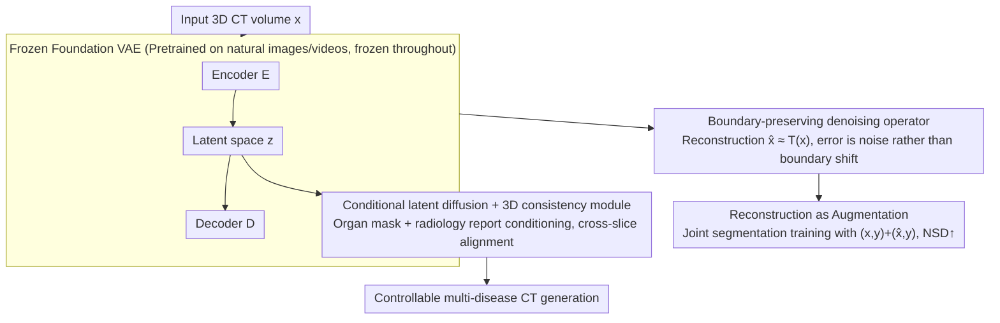

# Foundation VAEs for 3D CT Reconstruction, Augmentation, and Generation

**Conference**: ICML 2026  
**arXiv**: [2605.30893](https://arxiv.org/abs/2605.30893)  
**Code**: https://github.com/qic999/Foundation-VAE  
**Area**: Medical Imaging / 3D CT / Foundation Model Transfer  
**Keywords**: Foundation VAE, CT Reconstruction, CT Data Augmentation, Conditional Latent Diffusion, Zero-shot Medical Transfer

## TL;DR
This paper demonstrates a counter-intuitive yet practical discovery: Foundation VAEs pretrained on natural images/videos serve as a unified interface for CT reconstruction, augmentation, and generation without any medical fine-tuning. Reconstruction acts as denoising without shifting boundaries; thus, reconstructed images can serve as denoising augmentation (pancreatic / lung tumor NSD +3.9%), while the latent space supports conditional CT diffusion generation (FVD −3.9%, CT-CLIP +36.2%, multi-disease fidelity AUC +2.76%).

## Background & Motivation

**Background**: VAEs are the standard interface for contemporary generative models and large-voxel 3D representations, compressing high-resolution CT into compact latent spaces for efficient diffusion or segmentation. The mainstream approach involves training CT-specific VAEs: MedVAE via self-training, or MAISI using 37,243 CT volumes and 8 V100 GPUs for 300 epochs with multi-stage patch cropping.

**Limitations of Prior Work**: Medical VAE training is expensive, sensitive to scanner/protocol/disease distributions, and prone to overfitting. MedVAE exhibits reconstruction collapse on the MSD dataset (Lung PSNR 20.34, SSIM 0.52; Pancreas PSNR 18.78, SSIM 0.33), and MAISI incurs extremely high training costs. Adding new datasets requires retraining or re-tuning.

**Key Challenge**: The CT representation stage is widely assumed to be "medical-exclusive"—yet training exclusive VAEs is both costly and generalizes poorly. Can the "medical-exclusive" assumption be bypassed?

**Goal**: To test a transfer hypothesis—whether a Foundation VAE pretrained on natural images/videos can serve as a universal interface for CT (reconstruction + augmentation + generation) without any medical fine-tuning.

**Key Insight**: It is observed that reconstruction errors of Foundation VAEs on CT are concentrated on high-frequency noise and scanner artifacts, while tissue/lesion boundaries remain almost perfectly aligned (Fig 2). This suggests that the encoder-decoder behaves as a "boundary-preserving denoiser" on CT, which is precisely what downstream segmentation and detection tasks require.

**Core Idea**: To utilize Foundation VAEs as a unified interface for three CT tasks: (1) reconstruction (denoising); (2) using denoised reconstructed images as additional views for segmentation training (augmentation); (3) training conditional latent diffusion within the same frozen latent space for CT generation.

## Method

### Overall Architecture

The framework utilizes a single component: a Foundation VAE (e.g., WAN2.1 / VideoVAE+ / IVVAE) pretrained on natural images/videos that remains **frozen throughout**. It serves as a unified interface for three CT tasks. For reconstruction, the CT volume $x$ passes through encoder $E$ to obtain latent representation $z$, which is then restored by decoder $D$ to $\hat{x}$; the resulting $\hat{x} \approx T(x)$ represents the output of a "boundary-preserving denoising" operator $T$. For augmentation, these denoised $\hat{x}$ are used directly as additional training views for segmentation. For generation, a conditional latent diffusion model is trained within the same frozen latent space. All three tasks share the same weights without any medical fine-tuning.

### Key Designs

**1. Foundation VAE as a Boundary-Preserving Denoiser: CT Reconstruction as Preprocessing**

The conventional path involves training specialized medical VAEs (e.g., MedVAE or MAISI), which are expensive and sensitive to scanner/protocol variations—MedVAE reconstruction often collapses on MSD (Lung PSNR 20.34, SSIM 0.52). Conversely, this paper directly uses off-the-shelf Foundation VAEs to encode and decode CT. A key observation is that the reconstruction error structure is unique: errors almost entirely consist of high-frequency granular noise and slight streak artifacts, while organ and lesion boundaries remain unshifted (voxel-wise error map in Fig 2). Quantitatively, Lung PSNR > 30 and SSIM > 0.76, while Pancreas / LiTS / KiTS19 achieve PSNR > 39 and SSIM > 0.94, far exceeding MedVAE's collapse range. In other words, $T$ in the reconstruction $\hat{x} \approx T(x)$ is an edge-preserving denoising operator. This holds because the "high-level perceptual compression" learned by Foundation VAEs on large-scale natural images is essentially isomorphic to the "boundary-robust denoising" commonly used in the medical domain.

**2. Reconstruction as Augmentation: Using Denoised Images as Extra Training Views**

Since $\hat{x}$ is a boundary-preserving denoised version, it naturally serves as a training sample with "sharper boundaries and less noise." While traditional augmentation relies on hand-crafted geometric or photometric perturbations, this work jointly trains the segmentation model on original samples $(x, y)$ and reconstructed samples $(\hat{x}, y)$. This forces the network to provide consistent segmentations for both "raw" and "denoised" inputs. The most significant gains are seen in surface-distance-based metrics like NSD (average +3.9% for pancreatic/lung tumors) because denoising sharpens the boundary neighborhood. Dice, a region-based metric, shows only slight increases, indicating that regional integrity is maintained. This process requires no VAE retraining and near-zero extra computational cost, providing a "free" inductive bias.

**3. Conditional Latent Diffusion + 3D Consistency Module on Frozen Latent Space**

The generation task also reuses this frozen latent space. The diffusion model is trained directly on $z$ space—taking noisy $z_t$ and predicting noise $\epsilon$—with conditions including organ segmentation masks (spatial constraints) and radiology reports (semantic constraints). Since Foundation VAEs are typically 2D or temporal VAEs, slice-by-slice decoding into 3D can lead to inter-axial anatomical drift. Consequently, a lightweight 3D consistency module (cross-axial attention) is added to align anatomical relationships across slices (ablation shows significant drift without it). Compared to approaches like MedVAE or MAISI that train a dedicated latent space for generation, this method bypasses expensive representation training: diffusion only needs to learn the "condition $\to z$" mapping, leveraging the visual priors from large-scale natural image pretraining for free.

## Key Experimental Results

### Task 1: CT Reconstruction (Off-the-shelf Foundation VAE without medical fine-tuning)

| Model | Lung PSNR↑ | Lung SSIM↑ | Lung MSE↓ | Pancreas PSNR↑ | Pancreas SSIM↑ |
|:---|:---:|:---:|:---:|:---:|:---:|
| MedVAE (Medical-specific) | 20.34 | 0.52 | 600+ | 18.78 | 0.33 |
| MAISI (Medical-specific) | 34.5 | 0.89 | – | 38.2 | 0.92 |
| WAN2.1 (Natural VAE) | 30.93 | 0.76 | 77.97 | 39.18 | 0.94 |
| WAN2.2 | 30.93 | 0.76 | 77.97 | 39.06 | 0.95 |
| VideoVAE+ | 30.94 | 0.77 | 80.43 | 40.12 | 0.95 |
| **IVVAE** | **31.78** | **0.79** | **64.39** | **40.43** | **0.96** |

The zero-shot Foundation VAE significantly outperforms MedVAE and approaches or exceeds the costly MAISI.

### Task 2: CT Reconstruction → Segmentation Augmentation

| Training Data | Task | Dice↑ | **NSD↑** |
|:---|:---|:---:|:---:|
| Real CT | Lung tumor | 60.2 | 50.7 |
| Real + IVVAE Reconstruction | Lung tumor | 60.5 | **54.3** (+3.6) |
| Real CT | Pancreatic tumor | 51.4 | 42.5 |
| Real + IVVAE Reconstruction | Pancreatic tumor | 51.8 | **46.7** (+4.2) |

NSD (surface-based metric) increased by 3.9% on average, validating the boundary-preserving denoising hypothesis.

### Task 3: CT Conditional Generation

| Method | FVD↓ | CT-CLIP↑ | Multi-disease AUC↑ (18 classes) |
|:---|:---:|:---:|:---:|
| MedVAE + diffusion | 320 | 0.61 | 67.3 |
| MAISI + diffusion | 305 | 0.71 | 71.2 |
| **Foundation VAE + diffusion** | **293** | **0.97** | **74.0** (+2.76) |

FVD −3.9% (vs MAISI), CT-CLIP +36.2%, and multi-disease fidelity +2.76 AUC.

### Key Findings
- **Foundation VAEs are not just usable, but more robust**: While MedVAE collapses on MSD, Foundation VAEs remain stable, indicating that visual representations learned from large-scale natural images are more robust to distribution shifts.
- **Reconstruction error is noise, not boundary shift**: Voxel-wise error maps concentrate on high-frequency noise, validating the "boundary-preserving denoising" hypothesis—the foundation for both augmentation and generation.
- **3D Consistency Module is necessary**: Its removal causes inter-slice anatomical drift (qualitative cases provided in the paper).
- **Cross-dataset generalization**: Effectiveness is validated across four CT datasets (MSD Lung/Pancreas, LiTS, KiTS19), regardless of distribution.

## Highlights & Insights
- **Counter-intuitive discovery: "Foundation VAE as Medical VAE"**: This challenges the convention that medical imaging requires domain-specific representations, potentially saving massive computational and engineering costs.
- **Structural error analysis (boundary vs noise)**: Qualitative and quantitative evidence that errors are noise rather than boundary shifts is the key insight of the paper.
- **Unified interface for three tasks**: Unlike previous separate VAEs for reconstruction, augmentation, and generation, a unified interface allows shared improvements (e.g., future stronger Foundation VAEs will automatically improve all three tasks).
- **Engineering efficiency**: All VAEs are frozen; only segmentation heads or diffusion models are trained, allowing for a single shared backbone.

## Limitations & Future Work
- Only CT is validated; other modalities like MRI, PET, or Ultrasound are not tested—their noise characteristics and boundary structures may differ.
- Evaluation focuses on segmentation augmentation; other downstream tasks like classification, registration, or detection are not tested.
- Foundation VAEs remain 2D or temporal; 3D consistency relies on ad-hoc modules. Whether a native 3D Foundation VAE would perform better remains unknown.
- Quantitative comparison between "reconstruction denoising" and "classical denoising filters" is missing.
- Generation quality for certain rare diseases among the 18 classes is not separately reported.

## Related Work & Insights
- **vs MedVAE / MAISI (Medical-specific VAEs)**: Those are costly and generalize poorly; Foundation VAEs reflect a training-free and more robust alternative.
- **vs Traditional Augmentation**: Geometric/photometric perturbations are hand-crafted; reconstruction augmentation is learned and boundary-preserving.
- **vs CT-specific Generative Latent Spaces**: Foundation VAE latent spaces reuse natural image priors, reducing the learning burden for diffusion.
- **Insight**: The paradigm of "mandatory specialized training" for medical AI may need re-evaluation as Foundation models grow more powerful; this "frozen foundation + lightweight adaptation" model could extend to other high-cost medical subfields.

## Rating
- Novelty: ⭐⭐⭐⭐⭐ Challenging the paradigm with "Foundation VAE as zero-shot Medical VAE."
- Experimental Thoroughness: ⭐⭐⭐⭐⭐ Covers reconstruction across 4 datasets, segmentation augmentation for 2 tasks, and 18-class disease generation with multiple backbone comparisons.
- Writing Quality: ⭐⭐⭐⭐ Clear parallel narration of tasks; Fig 2 voxel error maps provide crucial evidence.
- Value: ⭐⭐⭐⭐⭐ Significantly reduces training costs for the medical imaging AI community.

<!-- RELATED:START -->

## Related Papers

- [\[AAAI 2026\] GuideGen: A Text-Guided Framework for Paired Full-Torso Anatomy and CT Volume Generation](../../AAAI2026/medical_imaging/guidegen_a_text-guided_framework_for_paired_full-torso_anatomy_and_ct_volume_gen.md)
- [\[NeurIPS 2025\] Toward a Vision-Language Foundation Model for Medical Data: Multimodal Dataset and Benchmarks for Vietnamese PET/CT Report Generation](../../NeurIPS2025/medical_imaging/toward_a_vision-language_foundation_model_for_medical_data_multimodal_dataset_an.md)
- [\[NeurIPS 2025\] Surf2CT: Cascaded 3D Flow Matching Models for Torso 3D CT Synthesis from Skin Surface](../../NeurIPS2025/medical_imaging/surf2ct_cascaded_3d_flow_matching_models_for_torso_3d_ct_synthesis_from_skin_sur.md)
- [\[CVPR 2026\] SPECTRE：面向体积 CT Transformer 的自监督与跨模态预训练](../../CVPR2026/medical_imaging/scaling_self-supervised_and_cross-modal_pretraining_for_volumetric_ct_transforme.md)
- [\[CVPR 2026\] Revisiting 2D Foundation Models for Scalable 3D Medical Image Classification](../../CVPR2026/medical_imaging/revisiting_2d_foundation_models_for_scalable_3d_medical_image_classification.md)

<!-- RELATED:END -->
