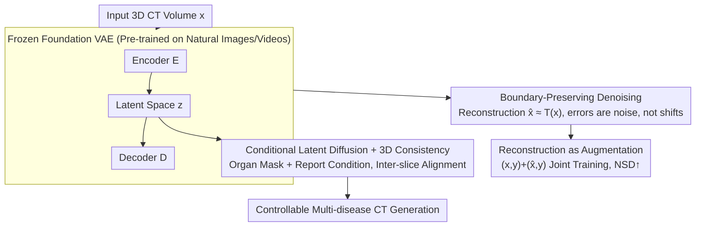

# Foundation VAEs for 3D CT Reconstruction, Augmentation, and Generation

**Conference**: ICML 2026  
**arXiv**: [2605.30893](https://arxiv.org/abs/2605.30893)  
**Code**: https://github.com/qic999/Foundation-VAE  
**Area**: Medical Imaging / 3D CT / Foundation Model Transfer  
**Keywords**: Foundation VAE, CT Reconstruction, CT Data Augmentation, Conditional Latent Diffusion, Zero-shot Medical Transfer

## TL;DR
This paper demonstrates a counter-intuitive yet practical finding: Foundation VAEs pre-trained on natural images/videos can serve as a unified interface for CT reconstruction, augmentation, and generation without any medical fine-tuning. The reconstruction acts as a boundary-preserving denoiser (improving pancreatic/lung tumor NSD by +3.9%), while its latent space supports conditional CT diffusion generation (FVD −3.9%, CT-CLIP +36.2%, and multi-disease fidelity AUC +2.76%).

## Background & Motivation

**Background**: VAEs serve as the standard interface for modern generative models and large-scale 3D representations, efficiently compressing high-resolution CT scans into compact latent spaces for diffusion or segmentation. The mainstream approach involves training CT-specific VAEs, such as the self-trained MedVAE or MAISI, which utilizes 37,243 CT volumes and 8 V100 GPUs for 300 epochs with multi-stage patch cropping.

**Limitations of Prior Work**: Medical VAE training is expensive, sensitive to scanner/protocol/disease distributions, and prone to overfitting. MedVAE exhibits reconstruction collapse on MSD datasets (Lung PSNR 20.34, SSIM 0.52; Pancreas PSNR 18.78, SSIM 0.33), while MAISI incurs extreme training costs. Each new dataset typically requires retraining or extensive tuning.

**Key Challenge**: The CT representation stage is widely assumed to be "medical-exclusive," yet training exclusive VAEs is both costly and leads to poor generalization. Can this "medical-exclusive" assumption be bypassed?

**Goal**: To test a transfer hypothesis: Can a Foundation VAE pre-trained on natural images/videos function as a universal interface for CT tasks (reconstruction, augmentation, and generation) without any medical fine-tuning?

**Key Insight**: It was observed that reconstruction errors of Foundation VAEs on CT scans are concentrated in high-frequency noise and scanner artifacts, while tissue and lesion boundaries remain almost perfectly aligned (Fig 2). This suggests that the encoder-decoder pair acts as a "boundary-preserving denoiser" on CT data, which is precisely what downstream segmentation and detection tasks require.

**Core Idea**: Use Foundation VAEs as a unified interface for three CT tasks: (1) reconstruction (denoising); (2) using denoised reconstructions as additional views for segmentation training (augmentation); and (3) training conditional latent diffusion within the same frozen latent space for CT generation.

## Method

### Overall Architecture

The entire framework employs a single component—a Foundation VAE (e.g., WAN2.1 / VideoVAE+ / IVVAE) pre-trained on natural images/videos and **kept frozen throughout**. This component serves as the unified interface for three CT tasks. For reconstruction, the CT volume $x$ passes through the encoder $E$ to obtain latent representation $z$, then through the decoder $D$ to produce $\hat{x}$, where $\hat{x}\approx T(x)$ represents the output of a "boundary-preserving denoising" operator $T$. For augmentation, these denoised $\hat{x}$ are used directly as auxiliary views for segmentation training. For generation, a conditional latent diffusion model is trained within the same frozen latent space. All tasks share the same weights without any medical fine-tuning.

### Key Designs

**1. Foundation VAE as a Boundary-Preserving Denoiser: CT Reconstruction as Pre-processing**

Traditional medical VAEs (e.g., MedVAE and MAISI) are expensive to train and sensitive to scanner protocols, often leading to collapse, such as MedVAE’s poor performance on MSD. In contrast, this work directly employs off-the-shelf Foundation VAEs. The key observation is the specific structure of reconstruction errors: they consist almost entirely of high-frequency noise and slight streak artifacts, while organ and lesion boundaries remain stable (see voxel-wise error in Fig 2). Quantitatively, Lung PSNR > 30 and SSIM > 0.76, while Pancreas/LiTS/KiTS19 achieve PSNR > 39 and SSIM > 0.94, significantly outperforming MedVAE. Thus, the reconstruction $\hat{x}\approx T(x)$ effectively treats $T$ as a boundary-preserving denoiser. This transferability stems from the "high-level perceptual compression" learned from large-scale natural images, which is isomorphic to "boundary-robust denoising" in medical domains.

**2. Reconstruction as Augmentation: Denoised Samples as Auxiliary Segmentation Views**

Since $\hat{x}$ is a boundary-preserving denoised version of $x$, it naturally provides training samples with clearer boundaries and reduced noise. While traditional augmentation relies on hand-crafted geometric or photometric perturbations, Ours trains segmentation models jointly on real samples $(x, y)$ and reconstructed samples $(\hat{x}, y)$. This forces the network to maintain consistent segmentation under both "raw" and "denoised" inputs. The most significant gains appear in surface-distance-based metrics like NSD (pancreatic/lung tumor average +3.9%), as denoising sharpens boundary neighborhoods. Dice scores increase slightly, indicating that regional integrity is maintained. This process requires no VAE retraining and nearly zero additional computational cost.

**3. Conditional Latent Diffusion in Frozen Latent Space: Reusing Visual Priors for CT Generation**

The generation task also reuses this frozen latent space. The diffusion model is trained directly on $z$ space—predicting noise $\epsilon$ from noisy $z_t$—conditioned on both organ segmentation masks (spatial constraints) and radiology reports (semantic constraints). Since Foundation VAEs are typically 2D or temporal VAEs, slice-by-slice decoding can lead to inter-axial anatomical drift. A lightweight 3D consistency module (cross-axial attention) is added to align anatomical structures across slices. Compared to MAISI’s specialized latent space training, this approach leverages visual priors from natural image pre-training, significantly reducing the learning burden for diffusion.

## Key Experimental Results

### Task 1: CT Reconstruction (Off-the-shelf Foundation VAE without fine-tuning)

| Model | Lung PSNR↑ | Lung SSIM↑ | Lung MSE↓ | Pancreas PSNR↑ | Pancreas SSIM↑ |
|------|----------|----------|---------|--------------|--------------|
| MedVAE (Medical-Specific) | 20.34 | 0.52 | 600+ | 18.78 | 0.33 |
| MAISI (Medical-Specific) | 34.5 | 0.89 | – | 38.2 | 0.92 |
| WAN2.1 (Natural VAE) | 30.93 | 0.76 | 77.97 | 39.18 | 0.94 |
| WAN2.2 | 30.93 | 0.76 | 77.97 | 39.06 | 0.95 |
| VideoVAE+ | 30.94 | 0.77 | 80.43 | 40.12 | 0.95 |
| **IVVAE** | **31.78** | **0.79** | **64.39** | **40.43** | **0.96** |

Zero-shot Foundation VAEs significantly outperform MedVAE and approach or exceed the performance of the expensive MAISI.

### Task 2: CT Reconstruction → Segmentation Augmentation

| Training Data | Task | Dice↑ | **NSD↑** |
|--------|------|------|------|
| Real CT | Lung tumor | 60.2 | 50.7 |
| Real + IVVAE Recon | Lung tumor | 60.5 | **54.3** (+3.6) |
| Real CT | Pancreatic tumor | 51.4 | 42.5 |
| Real + IVVAE Recon | Pancreatic tumor | 51.8 | **46.7** (+4.2) |

NSD (surface-based metric) increased by +3.9% on average, validating the boundary-preserving denoising hypothesis.

### Task 3: Conditional CT Generation

| Method | FVD↓ | CT-CLIP↑ | Multi-disease AUC↑ (18 classes) |
|------|------|---------|-------------|
| MedVAE + diffusion | 320 | 0.61 | 67.3 |
| MAISI + diffusion | 305 | 0.71 | 71.2 |
| **Foundation VAE + diffusion** | **293** | **0.97** | **74.0** (+2.76) |

Achieved FVD −3.9% (vs. MAISI), CT-CLIP +36.2%, and +2.76 AUC in multi-disease fidelity.

### Key Findings
- **Foundation VAEs are not just usable, but more robust**: While MedVAE collapses on MSD, Foundation VAEs remain stable, indicating that visual representations learned from large-scale natural images are more robust to distribution shifts.
- **Reconstruction error is noise, not boundary shift**: Voxel-wise error maps concentrated in high-frequency noise validate the "boundary-preserving denoising" hypothesis, which serves as the foundation for both augmentation and generation.
- **3D Consistency module is essential**: Removing it leads to anatomical drift between slices.
- **Cross-dataset generalization**: Effectiveness was validated across four CT datasets (MSD Lung/Pancreas, LiTS, KiTS19) regardless of distribution.

## Highlights & Insights
- **Counter-intuitive discovery**: The finding that "Foundation VAE is Medical VAE" challenges the conventional wisdom that medical imaging requires exclusive representation training, potentially saving immense computational and engineering costs.
- **Structural Analysis of Reconstruction Errors**: Proving that errors are noise rather than boundary shifts is the pivotal insight of the paper and provides a framework for future research.
- **Unified Interface for Three Tasks**: Unifying reconstruction, augmentation, and generation under one interface allows improvements in Foundation VAEs to automatically enhance all three downstream tasks.
- **Engineering Efficiency**: Keeping VAEs frozen allows for lightweight adaptation of segmentation heads or diffusion models, simplifying deployment with a shared backbone.

## Limitations & Future Work
- Validated only on CT; other modalities like MRI, PET, or Ultrasound may have different noise characteristics and may not transfer as directly.
- Only segmentation augmentation was evaluated; other tasks like classification, registration, or detection remain untested.
- Foundation VAEs used are 2D/Temporal; inter-slice consistency relies on ad-hoc modules. The benefit of a native 3D Foundation VAE is unexplored.
- Lack of quantitative comparison between "reconstruction denoising" and classical denoising filters.
- Generation quality for specific rare diseases in the 18-class set was not separately reported.

## Related Work & Insights
- **vs. MedVAE / MAISI (Medical-Specific VAEs)**: These are costly and generalize poorly, whereas Foundation VAEs are training-free and more robust.
- **vs. Traditional Data Augmentation**: Traditional methods use hand-crafted perturbations; reconstruction augmentation is learned and boundary-preserving.
- **vs. CT-Specific Latent Spaces**: Foundation VAEs utilize natural image priors, reducing the difficulty of learning the diffusion mapping.
- **Insight**: The paradigm of "mandatory specialized training" for medical AI may need re-evaluation as foundation models become more powerful. The "frozen foundation + lightweight adaptation" pattern could extend to other high-cost medical sub-domains.

## Rating
- Novelty: ⭐⭐⭐⭐⭐ Challenging the paradigm with zero-shot Foundation VAEs.
- Experimental Thoroughness: ⭐⭐⭐⭐⭐ Covered 4 datasets for reconstruction, 2 for augmentation, and 18 diseases for generation.
- Writing Quality: ⭐⭐⭐⭐ Clear parallel task descriptions; the "boundary-preserving" insight is well-supported by evidence like Fig 2.
- Value: ⭐⭐⭐⭐⭐ Potentially saves significant training costs for the medical imaging community and influences future architectural designs.

<!-- RELATED:START -->

## Related Papers

- [\[AAAI 2026\] GuideGen: A Text-Guided Framework for Paired Full-Torso Anatomy and CT Volume Generation](../../AAAI2026/medical_imaging/guidegen_a_text-guided_framework_for_paired_full-torso_anatomy_and_ct_volume_gen.md)
- [\[NeurIPS 2025\] Toward a Vision-Language Foundation Model for Medical Data: Multimodal Dataset and Benchmarks for Vietnamese PET/CT Report Generation](../../NeurIPS2025/medical_imaging/toward_a_vision-language_foundation_model_for_medical_data_multimodal_dataset_an.md)
- [\[CVPR 2026\] SPECTRE：面向体积 CT Transformer 的自监督与跨模态预训练](../../CVPR2026/medical_imaging/scaling_self-supervised_and_cross-modal_pretraining_for_volumetric_ct_transforme.md)
- [\[NeurIPS 2025\] Surf2CT: Cascaded 3D Flow Matching Models for Torso 3D CT Synthesis from Skin Surface](../../NeurIPS2025/medical_imaging/surf2ct_cascaded_3d_flow_matching_models_for_torso_3d_ct_synthesis_from_skin_sur.md)
- [\[CVPR 2026\] VesMamba: 3D Pulmonary Vessel Segmentation from CT images via Mamba with Structural Perception and Scale-aware Filtering](../../CVPR2026/medical_imaging/vesmamba_3d_pulmonary_vessel_segmentation_from_ct_images_via_mamba_with_structur.md)

<!-- RELATED:END -->
