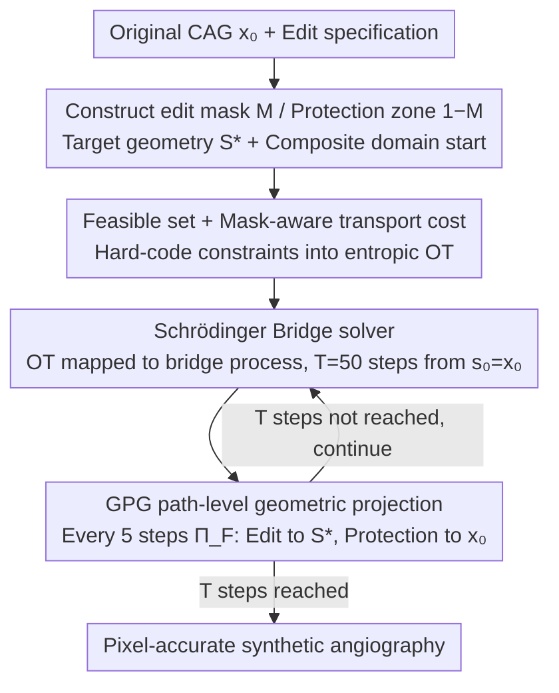

# OT-Bridge Editor: Geometrically Constrained Stenosis Editing in Coronary Angiography via Entropic Optimal Transport

**Conference**: ICML 2026  
**arXiv**: [2605.08851](https://arxiv.org/abs/2605.08851)  
**Code**: Not publicly released  
**Area**: Medical Imaging / Diffusion Models / Data Augmentation  
**Keywords**: Coronary Angiography, Stenosis Editing, Schrödinger Bridge, Entropic Optimal Transport, Path-level Geometric Supervision

## TL;DR
OT-Bridge Editor reformulates "editing a vascular stenosis on coronary angiography" as a constrained entropic OT problem in a vessel-structure composite domain. By employing Schrödinger Bridge with path-level geometric projection supervision, it achieves pixel-level shape/position controllable synthetic angiography, resulting in a 27.8% relative gain in downstream stenosis detection mAP@0.5 on the ARCADE public dataset.

## Background & Motivation

**Background**: Coronary Angiography (CAG) stenosis detection suffers from a severe lack of annotations and large cross-center domain gaps. The community generally uses diffusion models for "conditional generation" to augment data—providing a mask, text, or semantic map for reconstruction starting from noise.

**Limitations of Prior Work**: Existing diffusion editors have two primary weaknesses: (i) Conditions are injected via "soft constraints" such as guidance or cross-attention, which fail to precisely lock geometric boundaries (a single missing branch affects subsequent detection); (ii) Starting reverse diffusion from pure noise unnecessarily perturbs the anatomy of non-edited regions, leading to poor structural preservation.

**Key Challenge**: The requirement for medical synthesis is to "locally modify one stenosis in an existing angiogram." This is essentially a **localized minimized transport** from a source image to a target image rather than reconstructing the whole image from noise. However, existing diffusion paradigms lack an interface for "path-level geometric hard constraints."

**Goal**: (1) Formalize "geometrically accurate local editing" as a constrained optimal transport problem; (2) Design a generation path that can be supervised at the pixel level; (3) Significantly improve the performance of downstream stenosis detectors on public and multi-center data using synthetic angiography.

**Key Insight**: The authors noted that the Schrödinger Bridge naturally handles diffusion problems with "known endpoints + controllable paths," which matches the image translation requirement where the "source is the original image and the target is the edited image." Simultaneously, entropic regularization makes OT numerically solvable in high-dimensional pixel space.

**Core Idea**: The edit mask and target geometric description are incorporated into the SB boundary conditions and feasible set, followed by Geometric Projection Guidance (GPG) after each step of the bridge process to keep the generation path "clamped within a geometric feasible channel."

## Method

### Overall Architecture
The pipeline aims to "locally modify a stenosis on an existing coronary angiogram while keeping the rest of the anatomy untouched." Thus, it does not redraw the whole image from noise but treats editing as a "minimal transport" from the original to the target image. It first constructs an edit mask $\mathbf{M}$, a protection zone $\bar{\mathbf{M}}=\mathbf{1}-\mathbf{M}$, and a target geometry $\mathbf{S}^\star=\mathcal{S}(\cdot)$, setting the starting point in a "vessel-structure composite domain" (original image edges + vessel mask). The editing is then formulated as an entropic regularized OT with one end fixed at the original image $\mu_0=\delta_{\mathbf{x}_0}$ and the other $\mu_1$ subject to the geometric feasible set. A Diffusion Schrödinger Bridge solves for the bridge process. Finally, a geometric projection $\Pi_\mathcal{F}$ is inserted every $K$ steps of the bridge progression to pull the edited region toward the target geometry while pulling the non-edited region back to the original image, reaching pixel-accurate synthetic angiography after $T$ steps.

### Key Designs

**1. Feasible set + mask-aware transport cost: Hard-coding constraints into OT instead of soft guidance**

Methods like ControlNet or SDEdit apply conditions via cross-attention or noisy reconstruction, which are essentially "soft guidance" that cannot guarantee non-edited regions remain unchanged pixel-by-pixel. This paper hard-codes constraints into the transport problem: define the hard feasible set $\mathcal{F}=\{\mathbf{x}\mid \mathbf{x}\odot\bar{\mathbf{M}}=\mathbf{x}_0\odot\bar{\mathbf{M}},\ \mathcal{S}(\mathbf{x}\odot\mathbf{M})=\mathbf{S}^\star\}$, explicitly requiring the non-edited region to equal the original image and the edited region's geometric descriptor to match the target. The cost is written in a mask-aware form $c(\mathbf{x},\mathbf{y})=\|(\mathbf{x}-\mathbf{y})\odot\bar{\mathbf{M}}\|_2^2+\lambda_M\|(\mathbf{x}-\mathbf{y})\odot\mathbf{M}\|_2^2$ to distinguish transport costs. The overall objective is entropic transport $\min_\pi\langle\mathbf{C},\pi\rangle+\varepsilon\,\mathrm{KL}(\pi\|\mathbf{K})$ s.t. $\pi\in\mathcal{Q}$. Constraints are upgraded from "suggestions" to "mathematical definitions."

**2. Schrödinger Bridge as a dynamic solver: Converting fragile high-dimensional OT into a step-wise bridge process**

Solving entropic OT directly in pixel space is expensive and numerically unstable. SB's advantage is converting "endpoint distribution matching" into "trajectory density matching": solve $P^\star=\arg\min_{P:P_0=\mu_0,P_1=\mu_1}\mathrm{KL}(P\|R)$ in trajectory space, where $R$ is a reference diffusion chain. Sampling starts from $\mathbf{s}_0=\mathbf{x}_0$ and proceeds for $T=50$ steps via $\tilde{\mathbf{s}}_{k+1}\sim p^\star(\mathbf{s}_{k+1}\mid\mathbf{s}_k)$. This step not only makes the computation feasible—it "unrolls" the entire generation path, allowing GPG to insert supervision at each step, a capability soft-guidance diffusion lacks.

**3. GPG path-level geometric projection supervision: Pushing the state back to the feasible set at each step**

Adding geometric constraints only at the endpoint is equivalent to "soft guidance"; if the bridge process drifts in the middle, the cost of correction at the end is extremely high, and pixel-level precision cannot be maintained. GPG first samples $\tilde{\mathbf{x}}_{k+1}\sim p^\star$ and immediately projects it: $\mathbf{x}_{k+1}\leftarrow\Pi_\mathcal{F}(\tilde{\mathbf{x}}_{k+1})$, keeping the trajectory within the geometric channel. The projection solves a small optimization $\Pi_\mathcal{F}(\mathbf{x})=\arg\min_\mathbf{y}\mathcal{L}_{\text{geo}}(\mathbf{y})+\lambda_{\text{out}}\mathcal{L}_{\text{out}}(\mathbf{y})$: the geometric term $\mathcal{L}_{\text{geo}}=\mathcal{D}_{\text{geo}}(\mathcal{S}(\mathbf{y}\odot\mathbf{M}),\mathbf{S}^\star)$ uses Signed Distance Transform (SDT) to calculate boundary distance $\mathcal{D}_{\text{geo}}=\frac{1}{|B_M|}\sum_\mathbf{u}|\phi^\star(\mathbf{u})|$, providing smooth gradients and avoiding gradient explosions at hard boundaries. The external term $\mathcal{L}_{\text{out}}=\|(\mathbf{y}-\mathbf{x}_0)\odot\bar{\mathbf{M}}\|_2^2$ suppresses drift in non-edited regions. In implementation, projection occurs every 5 steps with $\lambda_{\text{out}}=10, \lambda_{\text{geo}}=1$.

### Loss & Training
The SB reference process $R$ uses a standard discrete diffusion chain with $\varepsilon=10^{-2}$ to control transport smoothness. GPG projection is solved via gradient optimization and inserted into the sampling path in the style of a logits-processor, thus requiring no retraining of the diffusion backbone and remaining decoupled from the editing space (pixel or latent).

## Key Experimental Results

### Main Results
On the ARCADE public set and a multi-center internal set, comparing against GANs (Pix2PixHD, SPADE) and diffusion editors (SDEdit, SDM, SiameseDiff, DiGDA).

| Metric | Pix2PixHD | SDEdit | SiameseDiff | **OT-Bridge** |
|------|----------:|-------:|------------:|--------------:|
| Edit Dice ↑ | 0.621 | 0.645 | 0.722 | **0.774** |
| Edit mIoU ↑ | 0.801 | 0.781 | 0.837 | **0.892** |
| FID ↓ | 52.9 | 46.9 | 34.2 | **16.7** |
| SSIM ↑ | 0.676 | 0.705 | 0.790 | **0.878** |

Downstream YOLOv8 mAP@0.5 on ARCADE: Real-only 0.525 → Real+Synth **0.727** (+38.5% relative gain; 27.8% average improvement across 4 detectors); On multi-center data: Real-only 0.654 → Real+Synth **0.731** (+11.8% gain, 23.0% average).

### Ablation Study

| Configuration | Edit Dice ↑ | Outside SSIM ↑ | Description |
|------|------------:|---------------:|------|
| Edge Domain | 0.592 | 0.533 | Edited only on edge maps; poor structure |
| Seg Domain | 0.767 | 0.694 | Mask domain only; rough boundaries |
| **Composite (Default)** | **0.892** | **0.878** | Edge + Vessel mask composite domain |
| Composite w/o Protection | 0.802 | 0.786 | Significant degradation without protection constraints |
| Endpoint GPG Only | bDice 0.765 | $\mathcal{E}_T=2.8$ | Endpoint OK but trajectory drifted |
| **Path GPG (Default)** | **bDice 0.895** | $\mathcal{E}_T=1.1$ | Geometrically stable throughout |
| w/o Boundary Supervision $\partial m$ | bDice 0.582 | $\mathcal{E}_T=12.4$ | Almost failed without SDT |

Synthetic data scale scans show saturation of gains at $r=1.0$ (Synth:Real = 1:1).

### Key Findings
- **GPG is the core contribution**: Removing path-level geometric supervision causes bDice to drop from 0.895 to 0.765, verifying that "step-wise projection" is far more critical for pixel-level editing than "endpoint constraints."
- **Composite Domain > Single Domain**: Using both edges and vessel masks as starting points preserves boundaries in the edited region and stabilizes structure in the non-edited region.
- **Cross-domain transfer of detectors**: Detectors trained on ARCADE with OT-Bridge synthetic images maintained an 11-13% gain when transferred to multi-center sets, indicating that synthetic images provide "positional/morphological diversity" rather than simple noise.
- **Robustness to mask noise**: Boundary jitter and dilation/erosion have little impact on Dice, but spatial displacement (mask misalignment) has the largest impact on downstream mAP—suggesting that localization accuracy is more important than boundary fine-tuning during deployment.

## Highlights & Insights
- **Reframing "local editing" as "constrained transport"**: Moving from redrawing the whole image from noise to transporting minimal changes from the original image better fits the essence of medical editing. This approach directly transfers to any "local modification" task (lesion inpainting, attribute editing, object insertion).
- **Path-level hard supervision is a natural interface for SB**: Traditional diffusion can only add guidance at the "two ends," whereas SB's bridge process makes "adding constraints at every step" a natural operation.
- **Composite domain starting points** significantly improve the solvability of dual "boundary + structure" objectives, suggesting that medical editors should not rely on a single representation.
- **Downstream task-driven evaluation**: Using detector mAP to directly evaluate the value of synthetic data is more convincing than reporting FID/SSIM alone, a practice worth emulating in medical generation research.

## Limitations & Future Work
- Only validated on coronary angiography stenosis editing; more complex multi-branch scenarios, 3D CTA, or super-resolution were not tested.
- GPG projection is solved via gradient descent, adding optimization overhead to each step, making single-image inference approximately 1.5× slower than pure SB.
- Geometric supervision relies on accurate vessel masks; spatial displacement experiments show significant mAP drops if masks are misaligned, requiring reliable segmentation pre-processing.
- Hyperparameters such as $\varepsilon, \lambda_M, \lambda_{\text{out}}$ are fixed without an adaptive mechanism; they may need recalibration for different centers or image qualities.

## Related Work & Insights
- **vs SDEdit / SDM / SiameseDiff**: These start from noise with soft guidance. OT-Bridge explicitly writes "what cannot move" into the feasible set, achieving order-of-magnitude improvements in structural preservation (FID 16.7 vs 34-79).
- **vs ControlNet / T2I-Adapter**: These emphasize "semantic structure guidance" without geometric hard constraints. OT-Bridge's GPG performs SDT projection directly on geometric descriptors, representing a pixel-level vs. feature-level difference.
- **vs I²SB / BBDM / DSB**: While these are also SB-style image translation models, this work designs path-level supervision and composite domain starts specifically for medical geometric editing, transforming a general bridge model into a "geometry-sensitive editor."

## Rating
- Novelty: ⭐⭐⭐⭐ Using constrained entropic OT + SB bridge process for geometry-sensitive medical editing; path-level projection supervision is a genuine new interface for "control at every step."
- Experimental Thoroughness: ⭐⭐⭐⭐ 4 detectors × 2 datasets + 5 baselines + 4 major ablations (domain/GPG/scale/mask noise).
- Writing Quality: ⭐⭐⭐⭐ Clear formulas and algorithmic pseudo-code; Figure 4-6 ROI visual comparisons are intuitive.
- Value: ⭐⭐⭐⭐⭐ Provides substantial evidence that detectors trained with synthetic + real data significantly improve in multi-center scenarios, offering real aid to clinical deployment.

<!-- RELATED:START -->

## Related Papers

- [\[CVPR 2026\] BiOTPrompt: Bidirectional Optimal Transport Guided Prompting for Disease Evolution-aware Radiology Report Generation](../../CVPR2026/medical_imaging/biotprompt_bidirectional_optimal_transport_guided_prompting_for_disease_evolutio.md)
- [\[AAAI 2026\] Neural Bandit Based Optimal LLM Selection for a Pipeline of Tasks](../../AAAI2026/medical_imaging/neural_bandit_based_optimal_llm_selection_for_a_pipeline_of_tasks.md)
- [\[CVPR 2025\] Uncertainty-Aware Concept and Motion Segmentation for Semi-Supervised Angiography Videos](../../CVPR2025/medical_imaging/uncertainty-aware_concept_and_motion_segmentation_for_semi-supervised_angiograph.md)
- [\[ICLR 2026\] Stochastic Optimal Control for Continuous-Time fMRI Representation Learning](../../ICLR2026/medical_imaging/stochastic_optimal_control_for_continuous-time_fmri_representation_learning.md)
- [\[ICLR 2026\] BioX-Bridge: Model Bridging for Unsupervised Cross-Modal Knowledge Transfer across Biosignals](../../ICLR2026/medical_imaging/biox-bridge_model_bridging_for_unsupervised_cross-modal_knowledge_transfer_acros.md)

<!-- RELATED:END -->
