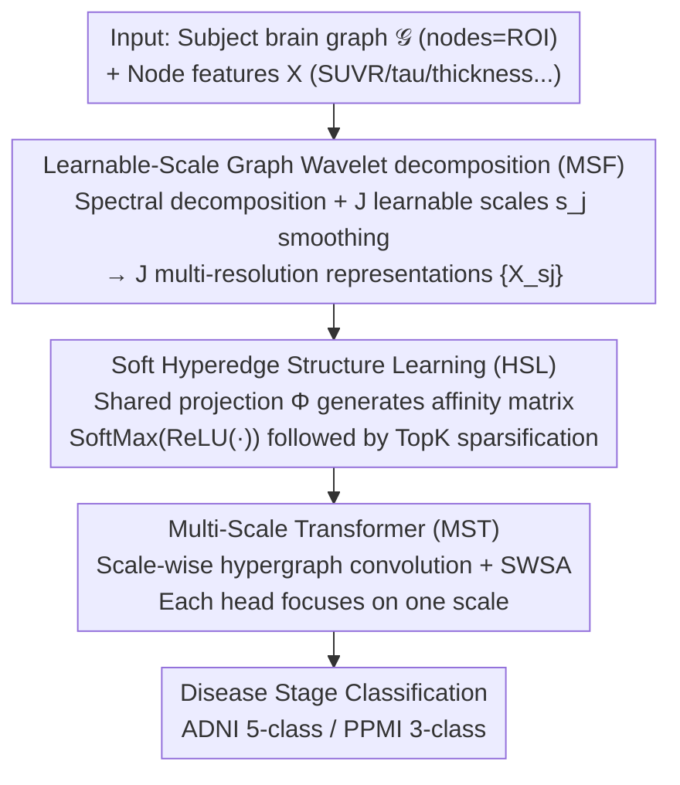

# Learning Multi-Scale Hypergraph for High-Order Brain Connectivity Analysis

**Conference**: ICML 2026  
**arXiv**: [2606.03310](https://arxiv.org/abs/2606.03310)  
**Code**: None  
**Area**: Medical Imaging / Brain Network Analysis  
**Keywords**: Brain Networks, Hypergraph Learning, Graph Wavelets, Neurodegenerative Diseases, Multi-scale

## TL;DR
MuHL decomposes brain ROI features into multi-resolution representations using graph wavelets with learnable scales, then dynamically generates soft hyperedges via a "node embedding × shared projection matrix" mechanism. This approach achieves 93.2% Acc on ADNI and 76.8% Acc on PPMI for multi-stage AD/PD classification, while identifying interpretable key ROIs and hyperedges.

## Background & Motivation
**Background**: Current mainstream brain network analysis (DTI structural networks / fMRI functional networks) is dominated by the GNN family—GCN, GAT, GCNII, and specialized models like BrainGNN, BrainGB, BrainNetTF, and ALTER. These models perform pairwise message passing between nodes (ROIs) and indirectly model high-order relationships by stacking multiple layers.

**Limitations of Prior Work**: Abnormalities in brain function or structure are often group-wise phenomena involving multiple ROIs co-dysfunctioning. Pairwise adjacency matrices cannot inherently express group-wise dependencies among three or more ROIs. Stacking GCN layers to approximate high-order relationships often triggers oversmoothing. While hypergraph models (HGNN, dwHGCN, HyBRiD, etc.) can explicitly represent group-wise connections, most rely on **predefined** hyperedges (e.g., via KNN) or **only learn hyperedge weights** with a fixed topology, lacking flexibility.

**Key Challenge**: High-order interactions in the brain require both **learnable structures** (not predefined) and **multi-scale capabilities** (covering both local clusters and global populations). Existing hypergraph methods fail to satisfy both simultaneously.

**Goal**: To simultaneously achieve (i) direct learning of continuous, sparse soft hyperedges and (ii) multi-scale hyperedge mapping corresponding to different ROI feature resolutions (small scale $\to$ compact hyperedges, large scale $\to$ cross-regional hyperedges), without relying on any handcrafted hyperedge priors.

**Key Insight**: The authors draw inspiration from the Spectral Graph Wavelet Transform (SGWT). The same graph signal, under different wavelet scales, is smoothed into versions with different receptive fields. Larger scales cause node features to become more similar, naturally grouping them into larger sets. By treating these scales as **learnable parameters**, the model can autonomously determine the optimal ROI neighborhood size for each hierarchy.

**Core Idea**: The pipeline integrates "learnable-scale graph wavelet decomposition $\to$ multi-scale soft hyperedge generation via a shared projection matrix $\Phi \to$ cross-scale fusion via a Multi-scale Transformer." This upgrades pairwise brain networks into learnable, multi-resolution hypergraphs for the staging and classification of neurodegenerative diseases.

## Method

### Overall Architecture
MuHL addresses the inability of pairwise matrices to express group-wise relations and the inflexibility of predefined hyperedges. The core idea is to upgrade a subject's brain graph into a set of **learnable, multi-resolution soft hypergraphs**, which are then fused via a Transformer for disease stage classification. The input consists of the subject's graph $\mathcal{G}$ (nodes = ROIs, edges = structural/functional connectivity) and node features $X \in \mathbb{R}^{N\times D}$ (e.g., SUVR, β-amyloid, tau, cortical thickness, or BOLD signals). Output is the disease stage label (5 classes for ADNI: CN/SMC/EMCI/LMCI/AD; 3 classes for PPMI: CN/Prodromal/PD).

The end-to-end pipeline consists of three stages: first, the MSF module uses learnable-scale graph wavelets to decompose $X$ into $J$ multi-resolution representations $\{X_{s_j}\}$. Second, the HSL module applies a shared learnable projection matrix $\Phi$ to directly learn soft hyperedge structures $\bar{H}_{s_j}$ for each scale. Finally, the MST module performs hypergraph convolution per scale and uses a Transformer, where each head focuses on a specific scale, to aggregate local-to-global semantic information for the classification head. All parameters, including scale scalars $s_j$ and the projection matrix $\Phi$, are learned via backpropagation from the classification loss.

### Key Designs

**1. Learnable-Scale Graph Wavelet Decomposition: Autonomous ROI Neighborhood Selection**

Traditional multi-resolution methods either require multiple atlases or manually selected discrete scales. This work leverages the SGWT property where graph signals are smoothed into different receptive fields based on the wavelet scale $s$. Scales are treated as trainable scalars. Specifically, spectral decomposition of the normalized Laplacian yields $U, \Lambda$. The representation at each scale is $X_{s_j} = U g^2(s_j \Lambda) U^T X$. The $J$ scale parameters $s_j$ are trained via backpropagation, allowing the model to decide the level of "blurring." Small $s$ maintains node differences for compact hyperedges, while large $s$ facilitates the formation of cross-regional hyperedges.

**2. Soft Hyperedge Learning via Shared Projection $\Phi$ + TopK Sparsification: Learnable Topologies**

To avoid the pitfalls of fixed topologies, the authors allow hyperedges to emerge end-to-end. Node embeddings $\bar{X}_{s_j} = X_{s_j} W$ are multiplied by a learnable projection $\Phi \in \mathbb{R}^{d_h \times M}$ to obtain the affinity matrix $H_{s_j} = \bar{X}_{s_j}\Phi$. After applying $\tilde{H}_{s_j} = \mathrm{SoftMax}(\mathrm{ReLU}(\bar{X}_{s_j}\Phi))$, Top-$\eta$ sparsification is performed to form $\bar{H}_{s_j}$. A crucial design is sharing $\Phi$ across all scales, ensuring a **correspondence** between hyperedges across resolutions: the same hyperedge index $M$ might cover a small cluster at a fine scale and expand to a large group at a coarse scale.

**3. Multi-Scale Transformer (MST): Scale-Wise Self-Attention (SWSA)**

Within each scale, hypergraph convolutions propagate messages locally. To model cross-scale dependencies, the MST module employs SWSA. After hypergraph convolution yields $F_{s_j}^{(Z)}$:

$$F_{s_j}^{(z)} = \sigma\left(\mathcal{D}_v^{-1/2}\bar{H}_{s_j} W_e \mathcal{D}_e^{-1} \bar{H}_{s_j}^T \mathcal{D}_v^{-1/2} F_{s_j}^{(z-1)} \Theta^{(z)}\right)$$

Multi-head attention binds each "head" to a specific "resolution." Each head independently computes $A_{s_j} = \mathrm{Softmax}(Q_{s_j} K_{s_j}^T / \sqrt{d_k})$ for its scale. This SWSA architecture embeds the local-global semantic hierarchy directly into the attention topology.

### Loss & Training
The model is trained end-to-end using cross-entropy with an L1 penalty on negative scales to ensure $s_j > 0$:

$$L = -\frac{1}{T}\sum_t\sum_c Y_{tc}\log\hat{Y}_{tc} + \alpha \frac{1}{J}\sum_j \mathbf{1}_{s<0}|s_j|$$

Default parameters: $J=3, M=16, \eta=3, d_h=16$. Evaluation uses 5-fold cross-validation with the Adam optimizer.

## Key Experimental Results

### Main Results
Testing on ADNI (650 subjects, 160 ROIs, 5 classes) and PPMI (181 subjects, 116 ROIs, 3 classes) against 19 baselines (standard GNNs, brain-specific GNNs, and hypergraph models).

| Dataset | Metric | Ours | Prev. SOTA | Gain |
|--------|------|------|----------|------|
| ADNI (5-class) | Acc | **93.2** | 90.8 (ALTER) | +2.4 |
| ADNI | F1 | **94.7** | 90.9 (ALTER) | +3.8 |
| PPMI (3-class) | Acc | **76.8** | 72.9 (GAT) | +3.9 |
| PPMI | F1 | **62.4** | 56.4 (BQN) | +6.0 |

Ours also leads in zero-shot cross-dataset transfer (e.g., ADNI-2 to ADNI-1/3/GO), indicating that the learned hypergraph structures generalize well.

### Ablation Study
| Configuration | ADNI Acc | PPMI Acc | Description |
|------|---------|---------|------|
| Full (MSF+HSL+MST) | **93.2** | **76.8** | Complete MuHL |
| w/o MSF | 90.0 | 72.9 | No multi-scale decomposition |
| w/o HSL | 76.8 | 67.4 | No structure learning (predefined), **largest drop** |
| w/o MST | 86.9 | 64.1 | No Transformer, only hypergraph convolutions |

### Key Findings
- **HSL is critical**: Removing HSL resulted in a 16.4% drop on ADNI, proving that learnable topologies are more vital than scaling or fusion mechanisms.
- **Optimal Hyperedge Count $M$**: Performance peaks at $M=16$. Too many hyperedges introduce noise/redundancy.
- **Hub ROI Identification**: The identified top-10 ROIs on ADNI include the bilateral globus pallidus, putamen, hippocampus, and thalamus, which correlate strongly with clinical AD progression. PPMI highlights the amygdala and thalamus, consistent with PD symptoms.

## Highlights & Insights
- **Continuous Learnable Scales**: Unlike fixed or discrete scale approaches, $s_j$ is integrated into backpropagation, allowing the model to choose its own neighborhood size.
- **Shared $\Phi$ for Cross-Scale Correspondence**: This elegantly ensures hyperedge semantic consistency while allowing monotonic expansion across scales, as backed by formal proofs in the paper.
- **Inherent Interpretability**: Importance is derived directly from hyperedge activation levels, providing hub ROI rankings as a natural byproduct of the architecture rather than a post-hoc addition.

## Limitations & Future Work
- **Severe Class Imbalance**: In ADNI, the AD group (n=12) is significantly smaller than the CN group (n=226), which may bias overall accuracy metrics.
- **Absence of Public Code**: No GitHub link is provided, hindering reproducibility regarding $\Phi$ initialization and training dynamics.
- **Efficiency at Scale**: Dependency on spectral decomposition ($O(N^3)$) is manageable for 160 ROIs but would become a bottleneck for higher-resolution atlases (e.g., Schaefer 1000).
- **Static Connectivity**: The model uses static connectivity matrices from fMRI, ignoring temporal dynamics.

## Related Work & Insights
- **vs. HGNN/HNHN**: These require a predefined incidence matrix $H$, whereas MuHL learns $H$ end-to-end.
- **vs. BrainNetTF/ALTER**: While these use pairwise attention, MuHL uses hypergraphs to capture group-wise interactions, leading to better performance (93.2% vs 90.8% on ADNI).
- **vs. Traditional SGWT**: While SGWT is typically used for denoising with fixed scales, this work employs it as a learnable feature pyramid for hypergraph learning.

## Rating
- Novelty: ⭐⭐⭐⭐ Combines learnable-scale wavelets with shared projection soft hyperedges in an end-to-end fashion with theoretical support.
- Experimental Thoroughness: ⭐⭐⭐⭐ Broad benchmarking and zero-shot tests, though limited by extreme class imbalance.
- Writing Quality: ⭐⭐⭐⭐ Clear motivation and consistent notation.
- Value: ⭐⭐⭐⭐ Provides a clean baseline for learnable multi-resolution hypergraphs.

<!-- RELATED:START -->

## Related Papers

- [\[CVPR 2026\] Continual Learning for fMRI-Based Brain Disorder Diagnosis via Functional Connectivity Matrices Generative Replay](../../CVPR2026/medical_imaging/forge_continual_learning_for_fmri_based_brain_disorder_diagnosis.md)
- [\[CVPR 2026\] OmniBrainBench: A Comprehensive Multimodal Benchmark for Brain Imaging Analysis Across Multi-stage Clinical Tasks](../../CVPR2026/medical_imaging/omnibrainbench_a_comprehensive_multimodal_benchmark_for_brain_imaging_analysis_a.md)
- [\[ICML 2026\] CAME-Grad: The Double Dilemma in Multi-Task Radiology Report Generation — A Gradient Dynamics Analysis and Solution](the_double_dilemma_in_multi-task_radiology_report_generation_a_gradient_dynamics.md)
- [\[NeurIPS 2025\] Riemannian Flow Matching for Brain Connectivity Matrices via Pullback Geometry](../../NeurIPS2025/medical_imaging/riemannian_flow_matching_for_brain_connectivity_matrices_via_pullback_geometry.md)
- [\[CVPR 2026\] PMRNet: Physics-informed Multi-scale Refinement Network for Medical Image Segmentation](../../CVPR2026/medical_imaging/pmrnet_physics-informed_multi-scale_refinement_network_for_medical_image_segment.md)

<!-- RELATED:END -->
