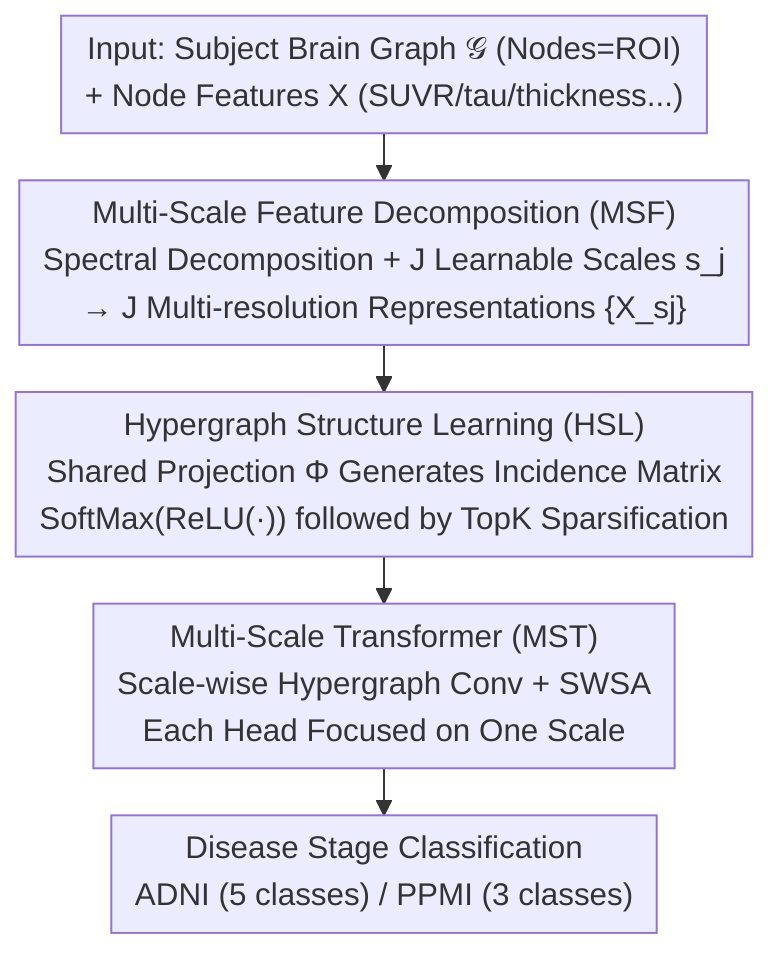

# Learning Multi-Scale Hypergraph for High-Order Brain Connectivity Analysis

**Conference**: ICML 2026  
**arXiv**: [2606.03310](https://arxiv.org/abs/2606.03310)  
**Code**: None  
**Area**: Medical Imaging / Brain Network Analysis  
**Keywords**: Brain Network, Hypergraph Learning, Graph Wavelet, Neurodegenerative Disease, Multi-scale

## TL;DR
MuHL utilizes graph wavelets with learnable scales to decompose brain ROI features into multi-resolution representations. It dynamically generates soft hyperedges via a "node embedding × shared projection matrix" mechanism, achieving 93.2% Acc for multi-stage AD classification on ADNI and 76.8% Acc for PD classification on PPMI, while providing interpretable key ROIs and hypergraphs.

## Background & Motivation
**Background**: The current mainstream of brain network analysis (DTI structural networks / fMRI functional networks) is dominated by the GNN family—GCN, GAT, GCNII—and brain-specific models like BrainGNN, BrainGB, BrainNetTF, and ALTER. These models perform pairwise message passing between nodes (ROIs) and indirectly model high-order relationships by stacking layers.

**Limitations of Prior Work**: Abnormalities in brain function or structure are often group-wise phenomena where "multiple ROIs exhibit coordinated dysfunction." Pairwise adjacency matrices inherently fail to express group-wise dependencies where three or more ROIs are connected as a set. Increasing GCN depth to approximate high-order relationships often triggers oversmoothing. Although hypergraph models (HGNN, dwHGCN, HyBRiD) can explicitly represent set-based connections, most rely on **predefined** hyperedges (e.g., via KNN) or **only learn hyperedge weights** for a fixed topology, lacking flexibility.

**Key Challenge**: High-order brain interactions require both **learnable structures** (not predefined) and **multi-scale properties** (from local clusters to global populations). Existing hypergraph methods fail to satisfy both requirements simultaneously.

**Goal**: Without relying on any handcrafted hyperedge priors, the objective is to (i) directly learn continuous and sparse soft hyperedges; and (ii) ensure that ROI features at different resolutions correspond to different hyperedge scales (small scale → compact hyperedges, large scale → cross-regional hyperedges).

**Key Insight**: Inspiration is drawn from the Spectral Graph Wavelet Transform (SGWT). The same graph signal, under different wavelet scales, is smoothed into versions with different receptive fields. By treating the scale as a **learnable parameter**, the model can autonomously determine the neighborhood size of ROIs for each hierarchy.

**Core Idea**: The pipeline consists of "learnable scale graph wavelet decomposition → shared projection matrix $\Phi$ for multi-scale soft hyperedge generation → multi-scale Transformer for cross-scale fusion." This upgrades pairwise brain networks into learnable, multi-resolution hypergraphs for the classification of neurodegenerative disease stages.

## Method

### Overall Architecture
MuHL addresses the limitation where pairwise adjacency matrices cannot capture the group-wise dysfunction characteristic of brain abnormalities. It upgrades a subject's brain graph into a set of **learnable, multi-resolution soft hypergraphs**, which are then fused via a Transformer for disease stage classification. The input is the subject's graph $\mathcal{G}$ (nodes = ROIs, edges = structural/functional connectivity) and node features $X \in \mathbb{R}^{N\times D}$ (e.g., SUVR, β-amyloid, tau, cortical thickness, or BOLD signals). The output is the disease stage label (5 classes for ADNI: CN/SMC/EMCI/LMCI/AD; 3 classes for PPMI: CN/Prodromal/PD).

The pipeline is end-to-end and consists of three stages: first, using learnable graph wavelets to decompose $X$ into $J$ multi-resolution ROI representations $\{X_{s_j}\}$ (MSF module); next, applying a shared learnable projection matrix $\Phi$ to learn soft hyperedges $\bar{H}_{s_j}$ for each scale (HSL module); finally, performing hypergraph convolution followed by a Transformer—where each head focuses on one scale—to fuse local-to-global semantics for the classification head (MST module). All parameters, including scale scalars $s_j$ and the projection matrix $\Phi$, are learned via backpropagation.

### Key Designs

**1. Learnable Scale Graph Wavelet Decomposition: Autonomous Receptive Field Learning**

A primary challenge is selecting the appropriate resolution scales. Traditional approaches either use multiple brain atlases or manually select discrete scales. This work leverages SGWT, where a graph signal is smoothed into different receptive fields via wavelet scales, treating these scales as trainable scalars. Specifically, spectral decomposition of the normalized Laplacian yields $U, \Lambda$. Representations for each scale are computed as $X_{s_j} = U g^2(s_j \Lambda) U^T X$. The $J$ values of $s_j$ are optimized via backpropagation based on the classification objective. At small $s$, node features are minimally smoothed, allowing HSL to form compact hyperedges. At large $s$, smoothing spans multiple neighbors, making distant nodes more similar and grouping them into cross-regional hyperedges.

**2. Soft Hyperedge Learning via Shared Projection $\Phi$ + TopK: Learnable Topology**

To overcome the fixed topology of existing hypergraph methods, this design allows the topology to emerge end-to-end. Node embeddings $\bar{X}_{s_j} = X_{s_j} W$ are multiplied by a learnable projection $\Phi \in \mathbb{R}^{d_h \times M}$ to obtain the incidence matrix $H_{s_j} = \bar{X}_{s_j}\Phi$. Applying $\tilde{H}_{s_j} = \mathrm{SoftMax}(\mathrm{ReLU}(\bar{X}_{s_j}\Phi))$ and retaining the top-$\eta$ hyperedges per node creates a sparse $\bar{H}_{s_j}$. Shared $\Phi$ across all scales ensures **semantic correspondence** between hyperedges: a single hyperedge captures a compact set of nodes at small scales and expands into a cross-regional group at large scales. The authors prove that hyperedge occupancy increases monotonically with $s$, ensuring non-redundant sparsification after TopK.

**3. Multi-Scale Transformer (MST): Scale-Wise Self-Attention**

While hypergraph convolutions aggregate information within a scale, cross-scale dependencies must be explicitly fused. The Scale-Wise Self-Attention (SWSA) in the MST module binds each attention head to a specific resolution resolution. Each head independently computes $A_{s_j} = \mathrm{Softmax}(Q_{s_j} K_{s_j}^T / \sqrt{d_k})$ after hypergraph convolution:

$$F_{s_j}^{(z)} = \sigma\left(\mathcal{D}_v^{-1/2}\bar{H}_{s_j} W_e \mathcal{D}_e^{-1} \bar{H}_{s_j}^T \mathcal{D}_v^{-1/2} F_{s_j}^{(z-1)} \Theta^{(z)}\right)$$

Unlike standard multi-head attention that views different subspaces of the same feature, SWSA writes the local-to-global semantic hierarchy into the attention topology.

### Loss & Training
The model is trained end-to-end using cross-entropy and an L1 penalty to ensure $s_j > 0$:

$$L = -\frac{1}{T}\sum_t\sum_c Y_{tc}\log\hat{Y}_{tc} + \alpha \frac{1}{J}\sum_j \mathbf{1}_{s<0}|s_j|$$

Default parameters: $J=3, M=16, \eta=3, d_h=16$, using 5-fold cross-validation and the Adam optimizer.

## Key Experimental Results

### Main Results
Evaluation was performed on ADNI (650 subjects, 160 ROIs, 5 classes) and PPMI (181 subjects, 116 ROIs, 3 classes) against 19 baselines.

| Dataset | Metric | MuHL | Prev. SOTA | Gain |
|--------|------|------|----------|------|
| ADNI (5 classes) | Acc | **93.2** | 90.8 (ALTER) | +2.4 |
| ADNI | F1 | **94.7** | 90.9 (ALTER) | +3.8 |
| PPMI (3 classes) | Acc | **76.8** | 72.9 (GAT) | +3.9 |
| PPMI | F1 | **62.4** | 56.4 (BQN) | +6.0 |

MuHL also outperformed others in zero-shot cross-dataset transfer (e.g., ADNI-2 to ADNI-1/3/GO), demonstrating the transferability of the learned hypergraph structures.

### Ablation Study

| Configuration | ADNI Acc | PPMI Acc | Description |
|------|---------|---------|------|
| Full (MSF+HSL+MST) | **93.2** | **76.8** | Complete MuHL |
| w/o MSF | 90.0 | 72.9 | No multi-scale decomposition |
| w/o HSL | 76.8 | 67.4 | No structure learning (using predefined structures); **largest drop** |
| w/o MST | 86.9 | 64.1 | No multi-scale Transformer |

### Key Findings
- **HSL is critical**: Removing HSL led to a 16.4% drop on ADNI, proving that "learning the hyperedge topology" is more vital than the multi-scale or Transformer components.
- **Optimal Hyperedge Count $M$**: Performance peaks at $M=16$; higher values introduce redundancy/noise.
- **Clinical Consistency**: Top-10 hub ROIs on ADNI include the globus pallidus, putamen, hippocampus, and thalamus, which are clinically linked to AD. Results often appear as bilateral pairs, consistent with disease progression.

## Highlights & Insights
- **Learnable Continuous Scales**: By making $s_j$ trainable, the model optimizes its own receptive fields, a technique applicable to any task requiring multi-resolution graph signals.
- **Shared $\Phi$ for Cross-Scale Correspondence**: This ensures hyperedge semantics are preserved across resolutions while enabling monotonic expansion of the hyperedge footprint.
- **Intrinsic Interpretability**: Hyperedge activation provides a natural ranking of ROI importance, avoiding the need for post-hoc explanation modules.

## Limitations & Future Work
- **Severe Class Imbalance**: The AD group in ADNI is very small compared to the CN group, potentially making predictions for minority classes unstable.
- **No Public Code**: The lack of a GitHub link limits reproducibility, especially regarding the training dynamics of $\Phi$.
- **Fixed Laplacian Sensitivity**: Spectral decomposition ($O(N^3)$) is manageable for 160 ROIs but may not scale to voxel-level graphs without Chebyshev approximations.
- **Static Connectivity**: Only static matrices are used, ignoring the temporal dynamics of fMRI signals.

## Related Work & Insights
- **Comparison with Hypergraph GNNs (HGNN/HNHN)**: Unlike these models which require a predefined incidence matrix $H$, MuHL learns $H$ end-to-end.
- **Comparison with Topology-Fixed Models (dwHGCN)**: MuHL learns the topology itself rather than just weights, explaining its significant performance gains in ablation studies.
- **Advancement over SGWT**: While traditional SGWT uses fixed scales for denoising, MuHL treats it as a learnable feature pyramid for hypergraph learning.

## Rating
- **Novelty**: ⭐⭐⭐⭐ End-to-end integration of learnable scale wavelets and shared projection for soft hypergraphs is highly original.
- **Experimental Thoroughness**: ⭐⭐⭐⭐ Strong performance across multiple benchmarks and zero-shot tasks, though limited by extreme class imbalance.
- **Writing Quality**: ⭐⭐⭐⭐ Clear motivation and consistent mathematical notation.
- **Value**: ⭐⭐⭐⭐ Provides a robust baseline for multi-resolution hypergraph learning in brain networks, despite the lack of open-source code.

<!-- RELATED:START -->

## Related Papers

- [\[CVPR 2026\] Continual Learning for fMRI-Based Brain Disorder Diagnosis via Functional Connectivity Matrices Generative Replay](../../CVPR2026/medical_imaging/forge_continual_learning_for_fmri_based_brain_disorder_diagnosis.md)
- [\[CVPR 2026\] OmniBrainBench: A Comprehensive Multimodal Benchmark for Brain Imaging Analysis Across Multi-stage Clinical Tasks](../../CVPR2026/medical_imaging/omnibrainbench_a_comprehensive_multimodal_benchmark_for_brain_imaging_analysis_a.md)
- [\[ICML 2026\] CAME-Grad: The Double Dilemma in Multi-Task Radiology Report Generation — A Gradient Dynamics Analysis and Solution](the_double_dilemma_in_multi-task_radiology_report_generation_a_gradient_dynamics.md)
- [\[ICLR 2026\] Spike-based Digital Brain: A Novel Fundamental Model for Brain Activity Analysis](../../ICLR2026/medical_imaging/spike-based_digital_brain_a_novel_fundamental_model_for_brain_activity_analysis.md)
- [\[NeurIPS 2025\] Riemannian Flow Matching for Brain Connectivity Matrices via Pullback Geometry](../../NeurIPS2025/medical_imaging/riemannian_flow_matching_for_brain_connectivity_matrices_via_pullback_geometry.md)

<!-- RELATED:END -->
