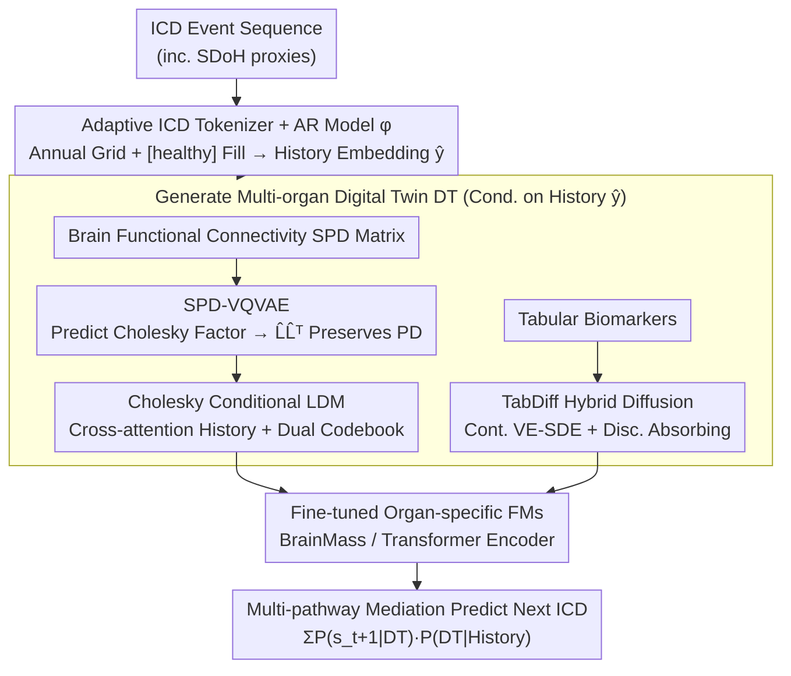

# Marrying Generative Model of Healthcare Events with Digital Twin of Social Determinants of Health for Disease Reasoning

**Conference**: ICML 2026  
**arXiv**: [2605.09771](https://arxiv.org/abs/2605.09771)  
**Code**: None  
**Area**: Medical Imaging / Generative Models / Digital Twin / Disease Prediction  
**Keywords**: digital twin, ICD autoregressive, latent diffusion, SPD manifold, Cholesky decomposition, multi-organ biomarkers

## TL;DR
This paper proposes DiffDT: a conditional Latent Diffusion framework connecting electronic health records (ICD-coded event sequences) with multi-organ biomarker digital twins (tabular features derived from brain/heart/liver/kidney imaging and brain functional connectivity SPD matrices). The key innovation is an SPD-VQVAE based on Cholesky decomposition that reduces $\mathcal{O}(N^3)$ SPD manifold diffusion to a manifold-preserving and efficient latent space. An AR model performs multi-pathway disease reasoning via the intermediary path "Generate Digital Twin $\to$ Predict next ICD." On UKB data, it achieves a next-event prediction AUC of 0.91 for 1,944 disease categories, setting a new SOTA.

## Background & Motivation

**Background**: There are two mainstream routes in medical AI: (a) **EHR-to-event**, which uses transformer autoregression to learn ICD event sequences (e.g., MOTOR, Delphi), treating disease progression as next-token prediction but ignoring specific physiological biomarkers; (b) **DT-to-event**, which uses pre-trained imaging foundation models (e.g., BrainMass, NeuroPath) to predict diseases from single-organ in-vivo biomarkers but lacks cross-temporal causal chains. Both struggle with long-term, multi-pathway, personalized disease reasoning.

**Limitations of Prior Work**: (1) Pure EHR routes learn medical utilization patterns rather than disease mechanisms. Figure 2 shows that prediction accuracy is negatively correlated with the "semantic distance between current and historical diseases"—prediction is poor for diseases far from the main diagnosis chapter, exposing the lack of multi-pathway probabilistic mediation. (2) Pure DT routes use only current biomarkers and cannot predict future physiological states based on past medical history. (3) Existing hybrid AR-diffusion architectures (e.g., ye2025hybrid, HybridVLA) are designed in Euclidean space; adding Gaussian noise directly to brain functional connectivity SPD matrices destroys their geometry (they are no longer positive definite). (4) Geometric diffusion methods like SPD-DDPM using affine-invariant / log-Euclidean metrics are rigorous but computationally prohibitive at $\mathcal{O}(N^3)$ complexity ($N=116$ for AAL atlas).

**Key Challenge**: To combine EHR temporal causality with multi-organ physiological states, one must (i) keep generative models grounded in ICD history, (ii) ensure generated brain networks remain on the SPD manifold, and (iii) maintain low enough complexity to train on 50K+ subjects. The first two points naturally conflict within a Euclidean latent diffusion framework.

**Goal**: (1) Establish the SDoH-to-event paradigm: use ICD-coded SDoH proxies (including chapters Z and V–Y) as conditions to generate multi-organ DTs as biological mediators, then predict future ICDs; (2) Design a manifold-preserving SPD latent diffusion that reduces $\mathcal{O}(N^3)$ to a calculable scale; (3) Validate with next-event prediction for 1,944 long-tail disease categories on UKB.

**Key Insight**: Cholesky decomposition $M = LL^\top$ provides a **unique and smooth** factor for the SPD manifold (Theorem 3.1: $\mathcal{S}_{++}^N \to \mathcal{L}_{++}^N$ is a diffeomorphism). Performing diffusion on Cholesky factors allows the use of Euclidean machinery while ensuring the reconstructed results remain SPD via $LL^\top$.

**Core Idea**: An SPD-VQVAE encodes brain functional connectivity matrices into a discrete latent space (the decoder outputs a lower-triangular matrix, then $LL^\top$ yields the SPD reconstruction), followed by a Cholesky LDM on this latent space conditioned on ICD history. Tabular biomarkers use TabDiff for hybrid SDE/absorbing diffusion. Finally, an AR model performs "Generate DT $\to$ Predict next ICD" as a mediation inference: $P(\text{Future}|\text{Biomarker})\cdot P(\text{Biomarker}|\text{History})$.

## Method

### Overall Architecture
The core problem DiffDT solves is combining the temporal causality of EHR with multi-organ physiological states for long-term, multi-pathway disease prediction. The pipeline unfolds across three hops: "Medical History $\to$ Physiological Mediator $\to$ Future Disease." First, an **adaptive medical history tokenizer + AR model $\phi$** maps ICD sequences to a uniform 1-year temporal grid, filling non-event years with `[healthy]` tokens. Token embeddings plus age embeddings are fed into causal self-attention for next-token prediction, yielding a causality-aware medical history embedding $\hat{y}$. This embedding acts as a condition to **generate multi-organ digital twins**. Tabular biomarkers follow TabDiff-style hybrid diffusion (VE SDE for continuous dimensions, absorbing process for discrete). Brain functional connectivity uses SPD-VQVAE + Cholesky LDM. Finally, **organ-specific FMs** (BrainMass for brain, Transformer encoder for tables) are fine-tuned on the generated DTs to predict the next ICD. During inference, for each multi-pathway causal node, the AR model encodes past ICDs, the diffusion model generates a hypothetical multi-organ DT, and the fine-tuned FM reads the next ICD from the DT, achieving multi-pathway mediation: $\sum_{\text{organ}} P(s_{t+1}\mid \text{DT}_t^{\text{organ}})\, P(\text{DT}_t^{\text{organ}}\mid S_{<t})$.

### Key Designs

**1. SPD-VQVAE: Enforcing SPD Manifold Constraints via Decoder Geometry**

Brain functional connectivity is a $116\times 116$ SPD matrix. It cannot be directly used in Euclidean diffusion because adding Gaussian noise immediately breaks positive definiteness. Methods like SPD-DDPM are rigorous under affine-invariant metrics but are $\mathcal{O}(N^3)$, which is too slow for 50,000 subjects with $N=116$. This work "absorbs" the constraint into the VQVAE decoder: the encoder $\mathcal{E}$ uses an MLP to flatten and project $\mathbf{M}$ into $z_e\in\mathbb{R}^{N_q\times d}$, then quantizes it to the codebook $\mathcal{Z}\in\mathbb{R}^{N_{code}\times d}$ to get $z$. The decoder $\mathcal{D}$ does not directly predict $\hat{\mathbf{M}}$; instead, it predicts a lower-triangular factor $\hat L$ (with diagonal through softplus to ensure positivity). Reconstruction is given by $\hat{\mathbf{M}}=\hat L\hat L^\top$. Training loss $\mathcal{L}_{\text{VAE}}=\mathcal{L}_{\text{SPD}}(L,\hat L)+\mathcal{L}_{\text{recon}}(\mathbf{M},\hat{\mathbf{M}})+\|\text{sg}[z_e]-e\|_2^2+\beta\|z_e-\text{sg}[e]\|_2^2$ supervises the Cholesky factor, the final SPD reconstruction, the codebook, and commitment. This works because Theorem 3.1 guarantees Cholesky is a diffeomorphism $\mathcal{S}_{++}^N\to\mathcal{L}_{++}^N$ (lower-triangular matrices with positive diagonals). Training with Euclidean MSE in factor space is equivalent to manifold training, while $\hat L\hat L^\top$ ensures reconstruction remains SPD, reducing complexity from $\mathcal{O}(N^3)$ to $\mathcal{O}(N^2)$.

**2. Cholesky Conditional LDM: Cross-attention History and Dual-Codebook Frequency Scaling**

With the discrete latent space of SPD-VQVAE, diffusion is performed on these latents conditioned on the medical history embedding $\hat{\mathbf{y}}$ from the AR model. The backbone is a U-Net style Residual MLP Block. Conditions are injected via two paths: time-step embeddings $\text{Embed}_\text{diff}(t)$ added to each layer, and cross-attention treating $\hat{\mathbf{y}}\in\mathbb{R}^{T\times d_\phi}$ as key/value and latent vector $\hat z$ as query. The LDM uses standard noise prediction loss $\mathcal{L}_{\text{LDM}}=\mathbb{E}\|\epsilon-\epsilon_\theta(z_t,t,\hat{\mathbf{y}})\|^2$. Cross-attention allows the model to attend to any critical historical ICD (e.g., how a hypertension diagnosis years ago shapes the current brain network). To combat mode collapse, where generative models produce an "average brain," the authors use **SPD-VQVAE-Dual**: two SPD-VQVAEs separately model low-frequency and high-frequency Fourier components (cutoff 25), forcing the LDM to learn both global structure and personalized details.

**3. Adaptive ICD Tokenizer and Multi-pathway Mediation: Dense Condition Signals from Sparse History**

Previous AR medical models used time-to-event embeddings, where gap between tokens could be decades, leaving fractured signals for diffusion. This work constructs a uniform annual grid $\tau=(\tau_t\mid \tau_{t+1}-\tau_t\in\{0,1\})$ covering the cohort's age range. If an ICD $c$ exists in a year, $s_t=c$; otherwise, $s_t=\text{`[healthy]`}$. Input tokens $\mathbf{y}_t=\text{Embed}_\text{ICD}(s_t)+\text{Embed}_\text{age}(\tau_t)$ are fed to a transformer with the loss $\mathcal{L}_\text{AR}=-\sum_t\log p(s_{t+1}\mid s_{\leq t};\phi)$. The `[healthy]` fillers allow the condition to be densely defined on the timeline, stabilizing LDM cross-attention. For inference, the $\phi$ output serves as $\hat{\mathbf{y}}$ for LDM to generate multi-organ DTs, which organ-specific FMs use to calculate $P(s_{t+1}\mid\hat{\mathbf{M}}_t)$, forming an explicit causal chain.

### Loss & Training
Three phases: (i) AR model $\phi$ pre-training on 7.28M ICD tokens from 448,651 subjects; (ii) SPD-VQVAE and TabDiff training on paired imaging + ICD data (Brain: 44,834; Heart: 23,987; Liver: 28,722; Kidney: 32,155 samples); (iii) Fine-tuning organ FMs on generated DTs for next-ICD classification. Tabular generation uses Classifier-Free Guidance: $\tilde\mu^{num}(\Gamma_t, S, t) = (1+\omega)\mu_\theta^{num}(\Gamma_t, S, t) - \omega\mu_\phi(\Gamma_t, t)$. Subject-level 80:20 split is strictly maintained.

## Key Experimental Results

### Main Results
UKB dataset, next-event prediction for 1,944 disease categories:

| Method | Backbone | AUC ↑ | F1 ↑ |
|---|---|---|---|
| Delphi | GPT2 | 0.6994 ± 0.091 | 7.09 ± 7.56 |
| Delphi | Qwen3 | 0.8931 ± 0.055 | 18.17 ± 20.67 |
| **Ours (DiffDT)** | GPT2 | **0.9087 ± 0.050** | **18.60 ± 16.29** |
| **Ours (DiffDT)** | Qwen3 | **0.9171 ± 0.049** | **20.92 ± 20.40** |

F1 grouped by mediation organ (compared with DT-to-event baselines):

| Mediation Organ | Brain F1 | Heart F1 | Liver F1 | Kidney F1 |
|---|---|---|---|---|
| NeuroPath | 56.53 | 48.96 | 54.20 | 54.57 |
| BrainMass | 47.18 | 56.63 | 58.81 | 50.43 |
| **DiffDT-Brain** | **65.14** | 53.74 | 60.44 | 54.97 |
| **DiffDT-Heart** | 58.00 | **58.50** | 56.17 | 58.18 |
| **DiffDT-Liver** | 59.88 | 52.23 | **61.65** | 53.52 |
| **DiffDT-Kidney** | 53.91 | 54.72 | 57.92 | **64.32** |

**Key Finding**: When using the same pre-trained BrainMass as a predictor, DiffDT-Brain (generated DT as input) outperforms BrainMass (real GT as input) by $\approx 18$ pp F1, indicating multi-pathway mediation captures additional causal signals from ICD history.

### Ablation Study

| LDM Configuration | RMSE ↓ | WD ↓ | r ↑ | mAcc ↑ |
|---|---|---|---|---|
| Standard VQVAE | 0.261 | 7.110 | 0.503 | 90.87 |
| SPD-VQVAE | 0.220 | 6.019 | 0.677 | 95.71 |
| **SPD-VQVAE-Dual** | **0.203** | **5.841** | **0.726** | **98.36** |

Tabular DT: Heart RMSE 0.265 / WD 17.27, Liver 0.184 / 2.48, Kidney 0.146 / 0.99. **Counterfactual Evaluation**: Replacing an exposure ICD with `[healthy]` to generate a do(healthy) DT shows it is significantly closer to the GT healthy distribution ($p=2.5e\text{-}5$ on FID) than the original diseased DT.

### Key Findings
- **Multi-pathway mediation is effective**: Generated DT input > Real GT input. LDM injects causal signals from ICD history into the generated DT, allowing the FM to access richer context.
- **SPD-VQVAE-Dual is essential**: Single-branch SPD-VQVAE outperforms standard VQVAE, but the dual-frequency branch adds another 4–7%, proving medical images need decoupled learning for structure and detail.
- **Backbone scaling is orthogonal**: Upgrading from GPT2 to Qwen3 consistently benefits DiffDT (+0.12 AUC), showing mediation gains are not overshadowed by larger LLMs.
- **Efficiency**: Cholesky LDM is significantly faster than SPD-DDPM. Single subject inference takes 1.2s per mediation, making large-scale cohort reasoning feasible.

## Highlights & Insights
- **Cholesky Diffeomorphism is the core trick**: Unlike SPD-DDPM's expensive eigendecomposition, using the Cholesky diffeomorphism transforms SPD diffusion into Euclidean diffusion on factors, reducing complexity to $\mathcal{O}(N^2)$ while maintaining manifold constraints. This "offloading manifold constraints to decoder geometry" approach is elegant and transferable.
- **SDoH-to-event paradigm**: Treating ICD-coded proxies as SDoH digital agents allows large-scale EHRs (like UKB) without explicit SDoH fields to perform social determinant analysis.
- **Generated DT > Real GT**: This counter-intuitive result suggests the generative model "distills" historical temporal signals into the latent biological state, providing the FM with an "augmented observation" rather than just a physiological snapshot.

## Limitations & Future Work
- Data source is single-cohort (UKB), dominated by relatively healthy middle-aged/elderly European whites.
- Multi-organ mediation is restricted to 4 organs (brain, heart, liver, kidney). Expanding this requires high engineering costs for new SPD-VQVAEs.
- Absolute F1 remains in the 50-65% range; predicting ultra-long-tail rare diseases remains difficult.
- Individual-level counterfactual validation (e.g., longitudinal intervention points) is still needed beyond population-level metrics.

## Related Work & Insights
- **vs. Delphi / MOTOR**: These models only learn ICD causality. DiffDT introduces biological mediation, increasing AUC from 0.70-0.89 to 0.91, especially reversing the negative trend on "off-diagonal" disease pairs.
- **vs. SPD-DDPM / Riemannian Flow Matching**: These are rigorous but $\mathcal{O}(N^3)$. DiffDT's Cholesky factor approach is manifold-aligned yet efficient.
- **Insight**: Generative models are not just for data augmentation; they can act as an information distillation layer for complex time-series reasoning.

## Rating
- Novelty: ⭐⭐⭐⭐⭐ 
- Experimental Thoroughness: ⭐⭐⭐⭐ 
- Writing Quality: ⭐⭐⭐⭐ 
- Value: ⭐⭐⭐⭐⭐ 

<!-- RELATED:START -->

## Related Papers

- [\[ICML 2026\] Evidential Reasoning Advances Interpretable Real-World Disease Screening](evidential_reasoning_advances_interpretable_real-world_disease_screening.md)
- [\[CVPR 2026\] Uni-Hema: Unified Model for Digital Hematopathology](../../CVPR2026/medical_imaging/uni-hema_unified_model_for_digital_hematopathology.md)
- [\[ICML 2026\] DIYHealth Suite: Dataset, Model, and Benchmark for Health Management at Home](diyhealth_suite_dataset_model_and_benchmark_for_health_management_at_home.md)
- [\[CVPR 2026\] GenTract: Generative Global Tractography](../../CVPR2026/medical_imaging/gentract_generative_global_tractography.md)
- [\[ICML 2026\] Auditing Sybil: Explaining Deep Lung Cancer Risk Prediction Through Generative Interventional Attributions](auditing_sybil_explaining_deep_lung_cancer_risk_prediction_through_generative_in.md)

<!-- RELATED:END -->
