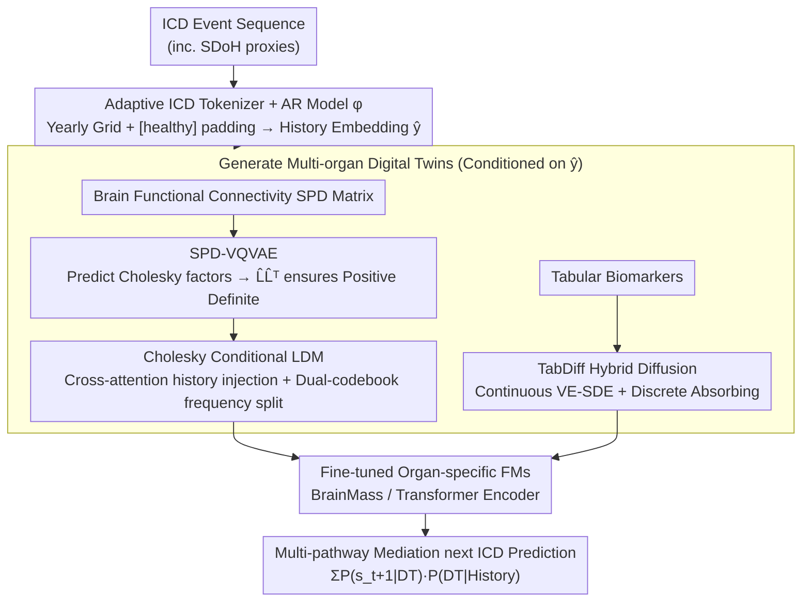

# Marrying Generative Model of Healthcare Events with Digital Twin of Social Determinants of Health for Disease Reasoning

**Conference**: ICML 2026  
**arXiv**: [2605.09771](https://arxiv.org/abs/2605.09771)  
**Code**: None  
**Area**: Medical Imaging / Generative Models / Digital Twin / Disease Prediction  
**Keywords**: digital twin, ICD autoregression, latent diffusion, SPD manifold, Cholesky decomposition, multi-organ biomarkers

## TL;DR
This paper proposes DiffDT: a conditional Latent Diffusion framework connecting electronic health records (ICD-coded event sequences) with multi-organ biomarker digital twins (imaging-derived tabular features of brain/heart/liver/kidney and brain functional connectivity SPD matrices). The key innovation is an SPD-VQVAE based on Cholesky decomposition that reduces $\mathcal{O}(N^3)$ SPD manifold diffusion to a manifold-preserving and efficient latent space. An AR model then utilizes the mediating path of "generating digital twins → predicting the next ICD" to complete multi-pathway disease reasoning. On UKB, the next-event prediction AUC for 1944 disease classes reached 0.91, setting a new SOTA.

## Background & Motivation

**Background**: Two mainstream routes in medical AI exist: (a) **EHR-to-event** uses transformer autoregression to learn ICD event sequences (e.g., MOTOR, Delphi), treating disease progression as next-token prediction but ignoring specific physiological biomarkers; (b) **DT-to-event** uses pre-trained imaging foundation models (e.g., BrainMass, NeuroPath) to predict diseases from single-organ in-vivo biomarkers but lacks cross-temporal causal chains. Both struggle with long-term, multi-pathway, and personalized disease reasoning.

**Limitations of Prior Work**: (1) Pure EHR routes learn healthcare utilization patterns rather than disease mechanisms; Figure 2 shows that prediction accuracy is negatively correlated with the "semantic distance between current and historical diseases"—diseases far from the main diagnosis chapter are predicted poorly, exposing the lack of multi-pathway probabilistic mediation. (2) Pure DT routes use only current biomarkers and cannot predict future physiological states based on past medical history. (3) Existing hybrid AR-diffusion architectures (e.g., ye2025hybrid, HybridVLA) are designed in Euclidean space; adding Gaussian noise directly to brain functional connectivity SPD matrices destroys their geometry (they lose positive definiteness). (4) Geometric diffusion methods like SPD-DDPM using affine-invariant / log-Euclidean metrics are rigorous but computationally infeasible at $\mathcal{O}(N^3)$ complexity (for $N=116$ in the AAL atlas).

**Key Challenge**: To integrate EHR temporal causality with multi-organ physiological states, one must: (i) align the generative model with ICD history, (ii) ensure generated brain networks remain on the SPD manifold, and (iii) maintain low enough complexity for training on 50K+ subjects. The first two requirements naturally conflict within Euclidean latent diffusion frameworks.

**Goal**: (1) Establish the SDoH-to-event paradigm: using ICD-coded SDoH proxies (including chapters Z and V–Y) as conditions, generate multi-organ DTs as biological mediators, then predict future ICDs. (2) Design manifold-preserving latent diffusion for SPD to reduce $\mathcal{O}(N^3)$ to a computable scale. (3) Validate next-event prediction for 1944 long-tail disease classes on UKB.

**Key Insight**: Cholesky decomposition $M = LL^\top$ provides a **unique and smooth** factor for the SPD manifold (Theorem 3.1: $\mathcal{S}_{++}^N \to \mathcal{L}_{++}^N$ is a diffeomorphism). Performing diffusion on Cholesky factors allows the use of Euclidean machinery while ensuring the reconstructed results remain SPD through $LL^\top$.

**Core Idea**: An SPD-VQVAE encodes brain functional connectivity matrices into a discrete latent space (the decoder outputs a lower-triangular matrix, then $LL^\top$ yields the SPD reconstruction). Cholesky LDM then runs on this latent space conditioned on ICD history. Tabular biomarkers follow a TabDiff-style hybrid SDE/absorbing diffusion. Finally, an AR model treats "generating DT → predicting next ICD" as a mediation inference of $P(\text{Future}|\text{Biomarker})\cdot P(\text{Biomarker}|\text{History})$.

## Method

### Overall Architecture
DiffDT aims to integrate EHR temporal causality with multi-organ physiological states for long-term, multi-pathway disease prediction. The pipeline follows a three-hop structure: "medical history → physiological mediator → future disease." First, an **adaptive medical history tokenizer + AR model $\phi$** maps ICD sequences to a uniform time grid with 1-year granularity, using `[healthy]` tokens for years without events. Token embeddings plus age embeddings are fed into causal self-attention for next-token prediction, yielding a causality-aware medical history embedding. This embedding serves as a condition to **generate multi-organ digital twins**—tabular biomarkers use TabDiff-style hybrid diffusion (VE SDE for continuous, absorbing process for discrete dimensions), while brain connectivity uses SPD-VQVAE + Cholesky LDM. Finally, **organ-specific FMs** (BrainMass for brain, Transformer encoder for tables) are fine-tuned on the generated DTs to predict the next ICD. During inference, for each multi-pathway causal node, the AR model encodes past ICDs, the diffusion model generates hypothetical multi-organ DTs, and the fine-tuned FMs read the next ICD from these DTs, achieving multi-pathway mediation via $\sum_{\text{organ}} P(s_{t+1}\mid \text{DT}_t^{\text{organ}})\, P(\text{DT}_t^{\text{organ}}\mid S_{<t})$.

### Key Designs

**1. SPD-VQVAE: Using Cholesky Decomposition for Geometric Constraint Satisfaction**

Brain connectivity is an $116\times 116$ SPD matrix. It cannot enter Euclidean diffusion frameworks directly as Gaussian noise breaks positive definiteness. Rigorous diffusion under affine-invariant metrics like SPD-DDPM is $\mathcal{O}(N^3)$, which is too slow for 50,000 subjects. Ours "internalizes" the constraint into the VQVAE decoder: encoder $\mathcal{E}$ uses an MLP to project flattened $\mathbf{M}$ to $z_e\in\mathbb{R}^{N_q\times d}$, which is quantized to codebook $\mathcal{Z}\in\mathbb{R}^{N_{code}\times d}$ to get $z$. Decoder $\mathcal{D}$ does not predict $\hat{\mathbf{M}}$ directly but predicts a lower-triangular factor $\hat L$ (with positive diagonals via softplus), and reconstructs $\hat{\mathbf{M}}=\hat L\hat L^\top$. Training loss $\mathcal{L}_{\text{VAE}}=\mathcal{L}_{\text{SPD}}(L,\hat L)+\mathcal{L}_{\text{recon}}(\mathbf{M},\hat{\mathbf{M}})+\|\text{sg}[z_e]-e\|_2^2+\beta\|z_e-\text{sg}[e]\|_2^2$ supervises the Cholesky factor, final SPD reconstruction, codebook, and commitment. This works because Theorem 3.1 guarantees Cholesky is a diffeomorphism between $\mathcal{S}_{++}^N$ and $\mathcal{L}_{++}^N$. Training via Euclidean MSE in the factor space is equivalent to training on the manifold, but the reconstruction $\hat L\hat L^\top$ necessarily returns to SPD. Complexity is reduced from $\mathcal{O}(N^3)$ to $\mathcal{O}(N^2)$.

**2. Cholesky Conditional LDM: History Injection via Cross-attention and Dual-codebook Frequency Splitting**

Diffusion is performed on the discrete latent space of the SPD-VQVAE, conditioned on the medical history embedding $\hat{\mathbf{y}}$ from the AR model. The backbone is a residual MLP block in U-Net form. Conditions are injected via two paths: time-step embedding $\text{Embed}_\text{diff}(t)$ is added to each layer input; cross-attention treats $\hat{\mathbf{y}}\in\mathbb{R}^{T\times d_\phi}$ as key/value and latent vector $\hat z$ as query, i.e., $Q=\hat z\hat{\bm{\alpha}}_h$, $K=\hat{\mathbf{y}}\hat{\bm{\beta}}_h$, $V=\hat{\mathbf{y}}\hat{\bm{\gamma}}_h$, outputting $\hat z=\text{Softmax}(QK^\top/\sqrt{C_{hid}})V$. Training uses standard noise prediction $\mathcal{L}_{\text{LDM}}=\mathbb{E}\|\epsilon-\epsilon_\theta(z_t,t,\hat{\mathbf{y}})\|^2$. Cross-attention allows models to attend to any critical historical ICD. To prevent "mode collapse" into an "average healthy brain," **SPD-VQVAE-Dual** uses two SPD-VQVAEs to model low-pass and high-pass Fourier components (threshold 25), forcing the LDM to learn both global structure and personalized details.

**3. Adaptive ICD Tokenizer and Multi-pathway Mediation: Dense Temporal Conditioning**

AR medical models usually use time-to-event embedding, resulting in gaps of decades between tokens, which provide broken signals for conditional diffusion. Ours constructs a uniform yearly grid $\tau=(\tau_t\mid \tau_{t+1}-\tau_t\in\{0,1\})$ covering the cohort's age range. If an ICD $c$ exists in a given year, $s_t=c$; otherwise, it is filled with `[healthy]`. Input tokens $\mathbf{y}_t=\text{Embed}_\text{ICD}(s_t)+\text{Embed}_\text{age}(\tau_t)$ are fed to a transformer to predict the next-token $\mathcal{L}_\text{AR}=-\sum_t\log p(s_{t+1}\mid s_{\leq t};\phi)$. The `[healthy]` filler ensures conditions are densely defined on the timeline, allowing cross-attention to attend stably. During inference, $\phi$ outputs are used as $\hat{\mathbf{y}}$ for the LDM to generate multi-organ DTs, which are then used by fine-tuned FMs to calculate $P(s_{t+1}\mid\hat{\mathbf{M}}_t)$, forming an explicit causal chain from events to physiological states to future events.

### Loss & Training
Three stages: (i) AR model $\phi$ is pre-trained for next-token prediction on 7.28M ICD tokens / 448,651 subjects. (ii) SPD-VQVAE and TabDiff are trained on paired imaging + ICD data (Brain: 44,834; Heart: 23,987; Liver: 28,722; Kidney: 32,155 samples), with losses $\mathcal{L}_{\text{VAE}}$ and $\mathcal{L}_{tab} = \lambda_{num}\mathcal{L}_{num} + \lambda_{cat}\mathcal{L}_{cat}$. (iii) Organ FMs are fine-tuned on generated DTs for next-ICD classification. Tabular generation uses Classifier-Free Guidance: $\tilde\mu^{num}(\Gamma_t, S, t) = (1+\omega)\mu_\theta^{num}(\Gamma_t, S, t) - \omega\mu_\phi(\Gamma_t, t)$. Subject-level 80:20 splitting is strictly maintained throughout.

## Key Experimental Results

### Main Results
UKB dataset, next-event prediction for 1944 disease classes:

| Method | Backbone | AUC ↑ | F1 ↑ |
|---|---|---|---|
| Delphi | GPT2 | 0.6994 ± 0.091 | 7.09 ± 7.56 |
| Delphi | Qwen3 | 0.8931 ± 0.055 | 18.17 ± 20.67 |
| **Ours** | GPT2 | **0.9087 ± 0.050** | **18.60 ± 16.29** |
| **Ours** | Qwen3 | **0.9171 ± 0.049** | **20.92 ± 20.40** |

F1 by organ mediation group (compared to DT-to-event baselines):

| Mediation Organ | Brain F1 | Heart F1 | Liver F1 | Kidney F1 |
|---|---|---|---|---|
| NeuroPath | 56.53 | 48.96 | 54.20 | 54.57 |
| BrainMass | 47.18 | 56.63 | 58.81 | 50.43 |
| **Ours (Brain)** | **65.14** | 53.74 | 60.44 | 54.97 |
| **Ours (Heart)** | 58.00 | **58.50** | 56.17 | 58.18 |
| **Ours (Liver)** | 59.88 | 52.23 | **61.65** | 53.52 |
| **Ours (Kidney)** | 53.91 | 54.72 | 57.92 | **64.32** |

**Key Observation**: Using the same pre-trained BrainMass as a predictor, DiffDT-Brain (using generated DT as input) is ≈18 pp higher in F1 than BrainMass (using real GT as input), indicating that multi-pathway mediation learns additional causal signals from ICD history.

### Ablation Study

| LDM Config | RMSE ↓ | WD ↓ | r ↑ | mAcc ↑ |
|---|---|---|---|---|
| Vanilla VQVAE | 0.261 | 7.110 | 0.503 | 90.87 |
| SPD-VQVAE | 0.220 | 6.019 | 0.677 | 95.71 |
| **SPD-VQVAE-Dual** | **0.203** | **5.841** | **0.726** | **98.36** |

Tabular DT: Heart RMSE 0.265 / WD 17.27, Liver 0.184 / 2.48, Kidney 0.146 / 0.99, correlating positively with organ mediation F1. **Counterfactual Evaluation**: Replacing an exposure ICD with `[healthy]` to generate a do(healthy) DT results in levels significantly closer to GT healthy ($p=2.5e\text{-}5$ on FID), proving the biological plausibility of the DT's counterfactual intervention.

### Key Findings
- **Multi-pathway mediation works**: Generated DT as input > real GT as input (DiffDT-Brain vs. BrainMass gain of 18 pp F1), suggesting LDM encodes causal signals from ICD history into the generated DT.
- **SPD-VQVAE-Dual is essential**: Single-branch SPD-VQVAE outperforms vanilla VQVAE, but the dual low/high-frequency branches provide an additional 4–7% gain.
- **Backbone upgrades are orthogonal to ours**: Upgrading GPT2 to Qwen3 still yields a stable +0.12 AUC gain.
- **Efficiency**: Cholesky LDM is significantly faster than SPD-DDPM; end-to-end inference takes 1.2s per mediation class.
- **Off-diagonal pairs are major gain areas**: Figure 4 shows the most significant AUC improvements occur for ICD pairs across different chapters (semantically distant).

## Highlights & Insights
- **Cholesky as SPD Diffeomorphism**: Unlike SPD-DDPM using eigendecomposition for affine-invariant metrics, Theorem 3.1 transforms SPD diffusion into Euclidean diffusion on lower-triangular factors, ensuring manifold alignment at $\mathcal{O}(N^2)$.
- **SDoH-to-event Paradigm**: Using ICD-coded SDoH proxies allows large-scale EHRs (like UKB) without explicit SDoH fields to conduct social determinants analysis.
- **Generative DT > Real GT as Input**: This counterintuitive result suggests that the **generative model encodes historical signals into the latent biological state**. The FM receives an "enhanced observation" rather than just a physiological snapshot.
- **Dual SPD-VQVAE with Fourier Splitting**: To combat mode collapse on medical images with high structural symmetry, frequency decoupling requires the generator to replicate both global structure and personalized details.

## Limitations & Future Work
- UKB data bias (predominantly European descent, middle-aged/elderly) remains; performance in LMICs or pediatric/intensive care cohorts is unverified.
- Currently covers 4 organs; extending to more organs (lungs, digestive, endocrine) requires re-training specific VQVAEs/TabDiffs.
- Absolute F1 values remain in the 50-65% range due to macro-averaging across long-tail (rare) diseases.
- Counterfactual evaluation is limited to population-level metrics (FID/WD); individual-level rigorous causal validation is still needed.
- Fixed Fourier threshold (25) in SPD-VQVAE-Dual; learnable frequency splitting or graph spectral-based decomposition could be explored.

## Related Work & Insights
- **vs. Delphi / MOTOR (EHR-only AR)**: They lack biological mediation; Ours improves AUC from 0.70-0.89 to 0.91, particularly in off-diagonal disease pairs.
- **vs. BrainMass / NeuroPath (DT-to-event)**: They use only real biomarkers; Ours is more accurate by 18 pp due to historical signal injection in the generated DT.
- **vs. SPD-DDPM / Riemannian Flow Matching**: Rigorous but $\mathcal{O}(N^3)$; Ours uses Cholesky on $\mathcal{L}_{++}^N$, which is efficient and geometrically aligned.
- **Insight**: (1) "Diffusion on latent space where constraints are satisfied by decoder geometry" is a general recipe for molecules, poses, or point clouds. (2) Generative models can act as information distillation layers, more than just data augmentation.

## Rating
- Novelty: ⭐⭐⭐⭐⭐ SDoH-to-event paradigm + Cholesky LDM is the first rigorously manifold-preserving and scalable solution.
- Experimental Thoroughness: ⭐⭐⭐⭐ 33K-44K UKB subjects + 1944 diseases + 4 organs + counterfactual evaluation.
- Writing Quality: ⭐⭐⭐⭐ Motivation, algorithm, and experiments are well-structured.
- Value: ⭐⭐⭐⭐⭐ High potential for long-term multi-pathway clinical decision support.

<!-- RELATED:START -->

## Related Papers

- [\[ICML 2026\] Evidential Reasoning Advances Interpretable Real-World Disease Screening](evidential_reasoning_advances_interpretable_real-world_disease_screening.md)
- [\[CVPR 2026\] Uni-Hema: Unified Model for Digital Hematopathology](../../CVPR2026/medical_imaging/uni-hema_unified_model_for_digital_hematopathology.md)
- [\[CVPR 2026\] GenTract: Generative Global Tractography](../../CVPR2026/medical_imaging/gentract_generative_global_tractography.md)
- [\[AAAI 2026\] Personalization of Large Foundation Models for Health Interventions](../../AAAI2026/medical_imaging/personalization_of_large_foundation_models_for_health_interventions.md)
- [\[ICML 2026\] Auditing Sybil: Explaining Deep Lung Cancer Risk Prediction Through Generative Interventional Attributions](auditing_sybil_explaining_deep_lung_cancer_risk_prediction_through_generative_in.md)

<!-- RELATED:END -->
