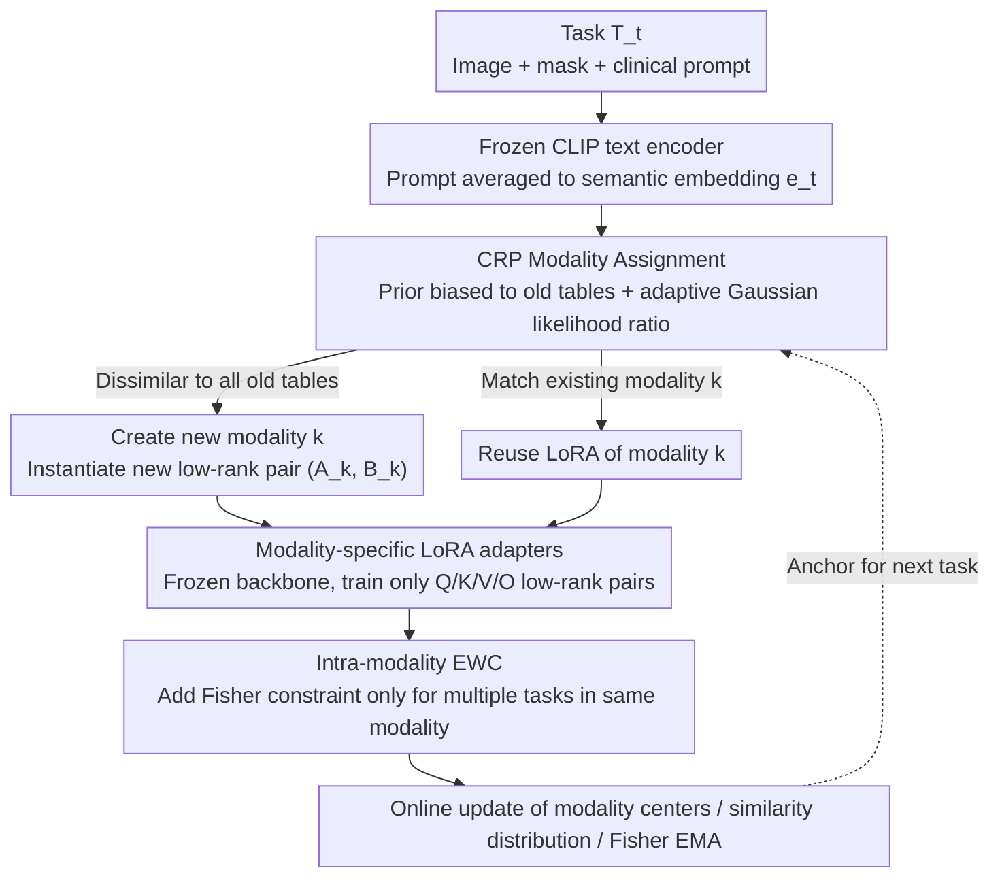

# MedCRP-CL: Continual Medical Image Segmentation via Bayesian Nonparametric Semantic Modality Discovery

**Conference**: ICML 2026  
**arXiv**: [2605.20297](https://arxiv.org/abs/2605.20297)  
**Code**: https://github.com/zygao930/MedCRP-CL (Available)  
**Area**: Medical Image Segmentation / Continual Learning  
**Keywords**: Continual Learning, Medical Image Segmentation, Chinese Restaurant Process, LoRA, EWC

## TL;DR
The authors utilize the Chinese Restaurant Process (CRP) for online Bayesian nonparametric clustering of clinical text prompts to automatically discover "semantic modalities." Each discovered modality is assigned an independent LoRA adapter combined with intra-modality EWC. This approach pushes the Dice coefficient to 73.3% while reducing the forgetting rate to 4.1% across 16 medical segmentation tasks, utilizing only 1/6 of the parameters required by MoE baselines.

## Background & Motivation

**Background**: When medical image segmentation models are deployed clinically, they must continuously incorporate data from new institutions, modalities, and diseases, making this a natural scenario for Continual Learning (CL). Existing solutions generally fall into two categories: regularization methods like EWC, which apply uniform Fisher constraints to all tasks, and expert routing methods like MoE-Adapters, which pre-specify the number of experts (e.g., $K=16$).

**Limitations of Prior Work**: Uniform regularization on heterogeneous tasks leads to severe "compromise"—chest X-rays and colonoscopy images should not share parameters; forcing constraints actually exacerbates catastrophic forgetting. Conversely, MoE models with a fixed number of experts cannot predict future task diversity and consume significant parameters (51.9M). Furthermore, medical scenarios often prohibit the replay of historical patient data due to HIPAA/GDPR, rendering conventional replay buffers clinically unavailable.

**Key Challenge**: The dilemma between parameter sharing and isolation—coarse sharing causes interference between dissimilar tasks, while rigid isolation cuts off beneficial transfer between similar tasks. To break this impasse, one must answer: "Which tasks should share, and which should be isolated?"

**Goal**: Discover the task structure online and perform structure-aware continual learning without pre-specifying the number of clusters, accessing future tasks, or storing raw patient data.

**Key Insight**: The authors observe that physical imaging modalities (e.g., "ultrasound", "X-ray") are too coarse—cardiac ultrasound and breast ultrasound share physical principles but have completely different anatomy and pathology; meanwhile, image-level clustering is unstable in high-dimensional spaces. **Clinical text prompts** naturally encode the combination of "anatomical region + pathological context," serving as a more suitable signal for task grouping.

**Core Idea**: Use CRP to perform Bayesian nonparametric clustering in the CLIP prompt embedding space to automatically discover "semantic modalities" (finer than physical modalities). Each semantic modality is then assigned an independent LoRA adapter with intra-modality EWC, achieving "strict isolation across modalities and shared transfer within modalities."

## Method

### Overall Architecture
The framework operates on a continuous stream of medical segmentation tasks without pre-setting the number of tasks or storing historical data. It runs atop a frozen CLIPSeg backbone: for each arriving task $T_t$ (including image, mask, and clinical text prompt), the frozen CLIP text encoder averages the prompt into a semantic embedding $e_t$. The CRP then decides online whether $e_t$ belongs to an existing "semantic modality" or requires a new one. Once modality $k$ is determined, only its specific LoRA adapter is activated for training, followed by an intra-modality EWC constraint to prevent overwriting previous tasks in the same modality. Modality centers, similarity distributions, and Fisher information are updated online as anchors for the next round. The task sequence $\mathcal{T}=\{T_1,\dots,T_N\}$ is thus automatically partitioned into isolated modality branches with internal sharing.

### Key Designs

**1. Bayesian Modality Assignment via CRP Prior + Adaptive Likelihood: Letting data decide sharing vs. isolation**

The difficulty in CL parameter sharing is that no one knows which tasks belong to the same category beforehand. This paper delegates this step to the Chinese Restaurant Process: the prior term $P(z_t=k)\propto n_k/(t-1+\alpha)$ favors popular "old tables," while $P(z_t=\text{new})\propto \alpha/(t-1+\alpha)$ allows for "new tables." Thus, the number of modalities $K$ is data-driven. To handle the likelihood—determining how similar prompt embeddings must be—the authors model intra-modality and inter-modality similarities as Gaussians $\mathcal{N}(\mu_{\text{intra}},\sigma^2_{\text{intra}})$ and $\mathcal{N}(\mu_{\text{inter}},\sigma^2_{\text{inter}})$, estimated online using Welford's algorithm. The decision becomes a learnable log-likelihood ratio:

$$\ell(s)=\frac{(s-\mu_{\text{inter}})^2}{2\sigma^2_{\text{inter}}}-\frac{(s-\mu_{\text{intra}})^2}{2\sigma^2_{\text{intra}}}+\log\frac{\sigma_{\text{inter}}}{\sigma_{\text{intra}}}$$

The assignment is determined by MAP: $z_t=\arg\max_k \log P(z_t=k\mid z_{1:t-1},e_t)$. This design allows the threshold to adapt to data, avoiding manual tuning when switching datasets.

**2. Modality-specific LoRA Adapters: Complete cross-modality isolation, intra-modality sharing**

Knowing the category is not enough; there must be a mechanism to store knowledge. The backbone remains frozen—cutting off the source of catastrophic forgetting—while low-rank adapters are attached to the Q/K/V/O projections of CLIPSeg for each modality. The effective weight for modality $k$ is $W_k=W_0+\frac{\alpha_{\text{LoRA}}}{r}B_k A_k$ ($r=8$, $\alpha_{\text{LoRA}}=16$). When CRP identifies a new modality, a new pair $(A_k, B_k)$ is instantiated. This ensures tasks like chest X-rays and colonoscopy use physically separate branches, preventing negative transfer, while tasks within the same modality reuse the same LoRA to facilitate knowledge transfer.

**3. Intra-modality Elastic Weight Consolidation: Confining EWC to the same "table"**

Sharing LoRA within a modality reintroduced the risk of overwriting previous task parameters. Classic EWC fails on heterogeneous task streams because Fisher information from different tasks (e.g., chest X-ray vs. endoscopy) conflicts. This paper resolves this by applying EWC only within modalities: after training task $t$, Fisher information $F_k^{(t)}$ is estimated and merged via EMA: $\bar F_k\leftarrow \frac{n_k-1}{n_k}\bar F_k+\frac{1}{n_k}F_k^{(t)}$. Subsequent training adds the constraint $\Omega_k(\theta_k)=\sum_i \bar F_{k,i}(\theta_{k,i}-\theta_{k,i}^*)^2$. Since constraints only occur between tasks CRP deemed similar, Fisher conflict is avoided. The mechanism is replay-free, satisfying HIPAA/GDPR privacy constraints.

### Loss & Training
The training objective is $\mathcal{L}=\mathcal{L}_{CE}+\mathcal{L}_{Dice}+\mathbf{1}_{[n_{z_t}>1]}\cdot\Omega_{z_t}(\theta_{z_t})$. Dice loss addresses medical image class imbalance; EWC is enabled only if a modality contains multiple tasks. Optimizer: AdamW, lr=$1\times 10^{-3}$, weight decay=$8\times 10^{-5}$; max 60 epochs per task, patience=8. CRP concentration $\alpha=5$, EWC coefficient $\lambda=5000$. Images are resized to $352\times 352$ with a batch size of 16 on an RTX 4090.

## Key Experimental Results

### Main Results
Evaluated on 16 medical segmentation tasks (5 endoscopy, 1 dermoscopy, 3 ultrasound, 7 chest X-ray) under a mixed task order:

| Method | Dice (%) ↑ | Forgetting (%) ↓ | Params (M) | GPU (GB) | Note |
|------|------------|------------------|------------|----------|------|
| Individual (Upper Bound) | 77.9 | – | 19.8 | 12.4 | Independent model per task |
| Sequential | 48.0 ± 7.1 | 28.3 ± 7.7 | 1.2 | 5.8 | Naive Fine-tuning |
| EWC | 56.8 ± 3.7 | 11.3 ± 3.5 | 1.2 | 5.8 | Uniform Regularization |
| RAPF | 58.4 ± 1.7 | 7.2 ± 2.6 | 0.9 | 5.6 | Adapter Fusion |
| CL-LoRA | 60.7 ± 2.0 | 9.7 ± 1.4 | 0.05 | 5.7 | LoRA + KD |
| MoE-Adapters | 65.3 ± 3.4 | 7.1 ± 3.2 | 51.9 | 13.3 | K=16 Experts |
| **Ours (MedCRP-CL)** | **73.3 ± 1.0** | **4.1 ± 0.8** | **8.6** | 12.4 | CRP+LoRA+EWC |

Compared to MoE-Adapters, Dice increases by 8.0% and forgetting decreases by 3.0%, with only 1/6 of the parameters.

### Ablation Study

Module Ablation:

| Configuration | CRP | LoRA | EWC | Dice (%) | Forgetting (%) |
|------|-----|------|-----|----------|----------------|
| Full Model | ✓ | ✓ | ✓ | 73.33 | 4.09 |
| w/o EWC | ✓ | ✓ | × | 71.92 | 5.41 |
| w/o CRP | × | ✓ | ✓ | 57.59 | 15.55 |
| Single LoRA | × | ✓ | × | 46.94 | 27.34 |
| w/o LoRA | ✓ | × | ✓ | 45.39 | 0.03 |

Modality Discovery Strategy Comparison:

| Modality Assignment | K | Dice (%) | Forgetting (%) |
|--------------|---|----------|----------------|
| Physical Imaging Type | 4 | 65.75 | 9.23 |
| CRP Discovery (Ours) | 5 | 73.33 | 4.09 |

### Key Findings
- **CRP is the Foundation**: Removing CRP causes forgetting to spike from 4.09% to 15.55% and Dice to drop to 57.59%. Removing LoRA results in near-zero forgetting but a low Dice (45.39%)—showing that both "routing discovery" and "parameter capacity" are essential.
- **Semantic Modality $\neq$ Physical Modality**: CRP automatically discovers $K=5$ instead of $K=4$, splitting cardiac ultrasound (CAMUS) and breast ultrasound (BUSI) into different modalities. While their visual similarity is $>0.95$, their text similarity is only $\sim 0.45$, providing a better grouping signal.
- **Robust Structure**: The method consistently discovers $K=5$ across 10 different text encoders and various clinical prompt noises (abbreviations, typos).
- **Order Robustness**: Dice remains stable (0.72-0.74) across grouped, interleaved, mixed, and reversed task orders.

## Highlights & Insights
- **Task Routing via Text instead of Images**: In medical CL, this is often overlooked. Visual clustering is unstable due to center-specific biases. Clinical prompts are concise and highly discriminative, provided by doctors at near-zero cost.
- **Adaptive Gaussian Likelihood**: Replacing manual thresholds with a log-likelihood ratio based on online Gaussian estimation makes the method robust to distribution shifts without manual hyperparameter tuning.
- **Synergy of CRP and LoRA**: CRP provides discrete decisions for expansion, while LoRA provides low-cost parameter instantiation. This combines "dynamic expansion" with "parameter efficiency" more effectively than MoE models.
- **Replay-free as a Key Contribution**: Storing only LoRA weights, Fisher EMA, and modality centers satisfies HIPAA/GDPR. This is arguably more important for deployment than the Dice improvement.

## Limitations & Future Work
- **Dependency on Text Encoder Training**: The method works best with encoders trained via contrastive learning (like CLIP); it might fail with purely generative encoders where embeddings might collapse.
- **Prompt Quality Sensitivity**: While robust to some noise, the performance still depends on clinical descriptions. Real-world multi-center experiments with highly varying reports are still needed.
- **2D Limitation**: The 16 tasks are all 2D. Extending CRP to handle 3D CT/MRI volumes specifically remains future work.
- **Interpretability of K**: The semantic meaning of $K=5$ requires post-hoc t-SNE analysis. Hierarchical CRP (hCRP) could be explored for better organization as task numbers scale into the hundreds.

## Related Work & Insights
- **vs. EWC / RAPF**: Unlike standard regularization, this work restricts EWC to intra-modality constraints, fundamentally avoiding Fisher conflict between heterogeneous tasks, leading to a 15%+ Dice gain.
- **vs. CL-LoRA**: While both use LoRA, CL-LoRA lacks task structure discovery and forces all tasks into one adapter set, yielding higher forgetting (9.7%).
- **vs. MoE-Adapters**: MoE-Adapters require a pre-set $K=16$ and use 51.9M parameters. This paper discovers $K=5$ dynamically, outperforming it with 1/6 the parameters.
- **vs. MedPEFT-CL**: MedPEFT-CL requires a replay buffer; this approach is replay-free, directly meeting medical privacy regulations.

## Rating
- Novelty: ⭐⭐⭐⭐ Combining CRP for prompt-based modality discovery in medical CL is a fresh direction.
- Experimental Thoroughness: ⭐⭐⭐⭐⭐ Comprehensive evaluation across 16 tasks, various orders, and encoders.
- Writing Quality: ⭐⭐⭐⭐ Logical flow from motivation to method and ablation is clear.
- Value: ⭐⭐⭐⭐ Significant Dice improvement with high parameter efficiency and strict privacy compliance.

<!-- RELATED:START -->

## Related Papers

- [\[CVPR 2026\] SPEGC: Continual Test-Time Adaptation via Semantic-Prompt-Enhanced Graph Clustering for Medical Image Segmentation](../../CVPR2026/medical_imaging/spegc_continual_test-time_adaptation_via_semantic-prompt-enhanced_graph_clusteri.md)
- [\[ICML 2026\] SEMIR: Semantic Minor-Induced Representation Learning on Graphs for Visual Segmentation](semir_semantic_minor-induced_representation_learning_on_graphs_for_visual_segmen.md)
- [\[AAAI 2026\] Bidirectional Channel-selective Semantic Interaction for Semi-Supervised Medical Segmentation](../../AAAI2026/medical_imaging/bidirectional_channel-selective_semantic_interaction_for_semi-supervised_medical.md)
- [\[CVPR 2026\] Semantic Class Distribution Learning for Debiasing Semi-Supervised Medical Image Segmentation](../../CVPR2026/medical_imaging/semantic_class_distribution_learning_for_debiasing.md)
- [\[ICML 2026\] Are We Overconfident in Models and Results for Semi-Supervised 3D Medical Image Segmentation?](are_we_overconfident_in_models_and_results_for_semi-supervised_3d_medical_image_.md)

<!-- RELATED:END -->
