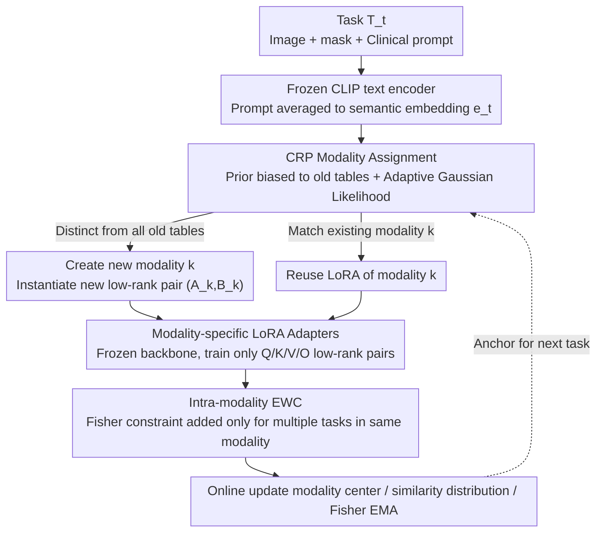

# MedCRP-CL: Continual Medical Image Segmentation via Bayesian Nonparametric Semantic Modality Discovery

**Conference**: ICML 2026  
**arXiv**: [2605.20297](https://arxiv.org/abs/2605.20297)  
**Code**: https://github.com/zygao930/MedCRP-CL (Available)  
**Area**: Medical Image Segmentation / Continual Learning  
**Keywords**: Continual Learning, Medical Image Segmentation, Chinese Restaurant Process, LoRA, EWC

## TL;DR
The authors utilize the Chinese Restaurant Process (CRP) for online Bayesian nonparametric clustering of clinical text prompts to automatically discover "semantic modalities." They assign independent LoRA adapters to each semantic modality and implement intra-modality EWC. This approach pushes the Dice coefficient to 73.3% while reducing the forgetting rate to 4.1% across 16 medical segmentation tasks, using only 1/6 of the parameters required by MoE baselines.

## Background & Motivation

**Background**: When medical image segmentation models are deployed clinically, they must continuously absorb data from new institutions, modalities, and pathologies, which is inherently a Continual Learning (CL) scenario. Existing solutions are generally categorized into two types: regularization-based methods like EWC, which apply unified Fisher constraints across all tasks, and expert routing methods like MoE-Adapters, which pre-specify the number of experts (e.g., $K=16$).

**Limitations of Prior Work**: Unified regularization causes severe "trade-offs" on heterogeneous tasks—forcing chest X-rays and colonoscopies to share parameters often exacerbates catastrophic forgetting. Conversely, MoE models with a fixed number of experts cannot predict the diversity of future tasks and consume excessive parameters (51.9M). Furthermore, medical scenarios prohibit the replay of historical patient data due to HIPAA/GDPR, making conventional replay buffers unavailable in clinical settings.

**Key Challenge**: The dilemma between parameter sharing and parameter isolation. Broad sharing causes interference between dissimilar tasks, while rigid isolation cuts off beneficial transfers between similar tasks. To break through this, one must first answer: "Which tasks should be shared, and which should be isolated?"

**Goal**: Discover task structures online and perform structure-aware continual learning without pre-defining the number of clusters, accessing future tasks, or storing raw patient data.

**Key Insight**: The authors noted that physical imaging modalities ("Ultrasound", "X-ray") are too coarse—cardiac ultrasound and breast ultrasound share physical principles but have distinct anatomical structures and pathological patterns. Meanwhile, image-level clustering is unstable in high dimensions. **Clinical text prompts** naturally encode the combination of "anatomical region + pathological context," serving as a more suitable signal for task grouping.

**Core Idea**: Use CRP on CLIP prompt embedding space to perform Bayesian nonparametric clustering, automatically discovering "semantic modalities" (finer than physical modalities). Each semantic modality is assigned an independent LoRA adapter and intra-modality EWC to achieve "strict inter-modality isolation and intra-modality sharing/migration."

## Method

### Overall Architecture
This paper aims to perform continual learning on a sequence of medical segmentation tasks without pre-specifying task categories or storing historical patient data. The system operates on top of a frozen CLIPSeg backbone. For each arriving task $T_t$ (containing image, mask, and clinical text prompt), a frozen CLIP text encoder first averages the prompt into a semantic embedding $e_t$. This is passed to the CRP, which online determines if it belongs to an existing "semantic modality" or requires a new one. Once the modality $k$ is identified, only the specific LoRA adapter for that modality is activated for training. Intra-modality EWC constraints are applied to prevent overwriting prior tasks within the same modality. After training, the modality center, similarity distribution, and Fisher information are updated online to serve as anchors for the next round. The task sequence $\mathcal{T}=\{T_1,\dots,T_N\}$ is thus automatically partitioned into isolated modality branches with internal sharing.

### Key Designs

**1. Bayesian Modality Assignment via CRP Prior + Adaptive Likelihood: Letting data define "Share vs. Isolate"**

The dilemma of sharing vs. isolation in CL arises because task categories are unknown beforehand. This paper delegates this step to the Chinese Restaurant Process: the prior $P(z_t=k)\propto n_k/(t-1+\alpha)$ favors existing "tables" (modalities) with more members, while $P(z_t=\text{new})\propto \alpha/(t-1+\alpha)$ allows for new ones. Thus, the number of modalities $K$ is data-driven. The challenge lies in the likelihood—if the similarity threshold for prompt embeddings is manually tuned, it may drift across institutions. The authors model intra-modality and inter-modality similarities as Gaussians $\mathcal{N}(\mu_{\text{intra}},\sigma^2_{\text{intra}})$ and $\mathcal{N}(\mu_{\text{inter}},\sigma^2_{\text{inter}})$, estimated online using Welford’s algorithm. The criterion becomes a learnable log-likelihood ratio:

$$\ell(s)=\frac{(s-\mu_{\text{inter}})^2}{2\sigma^2_{\text{inter}}}-\frac{(s-\mu_{\text{intra}})^2}{2\sigma^2_{\text{intra}}}+\log\frac{\sigma_{\text{inter}}}{\sigma_{\text{intra}}}$$

This design adapts thresholds to the data, and when a task is dissimilar to all existing modalities, the likelihood ratio pushes it to create a new one, avoiding improper force-fitting.

**2. Modality-specific LoRA Adapters: Complete inter-modality isolation with intra-modality sharing**

Knowing the category is insufficient; there must be a structure to store knowledge. The backbone remains frozen to eliminate the root cause of catastrophic forgetting. Instead, a pair of low-rank adapters is attached to the Q/K/V/O projections of CLIPSeg for each modality. The effective weight for modality $k$ is $W_k=W_0+\frac{\alpha_{\text{LoRA}}}{r}B_k A_k$ (rank=8, $\alpha_{\text{LoRA}}=16$). When CRP identifies a new modality, a new $(A_k,B_k)$ pair is instantiated. This ensures physical separation between distinct tasks (e.g., X-ray vs. colonoscopy), naturally preventing negative transfer, while tasks within the same modality reuse LoRA to facilitate knowledge transfer.

**3. Intra-modality Elastic Weight Consolidation: Confining EWC inside similar task clusters**

Shared LoRA within a modality introduces the risk of overwriting prior task parameters. Traditional EWC fails on heterogeneous streams because Fisher information from conflicting tasks (e.g., chest X-ray vs. colonoscopy) are forced together. This paper restricts EWC to occur only within a modality: after training task $t$, Fisher information $F_k^{(t)}=\mathbb{E}[\nabla_{\theta_k}\log p(y\mid x;\theta_k)^{\otimes 2}]$ is estimated and merged via Exponential Moving Average: $\bar F_k\leftarrow \frac{n_k-1}{n_k}\bar F_k+\frac{1}{n_k}F_k^{(t)}$. The constraint $\Omega_k(\theta_k)=\sum_i \bar F_{k,i}(\theta_{k,i}-\theta_{k,i}^*)^2$ is applied. Since constraints only occur between "CRP-deemed similar" tasks, Fisher conflicts are naturally avoided. The mechanism is replay-free, storing only EMA and modality centers, adhering to HIPAA/GDPR.

### Loss & Training
The training objective is $\mathcal{L}=\mathcal{L}_{CE}+\mathcal{L}_{Dice}+\mathbf{1}_{[n_{z_t}>1]}\cdot\Omega_{z_t}(\theta_{z_t})$. Dice loss handles category imbalance in medical images; EWC is enabled only when a modality contains multiple tasks. Optimizer: AdamW, lr=$1\times 10^{-3}$, weight decay=$8\times 10^{-5}$; max 60 epochs per task with patience=8. CRP concentration $\alpha=5$, EWC coefficient $\lambda=5000$.

## Key Experimental Results

### Main Results
On 16 medical segmentation tasks (5 colonoscopy + 1 dermoscopy + 3 ultrasound + 7 chest X-ray) in a mixed task order, compared with 5 CL baselines:

| Method | Dice (%) ↑ | Forgetting (%) ↓ | Params (M) | GPU (GB) | Note |
|------|------------|------------------|------------|----------|------|
| Individual (Upper Bound) | 77.9 | – | 19.8 | 12.4 | Independent model per task |
| Sequential | 48.0 ± 7.1 | 28.3 ± 7.7 | 1.2 | 5.8 | Naive Fine-tuning |
| EWC | 56.8 ± 3.7 | 11.3 ± 3.5 | 1.2 | 5.8 | Unified Regularization |
| RAPF | 58.4 ± 1.7 | 7.2 ± 2.6 | 0.9 | 5.6 | Adapter Fusion |
| CL-LoRA | 60.7 ± 2.0 | 9.7 ± 1.4 | 0.05 | 5.7 | LoRA + KD |
| MoE-Adapters | 65.3 ± 3.4 | 7.1 ± 3.2 | 51.9 | 13.3 | K=16 Experts |
| **Ours (MedCRP-CL)** | **73.3 ± 1.0** | **4.1 ± 0.8** | **8.6** | 12.4 | CRP + LoRA + EWC |

Compared to MoE-Adapters, Dice increases by 8.0% and forgetting decreases by 3.0%, utilizing only 1/6 of the parameters.

### Ablation Study

Component ablation:

| Configuration | CRP | LoRA | EWC | Dice (%) | Forgetting (%) |
|------|-----|------|-----|----------|----------------|
| Full Model | ✓ | ✓ | ✓ | 73.33 | 4.09 |
| w/o EWC | ✓ | ✓ | × | 71.92 | 5.41 |
| w/o CRP | × | ✓ | ✓ | 57.59 | 15.55 |
| Single LoRA | × | ✓ | × | 46.94 | 27.34 |
| w/o LoRA | ✓ | × | ✓ | 45.39 | 0.03 |

Modality discovery strategy comparison:

| Modality Assignment | K | Dice (%) | Forgetting (%) |
|--------------|---|----------|----------------|
| Physical Imaging Type | 4 | 65.75 | 9.23 |
| CRP Discovery (Ours) | 5 | 73.33 | 4.09 |

### Key Findings
- **CRP is the Foundation**: Removing CRP causes forgetting to spike from 4.09% to 15.55% and Dice to drop to 57.59%. Removing LoRA results in near-zero forgetting but Dice falls to 45.39%—indicating that both "routing discovery" and "parameter capacity" are essential.
- **Semantic Modality $\neq$ Physical Modality**: CRP identifies K=5 instead of K=4. The key difference is splitting cardiac ultrasound (CAMUS) and breast ultrasound (BUSI)—physically similar but anatomically distinct. Text embeddings provide a clearer grouping signal (intra-/inter-gap 0.50 vs. vision 0.22).
- **Structural Robustness**: Using 10 different text encoders results in the same K=5 partition. The modalities discovered are intrinsic to the data, not encoder artifacts.
- **Order Robustness**: Across grouped, interleaved, mixed, and reversed task sequences, Dice remains stable at 0.72-0.74 with forgetting at 0.04-0.06.

## Highlights & Insights
- **Task Routing via Text instead of Images**: In medical CL, this is an overlooked direction. Visual clustering is unstable due to high dimensions and acquisition biases; clinical prompts are short, discriminative, and naturally generated by physicians at zero additional cost.
- **Adaptive Gaussian Likelihood**: Modeling the likelihood as two online Gaussians avoids the sensitivity of distance thresholds in methods like DP-Means, making it adaptive across different datasets without manual tuning.
- **Natural Synergy between CRP and LoRA**: CRP provides discrete decisions on "whether to create a new table," while LoRA provides low-cost parameter instantiation for each table, merging dynamic expansion with parameter efficiency.
- **Replay-free as a Key Engineering Contribution**: Storing only LoRA weights, Fisher EMA, and modality centers satisfies HIPAA/GDPR requirements by avoiding any raw patient data.

## Limitations & Future Work
- **Dependency on Text Encoder Paradigms**: The method is optimized for contrastive-learning-trained encoders; encoders trained via non-contrastive methods like SigLIP may collapse to K=1.
- **Prompt Quality Sensitivity**: The experiments use tidy clinical descriptions. Real-world clinical reports contain abbreviations and slang; whether CRP remains stable under extreme real-world noise requires further multi-center validation.
- **2D Validation Only**: All 16 tasks are 2D segmentation. Whether CRP can derive stable modalities from 3D CT/MRI volumes remains to be tested.
- **Interpretability of K**: The semantic meaning of K modalities requires post-hoc t-SNE analysis. Hierarchical CRP (hCRP) could be explored to form tree-like task structures as the number of tasks grows.

## Related Work & Insights
- **vs. EWC / RAPF**: Traditional regularization applies Fisher constraints to all tasks. This paper's innovation is "intra-modality EWC," fundamentally avoiding Fisher conflicts between heterogeneous tasks.
- **vs. CL-LoRA**: Also uses LoRA but lacks a task structure discovery mechanism, forcing all tasks into a single set of adapters. Ours achieves 12+ points higher in Dice.
- **vs. MoE-Adapters**: MoE requires pre-setting K=16 and lacks the flexibility to adapt to new modalities. CRP lets data define K, outperforming MoE with 1/6 the parameters.
- **vs. MedPEFT-CL**: MedPEFT-CL requires a replay buffer, whereas this method is replay-free, adhering directly to medical privacy regulations.

## Rating
- Novelty: ⭐⭐⭐⭐ Combining CRP for prompt-based modality discovery is a fresh direction in medical CL.
- Experimental Thoroughness: ⭐⭐⭐⭐⭐ Comprehensive evaluation across 16 tasks, 10 encoders, and 4 task orders.
- Writing Quality: ⭐⭐⭐⭐ Clear logic from motivation to methodology.
- Value: ⭐⭐⭐⭐ Replay-free, adaptive K, and significant performance gains provide direct value for clinical deployment.

<!-- RELATED:START -->

## Related Papers

- [\[CVPR 2026\] SPEGC: Continual Test-Time Adaptation via Semantic-Prompt-Enhanced Graph Clustering for Medical Image Segmentation](../../CVPR2026/medical_imaging/spegc_continual_test-time_adaptation_via_semantic-prompt-enhanced_graph_clusteri.md)
- [\[ICML 2026\] SEMIR: Semantic Minor-Induced Representation Learning on Graphs for Visual Segmentation](semir_semantic_minor-induced_representation_learning_on_graphs_for_visual_segmen.md)
- [\[AAAI 2026\] Bidirectional Channel-selective Semantic Interaction for Semi-Supervised Medical Segmentation](../../AAAI2026/medical_imaging/bidirectional_channel-selective_semantic_interaction_for_semi-supervised_medical.md)
- [\[ICML 2026\] Are We Overconfident in Models and Results for Semi-Supervised 3D Medical Image Segmentation?](are_we_overconfident_in_models_and_results_for_semi-supervised_3d_medical_image_.md)
- [\[CVPR 2026\] From Infusion to Assimilation Distillation for Medical Image Segmentation](../../CVPR2026/medical_imaging/from_infusion_to_assimilation_distillation_for_medical_image_segmentation.md)

<!-- RELATED:END -->
