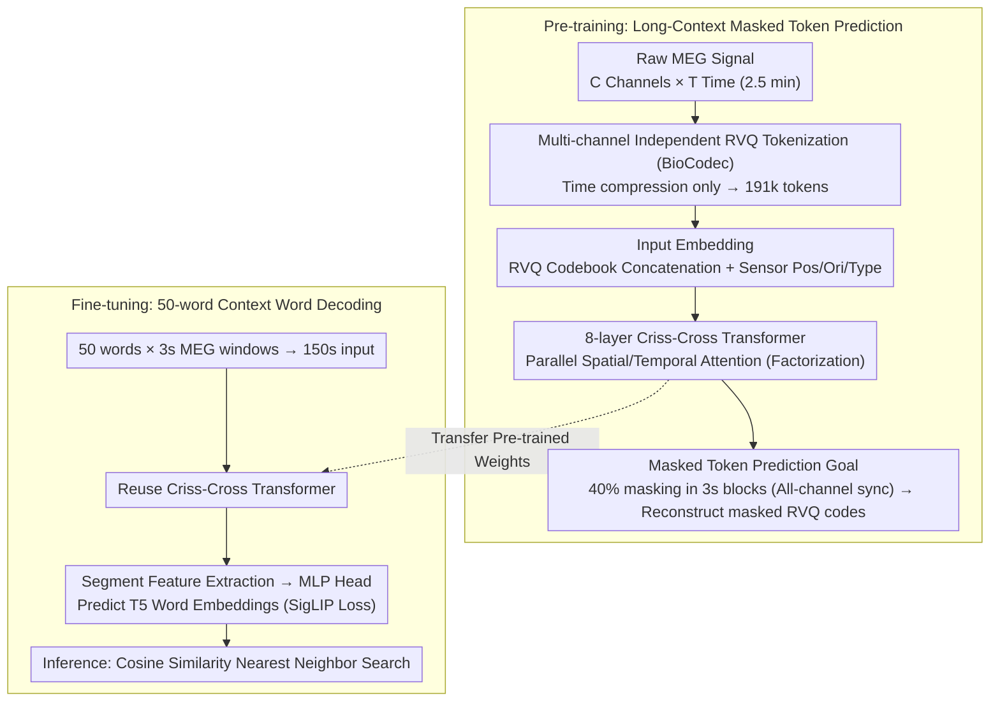

# MEG-XL: Data-Efficient Brain-to-Text via Long-Context Pre-Training

**Conference**: ICML 2026  
**arXiv**: [2602.02494](https://arxiv.org/abs/2602.02494)  
**Code**: Open-sourced (Release of code + weights declared in the paper)  
**Area**: Brain-Computer Interface / Neural Decoding / Foundation Models  
**Keywords**: Brain-to-Text, Long-Context Pre-Training, MEG, criss-cross attention, masked token prediction

## TL;DR
MEG-XL utilizes a 2.5-minute (191k tokens) MEG context for masked token pre-training (5–300× longer than previous methods) and fine-tunes on a 50-word brain-to-text task. With only 1 hour of data, it achieves the decoding accuracy of SOTA supervised methods trained on 50 hours of data, significantly outperforming all existing brain foundation models.

## Background & Motivation

**Background**: Brain-to-text (B2T) decoding is a core direction in Brain-Computer Interface (BCI), categorized into invasive (cortical electrodes; e.g., Moses 2021, Willett 2023, Card 2024 achieving usable accuracy) and non-invasive (MEG/EEG, lower barrier but weaker signals). Representative non-invasive works include Défossez et al. (2022) using 1s MEG for speech decoding and d'Ascoli et al. (2025) extending context to the sentence level (150s) for word decoding. Brain foundation models (LaBraM, BIOT, EEGPT, BrainOmni, CBraMod) typically perform masked pre-training on short 5–30s windows.

**Limitations of Prior Work**: (1) Supervised methods rely on ~50 hours of training data per subject, which is impractical for paralyzed patients who cannot provide lengthy training recordings. (2) Existing brain foundation models pre-train on short windows (≤10s), creating a severe mismatch with the long-term neurolinguistic structures (phrases, sentences, discourse) required for downstream tasks; recent analysis (Yang 2026) found these FMs underperform compared to supervised methods in low-data scenarios. (3) Extending context is hindered by computational bottlenecks: standard transformer attention is $\mathcal{O}((CT')^2)$, causing memory explosion with multi-channel long-time-series data.

**Key Challenge**: Neural activity contains language-related structures spanning tens of seconds to minutes (phrase aggregation, syntax, discourse coherence), which short-window pre-trained models can neither see nor exploit. Meanwhile, the clinical requirement for "fast adaptation to new subjects with minimal data" is exactly where short-context FMs fail.

**Goal**: (i) Build a framework for masked pre-training on minutes-level MEG context without memory exhaustion; (ii) Verify whether long-context pre-training truly surpasses SOTA supervised methods and existing FMs in low-data downstream scenarios (especially contextual word decoding); (iii) Explain the utility of long context—specifically whether it learns selective and hierarchical attention.

**Key Insight**: The authors treat "neural data as long documents," suggesting that pre-training in long contexts, similar to LMs, is necessary to learn long-range statistical priors. The computational bottleneck is addressed using criss-cross factorized attention (Wang 2025), which decouples and parallelizes attention across temporal and channel dimensions.

**Core Idea**: Use BioCodec to tokenize each channel independently (rank 12 temporal compression), feed into an 8-layer criss-cross transformer, and mask 40% of 3-second blocks within a 2.5-minute MEG window for prediction. This forces the model to learn cross-minute neural dependencies. Fine-tuning on word decoding then yields a data-efficient B2T model.

## Method

### Overall Architecture
MEG-XL treats "neural data as long documents," first undergoing masked pre-training on a 2.5-minute (191k tokens) MEG context to learn long-range statistical priors, then fine-tuning on a 50-word brain-to-text task. During pre-training, raw MEG $\mathbf{X}\in\mathbb{R}^{C\times T}$ is compressed into discrete tokens via a per-channel independent frozen BioCodec. After concatenating position/orientation/type embeddings, tokens pass through an 8-layer criss-cross transformer. 40% of tokens are uniformly masked in 3-second blocks for the model to predict the masked RVQ codes. For fine-tuning, following d'Ascoli’s setup, 50 words × 3s MEG windows are concatenated into a 150s input to predict T5 word embeddings for each segment. An MLP head is trained with SigLIP contrastive loss, and inference is performed via nearest-neighbor retrieval using cosine similarity. Both stages share the same criss-cross transformer backbone.

### Key Designs

**1. Multi-channel Independent RVQ Tokenization (BioCodec) + Residual Codebook Embedding: Compressing time without pooling channels**

To perform masked prediction on long contexts, continuous MEG signals must be compressed into discrete tokens to shorten sequences and provide prediction targets. This work uses BioCodec (a neural audio codec-style tokenizer trained on EEG) to perform Residual Vector Quantization (RVQ) on each channel independently: $Q=6$ quantization levels, codebook size $V=256$, with a 12× temporal downsampling factor. This compresses 50Hz × 150s × hundreds of channels into 191k tokens. Input embeddings are formed by concatenating codebook vectors $\mathbf{e}^{(q)}_{z_{c,q,t}}$ and projecting them as $\mathbf{h}^{(0)}_{c,t}=\mathbf{W}_{proj}[\mathbf{e}^{(1)};...;\mathbf{e}^{(Q)}]$, adding Fourier features for sensor positions $\gamma(\mathbf{v})=[\cos(2\pi\mathbf{Bv}),\sin(2\pi\mathbf{Bv})]$, orientation, and type embeddings. Critically, only time is compressed; unlike BrainTokenizer which "pools time and channels together," independent temporal compression preserves higher reconstruction quality and prevents loss of task-relevant information during tokenization.

**2. 2.5-minute Ultra-long Context + Criss-cross Factorized Attention: Fitting minute-level vision into a single GPU**

Linguistic structures in the brain (phrases, syntax, discourse) span seconds to minutes, yet existing brain foundation models pre-train on ≤10s windows, fundamentally lacking long-range dependencies. However, direct extension hits a computational wall: standard attention complexity is $\mathcal{O}((CT')^2)$. This work uses criss-cross attention to decouple space and time: half the feature dimensions undergo SpatialAttn (independent cross-channel attention per time step, $\mathcal{O}(T'\cdot C^2)$), and the other half undergo TemporalAttn (independent cross-time attention per channel with RoPE, $\mathcal{O}(C\cdot T'^2)$). The results are concatenated, followed by residual connections, RMSNorm, and SELU FFN. Total complexity drops to $\mathcal{O}(C\cdot T'^2+T'\cdot C^2)$, making 191k token sequences manageable. This factorization works because brain signals naturally exhibit "temporal correlation within sensors + spatial correlation within time steps," making the decoupling an effective approximation.

**3. 3s Large Block Masking + Synchronous All-channel Masking: Blocking interpolation shortcuts to force long-range modeling**

MEG is highly auto-correlated in time. If only short fragments are masked, the model can use "neighbor interpolation" to fill gaps without learning long-range dependencies. This work randomly selects 3-second blocks until 40% of tokens are masked, and **synchronously masks all channels** for the selected time steps. The model must then predict RVQ codes $p(z_{c,q,t}\mid\mathbf{X}_{\backslash\mathcal{M}})=\text{softmax}(\mathbf{W}_q\mathbf{h}^{(L)}_{c,t})$, with the loss:

$$\mathcal{L}=-\frac{1}{|\mathcal{M}|CQ}\sum_t\sum_c\sum_q\log p(z_{c,q,t}\mid\mathbf{X}_{\backslash\mathcal{M}}).$$

The 3s block size is chosen to cover the typical duration of a word's neural response. Synchronous all-channel masking removes both "temporal neighbor" and "spatial neighbor" interpolation shortcuts, forcing the model to model long-term structure. The 40% mask rate is empirically tuned—higher than BERT's 15%, falling between MAE (75%) and wav2vec 2.0 (49%).

### Loss & Training
Pre-training uses ~300 hours of MEG data (CamCAN + MOUS + SMN4Lang), covering resting state, motor, and speech tasks across hundreds of subjects. The objective is cross-entropy for masked token prediction; varying channel counts across MEG systems are handled via channel masking (padding). Fine-tuning employs SigLIP contrastive loss with a word embedding regression head, end-to-end tuning the transformer and MLP head. Nearest neighbor retrieval via cosine similarity is used for inference.

## Key Experimental Results

### Main Results

| Model | Params | MEG-MASC (13%) | Armeni (13%) | LibriBrain (13%) | MEG-MASC (100%) | Armeni (100%) | LibriBrain (100%) |
|---|---|---|---|---|---|---|---|
| BioCodec baseline | 1.0M | 19.8 | 20.0 | 19.9 | 31.2 | 37.1 | 41.9 |
| EEGPT | 4.7M | 19.6 | 20.3 | 20.3 | 26.3 | 20.8 | 22.9 |
| BIOT | 3.2M | 20.0 | 20.2 | 20.6 | 31.3 | 35.7 | 45.6 |
| BBL | 15M | 21.5 | 22.3 | 32.1 | 35.9 | 39.1 | 49.9 |
| BrainOmni | 8.4M | 18.7 | 21.0 | 29.7 | 19.1 | 62.3 | 63.0 |
| LaBraM | 5.8M | 33.2 | 26.3 | 40.3 | 31.1 | 42.0 | 47.7 |
| **MEG-XL (Ours)** | **20M** | **47.0** | **54.9** | **57.3** | **46.4** | **61.2** | **63.0** |

In low-data (13%) scenarios, MEG-XL outperforms the next best model, LaBraM, by 13–28 points. With full data, it matches or exceeds BrainOmni. BrainOmni crashes to 19.1% on MEG-MASC (shallow, multi-subject), indicating that prior FMs fail in the clinical "shallow data, multi-subject" scenario.

### Ablation Study

| Configuration | Effect |
|---|---|
| Random init MEG-XL (No PT) | Performance close to supervised baseline; gains stem from pre-training, not architecture. |
| PT Context 5s → 30s → 100s → 150s | Monotonic improvement in linear probe word decoding, saturating at ~100s. |
| Full-context vs Matched-context Inf | Almost identical → Longer context at inference is useless unless seen during pre-training. |
| Masked prediction (Zero-shot) | Monotonic improvement from 5s to 150s, not yet saturated—longer might yield more gains. |
| Attention Analysis | Early layers show local attention + deep layers show global integration + lower attention entropy in long-context models. |

### Key Findings
- **Breakthrough Data Efficiency**: MEG-XL achieves accuracy with 1 hour of data that supervised SOTA requires 50 hours to reach (~50× efficiency).
- **Hierarchical Attention**: Long-context pre-training learns "when to look far vs. near." Short-context models show uniform attention from the first layer and fail to learn this hierarchy.
- **Saturation Boundary**: On "deep single-subject" data like LibriBrain, the supervised method of d'Ascoli eventually catches up and overtakes MEG-XL after 2.5 hours, defining the boundary where pre-training replaces subject-specific data.
- **Clinical Advantage**: Supervised methods are completely defeated by MEG-XL in low-data regimes (+25 points on MEG-MASC), which is the most critical scenario for clinical BCI deployment.

## Highlights & Insights
- "Long context is a learned ability, not a given capability"—This is the most critical insight. simply providing longer context during inference is ineffective; it must be provided during pre-training. This aligns with LM length generalization literature and brings this principle to neural decoding.
- The success of criss-cross attention on brain signals suggests that highly structured spatio-temporal data can generally bypass quadratic complexity using factorization. This is applicable to fMRI, ECoG, sensor networks, etc.
- In a clinical context, "cross-subject pre-training as a replacement for intra-subject deep training" is a true paradigm shift, reducing BCI requirements from 50 hours per user to 1–2 hours.
- The 3s block + all-channel sync masking is a clever design that simultaneously prevents temporal and spatial shortcutting, forcing genuine semantic-level modeling.

## Limitations & Future Work
- Only perceived speech (listening to audiobooks) was tested; imagined speech, which is how paralyzed patients would actually use BCI, remains unexplored.
- The retrieval vocabulary size is 50 (with similar trends at top-250), which is orders of magnitude away from the thousands of words required for clinical open-vocabulary use.
- Interpretability gains (hierarchical attention) remain at a statistical descriptive level, lacking clear evidence mapping to specific linguistic structures (syllables/words/phrases).
- Memory remains a bottleneck—150s is the GPU VRAM limit, preventing verification of whether even longer contexts continue to provide benefits.
- Pre-training data consists of research datasets from healthy individuals; domain shift may exist compared to real MEG signals from paralyzed patients.

## Related Work & Insights
- **vs. d'Ascoli et al. (2025) (Supervised SOTA)**: They first extended MEG input to the sentence level (150s) but relied on supervised training. MEG-XL adopts the same context length but uses self-supervised pre-training to reduce data requirements.
- **vs. LaBraM / EEGPT / BIOT / BrainOmni**: These FMs use ≤30s windows and collapse in low-data scenarios. MEG-XL brings a qualitative change by extending to minutes-level context.
- **vs. CBraMod / BrainOmni (Criss-cross origins)**: BrainOmni also used criss-cross attention but kept a 30s window. This work proves the factorization's true value emerges at 150s.
- **vs. Transformer-XL (Naming homage)**: Directly transports the LM long-context paradigm to neural data and demonstrates that similar laws apply.

## Rating
- Novelty: ⭐⭐⭐⭐ First combination of minutes-level context + RVQ tokenization + criss-cross attention for B2T.
- Experimental Thoroughness: ⭐⭐⭐⭐⭐ 3 MEG datasets + 6 FM baselines + supervised SOTA + linear probing + zero-shot prediction + attention analysis.
- Writing Quality: ⭐⭐⭐⭐⭐ Excellent narrative—analogy from LM success to neural data; seamless integration of framework, evidence, and mechanism analysis.
- Value: ⭐⭐⭐⭐⭐ Substantial push for non-invasive BCI clinical feasibility; the "long context is a learned ability" principle is methodologically significant for the field.

<!-- RELATED:START -->

## Related Papers

- [\[CVPR 2026\] Ultrasound-CLIP: Semantic-Aware Contrastive Pre-training for Ultrasound Image-Text Understanding](../../CVPR2026/medical_imaging/ultrasound-clip_semantic-aware_contrastive_pre-training_for_ultrasound_image-tex.md)
- [\[CVPR 2025\] Multi-Resolution Pathology-Language Pre-training Model with Text-Guided Visual Representation](../../CVPR2025/medical_imaging/multi-resolution_pathology-language_pre-training_model_with_text-guided_visual_r.md)
- [\[ECCV 2024\] TIP: Tabular-Image Pre-training for Multimodal Classification with Incomplete Data](../../ECCV2024/medical_imaging/tip_tabular-image_pre-training_for_multimodal_classification_with_incomplete_dat.md)
- [\[ICLR 2026\] A Brain Graph Foundation Model: Pre-Training and Prompt-Tuning across Broad Atlases and Disorders](../../ICLR2026/medical_imaging/a_brain_graph_foundation_model_pre-training_and_prompt-tuning_across_broad_atlas.md)
- [\[NeurIPS 2025\] BrainOmni: A Brain Foundation Model for Unified EEG and MEG Signals](../../NeurIPS2025/medical_imaging/brainomni_a_brain_foundation_model_for_unified_eeg_and_meg_signals.md)

<!-- RELATED:END -->
