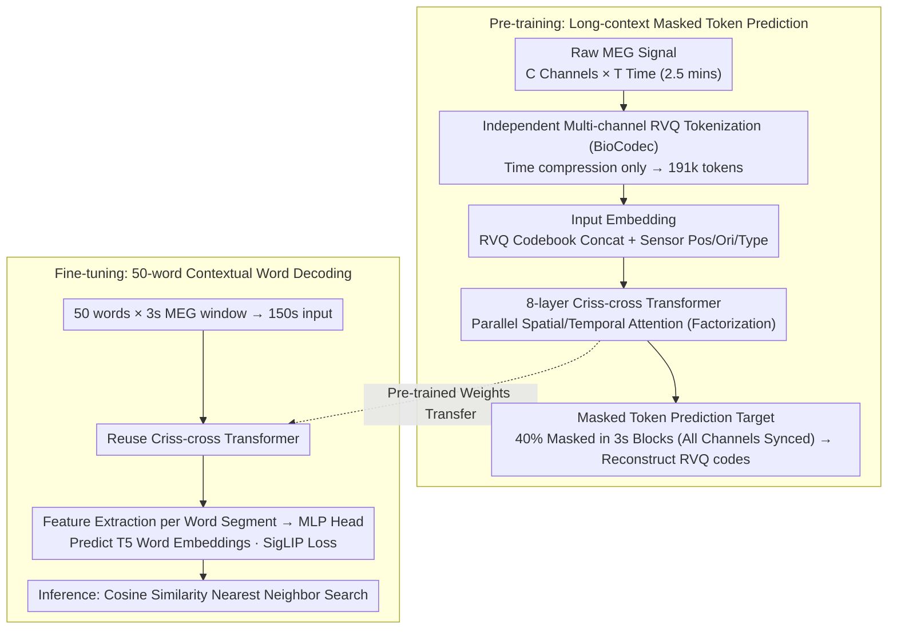

# MEG-XL: Data-Efficient Brain-to-Text via Long-Context Pre-Training

**Conference**: ICML 2026  
**arXiv**: [2602.02494](https://arxiv.org/abs/2602.02494)  
**Code**: Open-sourced (paper states release of code + weights)  
**Area**: Brain-Computer Interface / Neural Decoding / Foundation Models  
**Keywords**: Brain-to-Text, Long-Context Pre-training, MEG, criss-cross attention, masked token prediction

## TL;DR
MEG-XL utilizes a 2.5-minute (191k tokens) MEG context for masked token pre-training (5–300$\times$ longer than previous methods), then fine-tunes on a 50-word Brain-to-Text task. With only 1 hour of data, it achieves the decoding accuracy of SOTA supervised methods using 50 hours of data and significantly outperforms all existing brain foundation models.

## Background & Motivation

**Background**: Brain-to-Text (B2T) decoding is a core direction in Brain-Computer Interface (BCI), categorized into invasive (cortical electrodes, achieving usable accuracy in Moses 2021, Willett 2023, Card 2024, etc.) and non-invasive (MEG/EEG, lower barrier but weaker signals). Representative non-invasive works include Défossez et al. (2022) for 1-second MEG speech decoding and d'Ascoli et al. (2025), which expanded context to the sentence level (150s) for word decoding. Brain foundation models (LaBraM, BIOT, EEGPT, BrainOmni, CBraMod) perform masked pre-training on short windows of 5–30 seconds.

**Limitations of Prior Work**: (1) Supervised methods rely on approximately 50 hours of training data per subject, which is impractical for paralyzed patients who cannot provide long periods of training recordings. (2) Existing brain foundation models pre-train on short windows ($\leq 10$s), creating a severe mismatch with the long-term neurolinguistic structures (phrases, sentences, discourse) required downstream; recent analysis (Yang 2026) shows these FMs underperform supervised methods in low-data scenarios. (3) Context expansion is hindered by computational bottlenecks: standard transformer attention is $\mathcal{O}((CT')^2)$, causing VRAM overflow with multi-channel and long-duration sequences.

**Key Challenge**: Neural activity contains language-related structures spanning tens of seconds to minutes (phrase aggregation, syntax, discourse coherence), but short-window pre-trained models can neither perceive nor utilize these long-range dependencies. Simultaneously, "fast adaptation to new subjects with minimal data," the most critical requirement for clinical deployment, remains a blind spot for short-context FMs.

**Goal**: (i) Construct a framework capable of masked pre-training on minute-level MEG contexts without exceeding VRAM limits; (ii) Verify whether long-context pre-training outperforms SOTA supervised methods and existing FMs in low-data downstream scenarios (especially contextual word decoding); (iii) Explain the utility of long context—specifically, whether it learns selective and hierarchical attention.

**Key Insight**: Paying homage to Transformer-XL, the authors view "neural data as long documents," suggesting that pre-training in long contexts, similar to LMs, is necessary to learn long-range statistical priors. The computational bottleneck is resolved using criss-cross factorized attention (Wang 2025), decoupling and parallelizing attention across temporal and channel dimensions.

**Core Idea**: Each channel is independently tokenized using BioCodec (rank 12 temporal compression) and fed into an 8-layer criss-cross transformer. The model performs masked prediction on 40% of 3-second blocks within a 2.5-minute MEG window, forcing the learning of dependencies spanning minutes. Fine-tuning for word decoding then yields a data-efficient B2T model.

## Method

### Overall Architecture
MEG-XL treats "neural data as long documents," first performing masked pre-training on a 2.5-minute (191k tokens) MEG context to learn long-range statistical priors, then fine-tuning on a 50-word Brain-to-Text task. During pre-training, raw MEG $\mathbf{X}\in\mathbb{R}^{C\times T}$ is compressed into discrete tokens via per-channel independent frozen BioCodec. After concatenating position/orientation/type embeddings, tokens pass through an 8-layer criss-cross transformer. 40% of tokens are uniformly masked in 3-second blocks for the model to predict masked RVQ codes. During fine-tuning, following d'Ascoli's task setup, 50 words $\times$ 3s MEG windows are concatenated into a 150s input to predict T5 word embeddings for each segment. An MLP head is trained using SigLIP contrastive loss, and inference is performed via nearest-neighbor word retrieval based on cosine similarity. Both pre-training and fine-tuning share the same criss-cross transformer backbone.

### Key Designs

**1. Independent Multi-channel RVQ Tokenization (BioCodec) + Residual Codebook Embedding: Temporal compression only**

To perform masked prediction on long contexts, continuous MEG signals are first compressed into discrete tokens, reducing sequence length and providing prediction targets. BioCodec (a neural audio codec-style tokenizer trained on EEG) is used for independent Residual Vector Quantization (RVQ) per channel: $Q=6$ levels of residual quantization, each with codebook $V=256$, and 12$\times$ temporal downsampling. This compresses 50Hz $\times$ 150s $\times$ hundreds of channels into 191k tokens. Input embeddings are formed by concatenating vectors from each codebook level $\mathbf{e}^{(q)}_{z_{c,q,t}}$ and projecting them: $\mathbf{h}^{(0)}_{c,t}=\mathbf{W}_{proj}[\mathbf{e}^{(1)};...;\mathbf{e}^{(Q)}]$. Fourier features $\gamma(\mathbf{v})=[\cos(2\pi\mathbf{Bv}),\sin(2\pi\mathbf{Bv})]$ for sensor positions, orientations, and type embeddings are added. Crucially, only time is compressed: compared to BrainTokenizer’s simultaneous spatial-temporal compression, temporal-only compression preserves reconstruction quality and avoids discarding task-relevant information early. RVQ captures both slow dynamics and high-frequency details more effectively than single-level VQ for high-frequency time-series data.

**2. 2.5-minute Ultra-long Context + Criss-cross Factorized Attention: Fitting minute-level vision into a single GPU**

Linguistic structures in the brain (phrase aggregation, syntax, discourse coherence) span seconds to minutes, yet existing brain foundation models pre-train on short windows ($\leq 10$s), structurally precluding long-range dependencies. Extending context directly hits a computational wall: standard attention complexity is $\mathcal{O}((CT')^2)$. This study employs criss-cross attention to decouple spatial and temporal dimensions by splitting the feature dimension in half—one half undergoes SpatialAttn (independent cross-channel attention per timestep, $\mathcal{O}(T'\cdot C^2)$), and the other half undergoes TemporalAttn (independent cross-temporal attention per channel with RoPE encoding, $\mathcal{O}(C\cdot T'^2)$). The results are concatenated along the channel dimension followed by Residual + RMSNorm + SELU FFN. Total complexity is reduced from $\mathcal{O}((CT')^2)$ to $\mathcal{O}(C\cdot T'^2+T'\cdot C^2)$, allowing the 191k token sequence to fit on a single GPU. This factorization works because brain signals naturally exhibit separability between temporal correlation (sensor-specific) and spatial correlation (simultaneous), making decoupling a strong approximation.

**3. 3-second Large Block Masking + All-channel Synchronous Masking: Blocking interpolation shortcuts to force long-range modeling**

MEG exhibits high temporal autocorrelation. If only short segments are masked, the model can exploit neighbor interpolation to fill gaps without learning long-range dependencies. MEG-XL randomly selects 3-second blocks until 40% of tokens are masked, and **synchronously masks all channels** at chosen timesteps using a mask embedding. The model must predict RVQ codes $p(z_{c,q,t}\mid\mathbf{X}_{\backslash\mathcal{M}})=\text{softmax}(\mathbf{W}_q\mathbf{h}^{(L)}_{c,t})$ at masked positions, with the loss defined as:

$$\mathcal{L}=-\frac{1}{|\mathcal{M}|CQ}\sum_t\sum_c\sum_q\log p(z_{c,q,t}\mid\mathbf{X}_{\backslash\mathcal{M}}).$$

The 3-second block size is intentionally chosen to cover typical durations of neural responses to words (Kutas & Federmeier 2011). Synchronous masking across all channels disrupts both "temporal neighbor interpolation" and "channel neighbor interpolation" shortcuts, forcing the model to model long-term structures. The 40% mask rate was empirically tuned—higher than BERT's 15%, between MAE’s 75% and wav2vec 2.0’s 49%.

### Loss & Training
Pre-training utilizes approximately 300 hours of MEG data (CamCAN + MOUS + SMN4Lang), covering resting state, motor, and speech tasks across hundreds of subjects. The objective is masked token prediction via cross-entropy. Channel masking handles padding for varying channel counts across MEG systems. Fine-tuning uses SigLIP contrastive loss with a word embedding regression head, involving end-to-end fine-tuning of the transformer and MLP head. Inference is based on cosine similarity nearest-neighbor word retrieval.

## Key Experimental Results

### Main Results

| Model | Params | MEG-MASC (13%) | Armeni (13%) | LibriBrain (13%) | MEG-MASC (100%) | Armeni (100%) | LibriBrain (100%) |
|---|---|---|---|---|---|---|---|
| BioCodec baseline | 1.0M | 19.8 | 20.0 | 19.9 | 31.2 | 37.1 | 41.9 |
| EEGPT | 4.7M | 19.6 | 20.3 | 20.3 | 26.3 | 20.8 | 22.9 |
| BIOT | 3.2M | 20.0 | 20.2 | 20.6 | 31.3 | 35.7 | 45.6 |
| BBL | 15M | 21.5 | 22.3 | 32.1 | 35.9 | 39.1 | 49.9 |
| BrainOmni | 8.4M | 18.7 | 21.0 | 29.7 | 19.1 | 62.3 | 63.0 |
| LaBraM | 5.8M | 33.2 | 26.3 | 40.3 | 31.1 | 42.0 | 47.7 |
| **MEG-XL (Ours)** | **20M** | **47.0** | **54.9** | **57.3** | **46.4** | **61.2** | **63.0** |

In low-data (13%) scenarios, MEG-XL outperforms the next best (LaBraM) by 13–28 points. With full data, it is comparable to or better than BrainOmni. BrainOmni's performance drops to 19.1% on MEG-MASC (shallow, multi-subject), indicating that existing FMs fail in "shallow data, multi-subject" scenarios critical for clinical use.

### Ablation Study

| Configuration | Effect |
|---|---|
| Random init MEG-XL (No pre-training) | Performance near supervised baseline, proving gains come from pre-training, not just architecture. |
| PT Context 5s → 30s → 100s → 150s | Monotonic improvement in word decoding linear probe, saturating around 100s. |
| Full-context vs Matched-context Inference | Results almost overlap → providing longer context during inference is useless unless pre-trained on it. |
| Masked prediction (Zero-shot) | Monotonic improvement from 5s to 150s, not yet saturated—longer context might yield further gains. |
| Attention Analysis | Long-context models show local attention in early layers, global integration in deep layers, and lower attention entropy. |

### Key Findings
- **Breakthrough in Data Efficiency**: MEG-XL achieves accuracy with 1 hour of data that supervised SOTA requires 50 hours to reach (approx. 50$\times$ data efficiency).
- Long context learns "when to look far vs. when to look near"—a selective hierarchical attention that short-context models, which use uniform attention from the first layer, never learn.
- In "deep single-subject" data like LibriBrain, supervised methods (d'Ascoli) eventually surpass MEG-XL when data exceeds 2.5 hours, identifying the boundary where subject-specific data overtakes pre-training.
- MEG-XL significantly outperforms supervised methods in sparse-data scenarios (e.g., +25 points on MEG-MASC), which is the most critical scenario for clinical BCI deployment.

## Highlights & Insights
- "Long context is a learned capability, not a given capability" is the most significant insight—providing long context only at inference is useless; it must be provided during pre-training. This echoes LM length generalization literature.
- The success of criss-cross attention on brain signals suggests that highly structured spatial-temporal data can generally use "spatial-temporal factorized attention" to bypass quadratic complexity. This is applicable to any $C\times T$ signals like fMRI, ECoG, or sensor networks.
- In clinical contexts, "cross-subject pre-training replacing intra-subject deep training" is a paradigm shift—reducing BCI training requirements from 50 hours of a new user's time to 1–2 hours.
- 3s large blocks + all-channel synchronous masking is a clever design—it simultaneously disables "temporal" and "channel" shortcuts, forcing genuine semantic-level modeling.

## Limitations & Future Work
- Only perceived speech (listening to audiobooks) was tested; imagined speech, which is how paralyzed patients actually use BCI, remains untouched.
- The retrieval vocabulary size is only 50 (top-250 trends are similar), still orders of magnitude away from the open vocabulary (thousands of words) needed for clinical use.
- Interpretability gains from long context (hierarchical attention) are currently statistical; clear evidence mapped to specific linguistic structures (syllables/words/phrases) is needed.
- VRAM remains a bottleneck—150s is the limit for current GPUs, preventing further verification of benefits from even longer contexts.
- Pre-training data consists of research datasets from healthy individuals, which may have a domain shift from the MEG signals of paralyzed patients.

## Related Work & Insights
- **vs d'Ascoli et al. (2025) (Supervised SOTA)**: They first expanded MEG input to 150s sentence-level context but relied on supervised training; MEG-XL uses the same length but reduces data needs via self-supervised pre-training by 1–2 orders of magnitude.
- **vs LaBraM / EEGPT / BIOT / BrainOmni**: These brain FMs pre-train on $\leq 30$s windows and collapse in low-data scenarios; MEG-XL qualitatively transforms performance by extending context to minutes.
- **vs CBraMod / BrainOmni (Criss-cross relatives)**: BrainOmni also uses criss-cross attention but on 30s windows; this paper proves the true value of factorized attention emerges only when windows are extended to 150s.
- **vs Transformer-XL (Naming homage)**: Directly ports the LM long-context paradigm to neural data and demonstrates that similar laws apply.

## Rating
- Novelty: ⭐⭐⭐⭐ First to combine minute-level context, RVQ tokenization, and criss-cross attention for B2T with significant results.
- Experimental Thoroughness: ⭐⭐⭐⭐⭐ 3 MEG datasets + 6 FM baselines + supervised SOTA + linear probing + zero-shot prediction + attention analysis; complete chain of evidence.
- Writing Quality: ⭐⭐⭐⭐⭐ Excellent narrative—analogizing LM long-context success to neural data; theoretical framework, empirical evidence, and mechanism analysis are well-integrated.
- Value: ⭐⭐⭐⭐⭐ Substantial push for non-invasive BCI clinical feasibility; the "long context as a learned capability" principle is methodologically significant for neural foundation models.

<!-- RELATED:START -->

## Related Papers

- [\[CVPR 2026\] Ultrasound-CLIP: Semantic-Aware Contrastive Pre-training for Ultrasound Image-Text Understanding](../../CVPR2026/medical_imaging/ultrasound-clip_semantic-aware_contrastive_pre-training_for_ultrasound_image-tex.md)
- [\[CVPR 2025\] Multi-Resolution Pathology-Language Pre-training Model with Text-Guided Visual Representation](../../CVPR2025/medical_imaging/multi-resolution_pathology-language_pre-training_model_with_text-guided_visual_r.md)
- [\[CVPR 2026\] Meta-learning In-Context Enables Training-Free Cross Subject Brain Decoding](../../CVPR2026/medical_imaging/meta-learning_in-context_enables_training-free_cross_subject_brain_decoding.md)
- [\[ECCV 2024\] TIP: Tabular-Image Pre-training for Multimodal Classification with Incomplete Data](../../ECCV2024/medical_imaging/tip_tabular-image_pre-training_for_multimodal_classification_with_incomplete_dat.md)
- [\[NeurIPS 2025\] BrainOmni: A Brain Foundation Model for Unified EEG and MEG Signals](../../NeurIPS2025/medical_imaging/brainomni_a_brain_foundation_model_for_unified_eeg_and_meg_signals.md)

<!-- RELATED:END -->
