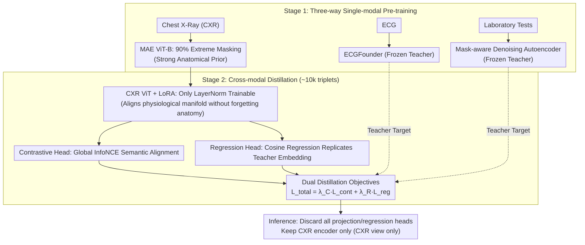

# PaCX-MAE: Physiology-Augmented Chest X-Ray Masked Autoencoder

**Conference**: ICML 2026  
**arXiv**: [2606.01537](https://arxiv.org/abs/2606.01537)  
**Code**: https://github.com/Lyce24/PACX-MAE (Available)  
**Area**: Medical Imaging / Self-supervised Representation / Cross-modal Distillation  
**Keywords**: Chest X-ray, MAE, Physiological Signal Distillation, ECG, Cross-modal Alignment

## TL;DR
PaCX-MAE builds upon an MAE pre-trained chest X-ray ViT, using LoRA fine-tuning to treat ECG and laboratory test encoders as frozen teachers. Through dual distillation involving InfoNCE contrastive loss and cosine regression, "invisible physiological context" is injected into the image-only encoder. During inference, the model requires only chest X-rays to outperform the same-architecture MAE baseline across 9 downstream benchmarks, with significant gains on physiology-dependent tasks (MedMod +2.7 AUROC, VinDr +6.5 F1).

## Background & Motivation

**Background**: Self-supervised representation learning in medical imaging generally follows two paths: pure contrastive (MoCo/DINO series) or pure reconstruction (MAE series). MAE on CheXpert/MIMIC has become a strong baseline for Chest X-ray (CXR) representation because reconstruction forces the model to memorize fine-grained anatomical structures rather than just learning global invariance. While multimodal methods can integrate ECG, lab tests, and cardiac waveforms to characterize patient dynamic states, they assume all modalities are available during inference.

**Limitations of Prior Work**: In clinical reality, especially in emergency scenarios, the chest X-ray is often the **only modality available immediately**—ECG leads might not be connected, and lab results are pending. Consequently, multimodal models cannot be deployed due to missing modalities, while unimodal models remain blind to the systemic physiological context behind CXR appearances (e.g., pulmonary vascular redistribution corresponding to fluid overload, or cardiomegaly corresponding to heart failure). These physiological states exist as "implicit fingerprints" in anatomical images, but standard vision pre-training is not guided to focus on them.

**Key Challenge**: Chest X-rays inherently encode substantial physiological information, but (i) label scarcity prevents direct supervised learning, and (ii) multimodal alignment is hindered by deployment constraints requiring paired data during inference. An ideal solution should use paired data only during pre-training, while inference remains CXR-only.

**Goal**: To decompose the problem into two sub-problems: (a) how to "embed" dense physiological structures from ECG/labs into the visual encoder; (b) how to do so without damaging the anatomical details already learned by MAE.

**Key Insight**: Borrowing from privileged information and cross-modal knowledge distillation (Lopez-Paz, reports distillation by Tiu/Boecking, missing MRI sequence distillation by Dou), physiological modalities are treated as privileged signals. However, the teachers are not text or another image, but two paths of dense physiological encodings: ECG and laboratory tests.

**Core Idea**: A two-stage curriculum—first, individual unimodal pre-training to obtain strong teachers; then, "Contrastive + Regression" dual-target distillation using LoRA on a frozen visual backbone to align the physiological manifold with the visual manifold. During inference, all heads are discarded, leaving only the CXR encoder.

## Method

### Overall Architecture
The core objective is to enable a visual encoder, which only sees CXRs during inference, to perceive "invisible physiological context" like ECG and lab tests. This is achieved via a two-stage curriculum. Stage 1 involves independent pre-training of three unimodal encoders: CXR using MAE (for strong anatomical priors), ECG using ECGFounder (a Transformer pre-trained on 10 million ECGs), and laboratory tests using a mask-aware denoising autoencoder (modeling both numerical values and structured missingness). Stage 2 performs cross-modal distillation on approximately 10k CXR-ECG-Lab triplets from Symile-MIMIC: freezing ECG/Lab encoders as teachers and attaching LoRA to the CXR ViT, enabling it to match the teachers' embeddings via contrastive and regression heads. During downstream inference, all projection/regression heads are discarded, leaving only the vision backbone.

### Key Designs

**1. MAE Strong Anatomical Prior + 90% Extreme Masking: Understanding global anatomy before reading physiology**

To extract physiological states from CXRs, the model must first understand global anatomical structures like the heart silhouette, mediastinum, and diaphragm. The authors adopt ViT-B/MAE on CheXpert with a mask rate of $0.90$ (significantly higher than the $0.75$ common in natural image MAE). This extreme sparsity forces the model to infer overall anatomical semantics from very few visible patches rather than relying on local texture shortcuts. MAE was intentionally chosen over contrastive learning because subtle low-contrast intensity cues (like effusion density) can be washed out by data augmentation in contrastive learning. Furthermore, MAE naturally preserves fine-grained intensity information, providing a foundation for subsequent physiological value regression.

**2. LoRA + LayerNorm-only Training: Minimizing backbone changes to avoid catastrophic forgetting**

The dense anatomical priors learned in Stage 1 are invaluable, particularly for pixel-level fidelity in segmentation tasks. Since Stage 2 uses only about 10k paired samples, full-parameter fine-tuning could easily bias the backbone and cause anatomical knowledge to be forgotten. The strategy is to keep the vision backbone largely frozen: only LayerNorm layers are unfrozen to allow for slight feature distribution shifts, and LoRA low-rank matrices are injected into the `qkv` of attention blocks and `fc` of FFN modules. This reduces trainable parameters to <1% of the backbone. Consequently, the visual manifold remains stable while the model learns the narrow path to bridge with the physiological manifold. This explains why PaCX maintains identical performance to MAE on CXL-Seg / COVID-QU-Ex (IoU 0.996 / 0.942).

**3. Dual Distillation Objective (Contrastive + Regression): Global semantic alignment and dense feature replication**

The total loss is a weighted sum of two terms:

$$\mathcal{L}_{total}=\lambda_C \mathcal{L}_{contrastive}+\lambda_R \mathcal{L}_{regression}$$

The contrastive term $\mathcal{L}_C$ projects CXR/ECG/Lab onto a shared space for alignment using symmetric InfoNCE with a learnable temperature. It **globally collects negative samples** across all distributed GPUs to maximize negative diversity and mitigate intra-batch bias, complemented by label smoothing ($\epsilon=0.02$) to suppress overfitting to noisy medical labels. The regression term $\mathcal{L}_R$ uses modality-specific heads to directly predict the teachers' **unprojected** raw embeddings, aiming for $1-\cos(\hat{y},y)$. Ablation shows both are essential: using only $\mathcal{L}_{reg}$ leads to collapse (MedMod F1 drops from 0.253 to 0.131), while using only $\mathcal{L}_{cont}$ approaches full performance but lags on VinDr F1 by ~1.5 points.

### Loss & Training
Stage 1 trains three modalities independently: MAE uses the full CheXpert set, ECG uses pre-trained ECGFounder weights, and Lab uses a mask-aware DAE on MIMIC lab tests. Stage 2 jointly optimizes the total loss on Symile-MIMIC, keeping the visual backbone mostly frozen (unfreezing LN + LoRA + two heads). Teacher encoders are frozen throughout to prevent degenerate co-adaptation, ensuring knowledge is transferred rather than jointly relearned. Downstream evaluation is performed via linear probing (frozen backbone, training only a linear head).

## Key Experimental Results

### Main Results (Linear probing across 9 benchmarks)

| Dataset | Metric | ImageNet | MAE | PaCX (Ours) | Gain |
|---------|--------|----------|-----|-------------|------|
| TB | AUROC / F1 | 0.887 / 0.818 | 0.899 / 0.814 | 0.910 / 0.846 | +1.1 / +3.2 |
| CheXchoNet | AUROC / F1 | 0.728 / 0.147 | 0.788 / 0.215 | 0.803 / 0.266 | +1.5 / +5.1 |
| VinDr-CXR | AUROC / F1 | 0.751 / 0.097 | 0.847 / 0.191 | 0.871 / 0.256 | +2.4 / +6.5 |
| NIH-14 | AUROC / F1 | 0.721 / 0.048 | 0.772 / 0.113 | 0.783 / 0.115 | +1.1 / +0.2 |
| MedMod | AUROC / F1 | 0.612 / 0.091 | 0.695 / 0.231 | 0.722 / 0.253 | +2.7 / +2.2 |
| ChestX6 | AUROC / F1 | 0.983 / 0.876 | 0.988 / 0.905 | 0.989 / 0.906 | +0.1 / +0.1 |
| CXL-Seg | IoU / Dice | 0.984 / 0.992 | 0.996 / 0.998 | 0.996 / 0.998 | 0 / 0 |
| COVID-QU-Ex | IoU / Dice | 0.894 / 0.943 | 0.942 / 0.970 | 0.942 / 0.970 | 0 / 0 |
| QaTa-COV19 | IoU / Dice | 0.622 / 0.766 | 0.726 / 0.841 | 0.715 / 0.833 | -1.1 / -0.8 |

### Ablation Study (Three physiology-dependent benchmarks)

| Configuration | CheXchoNet AUC/F1 | MedMod AUC/F1 | VinDr AUC/F1 | Description |
|---------------|-------------------|---------------|--------------|-------------|
| ECG Teacher Only | 0.801 / 0.296 | 0.717 / 0.243 | 0.871 / 0.233 | Lacks Lab, VinDr F1 -2.3 |
| Lab Teacher Only | 0.795 / 0.275 | 0.721 / 0.245 | 0.875 / 0.248 | Lacks ECG, CheXchoNet F1 drops |
| $\mathcal{L}_{cont}$ Only | 0.799 / 0.273 | 0.722 / 0.258 | 0.866 / 0.241 | No regression, VinDr F1 -1.5 |
| $\mathcal{L}_{reg}$ Only | 0.789 / 0.227 | 0.673 / 0.131 | 0.843 / 0.130 | No contrastive, global collapse |
| Full PaCX | 0.803 / 0.266 | 0.722 / 0.253 | 0.871 / 0.256 | Most stable |

### Key Findings
- **Physiology vs. Anatomy**: PaCX wins decisively on physiology-dependent tasks (VinDr, CheXchoNet, MedMod) and matches MAE on segmentation. This confirms that the LoRA + frozen backbone strategy **successfully avoids anatomical forgetting**, although pure texture-based segmentation tasks do not benefit from physiological priors.
- **Low-Data Gains**: Gains are most significant in extremely low-data regimes. with 1% training data, CheXchoNet AUROC increases by +8.2, while MedMod and VinDr see ~+5 gains. Physiological priors act as a strong regularizer.
- **Zero-shot Alignment**: Cosine similarity with ECG/Lab teacher embeddings improves from 0.204/0.239 (MAE) to 0.229/0.252, and R@5 is higher, indicating that distillation truly "pulled" the visual representation toward the physiological manifold.
- **Attention Rollout**: Visualization shows PaCX shifting its attention from bone structures (like clavicles) to soft tissues such as the heart shadow and mediastinum—qualitative evidence that the model learns to "look at the places where ECG signals originate."
- **Loss Antithesis**: Using only regression leads to **complete collapse** (MedMod F1 0.131), suggesting pure regression leads the model to trivial solutions; contrastive loss is necessary to provide discriminative pressure.

## Highlights & Insights
- **The "Phantom Modality" Framework**: Treating invisible physiological states as privileged information to be distilled into the image encoder is clever. This approach can be generalized to any medical scenario where diverse modalities exist at training but only one is available at inference (e.g., distilling pathology reports into X-rays or waveforms into imaging).
- **The MAE × LoRA × Dual-Distillation Combo**: MAE provides the anatomical prior, LoRA ensures no forgetting, and the dual objective ensures both global and dense learning. This combination is a solid engineering blueprint for cross-modal alignment on small paired datasets.
- **Practical Engineering**: Using global negative samples and label smoothing to handle medical noise and small batch sizes for paired data is a high-ROI engineering trick.
- **Unprojected Regression**: Predicting "unprojected" teacher embeddings rather than projected ones preserves the teacher's original manifold structure information—a subtle but important detail.

## Limitations & Future Work
- **Single-center Data**: The study relies only on paired data from MIMIC-IV (one hospital), leaving cross-center generalization and phenotypic diversity unverified.
- **Global Alignment vs. Local Correspondence**: Currently, alignment is between a whole image and a whole ECG/Lab vector. It does not model fine-grained "region-level" mappings like "ST-segment elevation ↔ specific cardiac region."
- **Small Paired Dataset**: While ~10k triplets are managed via the curriculum and LoRA, the scale is still small compared to million-scale image-only datasets.
- **Modality Scope**: Only ECG and Lab tests are considered; richer but harder-to-get signals like PPG or respiratory waveforms are excluded.
- **Segmentation Regression**: The slight performance dip on QaTa-COV19 was not deeply analyzed; it may suggest distillation side effects when physiological priors conflict with pathological patterns.

## Related Work & Insights
- **vs. Standard CXR MAE** (Xiao 2023 / Zhou 2023 / Huang 2023): These focus on unimodal reconstruction; Ours adds physiology distillation on top of MAE, gaining on physiology-dependent tasks without sacrificing anatomy.
- **vs. CLIP-style Alignment** (BioViL series by Tiu/Boecking): They align images with report text (semantic level). Ours aligns with dense physiological numerical manifolds (more continuous and physical), which is a harder but more grounded objective.
- **vs. Cross-modal Privileged Distillation** (Lopez-Paz 2016): Our work is an instantiation of this paradigm in the medical CXR + ECG/Lab context.
- **vs. ECGFounder** (Li 2025): Utilizing a strong ECG foundation model as a frozen teacher is an effective "Foundation-Model-as-a-Teacher" strategy, treating specialized models as ready-made label sources.

## Rating
- **Novelty**: ⭐⭐⭐⭐ While privileged distillation is not new, the systematic implementation of MAE + LoRA + dual distillation on CXR + ECG + Lab triplets is a robust engineering contribution.
- **Experimental Thoroughness**: ⭐⭐⭐⭐ Covers 9 benchmarks, low-data ablations, loss/modality ablations, and zero-shot retrieval. Weaknesses include single-center data and the focus on linear probing.
- **Writing Quality**: ⭐⭐⭐⭐ Motivation is clear and the two-stage curriculum narrative is fluent. Design justifications are well-reasoned despite fewer formulas.
- **Value**: ⭐⭐⭐⭐ Provides a reproducible recipe for a common medical AI deployment pain point (missing modalities). Open-source code and public data lower the barrier to entry.

<!-- RELATED:START -->

## Related Papers

- [\[NeurIPS 2025\] Variational Autoencoder with Normalizing Flow for X-ray Spectral Fitting](../../NeurIPS2025/medical_imaging/variational_autoencoder_with_normalizing_flow_for_x-ray_spectral_fitting.md)
- [\[CVPR 2026\] Phrase-grounded APO for Improving Chest X-ray Report Generation](../../CVPR2026/medical_imaging/phrase-grounded_apo_for_improving_chest_x-ray_report_generation.md)
- [\[CVPR 2026\] DARC: Dual Adjustment Reasoning with Counterfactuals for Trustworthy Chest X-ray Classification](../../CVPR2026/medical_imaging/darc_dual_adjustment_reasoning_with_counterfactuals_for_trustworthy_chest_x-ray_.md)
- [\[AAAI 2026\] A Disease-Aware Dual-Stage Framework for Chest X-ray Report Generation](../../AAAI2026/medical_imaging/a_disease-aware_dual-stage_framework_for_chest_x-ray_report_.md)
- [\[AAAI 2026\] PriorRG: Prior-Guided Contrastive Pre-training and Coarse-to-Fine Decoding for Chest X-ray Report Generation](../../AAAI2026/medical_imaging/priorrg_prior-guided_contrastive_pre-training_and_coarse-to-fine_decoding_for_ch.md)

<!-- RELATED:END -->
