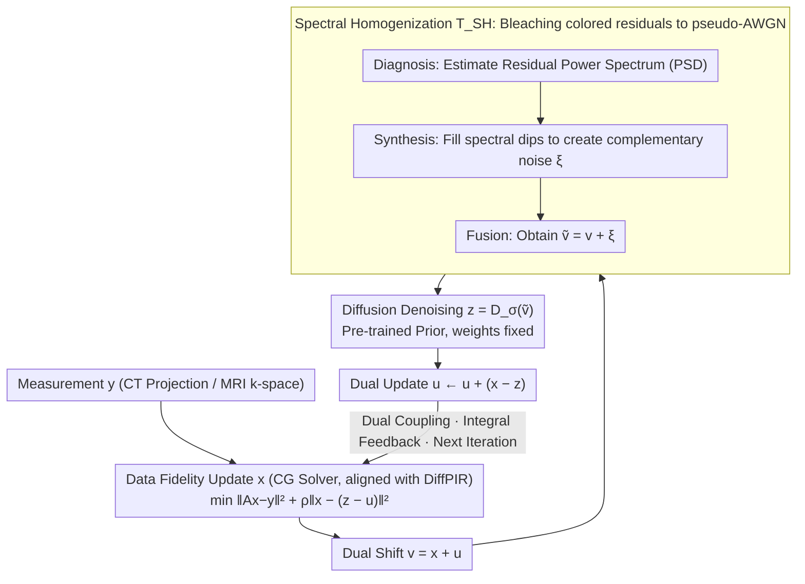

# Plug-and-Play Diffusion Meets ADMM: Dual-Variable Coupling for Robust Medical Image Reconstruction

**Conference**: ICML 2026  
**arXiv**: [2602.23214](https://arxiv.org/abs/2602.23214)  
**Code**: https://github.com/duchenhe/DC-PnPDP (Available)  
**Area**: Medical Image Reconstruction / Diffusion Models / Inverse Problems  
**Keywords**: PnP Diffusion Prior, ADMM Dual Variable, Spectral Whitening, CT/MRI Reconstruction, Steady-state Bias

## TL;DR
This paper reintroduces ADMM dual variables into the PnP diffusion prior loop, utilizing "duality" to provide integral feedback that eliminates steady-state bias. A frequency-domain Spectral Homogenization module is employed to whiten structured dual residuals into pseudo-AWGN, preventing the triggering of OOD hallucinations in the diffusion denoiser. It achieves SOTA fidelity and approximately 3× inference acceleration in sparse-view/limited-angle CT and accelerated MRI.

## Background & Motivation

**Background**: The mainstream approach for solving medical inverse problems ($y=Ax+n$) in CT/MRI is the PnP Diffusion Prior (PnPDP)—alternating between data consistency subproblems and diffusion denoising prior subproblems. Common implementations are based on Half-Quadratic Splitting (HQS) or proximal gradients, such as DiffPIR, DDS, DDNM, DAPS, and SITCOM.

**Limitations of Prior Work**: From a control theory perspective, the authors point out that HQS/PG-type solvers are "memoryless" operators—each iteration only considers the instantaneous data fidelity gradient, which is equivalent to a Proportional (P) controller. A P controller cannot eliminate steady-state errors when the system encounters "strong resistance" (heavy undersampling or strong noise), causing the reconstruction to stop at a **biased equilibrium point** that neither strictly satisfies physical measurements nor lies on the prior manifold. In medical scenarios, this bias directly impacts clinical reliability.

**Key Challenge**: Classical optimization theory offers a solution: adding a dual variable (Lagrange multiplier), which integrates the primal residuals and is equivalent to an Integral (I) controller, driving $x \to z$ to strictly satisfy constraints. However, directly reintroducing the dual $u^{(k)}$ into the diffusion PnP loop triggers a second conflict: $u$ accumulates "structured" residuals (directional streaks in CT, coherent aliasing in MRI) with colored spectra. Since diffusion denoisers are trained only on AWGN, the OOD input $v^{(k+1)}=x^{(k+1)}+u^{(k)}$ causes the denoiser to "hallucinate" artifacts as semantic content.

**Goal**: (1) Reconnect dual variables to PnP diffusion; (2) Ensure the input perceived by the diffusion denoiser remains AWGN-like.

**Key Insight**: Decouple the "geometric role" and the "statistical role"—the dual variable handles geometric convergence, while a frequency-domain whitening module "bleaches" the colored residuals accumulated by the dual variable into pseudo-AWGN.

**Core Idea**: Utilize ADMM duality to provide integral feedback for eliminating steady-state bias, then use Spectral Homogenization to fill "spectral dips" in the frequency domain. This ensures the power spectrum of the denoiser input fits white noise, reconciling the conflict between "geometric strictness" and "statistical compatibility."

## Method

### Overall Architecture
The DC-PnPDP framework strictly follows the three-step ADMM iteration but inserts a frequency-domain adaptation module $T_{\text{SH}}$ before the second step. One iteration cycle is as follows (Algorithm 1):

1. **Data Fidelity Update**: $x^{(k+1)}=\arg\min_x \|Ax-y\|_2^2+\rho\|x-z^{(k)}+u^{(k)}\|_2^2$ (solved via closed-form or CG);
2. **Dual Shift**: $v^{(k+1)} = x^{(k+1)} + u^{(k)}$;
3. **Spectral Homogenization**: $\tilde v^{(k+1)} = T_{\text{SH}}(v^{(k+1)}; z^{(k)}, \sigma_t)$;
4. **Diffusion Denoising**: $z^{(k+1)} = D_\sigma(\tilde v^{(k+1)}, t)$;
5. **Dual Update**: $u^{(k+1)} = u^{(k)} + (x^{(k+1)} - z^{(k+1)})$.

The noise schedule $\sigma_t$ follows the linear annealing of the EDM framework. A deliberate "controlled variable" design is used: the data fidelity step (parallel-beam projection for CT via torch-radon, Cartesian undersampling for MRI, unified CG solver) is identical to the strongest baseline, DiffPIR. Structural differences reside **strictly** in "maintaining the dual $u$" and "inserting $T_{\text{SH}}$," allowing ablation studies to cleanly attribute gains to the DC and SH modules without solver-induced interference.

### Key Designs

**1. Dual-Coupled Iteration: Dual variables as "integral memory" to eliminate steady-state bias**

Existing HQS/PG-based PnP diffusion solvers assume a dual $u \equiv 0$, effectively removing the integral action of ADMM. This inevitably leads to a biased equilibrium under severe undersampling. This work explicitly updates $u^{(k+1)}=u^{(k)}+(x^{(k+1)}-z^{(k+1)})$ after each iteration, accumulating the consensus error between $x$ and $z$ as a corrective force. In the next update for $x$, $u$ enters the center of the quadratic term $\|x-z^{(k)}+u^{(k)}\|^2$, pressuring the variables to align. This represents an upgrade from a Proportional controller to a PI (Proportional-Integral) controller, where the integral term suppresses steady-state error even under "high resistance" (heavy undersampling). The gain is significant: a $+4.55$ dB improvement on LACT-90 just by enabling the dual variable.

**2. Spectral Homogenization (SH): Bleaching colored residuals to pseudo-AWGN for denoiser compatibility**

While dual variables are beneficial, they accumulate structured residuals (streaks in CT, aliasing in MRI) with colored spectra. Since diffusion denoisers are trained on AWGN, inputting $v^{(k+1)}=x^{(k+1)}+u^{(k)}$ results in OOD artifacts being treated as semantic content. Since physical artifacts are concentrated in specific frequency bands, this method does not add noise in the spatial domain; instead, it fills energy into "spectral dips" in the frequency domain. Specifically: first, **Diagnosis** estimates the PSD $\hat S_r(\omega) = (|\mathcal F(r)(\omega)|^2)*K_\delta$ using a proxy residual $r^{(k+1)}=v^{(k+1)}-z^{(k)}$. Second, **Synthesis** defines spectral gaps $\Delta S(\omega)=\max(\epsilon, \sigma_t^2(HW) - \hat S_r(\omega))$ and generates complementary noise $\xi^{(k+1)} = \mathcal F^{-1}(\sqrt{\Delta S(\omega)} \odot e^{i\angle\mathcal F(n)})$ using random phases from white noise $n$. Finally, **Fusion** yields $\tilde v^{(k+1)} = v^{(k+1)} + \xi^{(k+1)}$. Proposition 4.1 provides a second-order spectral consistency guarantee: $\mathbb E_\xi[S_{n_{\text{eff}}}(\omega)] \approx \sigma_t^2(HW)$, implying $\text{Cov}(n_{\text{eff}}) \approx \sigma_t^2 I$. This "Coherence Breaking" drowns structured artifacts without damaging underlying structures.

### Loss & Training
The diffusion prior is pre-trained using the EDM framework (from scratch for AbdomenCT-1K, using public weights from Zheng et al. 2025 for MRI). **Weights are not updated during inference.** This makes the SH module plug-and-play with any pre-trained diffusion prior.

## Key Experimental Results

### Main Results
Comparison with 5 SOTA PnPDP solvers on AbdomenCT-1K (CT) and fastMRI brain (MRI) (selected from Table 1):

| Task | Metric | DiffPIR (Strongest baseline) | SITCOM | DAPS | DC-PnPDP (100 NFE) | Gain vs. Prev. SOTA |
|------|------|------|------|------|------|------|
| LACT-90 | PSNR / SSIM | 34.70 / 0.926 | 32.07 / 0.911 | 30.02 / 0.891 | **39.46 / 0.955** | **+4.76 dB** |
| SVCT-20 | PSNR / SSIM | 37.86 / 0.947 | 37.76 / 0.945 | 37.05 / 0.939 | **40.55 / 0.963** | **+2.69 dB** |
| Brain MRI AF=6 | PSNR / SSIM | 34.88 / 0.965 | 35.58 / 0.969 | 34.89 / 0.967 | **36.43 / 0.972** | +0.85 dB |
| Brain MRI AF=10 | PSNR / SSIM | 27.92 / 0.918 | 28.67 / 0.927 | 27.04 / 0.910 | **30.91 / 0.943** | **+2.24 dB** |

The $+4.76$ dB jump in LACT tasks highlights the value of dual variables in eliminating steady-state bias where baselines often generate false structures.

### Ablation Study
On LACT-90, toggling DC (Dual Coupling) and SH (Spectral Homogenization). The first row corresponds to DiffPIR:

| DC | SH | PSNR ↑ | SSIM ↑ | LPIPS ↓ | Insights |
|----|----|--------|--------|---------|------|
| ✗ | ✗ | 31.36 | 0.894 | 0.023 | DiffPIR baseline; largest steady-state bias |
| ✗ | ✓ | 31.51 | 0.898 | 0.022 | Negligible change; colored residuals are mostly dual-induced |
| ✓ | ✗ | 35.91 | 0.934 | 0.012 | Dual only gives +4.55 dB; still 1.1 dB below full model due to OOD |
| ✓ | ✓ | **37.02** | **0.943** | **0.011** | Strong synergy between the two modules |

### Key Findings
- **DC provides the lift, SH is the safety valve**: SH alone adds only $0.15$ dB, but without SH, DC remains $1.1$ dB below the full model—indicating SH's primary value is neutralizing OOD risks introduced by the dual variable.
- **~3.3× Inference Acceleration**: DC-PnPDP at 30 NFE exceeds DiffPIR at 100 NFE. On SVCT-20, DiffPIR requires 1000 NFE to match DC-PnPDP at 50 NFE.
- **Spectral Visualization**: Confirms that (a) SH output PSD matches ideal AWGN; (b) naive noise addition $x+u+\sigma_t n$ over-excites energy; (c) $x+u$ without noise has high-frequency spikes triggering hallucinations.

## Highlights & Insights
- **Control Theory Perspective**: Mapping PnP solvers to P/I controllers cleanly explains why baselines converge to biased points and directly predicts the remedy.
- **Structured Residuals as OOD Problem**: By treating "dual accumulation" as an OOD risk, the paper acknowledges the utility of dual variables while correcting their incompatibility with AWGN-trained denoisers using frequency-domain adaptation.
- **Transferable Trick**: Spectral Homogenization is a lightweight wrapper for whitening pre-trained denoiser inputs; it can be applied to any PnP diffusion pipeline where residuals are colored.
- **Clean Experimental Design**: By meticulously aligning the data fidelity step with DiffPIR, the authors isolate gains to the DC and SH modules, avoiding confounding factors common in PnP literature.

## Limitations & Future Work
- **Scope**: Mainly validated on single-coil CT/MRI and Cartesian undersampling; does not cover multi-coil parallel imaging, 3D volume reconstruction, or non-linear operators (e.g., phase retrieval).
- **Whitening Approximation**: Proposition 4.1 only ensures expected PSD binned to $\sigma_t^2 I$; higher-order statistics may not perfectly match AWGN.
- **Bootstrap Bias**: Using $z^{(k)}$ as a clean proxy for residual estimation may be biased in early iterations.
- **Hyperparameter $\rho$**: The sensitivity to the penalty parameter $\rho$, critical in ADMM convergence, was not extensively analyzed.

## Related Work & Insights
- **vs. DiffPIR (PnP-HQS)**: Strictly matches DiffPIR's fidelity step; $+4.76$ dB gain in LACT-90 is explicitly due to $u$ and SH.
- **vs. AC-DC (Shrestha & Fu 2026)**: AC-DC uses internal Langevin loops to fix OOD issues; DC-PnPDP uses a single-step frequency operation, avoiding additional denoiser calls.
- **vs. Bendel et al. 2025**: Their "colored re-noising" operates in the spatial domain; the frequency-domain approach here more precisely fills spectral dips without affecting salient peaks.

## Rating
- Novelty: ⭐⭐⭐⭐ The dual variable concept is classic, but the control theory analysis combined with the SH module for OOD adaptation is highly integrated and effective.
- Experimental Thoroughness: ⭐⭐⭐⭐ Strong coverage of CT/MRI tasks and baselines; clean ablation and visualization. Main weakness is a lack of multi-coil/3D experiments.
- Writing Quality: ⭐⭐⭐⭐⭐ Clear logical progression with a strong narrative thread tied to control theory.
- Value: ⭐⭐⭐⭐ A plug-and-play upgrade for the medical imaging community.

<!-- RELATED:START -->

## Related Papers

- [\[CVPR 2026\] D$^2$-FOSA: Dual-Diffusion Guided EEG-to-Image Reconstruction with Frequency-Oriented Semantic Alignment](../../CVPR2026/medical_imaging/d2-fosa_dual-diffusion_guided_eeg-to-image_reconstruction_with_frequency-oriente.md)
- [\[ICLR 2026\] Moving Beyond Diffusion: Hierarchy-to-Hierarchy Autoregression for fMRI-to-Image Reconstruction](../../ICLR2026/medical_imaging/moving_beyond_diffusion_hierarchy-to-hierarchy_autoregression_for_fmri-to-image_.md)
- [\[ICLR 2026\] DM4CT: Benchmarking Diffusion Models for Computed Tomography Reconstruction](../../ICLR2026/medical_imaging/dm4ct_benchmarking_diffusion_models_for_computed_tomography_reconstruction.md)
- [\[ICML 2026\] Foundation VAEs for 3D CT Reconstruction, Augmentation, and Generation](foundation_vaes_for_3d_ct_reconstruction_augmentation_and_generation.md)
- [\[CVPR 2026\] SemiGDA: Generative Dual-distribution Alignment for Semi-Supervised Medical Image Segmentation](../../CVPR2026/medical_imaging/semigda_generative_dual-distribution_alignment_for_semi-supervised_medical_image.md)

<!-- RELATED:END -->
