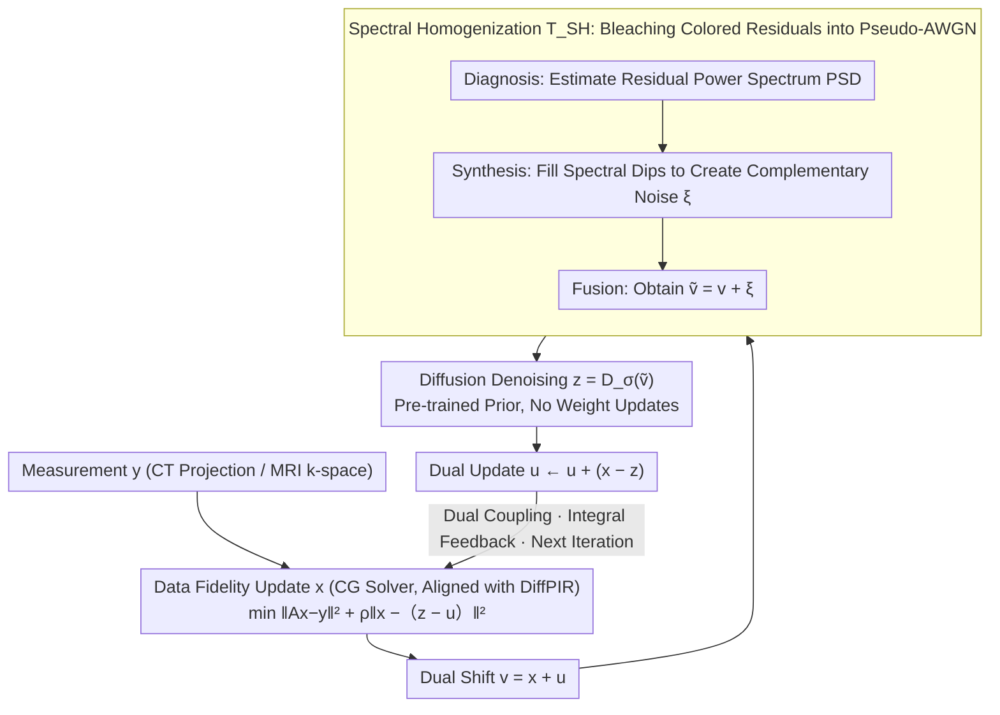

# Plug-and-Play Diffusion Meets ADMM: Dual-Variable Coupling for Robust Medical Image Reconstruction

**Conference**: ICML 2026  
**arXiv**: [2602.23214](https://arxiv.org/abs/2602.23214)  
**Code**: https://github.com/duchenhe/DC-PnPDP (Available)  
**Area**: Medical Image Reconstruction / Diffusion Models / Inverse Problems  
**Keywords**: PnP Diffusion Prior, ADMM Dual Variables, Spectral Whitening, CT/MRI Reconstruction, Steady-State Bias

## TL;DR
This paper reintegrates the dual variables of ADMM into the PnP diffusion prior loop, utilizing "duality" to provide integral feedback that eliminates steady-state bias. A frequency-domain Spectral Homogenization module is employed to whiten structured dual residuals into pseudo-AWGN, preventing Out-of-Distribution (OOD) hallucinations in the diffusion denoiser. It achieves SOTA fidelity on sparse-view/limited-angle CT and accelerated MRI with approximately a $3\times$ inference speedup.

## Background & Motivation

**Background**: The mainstream approach for solving medical inverse problems ($y=Ax+n$) in CT/MRI is the PnP Diffusion Prior (PnPDP), which alternates between data consistency subproblems and diffusion denoising prior subproblems. Common implementations are based on Half-Quadratic Splitting (HQS) or proximal gradients, such as DiffPIR, DDS, DDNM, DAPS, and SITCOM.

**Limitations of Prior Work**: From a control theory perspective, the authors point out that HQS/PG-type solvers are "memoryless" operators—each iteration only considers the instantaneous data fidelity gradient, which is equivalent to a Proportional (P) controller. A P controller cannot eliminate steady-state error when the system encounters "high resistance" (heavy undersampling or strong noise), causing the reconstruction to settle at a **biased equilibrium point** that neither strictly satisfies physical measurements nor lies on the prior manifold. In medical scenarios, this bias directly compromises clinical reliability.

**Key Challenge**: Classical optimization theory offers a remedy: adding dual variables (Lagrange multipliers). These perform integration on the primal residuals, equivalent to an Integral (I) controller, which can drive $x \to z$ to strictly satisfy constraints. However, directly reintroducing the dual $u^{(k)}$ into the diffusion PnP loop triggers a second conflict: $u$ accumulates "structured" residuals (directional streaks in CT, coherent aliasing in MRI) with colored spectra. Since diffusion denoisers are trained only on AWGN, the input $v^{(k+1)}=x^{(k+1)}+u^{(k)}$ immediately becomes OOD, causing the denoiser to "hallucinate" artifacts as semantic features.

**Goal**: (1) Reconnect dual variables to PnP diffusion; (2) Ensure the input perceived by the diffusion denoiser remains AWGN.

**Key Insight**: Decouple the "geometric role" from the "statistical role"—dual variables handle geometric convergence, while a frequency-domain whitening module "bleaches" the colored residuals accumulated by the dual variables into pseudo-AWGN.

**Core Idea**: Utilize ADMM duality to provide integral feedback for eliminating steady-state bias, and apply Spectral Homogenization to fill "spectral dips" in the frequency domain. This ensures the power spectrum of the denoiser input fits white noise, reconciling the conflict between "geometric rigors" and "statistical compatibility."

## Method

### Overall Architecture
The DC-PnPDP framework strictly follows the three-step ADMM procedure but inserts a frequency-domain adaptation module $T_{\text{SH}}$ before the second step. One iteration cycle is as follows (Algorithm 1):

1. **Keep Data Fidelity Update**: $x^{(k+1)}=\arg\min_x \|Ax-y\|_2^2+\rho\|x-z^{(k)}+u^{(k)}\|_2^2$ (Solved via closed-form or CG);
2. **Dual Shift**: $v^{(k+1)} = x^{(k+1)} + u^{(k)}$;
3. **Spectral Homogenization**: $\tilde v^{(k+1)} = T_{\text{SH}}(v^{(k+1)}; z^{(k)}, \sigma_t)$;
4. **Diffusion Denoising**: $z^{(k+1)} = D_\sigma(\tilde v^{(k+1)}, t)$;
5. **Dual Update**: $u^{(k+1)} = u^{(k)} + (x^{(k+1)} - z^{(k+1)})$.

The noise schedule $\sigma_t$ follows linear annealing from large to small based on the EDM framework. A deliberate "controlled variable" design is used: the data fidelity step (parallel-beam projection for CT using torch-radon, Cartesian undersampling for MRI, both solved via CG) is identical to the strongest baseline, DiffPIR. Structural differences are **strictly restricted** to "whether dual $u$ is maintained" and "whether $T_{\text{SH}}$ is inserted," allowing the ablation study to cleanly attribute gains to the DC and SH modules without solver-induced interference.

### Key Designs

**1. Dual-Coupled Iteration: Dual Variables as "Integral Memory" to Eliminate Steady-State Bias**

Existing HQS/PG-style PnP diffusion solvers assume dual $u \equiv 0$, effectively removing the integral component of ADMM. Consequently, under heavy undersampling, they inevitably settle at a biased equilibrium. This paper explicitly updates $u^{(k+1)}=u^{(k)}+(x^{(k+1)}-z^{(k+1)})$ after each iteration, accumulating the consensus error between $x$ and $z$ into a corrective force. In the next $x$ update, $u$ enters the center of the quadratic data fidelity term $\|x-z^{(k)}+u^{(k)}\|^2$, acting as a persistent pressure to align the two variables. This upgrades a pure Proportional controller to a PI controller; while a P controller cannot eliminate steady-state error against strong resistance (heavy undersampling), the I term drives it to zero by integrating the residual. The gain is immediate: on LACT-90, enabling only the dual variable yields $+4.55$ dB.

**2. Spectral Homogenization: Bleaching Colored Residuals into Pseudo-AWGN for Denoiser Compatibility**

While the dual variable is beneficial, it introduces a secondary problem: $u$ accumulates structured residuals (streaks in CT, aliasing in MRI) with colored spectra. Since diffusion denoisers are trained on AWGN, the input $v^{(k+1)}=x^{(k+1)}+u^{(k)}$ is OOD and causes the denoiser to treat artifacts as semantic hallucinations. Physical artifacts naturally concentrate in specific frequency bands. Instead of adding noise in the spatial domain (which would blur the entire image), this paper fills energy only into the "spectral dips" while preserving the "spectral peaks" that carry semantic information. The three steps are: **Diagnosis**, using $r^{(k+1)}=v^{(k+1)}-z^{(k)}$ as a residual proxy to perform kernel-smoothed PSD estimation $\hat S_r(\omega) = (|\mathcal F(r)(\omega)|^2)*K_\delta$; **Synthesis**, defining the spectral gap $\Delta S(\omega)=\max(\epsilon, \sigma_t^2(HW) - \hat S_r(\omega))$ and combining the random phase of white noise $n$ with the gap amplitude to create complementary noise $\xi^{(k+1)} = \mathcal F^{-1}(\sqrt{\Delta S(\omega)} \odot e^{i\angle\mathcal F(n)})$; and **Fusion** $\tilde v^{(k+1)} = v^{(k+1)} + \xi^{(k+1)}$. Proposition 4.1 provides second-order spectral consistency: $\mathbb E_\xi[S_{n_{\text{eff}}}(\omega)] \approx \sigma_t^2(HW)$, i.e., $\text{Cov}(n_{\text{eff}}) \approx \sigma_t^2 I$. This operation is termed "Coherence Breaking"—using random phases and complementary amplitudes to drown out the coherence of structured artifacts, bleaching the noise without damaging the structure. For complex-valued MRI reconstruction, SH is applied independently to the real and imaginary parts.

### Loss & Training
The diffusion prior is pre-trained according to the EDM framework (AbdomenCT-1K from scratch for CT, pre-trained weights from Zheng et al. 2025 for MRI). **Diffusion weights are not updated during inference**—all modifications occur within the PnP solver. This is standard for plug-and-play settings and means the SH module is plug-and-play for any pre-trained diffusion prior.

## Key Experimental Results

### Main Results
Comparing 5 SOTA PnPDP solvers on AbdomenCT-1K (CT) and fastMRI brain, PSNR/SSIM results are as follows (Table 1 excerpt):

| Task | Metric | DiffPIR (Strongest baseline) | SITCOM | DAPS | DC-PnPDP (100 NFE) | Gain vs. Prev. SOTA |
|------|------|------|------|------|------|------|
| LACT-90 | PSNR / SSIM | 34.70 / 0.926 | 32.07 / 0.911 | 30.02 / 0.891 | **39.46 / 0.955** | **+4.76 dB** |
| SVCT-20 | PSNR / SSIM | 37.86 / 0.947 | 37.76 / 0.945 | 37.05 / 0.939 | **40.55 / 0.963** | **+2.69 dB** |
| Brain MRI AF=6 | PSNR / SSIM | 34.88 / 0.965 | 35.58 / 0.969 | 34.89 / 0.967 | **36.43 / 0.972** | +0.85 dB |
| Brain MRI AF=10 | PSNR / SSIM | 27.92 / 0.918 | 28.67 / 0.927 | 27.04 / 0.910 | **30.91 / 0.943** | **+2.24 dB** |

The $+4.76$ dB jump in "missing wedge" tasks like LACT-90 demonstrates the value of dual-driven bias elimination—baselines often generate phantom structures in missing orientations.

### Ablation Study
Toggling DC (Dual-Coupled) and SH (Spectral Homogenization) on LACT-90; the first row corresponds to DiffPIR:

| DC | SH | PSNR ↑ | SSIM ↑ | LPIPS ↓ | Insight |
|----|----|--------|--------|---------|------|
| ✗ | ✗ | 31.36 | 0.894 | 0.023 | DiffPIR baseline, maximum steady-state bias |
| ✗ | ✓ | 31.51 | 0.898 | 0.022 | Whitening alone helps little; colored residuals are mostly dual-induced |
| ✓ | ✗ | 35.91 | 0.934 | 0.012 | Dual added (+4.55 dB), but short of full model by 1.1 dB (OOD leakage) |
| ✓ | ✓ | **37.02** | **0.943** | **0.011** | Strong synergy between the two modules |

### Key Findings
- **DC provides the lift, SH is the safety valve**: Opening SH alone only adds $+0.15$ dB, but turning it off when DC is active causes a $1.1$ dB drop—SH's value lies in mitigating the "OOD risk introduced by the dual variable."
- **Efficiency ~3.3× speedup**: DC-PnPDP with 30 NFE outperforms DiffPIR with 100 NFE. On SVCT-20, DiffPIR requires 1000 NFE to match the quality of DC-PnPDP with 50 NFE.
- **Spectral Visualization** (Fig. 3) confirms: (a) ideal AWGN input vs. (b) SH output PSDs are nearly identical; (c) naive noise addition $x+u+\sigma_t n$ leads to over-filled energy; (d) $x+u$ without processing contains high-frequency spikes that trigger hallucinations.

## Highlights & Insights
- **Control Theory Perspective on Bias**: Analogizing HQS/PG solvers to P controllers and dual variables to I terms cleanly explains why baselines converge to biased points and suggests reintroducing duality for de-biasing.
- **Structured Residuals as an OOD Problem**: Explicitly acknowledging that "dual accumulation = OOD" and solving it in the frequency domain rather than the spatial domain is a precise design choice for medical inverse problems.
- **Transferable Trick**: Spectral Homogenization is essentially a lightweight wrapper that whitens inputs for pre-trained denoisers. It can be applied to any PnP diffusion pipeline where residuals are colored.
- **Rigorous Controlled Comparison**: Aligning the data fidelity step exactly with DiffPIR ensures that gains are strictly attributed to DC and SH, avoiding contamination from solver differences.

## Limitations & Future Work
- **Medical scope**: Validated primarily on CT/MRI single-coil + Cartesian sampling; does not yet cover multi-coil parallel imaging, 3D volume reconstruction, or non-linear operators like phase retrieval.
- **Second-order approximation**: SH guarantees PSD expectation approximates $\sigma_t^2 I$ but does not guarantee high-order statistics match AWGN.
- **Proxy dependency**: Estimating PSD using $z^{(k)}$ as a clean proxy is biased in early iterations. EMA or score-based uncertainty estimation could be alternatives.
- **Hyperparameter sensitivity**: The impact of $\rho$ was not extensively analyzed, although ADMM's convergence is sensitive to it.
- **Future directions**: Extending SH to colored measurement noise (e.g., Poisson-Gaussian), replacing dual updates with primal-dual splitting (Chambolle-Pock), and learning $T_{\text{SH}}$ as a conditional module.

## Related Work & Insights
- **vs. DiffPIR (PnP-HQS)**: This method aligns exactly with DiffPIR's fidelity step; the $+4.76$ dB gain in LACT-90 is a clean result of reintroducing duality and SH.
- **vs. DAPS / SITCOM / DDS / DDNM**: These focus on likelihood subproblems or reverse SDE modifications but maintain memoryless HQS-like structures.
- **vs. Shrestha & Fu 2026 (AC-DC)**: AC-DC uses conditional Langevin inner loops to resolve OOD issues, which increases computation. SH is a single frequency-domain operation.
- **vs. Bendel et al. 2025 (Iterative Colored Re-noising)**: They use spatial re-noising to pull inputs toward AWGN; the frequency-domain approach here is more precise in filling gaps without harming peaks.

## Rating
- Novelty: ⭐⭐⭐⭐ Reintroducing dual variables isn't new, but the control theory mapping combined with spectral whitening for OOD mitigation is highly cohesive and effective.
- Experimental Thoroughness: ⭐⭐⭐⭐ Strong coverage of CT/MRI tasks, 5 SOTA baselines, clean ablation, and efficiency analyses; mainly limited by current focus on 2D/Cartesian.
- Writing Quality: ⭐⭐⭐⭐⭐ Strong narrative flow, with the control theory metaphor and Proposition 4.1 providing both intuition and formal backing.
- Value: ⭐⭐⭐⭐ A plug-in friendly solver upgrade for the medical imaging community.

<!-- RELATED:START -->

## Related Papers

- [\[ICLR 2026\] DM4CT: Benchmarking Diffusion Models for Computed Tomography Reconstruction](../../ICLR2026/medical_imaging/dm4ct_benchmarking_diffusion_models_for_computed_tomography_reconstruction.md)
- [\[CVPR 2025\] DiN: Diffusion Model for Robust Medical VQA with Semantic Noisy Labels](../../CVPR2025/medical_imaging/din_diffusion_model_for_robust_medical_vqa_with_semantic_noisy_labels.md)
- [\[CVPR 2026\] SemiGDA: Generative Dual-distribution Alignment for Semi-Supervised Medical Image Segmentation](../../CVPR2026/medical_imaging/semigda_generative_dual-distribution_alignment_for_semi-supervised_medical_image.md)
- [\[ICML 2026\] Foundation VAEs for 3D CT Reconstruction, Augmentation, and Generation](foundation_vaes_for_3d_ct_reconstruction_augmentation_and_generation.md)
- [\[ICLR 2026\] COMPASS: Robust Feature Conformal Prediction for Medical Segmentation Metrics](../../ICLR2026/medical_imaging/compass_robust_feature_conformal_prediction_for_medical_segmentation_metrics.md)

<!-- RELATED:END -->
