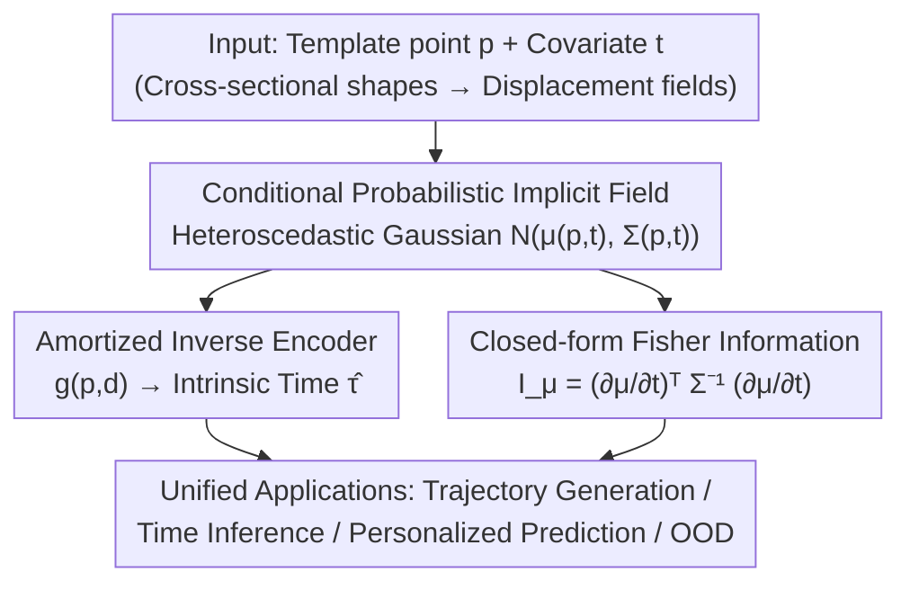

# PRISM: A 3D Probabilistic Neural Representation for Interpretable Shape Modeling

**Conference**: ICML 2026  
**arXiv**: [2602.11467](https://arxiv.org/abs/2602.11467)  
**Code**: https://github.com/uncbiag/PRISM  
**Area**: Medical Imaging / Statistical Shape Modeling / Uncertainty Quantification  
**Keywords**: Implicit Neural Representations, Statistical Shape Analysis, Fisher Information, Heteroscedastic Gaussian Fields, Anomaly Detection

## TL;DR
PRISM bridges implicit neural representations (INRs) with uncertainty-aware statistical shape analysis. It models the mean trajectory and spatially heterogeneous variation of anatomical structures evolving with covariates (e.g., age) using a conditional heteroscedastic Gaussian field. By deriving a closed-form Fisher information metric, it analytically quantifies the local uncertainty of "intrinsic developmental time," supporting shape evolution, personalized prediction, and anomaly detection on both synthetic and clinical pediatric airway data.

## Background & Motivation
**Background**: Statistical shape modeling (SSM) aims to characterize the distribution $p(\mathcal{Y} \mid t)$ of anatomical geometry as it varies with a continuous covariate (e.g., age $t$). Clinically, it is crucial not only to know the "average growth" but also to understand the inter-individual variation at the same age. Specifically, this variation is **heteroscedastic**: some regions exhibit high variability while others remain nearly invariant. Quantifying this spatially varying uncertainty is a prerequisite for distinguishing "developmentally conserved areas" from "naturally diverse areas" and for performing robust anomaly detection and personalized assessment.

**Limitations of Prior Work**: Incorporating rigorous uncertainty quantification (UQ) into covariate-aware shape modeling is challenging. One category consists of neural implicit methods like NAISR, which provide high-fidelity conditional generation but are **deterministic**—providing only point estimates of deformations without confidence intervals or population variance. Another category involves classical statistical atlases (e.g., LDDMM/Deformetrica) that explicitly model shape variation. However, their variation is defined in the **parameter space** (e.g., distributions of initial momenta or temporal shifts). Propagating this uncertainty to the image/anatomical space requires integrating velocity fields along non-linear deformations, making "anatomical point-wise aleatoric uncertainty" analytically intractable and requiring computationally expensive Monte Carlo resampling.

**Key Challenge**: A gap exists between high-fidelity generation (neural implicits) and analytically tractable point-wise uncertainty (statistical atlases). The former lacks variance, while the latter locks variance in the parameter space, preventing its propagation to anatomy. Clinical applications require the latter: spatially localized, covariate-conditioned population variation (aleatoric uncertainty) to differentiate physiological variation from pathology.

**Goal**: This work aims to construct a theoretically grounded, closed-form framework that maps intrinsic biological ambiguity directly to the anatomical space, supporting shape evolution, intrinsic developmental time inference, personalized prediction, and anomaly detection.

**Key Insight**: The authors combine neural implicit representations with information geometry. This preserves the high fidelity and resolution-independence of implicit fields while analytically calculating uncertainty via Fisher information. The key observation is that in implicit representations, $\partial\mu/\partial t$ can be obtained via automatic differentiation and $\Sigma^{-1}$ via a single forward pass, rendering Fisher information closed-form and sampling-free.

**Core Idea**: Model shape evolution as a continuous heteroscedastic Gaussian field and leverage closed-form Fisher information metrics to analytically quantify the uncertainty of "intrinsic developmental time" at any spatial location.

## Method

### Overall Architecture
PRISM represents each observed shape $\mathcal{Y}_i$ as a displacement field $\phi_i: \Omega \to \mathbb{R}^3$ relative to a shared template $\mathcal{T}$. For a template point $\boldsymbol{p}$, it provides a displacement $\boldsymbol{d} = \phi_i(\boldsymbol{p})$, such that the observed position is $\boldsymbol{y} = \boldsymbol{p} + \boldsymbol{d}$. Since $\boldsymbol{y} = \boldsymbol{p} + \boldsymbol{d}$ is a deterministic translation with invariant covariance ($\Sigma_{\boldsymbol{y}} = \Sigma_{\boldsymbol{d}}$), the displacement distribution can be directly modeled as $p(\boldsymbol{d} \mid \boldsymbol{p}, t) = \mathcal{N}(\mu(\boldsymbol{p}, t), \Sigma(\boldsymbol{p}, t))$. The pipeline consists of three components: first, a coordinate network learns the conditional shape distribution (mean trajectory + covariance); second, an amortized inverse encoder maps local deformations back to "intrinsic developmental time" $\hat\tau$; third, local time uncertainty is calculated via closed-form Fisher information. Together, these support downstream tasks.

A core conceptual distinction is made between **chronological time $t$** (e.g., actual age) and **intrinsic time $\tau$** (true developmental stage). Individuals of the same age may be developmentally advanced or delayed; PRISM quantifies the distribution of this temporal variation $p(\tau \mid \boldsymbol{p}, t)$.

### Key Designs

**1. Conditional Probabilistic Implicit Field: Covariate-driven terms + Covariate-invariant residuals for decoupled training of mean and variance**

To address the deterministic nature of neural implicits, PRISM models displacement as a continuous heteroscedastic Gaussian field $\boldsymbol{d} \mid \boldsymbol{p}, t \sim \mathcal{N}(\mu(\boldsymbol{p}, t), \Sigma(\boldsymbol{p}, t))$, where both mean and covariance are output by coordinate networks. Structurally, both $\mu$ and the Cholesky factor $\boldsymbol{L}$ of the covariance are decomposed into "covariate-driven terms + covariate-invariant residuals": $\mu(\boldsymbol{p}, t) = [f_\mu(\boldsymbol{p}, t) - f_\mu(\boldsymbol{p}, 0)] + h_\mu(\boldsymbol{p})$, and similarly for $\boldsymbol{L}$. The subtraction $f(\boldsymbol{p}, t) - f(\boldsymbol{p}, 0)$ ensures the driven term vanishes at $t=0$, such that $\mu(\boldsymbol{p}, 0) = h_\mu(\boldsymbol{p})$, achieving **identifiability** between covariate-dependent changes and individual-specific attributes. The covariance is parameterized via Cholesky decomposition $\Sigma = \boldsymbol{L}\boldsymbol{L}^\top$ (6 degrees of freedom per 3D point), with diagonal elements passing through softplus and a small constant $\epsilon$ to ensure positive definiteness and stable NLL optimization without explicit constraints.

A crucial training detail: Jointly optimizing $\mu$ and $\Sigma$ using Gaussian NLL can result in variance-weighted gradients biasing the mean estimate. PRISM employs **decoupled gradients**: $\mathcal{L}_\mu = \tfrac{1}{M} \sum_j \|\boldsymbol{d}_j - \mu_j\|_1$ ($\ell_1$ for outlier robustness) trains $\mu$, while $\mathcal{L}_\Sigma = \mathcal{L}_{\text{NLL}}$ trains $\Sigma$ with $\mu$ fixed during calculation. A two-stage curriculum is used: Stage 1 freezes the covariance head to train $\mu$ ($T_{\text{warm}}=10$), and Stage 2 trains both branches jointly.

**2. Closed-form Fisher Information: Analytically calculating temporal uncertainty using only the mean term $I_\mu$**

This is the theoretical core, addressing the intractability of point-wise uncertainty. From estimation theory, the score function $U(\boldsymbol{d}; \boldsymbol{p}, t) = \partial_t \log p(\boldsymbol{d} \mid \boldsymbol{p}, t)$ measures the sensitivity of the log-likelihood to time, and Fisher information $I(\boldsymbol{p}, t) = \mathbb{E}[U^2]$ measures how much information a displacement observation carries about time. Under the assumption that "population average intrinsic time equals chronological time," $\tau$ is an unbiased estimator of $t$. The Cramér-Rao inequality provides a lower bound for estimation precision: higher Fisher information (where shape changes significantly over time) allows for precise localization, while lower information (anatomical ambiguity) implies irreducible uncertainty.

For a heteroscedastic Gaussian model, Fisher information is closed-form and decomposes into two terms:

$$I_{\text{full}}(\boldsymbol{p}, t) = \underbrace{\Big(\tfrac{\partial\mu}{\partial t}\Big)^\top \Sigma^{-1} \Big(\tfrac{\partial\mu}{\partial t}\Big)}_{I_\mu} + \underbrace{\tfrac{1}{2}\mathrm{tr}\Big(\big(\Sigma^{-1} \tfrac{\partial\Sigma}{\partial t}\big)^2\Big)}_{I_\Sigma}.$$

Following the classic result in information geometry that mean and covariance parameters are orthogonal under the Fisher-Rao metric, these two terms answer different questions. $I_\mu$ measures the precision of "locating an individual along the mean trajectory" (the temporal variation targeted here), while $I_\Sigma$ measures how population structure variation evolves over time (orthogonal to the goal). Thus, only **$I_\mu$ is retained**: $I(\boldsymbol{p}, t) = (\partial\mu/\partial t)^\top \Sigma^{-1} (\partial\mu/\partial t)$. It is entirely analytical—$\partial\mu/\partial t$ is obtained via automatic differentiation and $\Sigma^{-1}$ via a forward pass—offering a fundamental advantage over Monte Carlo propagation by avoiding sampling variance and allowing dense anatomical queries.

**3. Amortized Inverse Encoder: Forward pass inference of intrinsic time, eliminating test-time optimization**

Inverting an observed deformation to find an individual's intrinsic time $\hat\tau$ is an MLE problem $\hat\tau_{\text{MLE}} = \arg\max_\tau \log p(\boldsymbol{d} \mid \boldsymbol{p}, \tau)$. However, iterative solvers are expensive (baselines like A-SDF/NAISR rely on test-time optimization, TTO). PRISM uses **amortized inference**: training an inverse encoder $g(\boldsymbol{p}, \boldsymbol{d}) \to \tau$. Training data is synthesized by the learned forward model $f$: triplets are formed by sampling $(\boldsymbol{p}, \tau)$ and querying $\boldsymbol{d} = \mu(\boldsymbol{p}, \tau)$. Optimization uses $\mathcal{L}_{\text{inv}} = \tfrac{1}{M} \sum_j |g(\boldsymbol{p}_j, \boldsymbol{d}_j) - \tau_j|$. At test time, a single forward pass per template-displacement pair yields a dense anatomical time map, orders of magnitude faster than iterative baselines.

**4. Unified Application Framework: Fisher-weighted time aggregation, z-score personalized prediction, and local OOD scoring**

These components support a suite of shape analysis applications. **Intrinsic Time Aggregation**: When $t$ is unknown, the arithmetic mean is used $\bar\tau = \tfrac{1}{|\mathcal{T}|} \sum_{\boldsymbol{p}} g(\boldsymbol{p}, \boldsymbol{d})$; when $t$ is known, Fisher information weighting is used $\bar\tau = \tfrac{\sum_{\boldsymbol{p}} I(\boldsymbol{p}, t) g(\boldsymbol{p}, \boldsymbol{d})}{\sum_{\boldsymbol{p}} I(\boldsymbol{p}, t)}$, giving higher weight to regions with high temporal identifiability. **Personalized Longitudinal Prediction**: Assuming a subject's temporal z-score $z_\tau = \tfrac{\tau_0 - t_0}{\sigma_\tau(t_0)}$ remains constant, extrapolation yields $\tau_1 = t_1 + z_\tau \sigma_\tau(t_1)$ and future position $\boldsymbol{y}_1 = \boldsymbol{p} + \mu(\boldsymbol{p}, \tau_1)$, preserving the individual's "advanced/delayed" stage. **OOD Detection**: In pediatric subglottic stenosis, pathological narrowing manifests as regions that appear "younger" than the rest of the anatomy. A score is derived using local intrinsic time relative to the anatomical median, normalized by local uncertainty $\text{Score}_{\text{OOD}} = \min_{\boldsymbol{p}} \big[ \tfrac{\hat\tau_{\boldsymbol{p}} - \tilde\tau}{\sigma_\tau(\boldsymbol{p}, t)} - \tfrac{\hat\tau_{\boldsymbol{p}^*} - \tilde\tau}{\sigma_\tau(\boldsymbol{p}^*, t)} \big]$. Strong negative values flag pathological zones without needing anomaly labels.

## Key Experimental Results

### Main Results
Evaluation was conducted on four datasets of increasing complexity: Starman (G) (global time uncertainty), Starman (L) (spatially varying trajectories for arms/legs), ANNY (parametric human model, ages 0–20), and Pediatric Airway (358 scans / 264 subjects, plus 31 stenosis cases for OOD). Baselines included A-SDF and NAISR (both using per-shape latent codes without uncertainty).

| Task | Dataset | Metric | A-SDF | NAISR | PRISM |
|------|------|------|------|------|------|
| Mean Trajectory Recon. | Airway | CD↓ | 0.114 | 0.072 | **0.064** |
| Mean Trajectory Recon. | Airway | HD↓ | 10.508 | 10.075 | **9.614** |
| Global Intrinsic Time | Starman(G) | MAE↓ | 0.016 | 0.019 | **0.005** |
| Global Intrinsic Time | Starman(G) | Inf. Time/case (s)↓ | 4.005 | 7.892 | **0.040** |
| Pers. Shape Prediction | Starman(G) | CD↓ | 0.165 | 0.130 | **0.072** |
| Pers. Shape Prediction | Starman(L) | CD↓ | 0.467 | 0.595 | **0.099** |

In mean reconstruction, PRISM achieved the lowest error on the airway (small data) and matched SOTA on Starman/ANNY. This is attributed to the "decoupling of correspondence and reconstruction" simplifying the optimization (NAISR must learn both jointly). In global intrinsic time inference, the amortized PRISM matched or exceeded baseline accuracy while being significantly faster (0.040s vs 4–8s). On local intrinsic time in Starman (L), PRISM was the **only applicable** method (baselines can only estimate a single global time), achieving $r=1.000$ and MAE of 0.004–0.008 for arms/legs. In personalized prediction, PRISM outperformed others; A-SDF degraded sharply outside the training range due to lack of geometric priors, while template-deformation methods (NAISR/PRISM) remained bounded.

### Ablation Study
OOD detection (Airway) and Fisher information term selection:

| Task/Config | Key Metric | Value | Note |
|------|------|------|------|
| OOD · A-SDF (Global) | AUC↑ | 0.270 | Global time, virtually no discriminative power |
| OOD · NAISR (Global) | AUC↑ | 0.605 | Global baseline |
| OOD · PRISM (Global) | AUC↑ | 0.502 | Global scoring worse than NAISR |
| OOD · PRISM (Local) | AUC↑ | **0.875** | Local scoring significantly leads (Acc 0.857) |
| Fisher · Using $I_\mu$ | Unc. Band | Matches GT | Accurately characterizes temporal variation |
| Fisher · Using $I_{\text{full}}$ | Unc. Band | Underestimates | $I_\Sigma$ shrinks the bound but misses the target |

### Key Findings
- In OOD detection, PRISM (Global) underperformed NAISR, but PRISM (Local) achieved the best results. This indicates that airway development is heterogeneous across individuals, locations, and time. Local estimation identifies deviations within the subject's own anatomy, bypassing inter-individual confounding.
- Retaining only $I_\mu$ for Fisher information is correct: On Starman (G) with ground truth, $I_\mu$-derived bands closely match GT, while $I_{\text{full}}$ systematically underestimates—$I_\Sigma$ tightens the Cramér-Rao bound but does not reflect the target of "locating an individual along the mean trajectory."
- Soft tissue regions (e.g., base of tongue) show wider uncertainty bands, consistent with high intra-individual variation reported in literature, indicating that the learned spatial uncertainty reflects clinical reality.

## Highlights & Insights
- Using closed-form Fisher information is an elegant contribution: Implicit representations naturally provide $\partial\mu/\partial t$ via automatic differentiation, shifting uncertainty from "Monte Carlo sampling" to "single forward pass + analytical calculation," which is fast, sampling-free, and queryable at any density.
- Explicitly separating **chronological time $t$** from **intrinsic time $\tau$** is a natural but often overlooked clinical modeling perspective. individuals can be advanced/delayed; PRISM uses z-scores to maintain this stage for personalized extrapolation.
- Decoupling $\mu/\Sigma$ gradients ($\ell_1$ for mean, NLL with fixed mean for variance) is a reusable trick for robust heteroscedastic regression, avoiding the old problem of variance-weighted gradients biasing the mean.
- "Unsupervised OOD" relies on the biological prior that "pathological regions appear developmentally younger than the rest of the own anatomy," normalized by local uncertainty—this is very effective for clinical scenarios where labels are scarce.

## Limitations & Future Work
- The framework currently conditions on a single scalar covariate (e.g., age); extending this to high-dimensional covariate spaces is necessary future work.
- Long-term prediction for degenerative diseases is not yet fully explored—stochasticity increases with biological age, making trajectory prediction harder. The authors plan to use heteroscedastic uncertainty maps for individualized disease progression.
- The method depends on high-quality template registration and point-wise correspondence (treated as a preprocessing step); poor correspondence directly affects the displacement training signal. OOD and personalized prediction were mainly validated on pediatric airways; cross-anatomy generalization requires more data.

## Related Work & Insights
- **vs NAISR**: Both use shared-template covariate-conditioned neural deformation, but NAISR is deterministic and provides only point estimates. PRISM adds heteroscedastic covariance and closed-form Fisher uncertainty, and its decoupled optimization yields better reconstruction.
- **vs Statistical Atlases (LDDMM/Deformetrica)**: These model variation in the tangent/parameter space, making point-wise anatomical uncertainty difficult to obtain analytically. PRISM provides analytical, spatially heteroscedastic uncertainty fields directly on the anatomy.
- **vs A-SDF**: A-SDF maps covariates directly to SDF without explicit correspondence. It fits mean trajectories well with sufficient data but overfits on small datasets (Airway) and degrades sharply when extrapolating outside the training range.
- **vs Gaussian Process Deformable Models (GPMM)**: GPMM uncertainty is tied to kernel/observation models and does not naturally condition on time/covariates or handle incomplete observations. PRISM's uncertainty is directly conditioned on covariates and supports cross-sectional incomplete data.

## Rating
- Novelty: ⭐⭐⭐⭐⭐ First INR for uncertainty-aware statistical shape analysis; closed-form Fisher information is a solid theoretical contribution.
- Experimental Thoroughness: ⭐⭐⭐⭐ Coverage of 4 datasets and multiple tasks + synthetic validation; however, clinical validation is limited to the airway.
- Writing Quality: ⭐⭐⭐⭐⭐ Clear motivation; the connection between theoretical derivation and clinical tasks is seamless.
- Value: ⭐⭐⭐⭐⭐ Bringing analytical point-wise uncertainty to clinical shape analysis has direct value for developmental assessment and anomaly detection.

<!-- RELATED:START -->

## Related Papers

- [\[NeurIPS 2025\] SynBrain: Enhancing Visual-to-fMRI Synthesis via Probabilistic Representation Learning](../../NeurIPS2025/medical_imaging/synbrain_enhancing_visual-to-fmri_synthesis_via_probabilistic_representation_lea.md)
- [\[CVPR 2026\] Modeling the Brain's Grammar: ROI-Guided fMRI Pretraining for Transferable and Interpretable Vision Decoding](../../CVPR2026/medical_imaging/modeling_the_brains_grammar_roi-guided_fmri_pretraining_for_transferable_and_int.md)
- [\[CVPR 2026\] EchoPOSE: 6D Pose Estimation of Sparse Echocardiograms for Left-Ventricular 3D Shape Reconstruction](../../CVPR2026/medical_imaging/echopose_6d_pose_estimation_of_sparse_echocardiograms_for_left-ventricular_3d_sh.md)
- [\[AAAI 2026\] Unsupervised Motion-Compensated Decomposition for Cardiac MRI Reconstruction via Neural Representation](../../AAAI2026/medical_imaging/unsupervised_motion-compensated_decomposition_for_cardiac_mri_reconstruction_via.md)
- [\[ICCV 2025\] SIC: Similarity-Based Interpretable Image Classification with Neural Networks](../../ICCV2025/medical_imaging/sic_similarity-based_interpretable_image_classification_with_neural_networks.md)

<!-- RELATED:END -->
