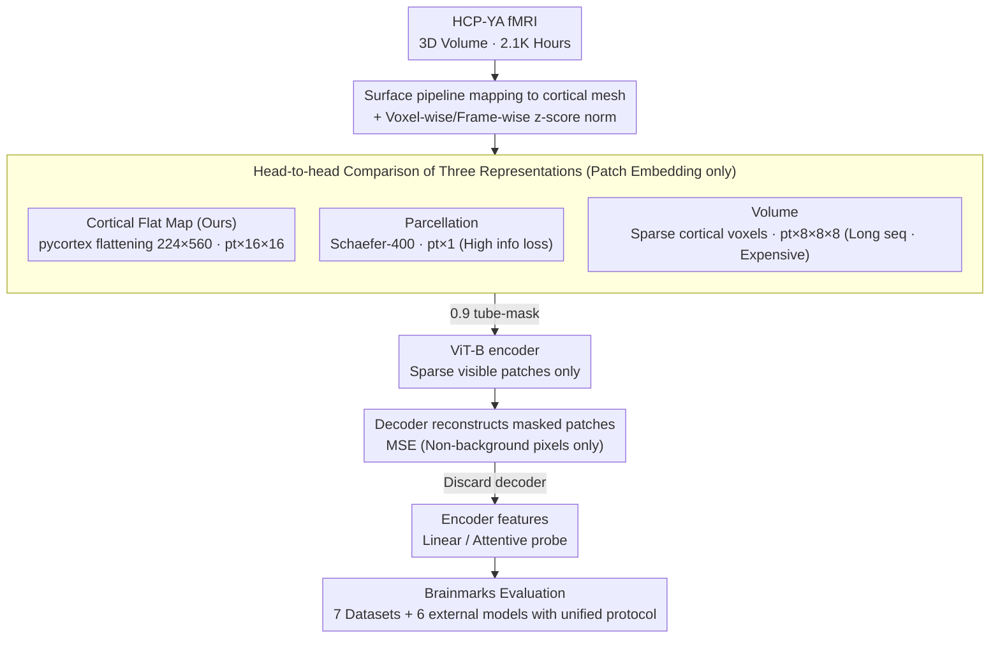

# Scaling Vision Transformers for Functional MRI with Flat Maps

**Conference**: ICML 2026  
**arXiv**: [2510.13768](https://arxiv.org/abs/2510.13768)  
**Code**: https://github.com/MedARC-AI/CortexMAE & https://github.com/MedARC-AI/Brainmarks (Available)  
**Area**: Medical Imaging / Self-Supervised Learning / Neuroimaging Foundation Models  
**Keywords**: fMRI Foundation Model, Cortical Flat Map, MAE, Brainmarks Evaluation, Scaling Law

## TL;DR
By projecting 3D fMRI volumes into 2D videos via "cortical flat maps" and feeding them into a standard spacetime MAE-ViT, the authors develop CortexMAE trained on 2.1K hours of HCP data. It significantly outperforms SOTA in cognitive state decoding, validating that the flat map is the "goldilocks zone" between voxel-wise (volume) and region-averaged (parcellation) representations. Simultaneously, the first open-source fMRI foundation model benchmark, Brainmarks, reveals the first systematic scaling laws for fMRI models and a "honest null result" showing that trait prediction still fails to beat simple functional connectivity baselines.

## Background & Motivation

**Background**: The neuroscience community aims to use fMRI combined with large models to decode brain activity (diagnosis, behavior prediction, visual reconstruction). Several fMRI self-supervised foundation models (BrainLM, Brain-JEPA, NeuroSTORM, SwiFT, etc.) already exist, mostly using **parcellation** representations (averaging 3D brain volumes into 100-400 brain regions to get 1D time series) or a few using **volume** representations (directly processing 4D spatio-temporal MRI data).

**Limitations of Prior Work**: (1) Parcellation is computationally cheap but suffers from **severe information loss**—entire cm-scale brain regions are compressed into single scalars, losing 99% of dimensions; (2) Volume preserves all information but results in massive sequence lengths (~2000+ tokens per fMRI volume after patching), leading to explosive training compute/IO overhead; (3) The fMRI foundation model field lacks **reproducible benchmarks**—studies use proprietary datasets, preprocessing, and evaluation settings, making comparisons impossible; (4) Previous trait prediction papers often report "beating baselines by X%," but use weak baselines without serious comparison against 30-year-old methods like "simple functional connectivity (FC) + logistic regression."

**Key Challenge**: fMRI data is inherently 4D spatio-temporal volume, while standard ViTs assume 2D inputs. One must either pay a high cost to learn 4D directly (full info but expensive) or use strong inductive biases (parcellation) that lose information. Is there an intermediate representation that **preserves whole-cortex signals while providing ViT-friendly 2D inputs**?

**Goal**: (i) Identify the "goldilocks" input representation for fMRI; (ii) Train a series of comparable foundation models using standard ViT + MAE; (iii) Establish an open-source, reproducible fMRI foundation model benchmark (Brainmarks); (iv) Conduct the first systematic data/model scaling law study for fMRI self-supervision.

**Key Insight**: Neuroscience has long utilized **cortical flat maps**—projecting the cortical surface (a 2D manifold consisting of a 2-4mm thick folded sheet) onto a flat grid. This preserves whole-cortex BOLD signals (unlike parcellation) while producing a 224x560 2D "image" that can be treated as video by a spacetime ViT.

**Core Idea**: Use cortical flat maps to project 3D fMRI into 2D videos and apply off-the-shelf MAE-st training. **No changes to the ViT architecture are made; only the patch embedding is replaced.** This simple yet overlooked choice yields SOTA results, the first fMRI scaling law, and the first open-source benchmark.

## Method

### Overall Architecture
The core of this work is a bet: fMRI is inherently 4D data, but if projected into an appropriate 2D representation, existing spacetime MAE-ViTs can be reused without architectural redesign. The pipeline involves two steps: projecting 3D fMRI volumes into 2D videos and feeding them into a standard MAE. Specifically, HCP-YA data is processed via FreeSurfer/fMRIPrep surface pipelines to map signals from 3D voxels to cortical surface meshes, then flattened using pycortex into 16-frame × 224 × 560 flat map videos. Videos are divided into $p_t \times 16 \times 16$ spatio-temporal patches (default $p_t=4$), tube-masked at a 0.9 ratio, where the ViT-B encoder only sees sparse visible patches while the decoder reconstructs masked parts. After pre-training, the decoder is discarded, and the encoder output serves as features for linear/attentive probes. To provide credible answers regarding representation quality, the authors also train parcellation MAE and volume MAE using the same architecture for rigorous comparison within the Brainmarks benchmark.

### Key Designs

**1. Cortical Flat Map Patch Embedding: Finding the "Goldilocks" point between voxels and parcellation**

fMRI representation has been stuck in a dilemma: parcellation averages cm-scale brain regions into single scalars (losing 99% of dimensions), while volume methods preserve full info but create massive sequences (~132K voxels) where most are empty background. This paper leverages a classic neuroscience tool: the cortex is essentially a folded 2D manifold (2-4mm thick) that can be flattened without loss. By mapping signals to a surface mesh and using pycortex flat maps, the left and right hemispheres are expanded into a 224x560 2D image. With 16 frames stacked as spacetime input, background patches are discarded and MSE loss is computed only on non-background pixels. This preserves ~77K dimensional signals (retaining detail) with a sequence length of 364—comparable to volume (465) and parcellation (400)—but with superior training bandwidth and throughput due to its regular 2D grid.

**2. Head-to-head comparison: Putting parcellation, flat, and volume on the same starting line**

A common flaw in previous fMRI foundation models is that groups only use their preferred representation to claim SOTA. Here, the authors keep almost all variables identical—same ViT-B encoder, same 16-frame input, same 0.9 mask ratio—varying only the patch embedding: Parcel uses $p_t \times 1$, Flat uses $p_t \times 16 \times 16$, and Volume uses $p_t \times 8 \times 8 \times 8$ 4D patches. Each variant is trained 8 times to get average performance across 8 downstream datasets (4 clinical, sex, age, Task21, and NSD COCO24). This allows differences to be cleanly attributed to the "representation," providing the first true multi-representation fMRI MAE family.

**3. Brainmarks Open Evaluation Suite: Ending the reproducibility crisis with unified probe protocols**

Brainmarks standardizes evaluation by incorporating 6 existing foundation models (SwiFT, BrainLM, Brain-JEPA, BrainHarmonix-F, NeuroSTORM, Brain-Semantoks) and the CortexMAE family across 7 public datasets. Crucially, the probe protocol is fair: small-sample trait prediction uses linear probes with 100 random train-test splits, while large-sample state prediction uses attentive probes with a fixed split and a 49-LR grid. No fine-tuning is allowed to prevent "cheating." Tasks like NSD COCO24 (overlapping short trials + subject-swap + difficult visual decoding) are designed to separate truly strong models from weak ones.

### Loss & Training
The objective is MAE MSE on masked patches. Two normalization steps are critical: z-scoring each voxel/ROI time series (coordinate norm) to suppress static voxel differences, and spatial z-scoring each frame (frame norm) to remove global signal drifts. Since BOLD signals fluctuate only 1-2%, static noise would overwhelm useful signals without normalization. Hyperparameters: temporal patch $p_t=4$, 625K steps, batch size 32 (= 512 frames), using repeated sampling to mitigate IO bottlenecks. Trait prediction uses average-pooled embeddings + logistic regression 5-fold CV; state prediction uses attentive probes + early stopping.

## Key Experimental Results

### Main Results
Probe accuracy across 8 downstream tasks (average of 8 pre-training seeds):

| Dataset | Parcel | Flat | Volume | FC Baseline |
|---|---|---|---|---|
| ABIDE (ASD) | 62.0 | 61.4 | 60.4 | 59.8 |
| ADHD200 | 56.8 | 59.2 | 58.8 | 57.0 |
| ADNI (AD) | 61.6 | 62.4 | 64.3 | 58.6 |
| PPMI (PD) | 61.4 | 58.8 | 59.1 | 58.0 |
| HCP-A Age | 44.2 | 47.5 | **53.4** | 45.6 |
| HCP-A Sex | 71.2 | **87.4** | 86.3 | 81.9 |
| HCP-YA Task21 (State) | 97.5 | **98.9** | 96.2 | 82.4 |
| NSD COCO24 (Visual) | 27.5 | **31.0** | 27.7 | 7.4 |

Summary: (1) **Flat map wins decisively in dynamic state decoding** (Task21, COCO24, Sex); (2) Volume has an advantage in Age prediction (likely capturing cortical thickness/structural cues); (3) Parcel is efficient but weak in state decoding; (4) All methods perform similarly on clinical datasets, barely exceeding FC baselines—indicating foundation models do not yet show clear advantages when sample sizes are tiny.

Controlled benchmark (Figure 8): **No model significantly outperforms simple FC baselines** in trait prediction (including SOTA like NeuroSTORM/Brain-JEPA). In state decoding, **CortexMAE Flat leads significantly**, outperforming volume models by 3-5% on NSD COCO24.

### Ablation Study

| Configuration | Observation |
|---|---|
| Full flat map MAE | Baseline |
| No frame normalization | Accuracy drops due to global signal drift pollution |
| No coordinate normalization | State decoding collapses as static voxel differences dominate |
| tube masking → random | Reconstruction becomes trivial due to temporal leakage |
| mask ratio 0.5 → 0.9 | High ratio forces structural representation, improving downstream |
| Increased encoder depth | Saturates after depth ~9 (37M parameters) |
| Increased pretrain data | Follows power law (index -0.01) on HCP; saturates on OOD NSD |

### Key Findings
- **fMRI strictly follows data scaling laws, but the index is 10x weaker than LLMs** (-0.01 vs -0.1 in Kaplan 2020), suggesting scaling alone won't solve fMRI performance easily.
- Model scaling saturates at depth 9 (37M params)—the 2K-hour HCP-YA dataset can only support this much capacity.
- Models spontaneously learn the Default Mode Network (DMN): the first PC of position embeddings matches the principal gradient of functional connectivity (Margulies 2016).
- **Honest null result**: Foundation models do not outperform simple FC + linear for individual trait prediction—a wake-up call for the field.
- State decoding is where foundation models show robust advantages, with CortexMAE Flat being the strongest.

## Highlights & Insights
- **The "just change patch embedding" approach is elegant**: Reusing spacetime MAE-ViT without changing architecture or attention is a highly efficient engineering choice.
- **The Goldilocks zone concept is transferable**: The trade-off between full retention and hyper-compression is universal; cortical flat maps utilize domain geometry (cortex as 2D) to find the perfect midpoint.
- **Honest Null Results + Open Benchmark**: By admitting trait prediction fails to beat FC baselines, the authors provide a necessary reality check for the field.
- **First fMRI Scaling Law**: Clarifies that fMRI marginal gains are smaller than NLP, suggesting that diversity/quality of data is the bottleneck rather than just scale.
- **DMN Emergence**: Self-supervised representations aligning with known neurobiology provides strong interpretability.

## Limitations & Future Work
- **Narrow distribution**: HCP-YA consists of healthy young adults (22-35); pre-training is homogeneous, leading to weak OOD generalization (scaling fails on NSD).
- **Clinical failure**: Results on ABIDE/ADHD200 hover around 60%, showing foundation models currently struggle to transfer to small-sample clinical data.
- **Early saturation**: Indicates current data scales are insufficient, but fMRI collection is prohibitively expensive compared to text.
- **Loss of subcortical info**: Flat maps exclude subcortical structures (thalamus, basal ganglia) which are critical for many clinical tasks; volume models retain a structural advantage here.
- Lack of multi-modal fMRI (task + rest + diffusion) joint pre-training.

## Related Work & Insights
- **vs BrainLM / Brain-JEPA**: These are parcellation-based models with high information loss; CortexMAE Flat preserves all cortical signals and performs significantly better in state decoding.
- **vs SwiFT / NeuroSTORM**: These are volume-based models; they are computationally expensive but better for age prediction. CortexMAE Flat remains superior for state decoding.
- **vs FC baselines**: Functional Connectivity (Finn et al. 2015) remains the standard for trait prediction; this work proves deep models haven't truly surpassed it yet.
- **vs vision MAE (He et al. 2022)**: Direct application of MAE-st; the primary contribution is finding the 2D projection to fit fMRI into the framework.

## Rating
- Novelty: ⭐⭐⭐⭐ (Cortical maps are old, but their use as a ViT-friendly representation is strategically clever).
- Experimental Thoroughness: ⭐⭐⭐⭐⭐ (Rigorous multi-representation comparison + 6 external models + 7 datasets + scaling law).
- Writing Quality: ⭐⭐⭐⭐⭐ (Clear logic, direct conclusions, and highly persuasive figures).
- Value: ⭐⭐⭐⭐⭐ (Brainmarks + honest null results + flat map representation are definitive contributions to the community).

<!-- RELATED:START -->

## Related Papers

- [\[CVPR 2026\] SPECTRE: Scaling Self-Supervised and Cross-Modal Pretraining for Volumetric CT Transformers](../../CVPR2026/medical_imaging/scaling_self-supervised_and_cross-modal_pretraining_for_volumetric_ct_transforme.md)
- [\[CVPR 2026\] EEGiT: Teaching Vision Transformers to Understand the EEG signal](../../CVPR2026/medical_imaging/eegit_teaching_vision_transformers_to_understand_the_eeg_signal.md)
- [\[CVPR 2026\] MuViT: Multi-Resolution Vision Transformers for Learning Across Scales in Microscopy](../../CVPR2026/medical_imaging/muvit_multi-resolution_vision_transformers_for_learning_across_scales_in_microsc.md)
- [\[ICLR 2026\] Functional MRI Time Series Generation via Wavelet-Based Image Transform and Spectral Flow Matching for Brain Disorder Identification](../../ICLR2026/medical_imaging/functional_mri_time_series_generation_via_wavelet-based_image_transform_and_spec.md)
- [\[CVPR 2026\] Keep It Frozen: Domain-Routed Conditional Residual Modulation for Multi-Domain Vision Transformers](../../CVPR2026/medical_imaging/keep_it_frozen_domain-routed_conditional_residual_modulation_for_multi-domain_vi.md)

<!-- RELATED:END -->
