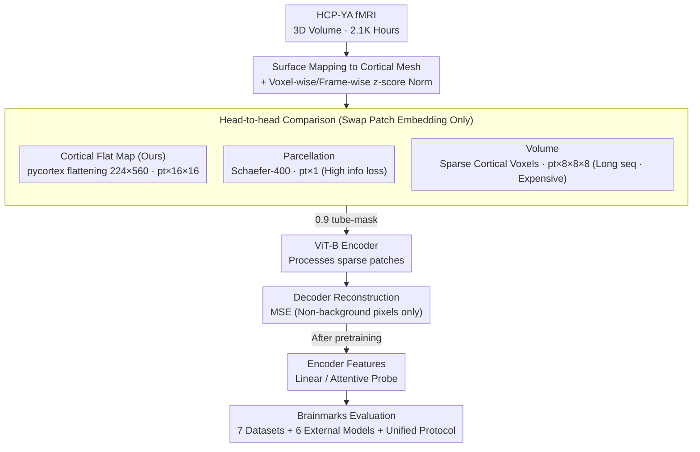

# Scaling Vision Transformers for Functional MRI with Flat Maps

**Conference**: ICML 2026  
**arXiv**: [2510.13768](https://arxiv.org/abs/2510.13768)  
**Code**: https://github.com/MedARC-AI/CortexMAE & https://github.com/MedARC-AI/Brainmarks (Available)  
**Area**: Medical Imaging / Self-Supervised Learning / Neuroimaging Foundation Models  
**Keywords**: fMRI Foundation Model, Cortical Flat Map, MAE, Brainmarks Evaluation, Scaling Law

## TL;DR
By projecting 3D fMRI volumes into 2D videos via "cortical flat maps" and feeding them into a standard spacetime MAE-ViT, the authors develop CortexMAE, trained on 2.1K hours of HCP data. It significantly outperforms SOTA in cognitive state decoding and validates flat maps as the "goldilocks zone" between voxel-wise (volume) and region-average (parcellation) representations. Simultaneously, the first open-source fMRI foundation model benchmark, Brainmarks, is released, providing the first systemic scaling laws for fMRI and an honest null result showing that foundation models still struggle to beat simple functional connectivity baselines in individual trait prediction.

## Background & Motivation

**Background**: The neuroscience community aims to use fMRI combined with large-scale models to decode brain activity (diagnosis, behavior prediction, visual reconstruction). Several self-supervised fMRI foundation models (BrainLM, Brain-JEPA, NeuroSTORM, SwiFT, etc.) already exist. Most use **parcellation** (averaging 3D volumes into 100-400 brain regions to get a 1D time-series vector), while a few use **volume** (directly processing 4D spatiotemporal MRI data).

**Limitations of Prior Work**: (1) Parcellation is computationally cheap but suffers from **severe information loss**, as cm-scale brain regions are compressed into single scalars, losing 99% of the dimensionality. (2) Volume representation preserves all information but results in massive sequence lengths (~2000+ tokens per volume after patching), leading to explosive training compute and I/O overhead. (3) The fMRI foundation model field lacks **reproducible benchmarks**, with different papers using private datasets, unique preprocessing, and inconsistent evaluation settings. (4) Prior trait prediction papers often report "beating baseline X%," but use weak baselines and fail to compare against 30-year-old methods like "simple functional connectivity (FC) + logistic regression."

**Key Challenge**: fMRI data is inherently 4D spatiotemporal volumes, while standard ViTs assume 2D inputs. One must either learn 4D directly at high cost (high info, high cost) or use strong inductive biases (parcellation) at the cost of information. Is there an intermediate representation that **both preserves whole-cortex signals and provides a ViT-friendly 2D input**?

**Goal**: (i) Identify the "goldilocks" input representation for fMRI; (ii) Train a suite of foundation models using standard ViT + MAE for clear comparison; (iii) Establish an open-source, reproducible fMRI foundation model benchmark (Brainmarks); (iv) Conduct the first systematic data/model scaling law study for fMRI self-supervised learning.

**Key Insight**: Neuroscience has long utilized **cortical flat maps**—projecting the 2D cortical manifold (essentially a 2-4mm thick folded sheet) onto a flat grid. This preserves whole-cortex BOLD signals without averaging details (unlike parcellation) while producing a 224×560 2D "image" that can be processed as video by a spacetime ViT.

**Core Idea**: Use cortical flat maps to project 3D fMRI into 2D videos and apply off-the-shelf MAE-st training. **No changes to the ViT architecture, only the patch embedding is swapped**—a simple yet overlooked choice that leads to SOTA results, the first fMRI scaling law, and the first open-source benchmark.

## Method

### Overall Architecture
The core hypothesis of this work is that fMRI is inherently 4D spatiotemporal data, but as long as it is projected into a suitable 2D representation, off-the-shelf spacetime MAE-ViTs can be reused without redesigning the architecture. The pipeline involves two steps: projecting 3D fMRI volumes into 2D videos, then feeding these videos into a standard MAE. Specifically, HCP-YA data is processed via FreeSurfer/fMRIPrep surface pipelines to map each frame's signal from 3D voxels to the cortical surface mesh, then flattened into 16 frames × 224 × 560 flat map videos using pycortex. Videos are divided into $p_t \times 16 \times 16$ spatiotemporal patches (default $p_t=4$), with a 0.9 tube-masking ratio. A ViT-B encoder processes only the sparse visible patches, and the decoder reconstructs masked parts. Post-pretraining, the decoder is discarded, and the encoder output is used for downstream linear or attentive probing. To ensure a credible answer to whether flat maps are superior, the authors also train parcellation MAE and volume MAE variants using the same architecture as controlled comparisons.

### Key Designs

**1. Cortical Flat Map Patch Embedding: Finding the "Goldilocks" point between voxels and parcellation.**
fMRI representations have been caught in a dilemma: parcellation averages cm-scale brain regions into single scalars (losing 99% of info), while volume processing preserves info but results in ~132K voxel sequences after patching, causing compute bottlenecks. This paper utilizes a decades-old neuroscience tool: the cortex is a 2-4mm thick sheet (a 2D manifold) that can be flattened without significant loss. Signals are mapped from 3D voxels to a 2D mesh, then unfolded into a 224×560 grid. Each timestep becomes a frame, and 16 frames form a spacetime ViT input. Background patches are discarded, and MSE loss is computed only on valid pixels. This preserves ~77K cortical signals while maintaining a sequence length (364 tokens) comparable to parcellation (400) and volume (465) methods, but with better bandwidth and throughput due to the regular 2D grid.

**2. Head-to-head Comparison: Placing parcellation, flat, and volume on the same starting line.**
Most fMRI foundation models only test one representation and claim SOTA. Here, all variables are controlled: same ViT-B encoder, same 16-frame input, same 0.9 mask ratio. The only difference is the patch embedding: $p_t \times 1$ for parcellation, $p_t \times 16 \times 16$ for flat maps, and $p_t \times 8 \times 8 \times 8$ for volumes. Each variant is trained with 8 random seeds. Because all other factors are fixed, differences are cleanly attributed to the "representation" itself.

**3. Brainmarks Open-source Benchmarking Suite: Ending the reproducibility crisis with unified probing.**
The field suffers from fragmented datasets and protocols. Brainmarks standardizes this by including 6 existing foundation models and 7 public datasets (Clinical: ABIDE/ADHD200/ADNI/PPMI; Tasks/Traits: HCP-A Age/Sex, HCP-YA Task21, NSD COCO24). Crucially, the probe protocol is identical for all: linear probes for small traits (100 random splits) and attentive probes for large-scale state prediction (fixed split with 49 LR grid). No custom fine-tuning is allowed. The NSD COCO24 task is specifically designed to distinguish strong models using short, overlapping trials and cross-subject testing.

### Loss & Training
The objective is MAE MSE on masked patches. Two normalization steps are critical: voxel/ROI-wise z-scoring (coordinate norm) to suppress static anatomical differences, and frame-wise z-scoring (frame norm) to remove global signal drifts. Since BOLD fluctuations are only 1-2%, normalization is essential to prevent static noise from overwhelming the signal. Other hyperparameters: temporal patch $p_t=4$, 625K steps, batch 32 (512 frames), with repeated sampling to mitigate I/O bottlenecks.

## Key Experimental Results

### Main Results
Probe accuracy across 8 downstream tasks (mean of 8 pretraining seeds):

| Dataset | Parcel | Flat | Volume | FC Baseline |
|---|---|---|---|---|
| ABIDE (ASD Diagnosis) | 62.0 | 61.4 | 60.4 | 59.8 |
| ADHD200 | 56.8 | 59.2 | 58.8 | 57.0 |
| ADNI (AD) | 61.6 | 62.4 | 64.3 | 58.6 |
| PPMI (PD) | 61.4 | 58.8 | 59.1 | 58.0 |
| HCP-A Age | 44.2 | 47.5 | **53.4** | 45.6 |
| HCP-A Sex | 71.2 | **87.4** | 86.3 | 81.9 |
| HCP-YA Task21 (State) | 97.5 | **98.9** | 96.2 | 82.4 |
| NSD COCO24 (Visual Decoding) | 27.5 | **31.0** | 27.7 | 7.4 |

Summary: (1) **Flat maps win across the board in dynamic state decoding** (Task21, COCO24, Sex); (2) Volume has an advantage in Age prediction (likely capturing structural cues like cortical thickness from dense voxels); (3) Parcellation is most efficient but weaker in states; (4) Clinical diagnosis results are flat across all methods and barely beat FC baselines, indicating that foundation models show little benefit when sample sizes are tiny.

Controlled benchmarking (Figure 8): In trait prediction, **no model significantly beats the simple FC baseline**. In state decoding, **CortexMAE flat map leads globally**, outperforming volume models like NeuroSTORM by 3-5 points on NSD COCO24.

### Ablation Study

| Configuration | Phenomenon |
|---|---|
| Full flat map MAE | Baseline |
| No frame normalization | Global signal drift contaminates features, downstream accuracy drops |
| No coordinate normalization | Static voxel differences dominate, state decoding collapses |
| Tube masking → random masking | Temporal interpolation leaks info; reconstruction becomes trivial |
| Mask ratio 0.5 → 0.9 | High mask ratio forces structural representation; stronger downstream performance |
| Increased encoder depth | Saturates after depth ~9 (37M parameters) |
| Increased pretrain data | Follows power law (exponent -0.01) on HCP; saturates on OOD NSD |

### Key Findings
- **fMRI strictly follows data scaling laws, but the exponent is 10x weaker than LLMs** (-0.01 vs -0.1 in Kaplan 2020), meaning fMRI scaling has diminishing returns.
- Model scaling saturates at depth 9 (37M params) for the 2K-hour HCP-YA dataset.
- The model spontaneously learns the Default Mode Network (DMN): the first principal component of position embeddings aligns with the FC principal gradient (Margulies 2016).
- **Honest Null Result**: Existing fMRI foundation models fail to beat simple FC + linear methods in individual trait prediction.

## Highlights & Insights
- **"Swapping patch embeddings" is an elegant engineering choice**: It bypasses architectural redesigns and demonstrates how domain geometry can be mapped to general-purpose frameworks.
- **Goldilocks representation is transferable**: The "all-info vs. high-compression" trade-off applies to EEG, ECG, and microscopy; flat maps demonstrate how domain geometry can find the ideal midway point.
- **Honest null result + Benchmark**: By publicly admitting that trait prediction fails to beat FC baselines, the authors provide a necessary reality check for the field.
- **First fMRI scaling law**: Highlights that fMRI marginal gains are small, suggesting diversity of data may be more important than raw scale.
- **DMN Emergence**: Self-supervised representations corresponding to known neurobiological structures provide strong interpretability.

## Limitations & Future Work
- Pretraining distribution is **narrow** (22-35 year olds), leading to weak OOD generalization (e.g., saturation on NSD).
- Performance on clinical datasets remains near chance (~60%), failing to solve the transfer learning bottleneck for small-sample medical data.
- Flat maps **discard subcortical structures** (thalamus, basal ganglia), which are critical for many clinical tasks.
- Scaling laws suggest a need for 10x more data, requiring community-wide cooperation.
- The evaluation is limited to English-speaking, Western populations, introducing demographic bias.

## Related Work & Insights
- **vs. BrainLM / Brain-JEPA**: These are parcellation-based; CortexMAE flat preserves cortical signals and is significantly stronger in state decoding.
- **vs. SwiFT / NeuroSTORM**: These are volume-based; while they have some niche advantages in age prediction, flat maps generally perform better in state decoding with lower compute.
- **vs. FC Baselines**: Reinforces that since Finn et al. 2015, FC + linear remains a formidable baseline that deep models haven't truly surpassed for traits.
- **vs. Vision MAE**: Demonstrates that "Domain Geometry + General Architecture" is a highly efficient research paradigm.

## Rating
- Novelty: ⭐⭐⭐⭐ (Flat maps are old, but their use as a ViT-friendly representation is strategic.)
- Experimental Thoroughness: ⭐⭐⭐⭐⭐ (Controlled comparisons, external model benchmarking, scaling laws, and interpretability.)
- Writing Quality: ⭐⭐⭐⭐⭐ (Clear motivation and highly persuasive visualizations.)
- Value: ⭐⭐⭐⭐⭐ (The Brainmarks benchmark and honest scaling results make this a foundational paper for the community.)

<!-- RELATED:START -->

## Related Papers

- [\[CVPR 2026\] EEGiT: Teaching Vision Transformers to Understand the EEG signal](../../CVPR2026/medical_imaging/eegit_teaching_vision_transformers_to_understand_the_eeg_signal.md)
- [\[CVPR 2026\] MuViT: Multi-Resolution Vision Transformers for Learning Across Scales in Microscopy](../../CVPR2026/medical_imaging/muvit_multi-resolution_vision_transformers_for_learning_across_scales_in_microsc.md)
- [\[CVPR 2026\] Turning Pre-Trained Vision Transformers into End-to-End Histopathology Whole Slide Image Models for Survival Prediction](../../CVPR2026/medical_imaging/turning_pre-trained_vision_transformers_into_end-to-end_histopathology_whole_sli.md)
- [\[AAAI 2026\] FunKAN: Functional Kolmogorov-Arnold Network for Medical Image Enhancement and Segmentation](../../AAAI2026/medical_imaging/funkan_functional_kolmogorov-arnold_network_for_medical_image_enhancement_and_se.md)
- [\[CVPR 2026\] Continual Learning for fMRI-Based Brain Disorder Diagnosis via Functional Connectivity Matrices Generative Replay](../../CVPR2026/medical_imaging/forge_continual_learning_for_fmri_based_brain_disorder_diagnosis.md)

<!-- RELATED:END -->
