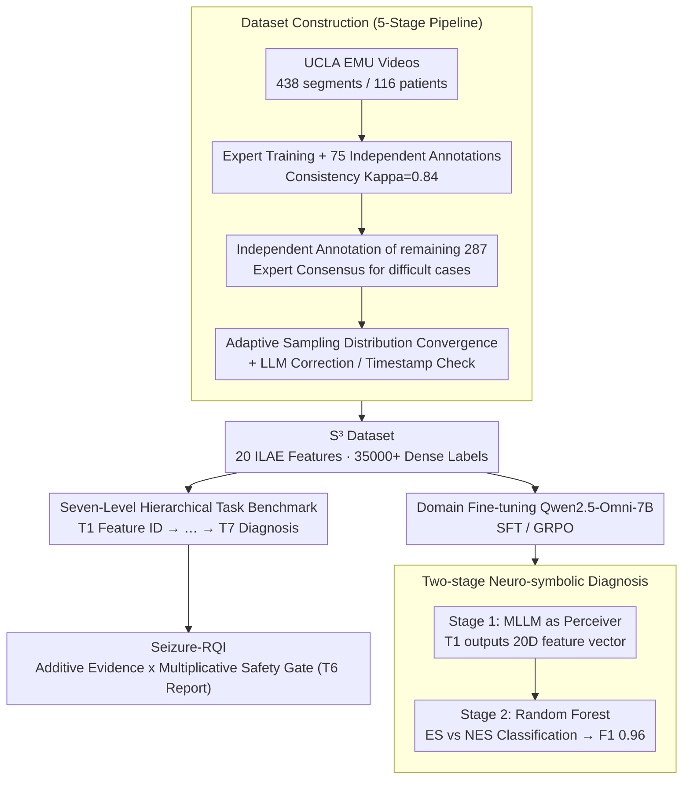

# Seizure-Semiology-Suite (S³): A Clinically Multimodal Dataset, Benchmark, and Models for Seizure Semiology Understanding

**Conference**: ICML 2026 Spotlight  
**arXiv**: [2605.21852](https://arxiv.org/abs/2605.21852)  
**Code**: Yes (GitHub: SeizureSemiologySuite)  
**Area**: Medical Imaging / Multimodal VLM / Video Understanding  
**Keywords**: Seizure Semiology, Clinical Video Understanding, Multimodal Large Language Models, Report Quality Assessment, Neuro-symbolic Classification

## TL;DR
This paper constructs S³, the first large-scale expert-annotated seizure video dataset (438 videos, 35,000+ dense labels, 20 ILAE semiological features), accompanied by a seven-level hierarchical task benchmark and a clinically aligned Seizure-RQI report quality metric. It systematically exposes the failure modes of 11 open-source MLLMs in temporal localization, spatial lateralization, and clinical faithfulness, and elevates seizure vs. non-seizure classification F1 to 0.96 through domain fine-tuning and a two-stage neuro-symbolic framework.

## Background & Motivation

**Background**: Seizure semiology is the core basis for diagnosing seizure types, locating the seizure onset zone (SOZ), and assessing SUDEP risk. Currently, it relies mainly on trained epileptologists' manual frame-by-frame review of long-term Video-EEG Monitoring (EMU) recordings, which is highly subjective, labor-intensive, and nearly impossible to scale in resource-limited areas.

**Limitations of Prior Work**: Automated methods have long been trapped in two extremes—one is narrow-task discriminative pipelines (3D CNNs for tonic-clonic detection, accelerometers, optical flow segmentation, CNN classifiers) that only output coarse-grained "yes/no" labels, losing descriptive interpretability; the other is applying general video QA MLLMs (ActivityNet-QA, MSRVTT-QA, MotionBench) directly to seizure videos, but these datasets are dominated by "purposeful, daily activities" and do not cover the category of "involuntary, pathological movement." Meanwhile, representative medical video understanding datasets (MedVidQA, SV-RCNet) concentrate on procedural scenes like surgery, assuming pre-defined temporal structures, which are entirely different from seizure onset.

**Key Challenge**: For MLLMs to be clinically usable, they must simultaneously perform correctly in "spatial lateralization (patient's left vs right)," "symptom co-occurrence," "temporal evolution of symptoms (ictal march)," and "narrative report generation." However, there is a current lack of training/evaluation data with dense expert labels, as well as evaluation metrics that can distinguish between "high BLEU but clinically incorrect" and "low BLEU but clinically correct"—traditional N-gram metrics and BERTScore show almost no correlation with clinical factuality.

**Goal**: (i) Build a seizure video dataset with dense ILAE standardized semiological feature annotations specifically for MLLMs; (ii) Design a hierarchical task system covering the full stack from "perception → reasoning → reporting → diagnosis"; (iii) Propose a report quality metric aligned with expert judgment; (iv) Provide a domain-adapted training solution closing the loop on this dataset.

**Key Insight**: Deconstruct the clinical expert's cognitive process for interpreting seizure videos into seven layers—feature identification of single frames/short windows → explanation of feature evidence → lateral/anatomical spatial analysis → temporal boundary localization → ordered sequence of symptoms → narrative reporting → comprehensive diagnosis. By scoring each layer independently, the MLLM's "system performance" is decomposed to identify "which link has the most severe weakness," providing a precise diagnosis for subsequent model iterations.

**Core Idea**: Use a "four-piece suite" consisting of domain expert annotation + clinical task stratification + clinically aligned metrics + neuro-symbolic decoupling to transform general MLLMs into clinically trustworthy seizure semiology interpreters.

## Method

### Overall Architecture
S³ implements the complete chain of clinical expert seizure video interpretation into a data-evaluation-model suite. **Data-side** is the Seizure-Semiology-Dataset: 438 continuous videos from 116 adult patients at UCLA EMU (2019–2023), where experts annotated 20 ILAE-defined semiological features (automatisms, tonic, clonic, etc.). Each feature includes "occurrence + start/end timestamps + textual rationale," totaling 35,000+ labels, split at the patient level (4:1) for training/testing while maintaining the ES (epileptic seizures) : NES (non-epileptic seizures) ratio. **Evaluation-side** is the Seizure-Semiology-Bench, which decomposes "video understanding" into 7 tasks of increasing difficulty, each with its own prompt template, sampling protocol (30s sliding window, event-centric cropping, sparse sampling), and evaluation metrics. **Model-side** involves SFT and GRPO seizure-specific fine-tuning on Qwen2.5-Omni-7B, alongside a proposed two-stage neuro-symbolic classifier that decouples perception from diagnostic reasoning. The data quality is maintained by a five-stage annotation pipeline: expert training → independent annotation of 75 segments for consistency validation (Kappa = 0.8395) → independent annotation of the remaining 287 segments (consensus arbitration by 3 experts for difficult cases) → adaptive sampling to verify feature distribution and expert convergence (ES Pearson 0.893, NES Pearson 0.782) → LLM text error correction + rule-based timestamp verification.

### Key Designs

**1. Dataset Construction (Seizure-Semiology-Dataset): Creating the first large-scale expert densely annotated seizure video data using a five-stage pipeline.**

The fundamental hurdle for MLLMs in seizure semiology has been the absence of training/evaluation data with expert-level dense annotations—existing medical video datasets only cover procedural scenes, and general video QA datasets only cover daily activities, neither of which include "involuntary pathological movements." S³ filtered 438 continuous seizure videos with clear motion and full-body visibility from 116 adult patients at UCLA EMU (2019–2023). It annotates 20 ILAE standardized semiological features for "occurrence + timestamps + rationale," totaling 35,000+ dense labels, with a 4:1 patient-level split (test set: 82 segments / 24 patients).

The credibility of the dense annotations is ensured by a five-stage pipeline: ① Experts use representative cases for feature calibration training; ② Annotators independently label 75 segments compared against experts (Kappa = 0.8395); ③ Annotators independently label the remaining 287 segments, with difficult cases arbitrated by a 3-expert consensus; ④ Adaptive sampling continuously compares feature distributions until statistical convergence (ES Pearson 0.893, NES Pearson 0.782); ⑤ LLMs correct grammatical/semantic errors in rationales, and rules validate timestamps. This chain allows non-expert annotators to produce clinically credible dense labels.

**2. Seven-Level Hierarchical Task Benchmark (Seizure-Semiology-Bench): Decomposing end-to-end black-box scores into accountable sub-capabilities.**

General MLLMs might achieve decent average scores while systematically failing in a critical clinical dimension (e.g., spatial lateralization). End-to-end "diagnostic accuracy" evaluation masks such failures. S³ therefore slices the clinical cognitive process into seven strictly increasing difficulty levels: Task 1 binary feature identification, Task 2 textual rationale generation, Task 3 spatial lateralization (fixed-choice anchored to patient's left/right), Task 4 temporal boundary localization (MM:SS timestamps), Task 5 symptom temporal ordering (Edit Distance / Temporal-F1 / LCS ratio), Task 6 narrative report generation, and Task 7 clinical diagnosis (ES vs NES, across video-only / report-augmented / two-stage variants).

The greatest value of this stratification is **traceability**: failures in later tasks can be traced back to earlier ones. For instance, poor Task 5 ordering can be decomposed into Task 1 identification errors ("what" error) plus Task 4 temporal errors ("when" error), precisely pinpointing the "weakest link." Experiments showed that as Qwen2.5-VL scaled from 7B to 72B, Task 1 average F1 only fluctuated between 0.42–0.45—proving that "scaling up" is not the cure; the bottleneck must be located through stratification.

**3. Seizure-RQI: A report quality metric aligned with expert judgment.**

Surface lexical metrics like BLEU/ROUGE/BERTScore show almost zero correlation with clinical judgment (Pearson $r \leq 0.10$). Seizure-RQI is designed around **additive evidence scores × multiplicative safety gates**: the base score is weighted from four clinical components—structural integrity $S$ (weight 15, presence of onset/propagation/postictal phases), symptom coverage $C$ (weight 35, correctly extracted features / ground truth features), key localization features $L$ (weight 25, match ratio for lateralization features), and temporal fidelity $T$ (weight 25, Temporal F1 of ordered feature lists); this is then multiplied by four penalty terms:

$$\mathrm{RQI} = (15S + 35C + 25L + 25T)\times P_{\text{hall}}\times P_{\text{off}}\times P_{\text{len}}\times P_{\text{haz}}$$

Where $P_{\text{hall}}$ penalizes hallucinated features, $P_{\text{off}}$ penalizes off-topic content (e.g., nursing interventions), $P_{\text{len}}$ penalizes excessive redundancy, and $P_{\text{haz}}$ penalizes hazardous clinical statements. Any safety issue directly depresses the total score through multiplication, rather than being diluted by higher scores in other areas. Validation shows RQI achieves a 0.57 Pearson correlation and 0.74 pairwise accuracy with expert judgment.

**4. Two-Stage Neuro-symbolic Diagnosis Framework: MLLM as a feature engineer rather than a diagnostic physician.**

Directly asking MLLMs for end-to-end diagnosis from video is prone to "hallucinatory reasoning" in long temporal contexts. The authors found that after domain fine-tuning, the visual recognition (Task 1) approached expert levels, but "rule-based reasoning based on multiple features" remained unstable. The framework decouples these: Phase 1 uses the MLLM purely as a perceiver, running Task 1 to output a 20-dimensional binary feature vector $v \in \{0,1\}^{20}$, compressing high-dimensional unstructured video into structured, interpretable clinical feature representations; Phase 2 feeds $v$ into a shallow statistical classifier like a Random Forest for ES vs NES discrimination.

This decoupling provides more stable diagnosis and enables Random Forest to output feature importance (e.g., tonic, head version, rapid blinking, or nocturnal onset receiving high weights), offering interpretability far superior to end-to-end MLLMs—critical for gaining physician trust in clinical deployment. This framework pushed ES vs NES F1 from 0.70 (direct diagnosis) to 0.96.

### Loss & Training
Two types of seizure-specific fine-tuning were applied to Qwen2.5-Omni-7B: **(i) SFT** using (video, prompt, answer) triplets for supervised learning; **(ii) GRPO** (Group Relative Policy Optimization) with task-customized rewards—Accuracy for Task 1/3/7, composite BLEU+ROUGE for Task 2/6, temporal proximity for Task 4, and LCS ratio for Task 5. GRPO revealed a counter-intuitive lesson: using BLEU/ROUGE as rewards for Task 6 forced the model toward repetitive output, because these metrics do not reflect clinical relevance—reaffirming the necessity of Seizure-RQI.

## Key Experimental Results

### Main Results

| Task / Metric | Best Baseline MLLM | seizure_omni_sft | seizure_omni_grpo | Note |
|---|---|---|---|---|
| Task 1 F1 (Feature ID) | Qwen2.5-VL-72B ≈ 0.43 | **0.47** | 0.43 | SFT 7B exceeds 72B general model |
| Task 4 Avg MAE (sec) | Qwen2.5-VL-32B 8.19 (start) / 12.72 (end) | 23.02 | **20.02** | GRPO improves 21.5% over baseline 25.50 |
| Task 5 LCS ratio | Qwen3-Omni-30B 0.43 | 0.18 | 0.18 | 50% gain over Qwen2.5-Omni baseline 0.12 |
| Task 6 Seizure-RQI | Lingshu-32B **39.80** | 31.69 | 36.44 | Small gap between medical pre-trained and general models |
| Task 7 ES vs NES F1 (video-only) | Lingshu-32B 0.84 | 0.71 | 0.77 | Limited upper bound for end-to-end MLLM |
| Task 7 F1 (two-stage) | — | **0.96** | 0.94 | First pure-video 0.96 on large-scale dataset |

### Ablation Study

| Configuration | Avg Task 7 F1 | Key Finding |
|---|---|---|
| Direct MLLM (w/o rpt) | 0.70 | Baseline for end-to-end diagnosis |
| Report-augmented (w/ rpt) | 0.79 | Ground truth report provides +0.09 gain |
| Two-stage Neuro-symbolic | **0.86** | +0.16 avg gain, exceeding ground truth report help |
| Seizure-RQI vs Lexical | Pearson 0.57 vs ≤0.10 | Significant clinical alignment |
| 2 FPS → 4 FPS → 10 FPS | Task 1 F1 +0.06 / +0.08 | Sampling rate is not the primary bottleneck |
| 60-frame sparse sampling | Avg MAE +4.91s | Temporal localization is a fundamental MLLM flaw |

### Key Findings
- **Scale is not the cure**: Scaling Qwen2.5-VL from 7B to 72B provided almost no gain in Task 1, indicating a lack of inductive bias for pathological motion in the architecture.
- **Fine-tuning vs. Catastrophic Forgetting**: SFT/GRPO brought 12%/15% gains across six tasks, but for Task 3 (lateralization) where samples were scarce, the model collapsed to only outputting "left" (F1 = 0.00).
- **Multimodal fusion is superior**: Qwen3-Omni-30B outperformed pure vision/audio models on sound-related features, proving semiology requires auditory signals (e.g., vocalization, responsiveness).
- **Medical pre-training is a double-edged sword**: Lingshu-32B achieved the best video-only Task 7 F1 (0.84) but dropped to 0.60 when adding reports, suggesting linguistic reasoning was weakened by narrow medical fine-tuning.
- **Spatial lateralization is an open problem**: Even with explicit prompting, Task 3 F1 remained < 0.2, likely due to the lack of spatial relationship data in pre-training corpora.

## Highlights & Insights
- **Traceability in Task Stratification**: Explicitly attributing Task 5 (ordering) errors to Task 1 (ID) + Task 4 (localization) provides a "diagnostic benchmark" applicable to any long-temporal multi-step reasoning task.
- **Multiplicative Penalty Structure in Seizure-RQI**: This "additive evidence + multiplicative safety gate" paradigm can be mapped to any high-risk clinical text generation evaluation (radiology, pathology, etc.).
- **Interpretability via Neuro-symbolic Decoupling**: Treating the MLLM as a "feature engineer" provides both superior performance (F1=0.96) and feature importance rankings, which is crucial for moving AI-assisted diagnosis into real-world clinical workflows.
- **GRPO Reward Selection Lesson**: The failure of BLEU/ROUGE as rewards highlights that RL phases must use rewards truly aligned with downstream goals.

## Limitations & Future Work
- Data source restricted to UCLA (adult patients); lacks pediatric and cross-institutional validation; insufficient samples for lateralization sub-tasks (< 100).
- FPS limitation systemically loses information for high-frequency events like rapid blinking.
- Temporal localization remains a fundamental short-coming; future work envisions agentic frameworks for tool-enhanced iterative refinement.
- Lack of fusion with physiological signals (EEG, MRI) and prospective clinical deployment validation.

## Related Work & Insights
- **vs MedVidQA / SV-RCNet**: These target "intentional, procedural" videos; S³ fills the gap for "involuntary pathological motion."
- **vs MotionBench**: General fine-grained motion benchmarks do not proxy for clinical lateralization or pathological evolution capabilities.
- **vs RadGraph**: While RadGraph evaluates radiology report entity relations, S³-RQI adds narrative structure and temporal consistency dimensions.
- **vs Traditional Seizure Detectors**: Previous methods output coarse categories; S³'s generative paradigm provides rationales, reports, and diagnosis aligned with expert reasoning.

## Rating
- Novelty: ⭐⭐⭐⭐ (Comprehensive integration of dataset + benchmark + metrics + training strategy)
- Experimental Thoroughness: ⭐⭐⭐⭐⭐ (Across 11 MLLMs, multiple training paradigms, and clinician comparison)
- Writing Quality: ⭐⭐⭐⭐ (Clear stratification and mechanistic analysis of failures)
- Value: ⭐⭐⭐⭐⭐ (Provides a blueprint for high-risk clinical report evaluation and neuro-symbolic engineering)

<!-- RELATED:START -->

## Related Papers

- [\[ICML 2026\] DIYHealth Suite: Dataset, Model, and Benchmark for Health Management at Home](diyhealth_suite_dataset_model_and_benchmark_for_health_management_at_home.md)
- [\[CVPR 2026\] Gastric-X: A Multimodal Multi-Phase Benchmark Dataset for Advancing Vision-Language Models in Gastric Cancer Analysis](../../CVPR2026/medical_imaging/gastric-x_a_multimodal_multi-phase_benchmark_dataset_for_advancing_vision-langua.md)
- [\[NeurIPS 2025\] FAPEX: Fractional Amplitude-Phase Expressor for Robust Cross-Subject Seizure Prediction](../../NeurIPS2025/medical_imaging/fapex_fractional_amplitude-phase_expressor_for_robust_cross-subject_seizure_pred.md)
- [\[ICML 2026\] SynerMedGen: Synergizing Medical Multimodal Understanding with Generation via Task Alignment](synermedgen_synergizing_medical_multimodal_understanding_with_generation_via_tas.md)
- [\[CVPR 2026\] MedMO: Grounding and Understanding Multimodal Large Language Model for Medical Images](../../CVPR2026/medical_imaging/medmo_grounding_and_understanding_multimodal_large_language_model_for_medical_im.md)

<!-- RELATED:END -->
