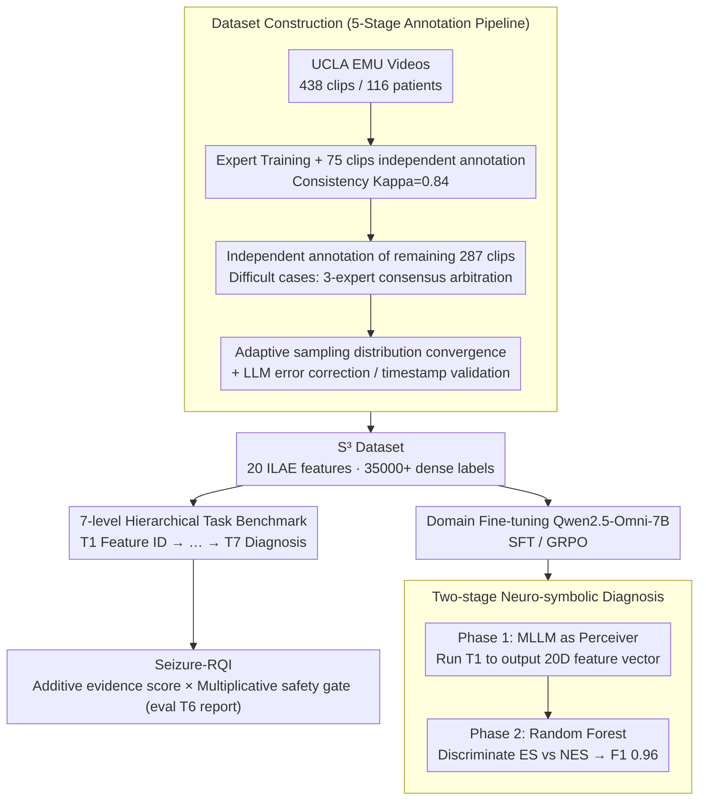

# Seizure-Semiology-Suite (S³): A Clinically Multimodal Dataset, Benchmark, and Models for Seizure Semiology Understanding

**Conference**: ICML 2026 Spotlight  
**arXiv**: [2605.21852](https://arxiv.org/abs/2605.21852)  
**Code**: Available (GitHub: SeizureSemiologySuite)  
**Area**: Medical Imaging / Multimodal VLM / Video Understanding  
**Keywords**: Seizure Semiology, Clinical Video Understanding, Multimodal Large Language Models, Report Quality Evaluation, Neuro-symbolic Classification

## TL;DR
This paper constructs the first large-scale expert-annotated seizure video dataset, S³ (438 clips, 35,000+ dense labels, 20 ILAE semiology features). It introduces a seven-level hierarchical task benchmark and a clinically aligned Seizure-RQI report quality metric. The study systematically exposes 11 open-source MLLMs' failure modes in temporal localization, spatial lateralization, and clinical faithfulness, and achieves an ES vs. NES classification F1 of 0.96 through domain fine-tuning and a two-stage neuro-symbolic framework.

## Background & Motivation

**Background**: Seizure semiology is the core evidence for clinically diagnosing seizure types, localizing the seizure onset zone (SOZ), and assessing SUDEP risk. Currently, it relies heavily on trained epilepsy experts manually reviewing long-term video-electroencephalogram monitoring (EMU) footage frame-by-frame, which is highly subjective, labor-intensive, and nearly impossible to scale in resource-limited areas.

**Limitations of Prior Work**: Automated methods have long been trapped at two extremes: one is narrow-task discriminative pipelines (3D CNNs for tonic-clonic detection, accelerometers, optical flow segmentation, CNN classifiers) that only output coarse-grained "yes/no" labels, losing descriptive interpretability; the other is the direct application of MLLMs from general video QA datasets (ActivityNet-QA, MSRVTT-QA, MotionBench) to seizure videos. However, these datasets focus on "purposeful, daily activities" and do not cover "involuntary, pathological movements." Furthermore, representative medical video datasets (MedVidQA, SV-RCNet) center on procedural scenes like surgery, assuming a preset temporal structure that differs entirely from seizure episodes.

**Key Challenge**: For MLLMs to be clinically viable, they must correctly handle "spatial lateralization (patient's left vs. right)," "symptom co-occurrence," "temporal evolution of symptoms (ictal march)," and "narrative report generation" simultaneously. However, there is a lack of training/evaluation data with dense expert labels and a lack of metrics that can distinguish between "high BLEU but clinically incorrect" and "low BLEU but clinically correct"—traditional N-gram metrics and BERTScore show almost no correlation with clinical factuality.

**Goal**: (i) Create a seizure video dataset with dense annotations of ILAE standardized semiology features specifically for MLLMs; (ii) design a hierarchical task system covering the full stack of "Perception → Reasoning → Reporting → Diagnosis"; (iii) propose a report quality metric aligned with expert judgment; (iv) provide a closed-loop domain-adaptive training solution on this dataset.

**Key Insight**: The cognitive process of clinical experts interpreting seizure videos is decomposed into seven layers: single-frame/short-window feature recognition → feature evidence explanation → lateral/anatomical spatial analysis → temporal boundary localization → ordered sequence of symptoms → narrative reporting → comprehensive diagnosis. By scoring each layer independently, the MLLM's "system performance" is broken down to identify exactly "which stage is the weakest link," providing a precise diagnosis for future model iterations.

**Core Idea**: Transform general MLLMs into clinically trustworthy seizure semiology interpreters using a fourfold approach: "Domain Expert Annotation + Clinical Task Stratification + Clinically Aligned Metrics + Neuro-symbolic Decoupling."

## Method

### Overall Architecture
S³ implements the complete clinical video interpretation workflow as a three-part suite: data, evaluation, and model. **Data side**: The Seizure-Semiology-Dataset consists of 438 continuous video clips from 116 adult patients (UCLA EMU 2019–2023). Experts annotated 20 ILAE-defined semiology features (e.g., automatisms, tonic, clonic). Each feature includes "occurrence + start/end timestamps + textual rationale," totaling 35,000+ labels. Data is split 4:1 at the patient level for training/testing while maintaining the ES (Epileptic Seizure) to NES (Non-Epileptic Seizure) ratio. **Evaluation side**: The Seizure-Semiology-Bench decomposes "video understanding" into 7 tasks of increasing difficulty, each with its own prompt template, sampling protocol (30s sliding window, event-centered cropping, sparse sampling), and evaluation metrics. **Model side**: Domain-specific fine-tuning (SFT and GRPO) is performed on Qwen2.5-Omni-7B, and a two-stage neuro-symbolic classifier is proposed to decouple perception from diagnostic reasoning. Data quality is ensured by a five-stage annotation pipeline: expert training → 75-clip independent annotation for consistency (Kappa = 0.8395) → independent annotation of the remaining 287 clips (with 3-expert consensus for difficult cases) → adaptive sampling to verify feature distribution convergence (ES Pearson 0.893, NES Pearson 0.782) → LLM textual error correction + rule-based timestamp validation.

### Key Designs

**1. Dataset Construction (Seizure-Semiology-Dataset): Using a 5-stage pipeline to create the first large-scale expert-annotated seizure video data.**

The primary bottleneck for MLLMs in seizure semiology has been the absence of training/evaluation data with expert-level dense annotations. Existing medical video datasets cover only procedural scenes, and general video QA datasets only cover daily activities, neither including "involuntary pathological movements." S³ filtered 438 continuous seizure videos with clear movement and full-body visibility from 116 adult patients at UCLA EMU (2019–2023). Each clip was annotated for 20 ILAE standardized semiology features, including "occurrence + start/end timestamps + textual rationale," for 35,000+ dense labels. The test set includes 82 clips from 24 patients.

Reliability is ensured via a five-stage pipeline: ① Experts used representative examples to train annotators for feature calibration; ② Annotators independently labeled 75 clips, achieving a Kappa of 0.8395 against experts; ③ Annotators independently labeled the remaining 287 clips, with disputes settled by 3-expert consensus; ④ Adaptive sampling continuously compared feature distributions between annotators and experts until statistical convergence (ES Pearson 0.893, NES Pearson 0.782); ⑤ LLMs corrected grammatical errors in rationales, and rule-based checks validated timestamps. This chain ensures clinical credibility for non-expert annotators' output.

**2. 7-level Hierarchical Task Benchmark (Seizure-Semiology-Bench): Decomposing end-to-end black-box scores into accountable sub-capabilities.**

General MLLMs may achieve decent average scores while failing systematically in a clinical dimension (e.g., spatial lateralization). End-to-end "diagnostic accuracy" masks these failures. S³ partitions the clinical cognitive flow into seven layers of strictly increasing difficulty: Task 1: Binary Feature Recognition (20 yes/no prompts); Task 2: Textual Rationale Generation (explaining feature presence); Task 3: Spatial Lateralization (forced-choice anchoring to patient's left/right); Task 4: Temporal Boundary Localization (MM:SS timestamps, evaluated via second-level MAE); Task 5: Symptom Sequence Ordering (Edit Distance, Temporal-F1, LCS ratio); Task 6: Narrative Report Generation; Task 7: Clinical Diagnosis (ES vs. NES, compared across video-only, report-augmented, and two-stage settings).

The greatest value of this hierarchy is **traceability**: failures in later tasks can be traced back. For example, poor performance in Task 5 (ordering) can be decomposed into Task 1 errors ("what" is wrong) plus Task 4 errors ("when" is wrong), pinpointing the weakest link. Experiments showed that scaling Qwen2.5-VL from 7B to 72B only shifted Task 1 average F1 between 0.42–0.45—proving that scale is not the cure; the bottleneck must be identified through stratification.

**3. Seizure-RQI: A Report Quality Metric Aligned with Expert Judgment.**

Surface metrics like BLEU/ROUGE/BERTScore show nearly zero correlation with clinical judgment (Pearson $r \leq 0.10$), often favoring reports that are "high BLEU but clinically wrong." Seizure-RQI's design philosophy is **additive evidence score × multiplicative safety gates**: the base score is weighted from four clinical components—structural integrity $S$ (weight 15, covers onset/propagation/postictal phases), symptom coverage $C$ (weight 35, correctly identified features / total ground truth features), key localization features $L$ (weight 25, match ratio for 4 lateralization features), and temporal fidelity $T$ (weight 25, Temporal F1 of the ordered feature list); this is then multiplied by four penalty terms:

$$\mathrm{RQI} = (15S + 35C + 25L + 25T)\times P_{\text{hall}}\times P_{\text{off}}\times P_{\text{len}}\times P_{\text{haz}}$$

where $P_{\text{hall}}$ penalizes hallucinated features, $P_{\text{off}}$ penalizes irrelevant content (e.g., nursing interventions), $P_{\text{len}}$ penalizes excessive redundancy, and $P_{\text{haz}}$ penalizes hazardous clinical statements. Any safety issue directly suppresses the score through multiplication, unlike a weighted sum where high scores elsewhere might dilute the error. Validation shows RQI reaches a Pearson correlation of 0.57 with experts (pairwise accuracy 0.74), significantly higher than general metrics (≈0.54).

**4. Two-stage Neuro-symbolic Diagnosis Framework: Using MLLM as a Feature Engineer rather than a Diagnostician.**

Direct end-to-end diagnosis by MLLMs is prone to "hallucinatory reasoning" over long temporal contexts. While domain-tuned MLLMs approach experts in visual recognition (Task 1), they remain unstable in "rule-based reasoning across multiple features." The framework decouples these: Phase 1 uses the MLLM purely as a perceiver, running Task 1 to output a 20-dimensional binary feature vector $v \in \{0,1\}^{20}$, compressing unstructured video into structured, interpretable clinical features. Phase 2 feeds $v$ into a shallow statistical classifier like Random Forest for ES vs. NES discrimination.

This decoupling stabilizes diagnosis, and Random Forest provides feature importance (e.g., tonicity, head version, rapid blinking, nocturnal onset receive high weights), offering far better interpretability than end-to-end MLLMs—crucial for winning physician trust. This framework combined with seizure_omni_sft-7B pushed ES vs. NES F1 from 0.70 (direct diagnosis) to 0.96.

### Loss & Training
Two types of seizure-specific fine-tuning were applied to Qwen2.5-Omni-7B: **(i) SFT** using (video, prompt, answer) triplets; **(ii) GRPO** (Group Relative Policy Optimization) with task-specific rewards—Accuracy for Tasks 1/3/7, a BLEU+ROUGE composite for Tasks 2/6, temporal proximity for Task 4, and LCS ratio for Task 5. GRPO revealed a counter-intuitive lesson: using BLEU/ROUGE as a reward in Task 6 pushed the model toward repetitive output, as these metrics do not reflect clinical relevance—further validating the necessity of Seizure-RQI.

## Key Experimental Results

### Main Results

| Task / Metric | Best Baseline MLLM | seizure_omni_sft | seizure_omni_grpo | Notes |
|---|---|---|---|---|
| Task 1 F1 (Feature ID) | Qwen2.5-VL-72B ≈ 0.43 | **0.47** | 0.43 | 7B SFT outperforms 72B general model |
| Task 4 Mean MAE (s) | Qwen2.5-VL-32B 8.19 On / 12.72 Off | 23.02 | **20.02** | GRPO improves 21.5% over baseline 25.50 |
| Task 5 LCS ratio | Qwen3-Omni-30B 0.43 | 0.18 | 0.18 | 50% Gain over Qwen2.5-Omni baseline 0.12 |
| Task 6 Seizure-RQI | Lingshu-32B **39.80** | 31.69 | 36.44 | Small gap between Med-PT and general models |
| Task 7 ES vs NES F1 (video-only) | Lingshu-32B 0.84 | 0.71 | 0.77 | Limited ceiling for end-to-end MLLM |
| Task 7 F1 (Two-stage N-S) | — | **0.96** | 0.94 | First pure-video achievement at scale |

### Ablation Study

| Configuration | Mean Task 7 F1 | Key Finding |
|---|---|---|
| Direct MLLM (w/o rpt) | 0.70 | End-to-end diagnosis as baseline |
| Report-augmented (w/ rpt) | 0.79 | Ground truth report provides +0.09 Gain |
| Two-stage Neuro-symbolic | **0.86** | Mean +0.16 Gain, exceeding ground-truth report aid |
| Seizure-RQI vs BLEU/ROUGE/BERTScore | Pearson 0.57 vs ≤0.10 | Significant clinical alignment |
| Frame Rate 2 → 4 → 10 FPS | Task 1 F1 +0.06 / +0.08 | Sampling rate is not the primary bottleneck |
| Task 4 Sparse 60 Frames | Mean MAE +4.91s | Temporal localization is a fundamental MLLM flaw |

### Key Findings
- **Scale is not the cure**: Qwen2.5-VL showed almost no improvement in Task 1 from 7B to 72B, suggesting architectures lack inductive bias for pathological movement, which cannot be fixed by parameter scaling alone.
- **Domain Tuning vs. Catastrophic Forgetting**: SFT/GRPO brought an average 12%/15% Gain across six tasks, but Task 3 (lateralization) collapsed (F1 = 0.00) due to small sample size (n=527, head turning only 98), where the model defaulted to only predicting "left." Domain adaptation requires sufficient sub-task samples.
- **Multimodal fusion is superior**: Qwen3-Omni-30B outperformed pure vision (Qwen2.5-VL-32B) and pure audio (Audio-Flamingo-3) on sound-related features, proving semiology requires auditory signals (e.g., vocalization, responsiveness).
- **Medical Pre-training is a double-edged sword**: Lingshu-32B achieved the best video-only Task 7 F1 (0.84), but adding reports caused it to drop to 0.60, indicating that linguistic reasoning capability was weakened by narrow medical fine-tuning.
- **Spatial Lateralization is an open problem**: Despite explicit prompting ("patient's left vs camera's left"), all models had Task 3 average F1 < 0.2. Prompt engineering cannot fix this; the root cause is the lack of spatial relationship data in pre-training corpora (e.g., LAION-2B).

## Highlights & Insights
- **Traceability in Task Hierarchy**: Explicitly attributing Task 5 (sequence) errors to Task 1 (recognition) and Task 4 (localization) cascade provides a "diagnostic benchmark" applicable to any long-context multi-step reasoning task.
- **Multiplicative Penalty Structure in Seizure-RQI**: Creating a structure of "additive evidence + multiplicative safety gates" allows safety issues to suppress scores regardless of other high-performing dimensions. This is a paradigm shift for high-risk clinical report evaluation (radiology, pathology, etc.).
- **Neuro-symbolic Decoupling for Interpretability**: Using MLLM as a "feature engineer" to feed a Random Forest achieves both high performance (F1=0.96) and feature ranking, making AI assistance more acceptable to physicians for clinical deployment.
- **GRPO Reward Lessons**: Using BLEU/ROUGE as a reward caused model degeneration (repetitive text), showing that RL stages must use rewards truly aligned with downstream clinical goals rather than proxy linguistic metrics.

## Limitations & Future Work
- Single-source data: Limited to UCLA adult patients (18–64); lacks pediatric data and multi-center validation. Sample sizes for lateralization sub-tasks are insufficient.
- Frame rate constraints: Evaluation at 2 FPS causes systematic data loss for high-frequency events like rapid blinking or subtle facial twitches.
- Temporal localization deficiency: MLLMs lack the retrospective refinement capability of clinicians; MAE remains at 8–12 seconds, far from ictal localization needs.
- Evaluation coverage: Does not integrate EEG or MRI signals; lacks prospective clinical deployment validation.

## Related Work & Insights
- **vs. MedVidQA / SV-RCNet**: These focus on "intentional, procedural" videos; S³ fills the gap for "involuntary motion + dense feature annotation."
- **vs. MotionBench**: MotionBench tests daily movements, while S³ tests clinical lateralization and temporal evolution, showing general fine-grained motion benchmarks do not proxy clinical ability.
- **vs. RadGraph**: While RadGraph uses graph structures for radiology reports, Seizure-RQI adds narrative structure (phases) and temporal consistency.
- **vs. Traditional Seizure Methods**: Generative paradigms in S³ provide rationales and narrative reports, aligning with the actual clinical reasoning process unlike previous "black-box" 3D CNN or sensor-based classifiers.

## Rating
- Novelty: ⭐⭐⭐⭐ The fourfold suite (dataset + task system + metrics + training) closed the loop on seizure semiology for the first time.
- Experimental Thoroughness: ⭐⭐⭐⭐⭐ 11 MLLMs evaluated + SFT/GRPO paradigms + neuro-symbolic comparison + 5 ablations + physician baseline.
- Writing Quality: ⭐⭐⭐⭐ Clear hierarchical narrative; failure modes are well-analyzed.
- Value: ⭐⭐⭐⭐⭐ Provides a dataset, benchmark, metric, and engineering paradigm (two-stage F1=0.96) that approaches the clinical usability threshold.

<!-- RELATED:START -->

## Related Papers

- [\[CVPR 2026\] Gastric-X: A Multimodal Multi-Phase Benchmark Dataset for Advancing Vision-Language Models in Gastric Cancer Analysis](../../CVPR2026/medical_imaging/gastric-x_a_multimodal_multi-phase_benchmark_dataset_for_advancing_vision-langua.md)
- [\[NeurIPS 2025\] FAPEX: Fractional Amplitude-Phase Expressor for Robust Cross-Subject Seizure Prediction](../../NeurIPS2025/medical_imaging/fapex_fractional_amplitude-phase_expressor_for_robust_cross-subject_seizure_pred.md)
- [\[ICML 2026\] SynerMedGen: Synergizing Medical Multimodal Understanding with Generation via Task Alignment](synermedgen_synergizing_medical_multimodal_understanding_with_generation_via_tas.md)
- [\[CVPR 2026\] MedMO: Grounding and Understanding Multimodal Large Language Model for Medical Images](../../CVPR2026/medical_imaging/medmo_grounding_and_understanding_multimodal_large_language_model_for_medical_im.md)
- [\[NeurIPS 2025\] THUNDER: Tile-level Histopathology image UNDERstanding benchmark](../../NeurIPS2025/medical_imaging/thunder_tile-level_histopathology_image_understanding_benchmark.md)

<!-- RELATED:END -->
