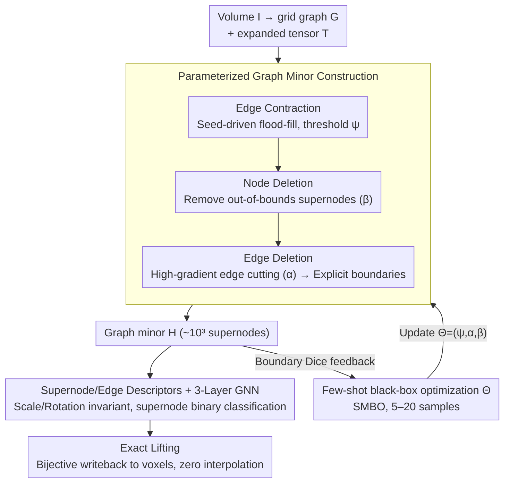

# SEMIR: Semantic Minor-Induced Representation Learning on Graphs for Visual Segmentation

**Conference**: ICML 2026  
**arXiv**: [2605.12389](https://arxiv.org/abs/2605.12389)  
**Code**: None (Repository link not provided in the paper)  
**Area**: Medical Image Segmentation / Graph Neural Networks  
**Keywords**: Graph minor, few-shot boundary alignment, superpixel, tumor segmentation, exact lifting

## TL;DR
SEMIR treats the voxel grid as a parent graph $G$ and compresses it into a "boundary-aligned" graph minor $H$ via parameterized edge contraction, node deletion, and edge deletion (reducing nodes from $\sim10^7$ to $\sim10^3$). It utilizes 5–20 few-shot samples to maximize boundary Dice via black-box optimization of $\Theta$, uses a GNN for supernode classification on the minor, and finally returns to the original grid through a bijective exact lifting. It consistently outperforms nnU-Net on minority class Dice for BraTS, KiTS, and LiTS tumor segmentation tasks while requiring only a 16GB T4 GPU.

## Background & Motivation

**Background**: The mainstream for medical voxel image segmentation involves dense convolutional or Transformer architectures like U-Net and Swin-UNETR, which perform voxel-wise softmax predictions on the original grid. To enable processing on $10^8$ voxels, these methods rely on patch slicing, downsampling, or pre-compression via manual superpixel methods (SLIC, Felzenszwalb).

**Limitations of Prior Work**: (1) The computational cost of dense inference is tied to the number of voxels rather than anatomical complexity—tumors may occupy < 1% of the volume but require 100% of the computation; (2) Extreme class imbalance leads to the dilution of gradient signals for minority classes (e.g., tumor, enhancing tumor); (3) Existing superpixel/pooling methods are task-agnostic, relying on low-level intensity grouping, failing to align with semantic boundaries, and requiring interpolation during lifting, which introduces boundary artifacts.

**Key Challenge**: A structural trade-off exists between "computability" and "boundary alignment." Multi-class joint segmentation forces all structures to compete for the same representation, while spatial scale variance necessitates a difficult balance between loss weights.

**Goal**: (1) Learn a task-adaptive, topology-preserving intermediate graph representation where inference cost scales with semantic boundary complexity rather than voxel count; (2) Support exact lifting with zero boundary artifacts; (3) Enable effective representation learning using extremely few samples (5–20).

**Key Insight**: Graph minor theory provides formal tools—edge contraction naturally induces a surjective partition from parent to child. Each supernode corresponds to a connected subset in the original graph, forming a "strictly non-overlapping" partition. Robertson-Seymour theory ensures polynomial measurability.

**Core Idea**: Treat graph compression itself as a representation space to be learned in a few-shot manner. Parameters $\Theta=\{\psi,\alpha,\beta\}$ control edge contraction, edge deletion, and node deletion. Black-box optimization maximizes boundary Dice on few-shot samples, followed by binary classification GNN on the compressed graph and lifting back to voxels.

## Method

### Overall Architecture
SEMIR addresses the structural contradiction between the high cost of dense voxel inference and semantic boundary misalignment. Instead of optimizing a segmentation network, it optimizes the graph space where inference occurs. A volume $I \in \mathbb{R}^{H \times W \times D \times C}$ is encoded into an $N$-connected grid graph $G$ and stored as an expanded tensor $T \in \{0,\dots,255\}^{(2H-1)\times(2W-1)\times(2D-1)}$. Even indices store node states, while odd indices store edge states. The pipeline is as follows: compress $G$ into a graph minor $H=S(T,\Theta)$ using current parameters $\Theta$; tune $\Theta$ for optimal boundary alignment using black-box optimization on 5–20 few-shot samples; extract supernode/edge features for a 3-layer GNN to perform supernode binary classification; and finally use the bijection recorded in $T$ to map supernode labels back to voxels with zero interpolation.

### Key Designs

**1. Parameterized Graph Minor Construction: Compressing the voxel grid into a boundary-aligned, topology-preserving sparse graph with exact lifting**

Dense inference is limited by voxel count rather than anatomical complexity, while classic superpixels are task-agnostic and require interpolation. SEMIR solves this using three cascaded graph operators. First, seed-driven flood-fill **edge contraction** merges adjacent voxel $p$ into seed $s$ if and only if $\|I_p - I_s\|_n \le \psi$. Crucially, the threshold is relative to the seed rather than the rolling mean, preserving low-contrast gradients as chains of adjacent supernodes. Second, **node deletion** removes supernodes with area $a_v$ or mean intensity $\bar{I}_v$ outside specified bounds (controlled by $\beta=(\beta_{\min}, \beta_{\max}, m_{\min}, m_{\max})$), effectively cleaning acquisition noise. Deleted regions default to background (0), ensuring conservative pruning. Finally, **edge deletion** cuts edges if $\|\bar{I}_{v_i}-\bar{I}_{v_j}\|_n > \alpha$, turning high gradients into explicit cuts that define segmentation boundaries. These operators preserve topology while allowing task-driven tuning. Lemma 3.1 guarantees each supernode corresponds to a connected subgraph in $G$, while Theorem 3.2 ensures exact bijective lifting with zero boundary artifacts—resolving a long-standing issue in superpixel methods.

**2. Few-shot Black-box Optimization of $\Theta$: Replacing manual threshold tuning with data-driven boundary alignment learning**

Traditional superpixel parameters $\psi, \alpha, \beta$ are typically manually tuned, which is uninterpretable and task-misaligned. SEMIR models the search for these parameters as minimizing binary boundary Dice: $\Theta_{\text{opt}} = \arg\min_\Theta \mathbb{E}[1 - \text{DSC}(S_B(T,\Theta), Y_B)]$. The boundary Dice loss is defined as $L(\hat{Y}_B, Y_B) = 1 - \frac{2|\hat{Y}_B \cap Y_B|}{|\hat{Y}_B| + |Y_B|}$. SMBO with ExtraTrees as a surrogate searches the space using 5–20 annotations. The supervision $Y_B$ is derived from task-specific semantic boundaries, independent of class IDs. This few-shot capability arises because $\Theta$ does not define a fixed network but parameterizes a family of graph homomorphisms $\pi_\Theta: G \to H_\Theta$. The search space is constrained by physical meaning (low-dimensional, interpretable), making "learning structure" more efficient than "learning hyper-parameters."

**3. Scale/Rotation Invariant Supernode/Edge Descriptors + GNN Inference: Robust prediction for anisotropic medical volumes**

Voxel spacing in CT/MRI is often anisotropic, making absolute geometric measures unreliable. Thus, all descriptors are invariant. Supernode features include voxel count $a_u$, per-channel intensity standard deviation $\sigma_u$, intensity covariance $\Sigma_u$, principal axis direction $d_u$ (from the largest eigenvector of spatial covariance), elongation $\text{elong}_u=\sqrt{(\lambda_{u,1}+\varepsilon)/(\lambda_{u,2}+\varepsilon)}$, boundary length $b_u$, and 3D compactness $\text{comp}_u = 36\pi a_u^2/(b_u^3+\varepsilon)$. Edges use log-ratio for scale-invariant relative differences. Log-ratio and covariance eigenvectors provide scale and rotation invariance, while compactness and elongation distinguish between geometric differences like "vessel-like thin structures" and "tumor-like masses." Features are fed into a 3-layer GINE (hidden 128, Adam lr $10^{-3}$, early-stopping on validation Dice). Each target structure has an independent binary supernode classifier.

### Loss & Training
The two stages have different objectives: minor construction uses black-box SMBO without differentiable gradients, while the GNN stage uses standard voxel-level Dice/BCE (compared after lifting). Each target structure (ET, TC, tumor, liver) has a minor independently constructed and a binary model trained. Multi-class segmentation is achieved by merging per-target results via confidence-weighted voting or energy minimization, eliminating class imbalance by design rather than balancing loss weights.

## Key Experimental Results

### Main Results (Against nnU-Net, binary target-vs-rest)

| Dataset | Target | nnU-Net DSC | SEMIR DSC | Training Time |
|---------|--------|-------------|-----------|---------------|
| BraTS   | ET     | 0.812       | **0.894 ± 0.006** | 43 h vs 2.5 h (T4) |
| BraTS   | TC     | 0.829       | **0.941 ± 0.002** | 39 h vs 1.6 h (T4) |
| KiTS    | T      | 0.720       | **0.819 ± 0.006** | 19 h vs 0.8 h (T4) |
| LiTS    | T      | 0.733       | **0.891 ± 0.007** | 11 h vs 0.6 h (T4) |

Contextual comparison with Prev. SOTA (task-specific protocols, minority Dice): BraTS ET 0.894 is comparable to GTMamba (0.884); KiTS T 0.819 is significantly higher than ConvOccNet (0.693) and Swin UNETR (0.343); LiTS T 0.891 exceeds most published baselines.

### Ablation Study

BraTS ET / NWPU VHR-10 IoU:

| Ablation | BraTS ET | NWPU VHR-10 | Description |
|----------|----------|-------------|-------------|
| Full SEMIR | 0.894 | 0.862 | Complete method |
| w/o edge contraction | 0.441 | 0.408 | Minor degrades to voxel graph, fragmented -51% |
| w/o edge deletion | 0.719 | 0.681 | No explicit boundaries; supernodes cross semantic edges |
| w/o node deletion | 0.812 | 0.749 | Noise supernodes not pruned |
| Learned $\Theta$ (5-shot) | 0.894 | 0.789 | 5 samples are sufficient |
| Fixed manual $\Theta$ | 0.837 | 0.763 | Few-shot learned partition is superior |
| w/o edge features | 0.725 | 0.741 | Missing relative geometric signals |
| w/o spatial features | 0.661 | 0.629 | Compactness/elongation are critical |

### Key Findings
- The graph minor reduces inference nodes from $\sim10^7$ to $\sim10^3$, scaling complexity with "semantic boundary complexity" rather than "voxel resolution." This explains why Ours outperforms nnU-Net on 16GB T4 GPUs, whereas nnU-Net is 20×–60× slower and often requires A100s.
- Optimization of $\Theta$ with 5 samples outperforms manual tuning, proving the hypothesis space is small and physically well-constrained—a key return on "learning structure."
- On the non-medical NWPU aerial dataset, SEMIR achieves 0.862 IoU for small objects (dropping to 0.408 without edge contraction), indicating general applicability of minor construction to high-resolution small-object issues.

## Highlights & Insights
- Applying graph minor theory to segmentation provides an algebraic foundation for "strict topology preservation + bijective lifting," eliminating interpolation artifacts—a chronic issue for superpixel methods.
- The perspective of "optimizing the inference space rather than the segmentation model" is profound. It resolves class imbalance structurally via per-target binary tasks and moves task adaptation to the partition layer.
- Engineering-wise, the expanded tensor $T$ uses single-byte storage, and the Rust backend performs flood-fill on CPU in under a second. This decouples compute-intensive from data-intensive tasks, feeding GNNs with pre-computed graph batches.

## Limitations & Future Work
- Sensitivity to boundary statistics: In regions with low contrast or poor multi-modal fusion, incorrect $\alpha$ values can misalign minor boundaries; few-shot sets may lack coverage of rare pathological morphologies.
- Lack of end-to-end joint optimization: Current minor construction and GNN are modular/decoupled. Pseudo-random traversal also introduces slight run-to-run jitters.
- Evaluation is limited to CT/MRI; modalities with significantly different noise distributions (Ultrasound, Pathology) remain unverified. Node deletion's pruning of anomalies requires clinician oversight to avoid missing rare pathologies.

## Related Work & Insights
- **vs nnU-Net**: Dense voxel inference is heavily impacted by class imbalance for minority classes. Ours resolves this via per-target binary minors, gaining +8.2 for BraTS ET, +9.9 for KiTS T, and +15.8 for LiTS T.
- **vs SLIC / Felzenszwalb**: These are task-agnostic, manually tuned, and require interpolation. Ours provides task-aware black-box optimization and exact lifting.
- **vs DiffPool / MinCutPool**: These learn soft clusters without lifting guarantees. Ours uses graph homomorphism hard partitions, which are theoretically more robust for reconstruction.

## Rating
- Novelty: ⭐⭐⭐⭐⭐ First use of graph minor + few-shot boundary alignment for inference space representation learning.
- Experimental Thoroughness: ⭐⭐⭐⭐ 3 medical datasets + nnU-Net comparison + NWPU cross-domain ablation; clearly noted protocol differences in SOTA comparisons.
- Writing Quality: ⭐⭐⭐⭐⭐ Excellent narrative, flowing from "density vs structure" to graph minor theory, operators, and formal proofs.
- Value: ⭐⭐⭐⭐⭐ Enables superior performance on 16GB T4 relative to A100-dependent models, offering game-changing potential for resource-constrained clinical deployment.

<!-- RELATED:START -->

## Related Papers

- [\[ICLR 2026\] SEED: Towards More Accurate Semantic Evaluation for Visual Brain Decoding](../../ICLR2026/medical_imaging/seed_towards_more_accurate_semantic_evaluation_for_visual_brain_decoding.md)
- [\[NeurIPS 2025\] SynBrain: Enhancing Visual-to-fMRI Synthesis via Probabilistic Representation Learning](../../NeurIPS2025/medical_imaging/synbrain_enhancing_visual-to-fmri_synthesis_via_probabilistic_representation_lea.md)
- [\[ICML 2026\] MedCRP-CL: Continual Medical Image Segmentation via Bayesian Nonparametric Semantic Modality Discovery](medcrp-cl_continual_medical_image_segmentation_via_bayesian_nonparametric_semant.md)
- [\[CVPR 2026\] Multimodal Causality-Driven Representation Learning for Generalizable Medical Image Segmentation](../../CVPR2026/medical_imaging/multimodal_causal-driven_representation_learning_for_generalizable_medical_image.md)
- [\[ICLR 2026\] A Structured, Tagged, and Localized Visual Question Answering Dataset with Full Sentence Answers and Scene Graphs for Chest X-ray Images](../../ICLR2026/medical_imaging/a_structured_tagged_and_localized_visual_question_answering_dataset_with_full_se.md)

<!-- RELATED:END -->
