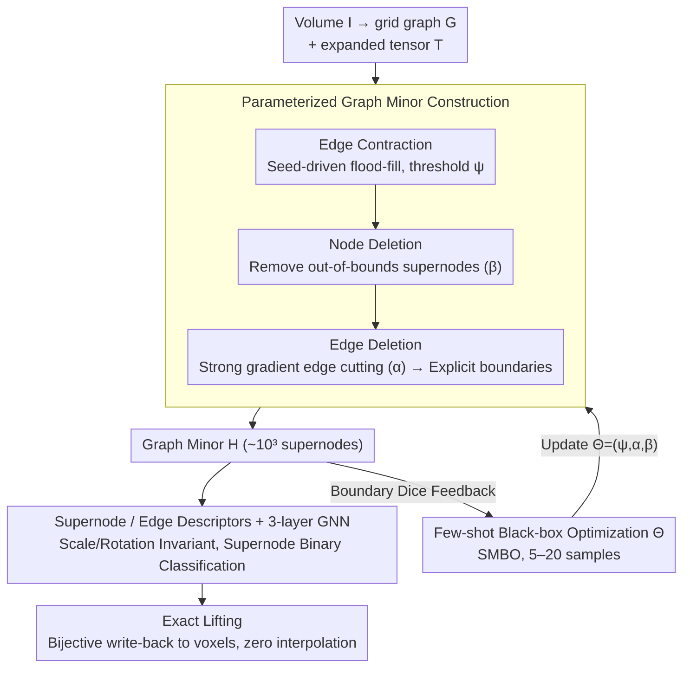

# SEMIR: Semantic Minor-Induced Representation Learning on Graphs for Visual Segmentation

**Conference**: ICML 2026  
**arXiv**: [2605.12389](https://arxiv.org/abs/2605.12389)  
**Code**: None (Repository link not provided in the paper)  
**Area**: Medical Image Segmentation / Graph Neural Networks  
**Keywords**: Graph minor, few-shot boundary alignment, superpixels, tumor segmentation, exact lifting

## TL;DR
SEMIR treats the voxel grid as a base graph $G$ and compresses it into a "boundary-aligned" graph minor $H$ via parameterized edge contraction, node deletion, and edge deletion (reducing node count from $\sim10^7$ to $\sim10^3$). It utilizes 5–20 few-shot samples for black-box optimization of $\Theta$ to maximize boundary Dice, performs supernode classification with a GNN on the minor, and finally returns to the original grid via a bijective exact lifting. It consistently outperforms nnU-Net on minority class Dice across BraTS, KiTS, and LiTS tumor segmentation tasks, requiring only a 16GB T4 GPU.

## Background & Motivation

**Background**: The mainstream of medical voxel image segmentation consists of dense convolutional or Transformer architectures such as U-Net and Swin-UNETR, which perform voxel-wise softmax prediction on the original grid. To maintain tractability on $10^8$ voxels, these methods rely on patch slicing, downsampling, or pre-compression via manual superpixel methods (e.g., SLIC, Felzenszwalb).

**Limitations of Prior Work**: (1) The computational complexity of dense inference is tied to the number of voxels rather than the complexity of anatomical structures—tumors occupying < 1% of the volume still incur 100% of the computation. (2) Extreme class imbalance dilutes the gradient signals for minority classes (e.g., tumor, enhancing tumor). (3) Existing superpixel and pooling methods are "task-agnostic," relying on low-level intensity grouping that fails to align with semantic boundaries and introduces artifacts during interpolation when mapping predictions back to voxels.

**Key Challenge**: A structural trade-off exists between "computational feasibility" and "boundary alignment." Multi-class joint segmentation forces all structures to compete for the same representation, while spatial scale disparities compel a precarious balancing act between loss weights.

**Goal**: (1) Learn a "task-adaptive, topology-preserving" intermediate graph representation where inference cost scales with semantic boundary complexity rather than voxel count. (2) Support exact lifting with zero boundary artifacts. (3) Enable the representation to be learned effectively with very few samples (5–20).

**Key Insight**: Graph minor theory provides formal tools—edge contraction naturally induces a surjective partition from parent to child, where each supernode corresponds to a connected subset of the original graph, forming a "strictly non-overlapping" partition. This is supported by polynomial measurability from Robertson-Seymour.

**Core Idea**: Treat the graph compression itself as a representation space to be learned via few-shot optimization. Parameters $\Theta=\{\psi,\alpha,\beta\}$ control three classes of operations: contraction, edge deletion, and node deletion. Black-box optimization is used to maximize boundary Dice on few-shot samples, followed by binary classification GNNs on the compressed graph and lifting back to voxels.

## Method

### Overall Architecture
SEMIR addresses the structural contradiction between the high cost of dense voxel inference and semantic boundary misalignment by optimizing the graph space where inference occurs rather than the segmentation network itself. A volume $I \in \mathbb{R}^{H \times W \times D \times C}$ is encoded into an $N$-connected grid graph $G$ and stored as an expanded tensor $T \in \{0,\dots,255\}^{(2H-1)\times(2W-1)\times(2D-1)}$, where even indices store node states and odd indices store edge states. The pipeline is as follows: the current parameters $\Theta$ compress $G$ into a graph minor $H=S(T,\Theta)$. Black-box optimization tunes $\Theta$ on 5–20 few-shot samples to maximize boundary alignment. The optimized minor is then used to extract supernode/edge features for a 3-layer GNN performing binary classification. Finally, supernode labels are mapped back to voxels using the bijection recorded in $T$, achieving zero-interpolation write-back.

### Key Designs

**1. Parameterized graph minor construction: Compressing voxel grids into boundary-aligned, topology-preserving, and exactly liftable sparse graphs**

The bottleneck of dense inference is that complexity is tied to voxel count rather than anatomical complexity. Furthermore, classical superpixels are task-agnostic and require interpolation for write-back. SEMIR solves this using a cascade of three graph operators. First is seed-driven flood-fill **edge contraction**: an adjacent voxel $p$ is merged into seed $s$ if and only if $\|I_p - I_s\|_n \le \psi$. Crucially, the threshold is relative to the seed rather than the rolling mean of the current supernode, ensuring that low-contrast gradients are preserved as a chain of adjacent supernodes rather than collapsing into a single mass. This is followed by **node deletion**, which removes supernodes with area $a_v$ or mean intensity $\bar{I}_v$ outside specified bounds (controlled by $\beta=(\beta_{\min}, \beta_{\max}, m_{\min}, m_{\max})$) to eliminate acquisition noise. Regions deleted are filled with 0 (background) by default, ensuring conservative removal rather than false positives. Finally, **edge deletion** severs edges between adjacent supernodes if $\|\bar{I}_{v_i}-\bar{I}_{v_j}\|_n > \alpha$, turning strong gradients into explicit cuts that define segmentation boundaries. These operators preserve topology while allowing for task-driven parameter tuning. Algebraic guarantees underpin this: Lemma 3.1 ensures each supernode corresponds to a connected subgraph in $G$ (strictly non-overlapping partition), and Theorem 3.2 guarantees that write-back is an exact bijection with zero boundary artifacts—curing the chronic interpolation issues of superpixel methods.

**2. Few-shot black-box optimization of $\Theta$: Replacing manual superpixel thresholding with data-driven boundary alignment learning**

In traditional superpixel methods, $\psi$, $\alpha$, and $\beta$ are tuned manually, which is neither interpretable nor semantically aligned. SEMIR models the search for these parameters as minimizing the binary boundary Dice. The objective is $\Theta_{\text{opt}} = \arg\min_\Theta \mathbb{E}[1 - \text{DSC}(S_B(T,\Theta), Y_B)]$, where the boundary Dice loss is $L(\hat{Y}_B, Y_B) = 1 - \frac{2|\hat{Y}_B \cap Y_B|}{|\hat{Y}_B| + |Y_B|}$. Sequential Model-Based Optimization (SMBO) using ExtraTrees as a surrogate searches across 5–20 annotations. The supervision signal $Y_B$ is derived from task-specific semantic boundary maps, independent of specific class IDs. This achieves success with very few samples because $\Theta$ is not a hyperparameter of a fixed network but parameterizes a family of graph homomorphisms $\pi_\Theta: G \to H_\Theta$. Each $\Theta$ corresponds to a partition; few-shot search optimizes the partition structure itself. The search space is naturally constrained by physical meaning (low-dimensional, interpretable parameters), making 5–20 samples sufficient. This represents the payoff of "learning structure" versus "learning hyperparameters."

**3. Scale/Rotation-invariant supernode/edge descriptors + GNN inference: Robust prediction for anisotropic medical volumes**

Voxel spacing in CT/MRI is anisotropic, making absolute geometric measures unreliable. Thus, all descriptors are invariants. For each supernode, features include voxel count $a_u$, standard deviation of intensity per channel $\sigma_u$, intensity covariance $\Sigma_u$, principal axis direction $d_u$ (from the spatial covariance's dominant eigenvector), elongation $\text{elong}_u=\sqrt{(\lambda_{u,1}+\varepsilon)/(\lambda_{u,2}+\varepsilon)}$, boundary length $b_u$, and 3D compactness $\text{comp}_u = 36\pi a_u^2/(b_u^3+\varepsilon)$. For edges, log-ratios of adjacent supernodes calculate scale-invariant relative differences. Log-ratios and covariance eigenvectors naturally provide scale and rotation invariance, while compactness and elongation combined with covariance effectively distinguish geometric differences like "vessel-like thin structures" versus "tumor-like masses." These features are fed into a 3-layer GINE (hidden 128, Adam lr $10^{-3}$, early-stopped on validation Dice), with an individual supernode binary classifier trained for each target structure.

### Loss & Training
The two stages use different optimization objectives: the minor construction stage uses black-box SMBO via a surrogate to find $\Theta$ without differentiable gradients; the GNN stage uses standard voxel-level Dice/BCE (compared after lifting back to voxels). Minors are constructed and binary classifiers are trained independently for each target structure (ET, TC, tumor, liver). Multi-class segmentation is then achieved by merging these per-target results using confidence-weighted voting or energy minimization, effectively eliminating class imbalance by design rather than balancing multi-class loss weights.

## Key Experimental Results

### Main Results (Comparison with nnU-Net on equivalent splits, binary target-vs-rest)

| Dataset | Target | nnU-Net DSC | SEMIR DSC | Training Time |
|---------|--------|-------------|-----------|---------------|
| BraTS   | ET     | 0.812       | **0.894 ± 0.006** | 43 h vs 2.5 h (T4) |
| BraTS   | TC     | 0.829       | **0.941 ± 0.002** | 39 h vs 1.6 h (T4) |
| KiTS    | T      | 0.720       | **0.819 ± 0.006** | 19 h vs 0.8 h (T4) |
| LiTS    | T      | 0.733       | **0.891 ± 0.007** | 11 h vs 0.6 h (T4) |

Contextual comparison with published SOTA (dataset-specific protocols, minority class Dice): The BraTS ET score of 0.894 is nearly tied with GTMamba (0.884); KiTS T at 0.819 is significantly higher than ConvOccNet (0.693) and Swin UNETR (0.343); LiTS T at 0.891 exceeds most published baselines.

### Ablation Study

Results for BraTS ET / NWPU VHR-10 IoU:

| Ablation | BraTS ET | NWPU VHR-10 | Description |
|----------|----------|-------------|-------------|
| Full SEMIR | 0.894 | 0.862 | Complete method |
| w/o edge contraction | 0.441 | 0.408 | Minor degrades to voxel graph; fragmentation -51% |
| w/o edge deletion | 0.719 | 0.681 | No explicit boundaries; supernodes cross semantic edges |
| w/o node deletion | 0.812 | 0.749 | Noise supernodes were not pruned |
| Learned $\Theta$ (5-shot) | 0.894 | 0.789 | 5 samples are sufficient |
| Fixed manual $\Theta$ | 0.837 | 0.763 | Few-shot learned partition is superior |
| w/o edge features | 0.725 | 0.741 | Missing relative geometric signals |
| w/o spatial features | 0.661 | 0.629 | Compactness/elongation are critical |

### Key Findings
- The minor reduces inference nodes from $\sim10^7$ to $\sim10^3$; complexity scales with "semantic boundary complexity" rather than "voxel resolution." This explains why SEMIR on a 16GB T4 can outperform nnU-Net, which is 20×–60× slower and requires an A100.
- Optimization of few-shot $\Theta$ beats the best manual tuning with only 5 samples, proving that the effective hypothesis space for $\Theta$ is small and well-constrained physically.
- SEMIR still achieves 0.862 IoU for small objects on the non-medical NWPU aerial imagery (dropping to 0.408 without edge contraction), indicating the general applicability of minor construction to "small objects + high resolution" vision problems.

## Highlights & Insights
- Implementing graph minors—a relatively niche tool from graph theory—for segmentation provides an algebraic foundation for "strict topology preservation + bijective lifting," eliminating interpolation artifacts, a chronic issue in superpixel methods for decades.
- The shift from optimizing the segmentation model to optimizing the "inference space" is a profound perspective: it fundamentally addresses class imbalance via per-target binary decomposition and places task adaptation in the "partition" layer rather than the "network weight" layer.
- The expanded tensor $T$ uses single-byte storage for node/edge states, and a Rust-backend flood-fill constructs the minor in under one second on the CPU. Engineering-wise, this decouples "compute-intensive" from "data-intensive" tasks, providing the GPU with pre-computed graph batches. This CPU-GPU asynchronous design is applicable to other vision tasks requiring sparsification.

## Limitations & Future Work
- Sensitivity to boundary statistics: In low-contrast or poorly fused multi-modal regions, an incorrect $\alpha$ choice can shift the minor boundaries; generalization may be limited if the few-shot set fails to cover rare pathological morphologies.
- Currently, minor construction and downstream GNN are decoupled (modular), lacking end-to-end joint optimization. Pseudo-random traversal also introduces slight run-to-run jitter.
- Evaluation is limited to CT/MRI volumetric imaging. Modalities with vastly different color/noise distributions (e.g., ultrasound, pathology) are not yet validated. The "discarding outlier regions" in node deletion may accidentally remove rare pathologies, requiring clinical oversight.

## Related Work & Insights
- **vs nnU-Net**: Dense voxel inference + multi-class joint training is severely impacted by class imbalance on minority classes; SEMIR resolves this by target through per-target binary minors, gaining +8.2 (BraTS ET), +9.9 (KiTS T), and +15.8 (LiTS T) points.
- **vs SLIC / Felzenszwalb Superpixels**: Task-agnostic, manually tuned, and require interpolation; SEMIR provides task-aware black-box optimization + exact lifting, treating "grouping" as a learnable partition family.
- **vs DiffPool / MinCutPool**: These learn soft clustering and lack lifting guarantees; SEMIR ensures invertibility through the hard partitioning of graph homomorphisms, making it theoretically more robust.

## Rating
- Novelty: ⭐⭐⭐⭐⭐ First application of graph minor + few-shot boundary alignment for inference space representation learning.
- Experimental Thoroughness: ⭐⭐⭐⭐ Three medical datasets + nnU-Net comparison + NWPU cross-domain ablation + complete ablation; specific protocol differences with published SOTA are clearly noted.
- Writing Quality: ⭐⭐⭐⭐⭐ Extremely clear narrative, progressing smoothly from "density vs structure" to graph minor theory, specific operators, and Lemma/Theorem proofs.
- Value: ⭐⭐⭐⭐⭐ Enabling a 16GB T4 to outperform nnU-Net on an A100 is potentially game-changing for resource-constrained clinical deployments.

<!-- RELATED:START -->

## Related Papers

- [\[ICLR 2026\] SEED: Towards More Accurate Semantic Evaluation for Visual Brain Decoding](../../ICLR2026/medical_imaging/seed_towards_more_accurate_semantic_evaluation_for_visual_brain_decoding.md)
- [\[NeurIPS 2025\] SynBrain: Enhancing Visual-to-fMRI Synthesis via Probabilistic Representation Learning](../../NeurIPS2025/medical_imaging/synbrain_enhancing_visual-to-fmri_synthesis_via_probabilistic_representation_lea.md)
- [\[ICML 2026\] MedCRP-CL: Continual Medical Image Segmentation via Bayesian Nonparametric Semantic Modality Discovery](medcrp-cl_continual_medical_image_segmentation_via_bayesian_nonparametric_semant.md)
- [\[CVPR 2026\] Multimodal Causality-Driven Representation Learning for Generalizable Medical Image Segmentation](../../CVPR2026/medical_imaging/multimodal_causal-driven_representation_learning_for_generalizable_medical_image.md)
- [\[CVPR 2026\] Semantic Class Distribution Learning for Debiasing Semi-Supervised Medical Image Segmentation](../../CVPR2026/medical_imaging/semantic_class_distribution_learning_for_debiasing.md)

<!-- RELATED:END -->
