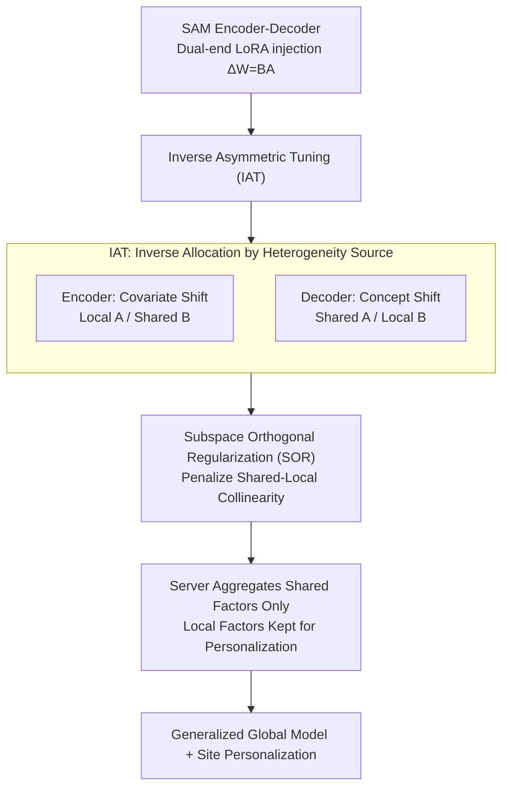

# Shift-Dependent Asymmetry: Orthogonal Inverse Low-Rank Adaptation for Federated Medical Segmentation

**Conference**: ICML2026  
**arXiv**: [2606.08687](https://arxiv.org/abs/2606.08687)  
**Code**: To be confirmed  
**Area**: Medical Imaging / Federated Learning / Parameter-Efficient Fine-tuning  
**Keywords**: Federated Learning, LoRA, Medical Segmentation, Encoder-Decoder Asymmetry, Subspace Orthogonality

## TL;DR
Addressing the issue of data heterogeneity across clients when using Federated LoRA to fine-tune large medical segmentation models, this paper discovers that encoders and decoders face fundamentally different sources of heterogeneity (encoders are dominated by appearance/acquisition shifts, while decoders are dominated by annotation/concept shifts). Consequently, it proposes IAT to **inversely allocate** shared/local LoRA factors across these two modules and utilizes SOR subspace orthogonal regularization to block the leakage of "local updates into shared directions" caused by bilinear parameterization. This approach consistently outperforms strong Federated LoRA baselines on histopathology and fundus medical segmentation tasks.

## Background & Motivation

**Background**: medical image segmentation requires multi-center data for robustness, but patient privacy prevents the centralization of raw images. Federated Learning (FL) allows institutions to collaborate without exchanging raw data. To integrate foundation models like SAM into the federated workflow, LoRA is commonly used to transmit only low-rank factors to save communication costs. Thus, "Federated LoRA" has become a mainstream paradigm.

**Limitations of Prior Work**: Standard LoRA aggregation faces an inherent contradiction—LoRA is bilinear $\Delta W=BA$, and since matrix multiplication is non-linear, simply averaging the decomposed factors on the server side **generally fails to reconstruct the average of effective updates**. Expanding the formula introduces a coupling term $\overline{B}\,\overline{A}=\frac{1}{K}\sum_k[B_kA_k+(B_k-\overline{B})(A_k-\overline{A})]$, where $(B_k-\overline{B})(A_k-\overline{A})$ represents interference from conflicting local updates, which is amplified under non-IID conditions and contaminates the global model. Existing Federated LoRA remedies involve "freezing one factor" or "sharing only one specific matrix," but these apply a **one-size-fits-all uniform splitting rule to the entire network**.

**Key Challenge**: Medical segmentation follows an encoder-decoder architecture, where both ends face **structurally opposite** sources of heterogeneity. The encoder is primarily dominated by covariate shift (changes in input distribution $P(\mathbf{x})$, such as appearance differences from different scanning devices); the decoder is primarily dominated by concept shift (changes in conditional distribution $P(\mathbf{y}|\mathbf{x})$, such as different annotation standards). Uniform splitting rules ignore these role differences, entangling "shared anatomical knowledge" with "site-specific biases."

**Goal**: (1) Design a structure-aware framework that distinguishes encoder/decoder roles and allocates LoRA shared/local factors based on the source of heterogeneity; (2) Further ensure that decoupled subspaces remain truly independent in optimization dynamics without leakage.

**Key Insight**: The authors start with a theoretical question—under covariate shift vs. concept shift, which factor does "minimizing the reconstruction error of a linear proxy layer" prefer to localize? Proposition 3.1 provides a clean conclusion: under covariate shift, one should share $B$ and localize $A$ (to align with client-specific input row spaces); under concept shift, one should share $A$ and localize $B$ (to align with client-specific output column spaces).

**Core Idea**: Replace the uniform splitting rule with "Inverse Asymmetric Tuning (IAT)"—the encoder uses "Local $A$ / Shared $B$" and the decoder uses "Shared $A$ / Local $B$," precisely matching parameter roles to the dominant heterogeneity source of each module. Additionally, an orthogonal regularization is added to block leakage caused by bilinear coupling.

## Method

### Overall Architecture
The segmentation network is defined as $\mathcal{F}=\mathcal{D}\circ\mathcal{E}$ (Encoder $\mathcal{E}$ + Decoder $\mathcal{D}$), with LoRA injected into both ends (ablation shows that injecting LoRA only in the encoder is insufficient for reconstructing pixel-level details). The complete method applies a two-pronged strategy of "structural decoupling + optimization decoupling": IAT handles the structural inverse allocation of LoRA factors (deciding which is local and which is shared), while SOR ensures the shared direction and local drift remain orthogonal during training dynamics to prevent leakage. The server only aggregates shared factors to obtain a generalized global model, while local factors remain on clients for personalization.

### Key Designs

**1. Inverse Asymmetric Tuning (IAT): Inverse Sharing Decisions for Encoder and Decoder Based on Heterogeneity Sources**

The limitation of uniform splitting rules is treating the encoder (appearance heterogeneity) and decoder (annotation heterogeneity) identically. IAT's rationale stems from Proposition 3.1's analysis of reconstruction error for a linear proxy layer $y=(W_0+BA)x$: under covariate shift (input subspace rotation $x_k=R_k x_\text{gen}$), error minimization prefers **Shared $B$, Local $A_k$** (to align site-specific input row spaces); under concept shift (target mapping rotation $y_k=T_k y_\text{gen}$), it prefers **Shared $A$, Local $B_k$** (to align site-specific output column spaces). Applying this to the network results in an inverse protocol: encoder layers $l\in\mathcal{E}$ adopt Local-$A$/Shared-$B$—clients locally optimize input projection $A_k$ to filter site-specific imaging artifacts, while the server only aggregates $B$: $B_{agg}^{(t+1,l)}\leftarrow\sum_k p_k B_k^{(t+1,l)}$; decoder layers $l\in\mathcal{D}$ conversely use Shared-$A$/Local-$B$—aggregating $A$ to maintain a consistent shared feature subspace $A_{agg}^{(t+1,l)}\leftarrow\sum_k p_k A_k^{(t+1,l)}$, while leaving output projection $B_k$ locally to adapt to diverse annotation standards. This "structural inversion" explicitly aligns parameter roles with the dominant source of heterogeneity in each module, which is the core observation of this paper—optimal sharing preferences are not static but **structurally flipped** between the encoder and decoder.

**2. Subspace Orthogonal Regularization (SOR): Blocking Local Update Leakage into Shared Directions via Bilinear Parameterization**

Structural separation alone is insufficient. Proposition 3.2 reveals that the optimization dynamics of the bilinear $\Delta W=BA$ remain entangled: the aggregated update of the shared factor $B$ can be decomposed into $B^{(t+1)}=B^{(t)}-\eta\underbrace{\sum_k p_k G_k\overline{A}^\top}_\text{common drift}-\eta\underbrace{\sum_k p_k G_k(A_k-\overline{A})^\top}_\text{heterogeneity leakage}$, where the last term is the leakage channel through which local bias $(A_k-\overline{A})$ contaminates the shared update (the same applies symmetrically to the decoder side with $A$ and $B$ roles swapped). SOR counteracts this by penalizing the alignment of the "shared update direction" and "local drift direction" within a compact $r\times r$ proxy space: using proxies $P_{sh},P_{lo}$ (encoder) and $Q_{sh},Q_{lo}$ (decoder) with stop-gradients, where local drift is constructed using the EMA of intra-round private factor drift. It then minimizes the square of their normalized Frobenius inner product $\mathcal{L}_\text{SOR}^{(k)}=\sum_{l\in\mathcal{E}}\big(\frac{\langle P_{sh},P_{lo}\rangle_F}{\|P_{sh}\|_F\|P_{lo}\|_F+\epsilon}\big)^2+\sum_{l\in\mathcal{D}}(\cdots)^2$. Due to the stop-gradient arrangement, SOR primarily generates gradients for the shared factors, forcing them to evolve orthogonally to local drift while leaving personalization unconstrained. The elegance of this soft geometric constraint is that it is calculated in the $r\times r$ low-rank proxy space, correcting gradient flow **without any additional communication**, ensuring the shared model only aggregates universal representations while site-specific changes are strictly isolated.

**3. Overall Objective with Convergence Guarantees: Proving Asymmetric Partial Sharing Does Not Break Convergence**

Each client optimizes $\mathcal{L}_\text{total}^{(k)}=\mathcal{L}_\text{seg}+\lambda\mathcal{L}_\text{SOR}^{(k)}$ (segmentation loss + SOR regularization), and the server aggregates only shared factors according to the IAT protocol. The authors explicitly parameterize the optimization space as $\Theta:=(\Theta^\text{sh},\{\Theta_k^\text{lo}\}_k)$. Under assumptions of $L$-smoothness, bounded gradients, and a low-rank specific "non-degenerate LoRA factor" ( $\sigma_\min\geq\delta>0$, ensuring the update direction is an effective descent direction), they prove (Theorem 3.1) that the method achieves a convergence rate of $\mathcal{O}(1/\sqrt{T})$, matching the standard rate of FedAvg in non-convex settings (differing only by low-order aggregation drift terms). This guarantee signifies that incorporating asymmetric partial sharing—sharing one half of the factors while keeping the other half local—does not sacrifice convergence theoretically.

### Loss & Training
The total local objective is $\mathcal{L}_\text{total}^{(k)}=\mathcal{L}_\text{seg}+\lambda\mathcal{L}_\text{SOR}^{(k)}$, where $\lambda$ controls the strength of the orthogonal regularization. Training spans $R$ communication rounds; in each round, clients perform $E$ local SGD steps to update both shared and local components, and the server aggregates only $\Theta^\text{sh}$. SOR constructs proxies using the detached parameter anchors $A_{0,k},B_{0,k}$ from the start of the round and the EMA of intra-round private factor drifts $\delta A_k,\delta B_k$. The stop-gradient ensures the regularization only shapes the shared factors.

## Key Experimental Results

### Main Results
On two types of medical segmentation tasks—Histology nuclei (7 datasets) and Fundus photography (4 datasets)—the method was compared against several strong Federated LoRA and parameter-efficient FL baselines using the Dice metric. Ours performed best on average for both types (at LoRA Rank=8):

| Dataset Group | Metric (Avg) | Ours | Second Best | Gain |
|---|---|---|---|---|
| Histology nuclei (7 sets) | Dice Avg | **81.40** | FedSA 80.09 | +1.31 |
| Fundus photography (4 sets) | Dice Avg | **84.52** | FedSA 83.04 | +1.48 |

Gains were particularly significant on challenging subsets, such as Drishti-GS1 in the fundus group, where Ours achieved 85.43, far exceeding FedSA's 80.64 and most baselines (FFA-LoRA: 29.07, FedIT: 57.74). This indicates that structure-aware allocation yields higher returns on sites with strong heterogeneity and large annotation differences. Trends were consistent at Rank=16 (some uniform splitting baselines like FedIT even dropped to 41.52 on certain sites, highlighting their insensitivity to module roles).

### Ablation Study

| Configuration | Key Phenomenon | Explanation |
|---|---|---|
| Encoder-only LoRA | Insufficient performance | Segmentation requires the decoder to reconstruct pixel-level details, validating dual-end injection. |
| Uniform Split | Significantly lower than IAT | Encoder/decoder roles are ignored, entangling shared and local components. |
| IAT Inverse Allocation | Superior to uniform baselines | Empirically confirms the preference inversion in Prop. 3.1. |
| + SOR | Further suppresses leakage | Orthogonal constraints in $r\times r$ proxy space without extra communication. |

### Key Findings
- **Optimal sharing preferences invert between the encoder and decoder** rather than remaining static—this is the most counter-intuitive finding and the foundation of the method, with the empirical "crossover" pattern matching Proposition 3.1.
- **Fragility of Uniform Splitting**: Baselines like FFA-LoRA and FedIT show a sharp drop in Dice (from high scores to single digits or 40s) on certain heterogeneous sites, proving that one-size-fits-all rules fail under asymmetric heterogeneity in medical segmentation.
- **SOR gains come from blocking leakage, not adding capacity**: It only adds orthogonal constraints to shared factors without touching personalization, and it calculates these in a low-rank proxy space with zero additional communication.

## Highlights & Insights
- **Turning "Module Role Differences" into a Theoretical Criterion**: Proposition 3.1 is not just a general suggestion but is derived directly from reconstruction error, establishing that "covariate shift shares $B$, concept shift shares $A$." This provides a provable basis for "inverse allocation" rather than just an engineering trick.
- **In-depth Diagnosis of Bilinear Leakage**: By decomposing the aggregate update of $B$ into "common drift + heterogeneity leakage," the paper precisely identifies the problem source and applies orthogonal regularization in the low-rank proxy space as a targeted solution.
- **Communication-Free Regularization Design**: The idea of imposing orthogonal constraints in $r\times r$ rather than full-dimensional space is transferable to any federated PEFT scenario where shared/local factors need decoupling.
- **Structure-Awareness > One-size-fits-all**: This insight is instructive for any federated fine-tuning involving encoder-decoder structures (not limited to medical segmentation)—one should avoid directly applying Federated LoRA protocols designed for decoder-only LLMs to dense prediction tasks.

## Limitations & Future Work
- **Dependence on Linear Proxies and Strong Assumptions**: Prop. 3.1 is based on a linear proxy layer and models heterogeneity via "input/output rotation"; the convergence proof requires a "non-degenerate LoRA factor" assumption. The approximation degree on a real non-linear SAM is not fully quantified.
- **Binary Heterogeneity Attribution**: Treating Encoder=Covariate Shift and Decoder=Concept Shift as dominant assumes a binary split. In reality, both shifts may coexist in the same module, and this hard dichotomy might not hold for all data.
- **Sensitivity to $\lambda$ and Rank Selection**: The impact of the SOR strength $\lambda$ and LoRA rank is only partially explored, and robustness under extreme non-IID or very few clients remains to be tested.
- **Scalability and Code**: The method was tested on histology/fundus data with limited clients; scalability to 3D volumetric data, cross-modal (CT/MRI) tasks, and larger client counts remains unverified.

## Related Work & Insights
- **vs FedSA / Asymmetric Sharing (Guo et al., 2025; Zhang et al., 2023)**: These also "share only specific factors" but use a **network-wide uniform** splitting rule; this paper points out that encoder/decoder roles are opposite in medical segmentation and should be **inversely** allocated.
- **vs FFA-LoRA (Freezing one factor)**: Freezing is a more aggressive "static split" that can fail catastrophically on heterogeneous sites (as seen in experiments); IAT allows localized factors to continue learning, preserving personalization.
- **vs Standard FedLoRA / FedIT (Naive Aggregation)**: Naively averaging decomposed factors introduces a coupling term $(B_k-\overline{B})(A_k-\overline{A})$ which is amplified under non-IID; this paper addresses both "aggregation inconsistency" and "training leakage."
- **vs Federated LoRA for LLMs**: Most Federated LoRA work targets decoder-only LLMs; medical segmentation involves encoder-decoder structures and pixel-level supervision, making standard LLM protocols sub-optimal.

## Rating
- Novelty: ⭐⭐⭐⭐ The "sharing preference inversion between encoder/decoder" observation + provable criteria is novel.
- Experimental Thoroughness: ⭐⭐⭐⭐ Tested on 11 medical segmentation datasets across two categories, multiple baselines, and dual ranks.
- Writing Quality: ⭐⭐⭐⭐ Clear logic from motivation and theory to method and convergence.
- Value: ⭐⭐⭐⭐ A practical solution for multi-center medical segmentation with foundation models under privacy constraints, with zero extra communication.

<!-- RELATED:START -->

## Related Papers

- [\[CVPR 2026\] Personalized Longitudinal Medical Report Generation via Temporally-Aware Federated Adaptation](../../CVPR2026/medical_imaging/personalized_longitudinal_medical_report_generation_via_temporally-aware_federat.md)
- [\[CVPR 2026\] KLIP: localized distribution shift detection via KL-divergence with diffusion priors in Inverse Problems](../../CVPR2026/medical_imaging/klip_localized_distribution_shift_detection_via_kl-divergence_with_diffusion_pri.md)
- [\[AAAI 2026\] Divide, Conquer and Unite: Hierarchical Style-Recalibrated Prototype Alignment for Federated Medical Segmentation](../../AAAI2026/medical_imaging/divide_conquer_and_unite_hierarchical_style-recalibrated_prototype_alignment_for.md)
- [\[CVPR 2026\] MedFG-VQA: Low-Frequency Memory and Graph Attention for Lightweight Medical VQA](../../CVPR2026/medical_imaging/medfg-vqa_low-frequency_memory_and_graph_attention_for_lightweight_medical_vqa.md)
- [\[CVPR 2026\] MedCLIPSeg: Probabilistic Vision-Language Adaptation for Data-Efficient and Generalizable Medical Image Segmentation](../../CVPR2026/medical_imaging/medclipseg_probabilistic_vision-language_adaptation_for_data-efficient_and_gener.md)

<!-- RELATED:END -->
