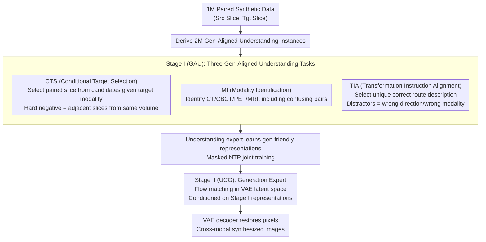

# SynerMedGen: Synergizing Medical Multimodal Understanding with Generation via Task Alignment

**Conference**: ICML 2026  
**arXiv**: [2605.08724](https://arxiv.org/abs/2605.08724)  
**Code**: https://github.com/Mhilab/SynerMedGen (Available)  
**Area**: Medical Image / Multimodal VLM / Cross-modal Synthesis  
**Keywords**: Unified Medical MLLM, Generation-aligned Understanding, Cross-modal Synthesis, CTS/MI/TIA, SynerMed Dataset

## TL;DR
SynerMedGen proposes the "generation-aligned understanding" principle—deriving understanding tasks directly from the same paired synthetic data (via CTS, MI, and TIA tasks). By employing a two-stage training process, the understanding branch first learns representations beneficial for synthesis before transitioning to the latent flow matching generation branch. This approach outperforms both specialized synthesis models and existing unified MLLMs across 22 medical synthesis tasks.

## Background & Motivation

**Background**: Unified medical MLLMs (e.g., HealthGPT, UniMedVL) have begun integrating "understanding" and "generation" into a single model—where understanding handles VQA/report generation and generation addresses cross-modal synthesis such as CT↔MR or PET↔CT. Architecturally, these models typically utilize dual-pathway or connector + diffusion hybrid designs.

**Limitations of Prior Work**: Existing unified frameworks treat understanding and generation as **two unrelated objectives**: the understanding side is trained with "recognition-style" tasks like lesion-level VQA, while the generation side uses pixel-level synthesis loss. Consequently, models may score high on VQA but fail to preserve anatomical structures or apply correct contrast transitions during cross-modal synthesis due to misaligned supervision.

**Key Challenge**: The "understanding" required for medical cross-modal synthesis involves **slice-level correspondence, modality identification, and transformation direction**, whereas traditional understanding supervision only provides "global semantics." The useful information between the two does not overlap.

**Goal**: To address a fundamental question often avoided in unified medical MLLMs: **What kind of "understanding" is truly useful for generation?** Based on this, the authors design specific tasks to bridge the gap.

**Key Insight**: Rather than treating understanding as an independent module, it should serve generation. By **deriving understanding tasks from the synthesis data itself**, training signals become naturally coupled. A two-stage training strategy ensures that multimodal priors learned in the first stage are naturally transferred to the generation stage through shared parameters.

**Core Idea**: Define the "generation-aligned understanding" principle → Design three understanding tasks directly corresponding to synthesis requirements (CTS for pairing, MI for modality control, TIA for transformation direction) → Implement two-stage "understanding-then-generation" training → Release the SynerMed dataset containing 1M paired samples and 2M understanding instances.

## Method

### Overall Architecture
Based on the Bagel unified architecture, the model consists of an understanding encoder $E_{\text{ViT}}$ producing semantic tokens $\mathbf{z}_{\text{ViT}}$ and a generation encoder $E_{\text{VAE}}$ producing latent tokens $\mathbf{z}_{\text{VAE}}$. Both tokens enter a shared Mixture-of-Transformer-experts (MoT) via projection. The MoT contains two experts: an understanding expert for VLM prompted learning and a generation expert for conditional latent synthesis. The pipeline starts with generating 2M understanding instances from 1M paired synthetic data (covering CTS, MI, and TIA). Training is divided into two stages: **Stage I (GAU)** trains the understanding expert on these three tasks; **Stage II (UCG)** initializes from Stage I and performs flow matching in the VAE latent space. All understanding tasks are formulated as "prompted-generation of short answer tokens," with the loss being a masked NTP calculated only on answer tokens: $\mathcal{L}_{\text{NTP}}(\mathbf{y}^*)=-\sum_i\log p_\theta(y_i^*\mid \mathbf{y}^*_{<i},\mathbf{x}_{\text{text}},\mathbf{z}_{\text{ViT}})$.

### Key Designs

The three understanding tasks are derived from the same paired synthetic data, targeting three types of priors needed for cross-modal synthesis: content (which two slices pair), modality (input/output modalities), and direction (what to change and what to keep).

**1. Conditional Target Selection (CTS): Capturing slice-level pairing**

Cross-modal synthesis must preserve patient-specific anatomy and lesions at the slice level. CTS formulates this as a multiple-choice prompt: given a target modality constraint $m_{\text{tgt}}$, the model identifies the true paired target slice $x^+=x_{\text{tgt}}$ from $N$ candidates based on the source slice $x_{\text{src}}$. The loss is defined as $\mathcal{L}_{\text{CTS}}=\mathcal{L}_{\text{NTP}}(\mathbf{y}^*_{\text{CTS}})$. The critical trick lies in selecting hard negatives: instead of random slices, **adjacent slices ($\pm 1 \sim \pm K$) from the same target volume** are used. This forces the model to differentiate at a fine-grained anatomical level rather than relying on coarse semantics.

**2. Modality Identification (MI): Making modality an explicit controllable factor**

If the understanding stage does not explicitly encode modality into the representation, the generation stage must struggle to extract it from entangled visual cues. MI uses the prompted-generation framework to have the model identify the modality of input images (CT, CBCT, PET, or MRI/sequences). The loss is $\mathcal{L}_{\text{MI}}=\mathcal{L}_{\text{NTP}}(\mathbf{y}^*_{\text{MI}})$. Confusing pairs (e.g., CT vs. CBCT) are intentionally included to force the model to capture the true features of the "modality" variable rather than superficial shortcuts.

**3. Transformation Instruction Alignment (TIA): Grounding transformation direction to text**

To clarify "what to change and what to keep," TIA provides a pair of images $(x_1, x_2)$ and requires the model to select the unique correct "route description" (e.g., "CT→MRI: Change contrast, preserve anatomy"). Each synthesis route maintains a description pool; the positive $e^+$ is drawn from the ground-truth route, while $R-1$ distractors are drawn from other routes, specifically including reversed directions and incorrect modalities. This grounds the synthesis route as an explicit concept for the model.

### Loss & Training
**Stage I (GAU)**: Joint training of the understanding expert on the three tasks: $\mathcal{L}_{\text{Stage I}}=\mathcal{L}_{\text{CTS}}+\mathcal{L}_{\text{MI}}+\mathcal{L}_{\text{TIA}}$. **Stage II (UCG)**: The generation expert performs conditional latent flow matching. The understanding expert and shared MoT, already optimized to be "generation-friendly" in Stage I, are further fine-tuned. The SynerMed dataset comprises 1M paired synthetic samples and 2M derived understanding instances.

## Key Experimental Results

### Main Results
Comparison across 22 synthesis tasks including SynthRAD2023 (CBCT↔CT, MRI↔CT, PET↔CT) and BraTS (T1/T2/T1c/FLAIR transitions). Metrics: SSIM (× 100).

| Task Direction | Pix2Pix | CycleGAN | BBDM | ResViT | SynDiff | RCD | HealthGPT | UniMedVL | **SynerMedGen** |
|----------|---------|----------|------|--------|---------|-----|-----------|----------|-----------------|
| Brain CBCT→CT | 66.17 | 53.32 | 71.09 | 85.00 | 85.47 | 85.97 | 57.37 | 51.48 | **87.15** |
| Pelvis CBCT→CT | 63.55 | 55.87 | 60.49 | 84.00 | 83.21 | 86.22 | 46.89 | 43.94 | **87.14** |
| Brain MRI→CT | 74.33 | 52.65 | 68.99 | 86.39 | 87.19 | 86.12 | 84.29 | 54.11 | **88.87** |
| Whole-Body CT→PET | 72.21 | 65.98 | 67.68 | 87.07 | 88.12 | 88.90 | 66.54 | 74.12 | **91.10** |
| BraTS T2→T1 | 59.34 | 57.19 | 56.77 | 86.94 | 88.31 | 88.01 | 60.13 | 77.26 | **90.58** |
| BraTS T1→T2 | 62.10 | 53.31 | 56.41 | 85.78 | 84.25 | 86.19 | 70.32 | 78.88 | **87.14** |

Ours ranks first in all 22 tasks, with a significant margin (+15~30 SSIM) over unified model baselines like HealthGPT and UniMedVL.

### Ablation Study

| Configuration | Avg SSIM Trend | Description |
|------|----------------|------|
| Full SynerMedGen (CTS+MI+TIA → UCG) | Optimal | All three tasks enabled |
| Standard VQA-style Understanding → UCG | Significant drop | Confirms "task misalignment" is the root cause |
| Only Stage I (GAU), Zero-shot Gen | **Strong zero-shot** | Synthesis capability without generative training |
| W/O CTS | Increased misalignment | Loss of slice-level anatomical consistency |
| W/O MI | Modality control failure | Missing modality-controllable factor |
| W/O TIA | Directional reversal | Lack of route-level grounding |

### Key Findings
- **Training only on understanding** without generative training still yields strong zero-shot SSIM, proving the "generation-aligned understanding" principle: the understanding stage effectively captures the representations needed for generation.
- The hard negative design in CTS (adjacent slices) is indispensable; replacing them with random slices degrades performance as the task reverts to coarse semantic recognition.
- In cross-dataset zero-shot tests, SynerMedGen maintains its advantage, indicating that the derived representations are universal priors independent of specific modalities or tasks.
- Unified MLLM baselines fail most significantly on subtle contrast synthesis (e.g., CBCT), proving that adding a generation head without aligning supervision is ineffective.

## Highlights & Insights
- "Deriving understanding tasks from generation data" is a **transferable design principle**—it can be applied to any unified understanding + generation work (video, 3D, code).
- The three tasks correspond to "content, modality, and direction" priors, geometrically covering all necessary dimensions for cross-modal synthesis and serving as a checklist for task design.
- The strong zero-shot generation in Stage I suggests that in unified models, the shared knowledge resides in the **multimodal priors implicit in the shared MoT parameters** rather than just token representations.

## Limitations & Future Work
- Currently limited to cross-modal 2D slice synthesis; 3D volumes and temporal (4D-CT) tasks are not yet covered.
- Understanding tasks are restricted to multiple-choice/classification; the impact of open-ended descriptive understanding on synthesis quality remains unexplored.
- Sequential training of Stage I and Stage II is computationally expensive for massive datasets; end-to-end joint training is worth investigating.
- Robustness to domain shift across different centers/scanners needs more extensive clinical evaluation.

## Related Work & Insights
- **vs HealthGPT**: HealthGPT uses task-specific adapters for separate understanding/generation, but supervision is misaligned; Ours improves performance by 15~30 SSIM by focusing on supervision design.
- **vs UniMedVL**: UniMedVL uses a progressive learning curriculum but relies on traditional understanding tasks; Ours proves that supervision alignment is more critical than curriculum alone.
- **vs General MLLMs (Bagel, Show-o, Janus)**: While those models achieve unity at the architecture level, this work achieves alignment at the "task design level."

## Rating
- Novelty: ⭐⭐⭐⭐⭐ The principle of "deriving understanding from generation" is explicitly proposed and cleanly instantiated.
- Experimental Thoroughness: ⭐⭐⭐⭐ 22 tasks, zero-shot tests, and a large-scale open-source dataset.
- Writing Quality: ⭐⭐⭐⭐ The triad of "content/modality/direction" is clearly articulated.
- Value: ⭐⭐⭐⭐ Sets a new SOTA for unified medical MLLMs and contributes a significant dataset (1M pairs + 2M tasks).

<!-- RELATED:START -->

## Related Papers

- [\[CVPR 2026\] MedGRPO: Multi-Task Reinforcement Learning for Heterogeneous Medical Video Understanding](../../CVPR2026/medical_imaging/medgrpo_multi-task_reinforcement_learning_for_heterogeneous_medical_video_unders.md)
- [\[ICML 2026\] CAME-Grad: The Double Dilemma in Multi-Task Radiology Report Generation — A Gradient Dynamics Analysis and Solution](the_double_dilemma_in_multi-task_radiology_report_generation_a_gradient_dynamics.md)
- [\[CVPR 2026\] MedMO: Grounding and Understanding Multimodal Large Language Model for Medical Images](../../CVPR2026/medical_imaging/medmo_grounding_and_understanding_multimodal_large_language_model_for_medical_im.md)
- [\[ICML 2026\] Seizure-Semiology-Suite (S³): A Clinically Multimodal Dataset, Benchmark, and Models for Seizure Semiology Understanding](seizure-semiology-suite_s3_a_clinically_multimodal_dataset_benchmark_and_models_.md)
- [\[CVPR 2026\] Sketch2CT: Multimodal Diffusion for Structure-Aware 3D Medical Volume Generation](../../CVPR2026/medical_imaging/sketch2ct_multimodal_diffusion_for_structure-aware_3d_medical_volume_generation.md)

<!-- RELATED:END -->
