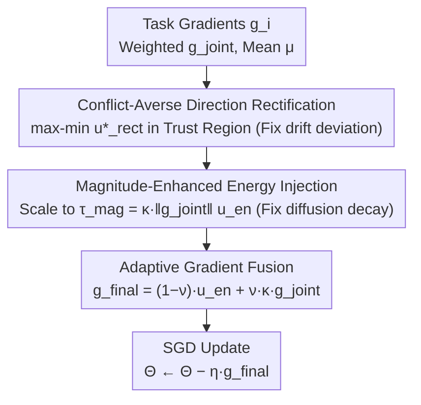

# CAME-Grad: The Double Dilemma in Multi-Task Radiology Report Generation — A Gradient Dynamics Analysis and Solution

**Conference**: ICML 2026  
**arXiv**: [2605.22635](https://arxiv.org/abs/2605.22635)  
**Code**: https://github.com/vpsg-research/CAME-Grad  
**Area**: Medical Imaging / Radiology Report Generation / Multi-task Optimization  
**Keywords**: Radiology Report Generation, Multi-task Learning, Gradient Conflict, SDE Analysis, Plug-and-play Optimizer

## TL;DR
This paper utilizes an SDE framework to analyze the dual nature of gradient conflicts between "report generation vs. clinical constraints" in Radiology Report Generation (RRG) — drift term deviation from Pareto optimality and diffusion term decay failing to escape local optima. The authors propose the CAME-Grad optimizer (Direction Rectification + Energy Injection + Adaptive Fusion) as a plug-and-play alternative to linear scaling, achieving average gains of +2.3% and +1.9% in clinical efficacy across 8 RRG methods on MIMIC-CXR and IU X-Ray.

## Background & Motivation

**Background**: RRG (Automated Radiology Report Generation) has evolved from single-task objectives (NLL supervision only) to multi-task learning, simultaneously learning report generation $\mathcal{L}_{rg}$ (language modeling requiring smooth semantic manifolds) and auxiliary tasks (disease classification / image-text alignment / retrieval augmentation requiring discrete rigid structures). Despite numerous architectural innovations, the **optimization end remains largely dependent on static linear weighting** $\mathcal{L}_{joint} = \sum_i \omega_i \mathcal{L}_i$.

**Limitations of Prior Work**: (1) Report generation requires smoothness while clinical constraints require hard boundaries; this inherent conflict causes report quality to drop when clinical supervision is strengthened and vice versa. (2) Linear scaling ignores gradient dynamics, leading to task interference after weighting. (3) Existing multi-task optimization methods (CAGrad / PCGrad / MGDA) primarily correct directions but overlook insufficient exploration caused by amplitude collapse — preventing the model from reaching flat minima.

**Key Challenge**: From an SDE perspective, SGD optimization $d\Theta_t = -\bm g_{joint}(\Theta_t) dt + \sqrt{\eta \Sigma}d\bm W_t$ consists of drift (first moment, determining convergence direction) and diffusion (second-order covariance, providing exploration to escape local traps). Gradient conflicts lead to both **drift deviation** (direction deviating from Pareto optimality) and **diffusion decay** (energy collapse, failing to escape sharp minima). Simply correcting the direction or increasing amplitude alone is insufficient; both must be addressed simultaneously.

**Goal**: (1) Reveal the root cause of linear scaling failures in RRG from an SDE perspective; (2) Design a unified optimizer that rectifies directions and enhances amplitude; (3) Develop a backbone-agnostic plug-and-play solution without architectural changes.

**Key Insight**: Observations show that the proportion of negative gradient inner products between RRG tasks reaches 53.8% (Figure 3), confirming the "intrinsic conflict" hypothesis. Since both direction and amplitude are compromised, the authors combine direction rectification (CAGrad-like) with energy injection (gradient magnitude amplification), followed by adaptive fusion to prevent deviating entirely from original directions and losing task-specific inductive biases.

**Core Idea**: A three-stage optimizer: Conflict-Averse Direction Rectification (maximizing worst-case improvement within a trust region) → Magnitude-Enhanced Energy Injection (amplifying gradient magnitude to escape sharp minima) → Adaptive Gradient Fusion (soft fusion between rectified and original directions to preserve task priors).

## Method

### Overall Architecture

CAME-Grad is a plug-and-play gradient optimizer that replaces static linear weighting in multi-task RRG training. At each step, it calculates individual task gradients $\bm g_i$, the weighted gradient $\bm g_{joint}$, and the mean $\bm \mu$. It then proceeds through three stages: first, rectifying task interference into a direction that improves even the "worst-performing" task (addressing drift deviation); second, amplifying the amplitude of this direction to restore exploration energy (addressing diffusion decay); and finally, performing a soft fusion with the original $\bm g_{joint}$ to preserve task priors. The final $\bm g_{final}$ is used for a standard SGD update $\Theta \leftarrow \Theta - \eta \bm g_{final}$. This logic corresponds to the SDE diagnosis that "direction + amplitude must be treated together."

### Key Designs

**1. Conflict-Averse Direction Rectification: Finding the "Maximized Worst-Case Improvement" among all tasks**

Linear weighting fails because gradients of report generation and clinical constraints conflict 53.8% of the time, causing tasks to pull against each other. Instead of blind weighting, this stage finds a direction within a trust region around the mean gradient $\bm \mu$ that maximizes the improvement of the worst-performing task: $\max_{\bm u} \min_i \bm g_i^\top \bm u$ s.t. $\|\bm u - \bm \mu\| \leq \rho \|\bm \mu\|$, where the center is the mean $\bm \mu$ and the radius is $\rho \|\bm \mu\|$. To avoid high costs in high-dimensional space, this is converted to the dual form $\min_{\bm \alpha \in \Delta^{K+1}} \mathcal{F}(\bm \alpha) = \bm g_{\bm \alpha}^\top \bm \mu + \sqrt{\xi}\|\bm g_{\bm \alpha}\|$ (where $\xi = \rho^2 \|\bm \mu\|^2$), where optimization occurs over a $K{+}1$ dimensional simplex. The rectified direction has a closed-form solution $\bm u^*_{rect} = \bm \mu + \frac{\sqrt{\xi}}{\|\bm g_{\bm \alpha^*}\|} \bm g_{\bm \alpha^*}$. Compared to CAGrad, the trust region constraint ensures convergence stability and Pareto compatibility with minimal GPU overhead.

**2. Magnitude-Enhanced Energy Injection: Restoring collapsed exploration energy**

Correcting direction alone risks "amplitude collapse" during conflicts, corresponding to energy decay in the SDE diffusion term. This causes the model to get stuck in sharp minima, missing rare disease details. This stage rescales $\bm u^*_{rect}$ to an amplified target amplitude $\tau_{mag} = \kappa \|\bm g_{joint}\|$ (with gain $\kappa > 1$), yielding $\bm u_{en} = \bm u^*_{rect} \cdot \tau_{mag} / (\|\bm u^*_{rect}\| + \epsilon)$. This restores the diffusion coefficient in the SDE, recovering the implicit regularization of SGD for flat minima and allowing the optimizer to escape local optima.

**3. Adaptive Gradient Fusion: A knob between rectified and original directions**

Total adoption of the rectified direction may erase task-specific structural information. The final step performs soft fusion: $\bm g_{final} = (1-\nu) \bm u_{en} + \nu (\kappa \bm g_{joint})$, where $\nu \in [0,1]$ is the task prior weight. As $\nu \to 0$, the update is fully Pareto-optimized; as $\nu \to 1$, it retains original task biases, allowing users to balance based on the scenario.

## Key Experimental Results

### Main Results on MIMIC-CXR (8 RRG Methods + CAME-Grad)

| RRG Method | Baseline CE↑ | + CAME-Grad CE↑ | Gain |
|---------|---------|-------------|---|
| R2Gen | 35.7 | 38.4 | +2.7 |
| Multi-task R2Gen + DC | 38.1 | 40.6 | +2.5 |
| WCL | 39.0 | 41.5 | +2.5 |
| METransformer | 41.2 | 43.5 | +2.3 |
| KGAE | 40.8 | 42.9 | +2.1 |
| RGRG | 42.5 | 44.8 | +2.3 |
| PromptMRG | 43.7 | 46.0 | +2.3 |
| RECAP | 44.6 | 46.9 | +2.3 |
| **Average Gain** | – | – | **+2.3** |

Consistency across 8 methods (+2.1 to +2.7 CE) proves plug-and-play versatility.

### IU X-Ray average gain of +1.9%

### Ablation Study (MIMIC-CXR, PromptMRG Baseline)

| Configuration | CE | Gain |
|------|----|---|
| Linear Scaling only (No CAME) | 43.7 | – |
| + Direction Rectification | 44.6 | +0.9 |
| + Magnitude Injection | 45.4 | +0.8 |
| + Adaptive Fusion (Full) | **46.0** | +0.6 |

Each stage contributes roughly +0.6 to +0.9 CE, indicating that all three are indispensable.

### Gradient Conflict Quantification (Figure 3)
Measuring the inner product between $\bm g_0$ (generation) and $\bm g_k$ (clinical) across epochs reveals they are **negative 53.8% of the time**, validating the "intrinsic conflict" hypothesis.

### Key Findings
- **Treating drift + diffusion simultaneously is essential**: Correcting direction (CAGrad) or increasing amplitude alone is suboptimal; the synergistic effect (+2.3 CE) exceeds the sum of individual gains (+1.7).
- **Plug-and-play universality**: 8 different RRG architectures benefited equally, suggesting the problem is at the optimization level rather than the architecture.
- **53.8% Negative Correlation**: Quantitative evidence of the prevalence of conflict provides empirical justification for modifying the RRG optimizer.
- **Consistency between MIMIC-CXR and IU X-Ray**: Gains across small and large datasets (+2.3 / +1.9) demonstrate stability.

## Highlights & Insights
- **SDE framework formalizes the "double dilemma"**: While previous works treated multi-task conflict as either a "direction" or "amplitude" issue, this work derives drift deviation + diffusion decay as two sides of the same conflict, requiring a unified solution. This framework is extensible to any multi-task or multi-objective RL/RLHF scenario.
- **Trust region + Closed-form + GPU friendly**: The dual optimization on a simplex avoids high-cost $\mathcal{O}(d)$ operations. The trust region ensures stability while remaining efficient.
- **Practical utility of plug-and-play**: Improving systems without altering architectures or retraining from scratch makes it highly practical for upgrading existing RRG pipelines.
- **Clinical diagnostic significance of gradient conflict**: The conflict between generation and clinical constraints mirrors the real-world tension between "fluent natural language" and "rare disease details," harmonizing these two requirements algorithmically.

## Limitations & Future Work
- $\rho, \kappa, \nu$ remain manual hyperparameters; adaptive scheduling based on current conflict intensity would be superior.
- Validated only on RRG; transferability to other multi-task medical applications (e.g., CT-Report + Segmentation joint training) is untested.
- The trust region center is the mean gradient $\bm \mu$, which might be biased for highly imbalanced task numbers; weighted means could be considered.
- SDE analysis is a continuous-time approximation; specific biases under discrete updates were not quantified.
- Training overhead reports are sparse; while GPU-friendly, the dual solution involves an extra forward pass. Costs on extremely large models need evaluation.

## Related Work & Insights
- **vs CAGrad / PCGrad / MGDA**: These only rectify direction while ignoring amplitude; CAME-Grad treats both.
- **vs GradNorm / Uncertainty Weighting**: These only adjust amplitude while ignoring direction.
- **vs Task Prioritization (Liu 2021 / Jeong 2024)**: These assume static priorities; CAME is dynamic and adaptive.
- **Inspiration**: Training involving "multi-objective and structurally conflicting targets" (RLHF + KL, Safety RL, Multi-modal alignment) can use the SDE framework for diagnosis; the CAME-Grad template is highly transferable.

## Rating
- Novelty: ⭐⭐⭐⭐ SDE double-dilemma framing is a fresh perspective; treating direction and amplitude systematically is a first.
- Experimental Thoroughness: ⭐⭐⭐⭐⭐ 2 datasets × 8 RRG methods × three-stage ablation × conflict visualization provide consistent conclusions.
- Writing Quality: ⭐⭐⭐⭐⭐ Clear chain from SDE derivation to algorithm to experiment; Figure 1 intuitively explains the "double dilemma."
- Value: ⭐⭐⭐⭐ RRG is a high-value clinical NLP task; optimizer-level improvements benefit all RRG work; the theoretical framework is generalizable.

<!-- RELATED:START -->

## Related Papers

- [\[CVPR 2026\] CURE: Curriculum-guided Multi-task Training for Reliable Anatomy Grounded Report Generation](../../CVPR2026/medical_imaging/cure_curriculum-guided_multi-task_training_for_reliable_anatomy_grounded_report_.md)
- [\[ICLR 2026\] Rethinking Radiology Report Generation: From Narrative Flow to Topic-Guided Findings](../../ICLR2026/medical_imaging/rethinking_radiology_report_generation_from_narrative_flow_to_topic-guided_findi.md)
- [\[CVPR 2026\] OraPO: Oracle-educated Reinforcement Learning for Data-efficient and Factual Radiology Report Generation](../../CVPR2026/medical_imaging/orapo_oracle-educated_reinforcement_learning_for_data-efficient_and_factual_radi.md)
- [\[CVPR 2026\] BiOTPrompt: Bidirectional Optimal Transport Guided Prompting for Disease Evolution-aware Radiology Report Generation](../../CVPR2026/medical_imaging/biotprompt_bidirectional_optimal_transport_guided_prompting_for_disease_evolutio.md)
- [\[ICML 2026\] SynerMedGen: Synergizing Medical Multimodal Understanding with Generation via Task Alignment](synermedgen_synergizing_medical_multimodal_understanding_with_generation_via_tas.md)

<!-- RELATED:END -->
