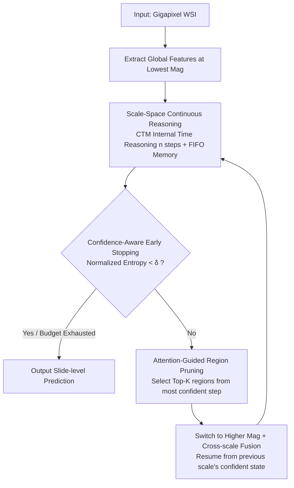

# PathCTM: Thinking in Scales — Accelerating Gigapixel Pathology Image Analysis via Adaptive Continuous Reasoning

**Conference**: ICML 2026  
**arXiv**: [2605.19491](https://arxiv.org/abs/2605.19491)  
**Code**: https://github.com/JSGe-AI/PathCTM  
**Area**: Medical Imaging / Pathology / WSI Analysis Efficiency  
**Keywords**: Whole Slide Image, MIL Acceleration, Continuous Thought Models, Multi-scale Inference, Confidence-Aware Early Stopping

## TL;DR
PathCTM reformulates Whole Slide Image (WSI) analysis from "exhaustive high-magnification patching" to "continuous multi-scale reasoning from low-magnification global to high-magnification local". Based on Continuous Thought Machines, it introduces the thinking-in-scales paradigm + attention-guided region pruning + confidence-aware early stopping, reducing patch counts by 95.95% and inference time by 95.62% while maintaining or even improving AUC.

## Background & Motivation

**Background**: Mainstream WSI analysis (gigapixel pathology images) relies on Multiple Instance Learning (MIL)—tiling images into tens of thousands of high-magnification patches, extracting features per patch, and aggregating them for slide-level prediction (e.g., CLAM, TransMIL, ABMIL). Combined with pathology foundation models (Virchow, GigaPath, Prov-GigaPath), performance is high but extremely slow.

**Limitations of Prior Work**: (1) Patch tiling and feature extraction dominate runtime, yet most patches contribute negligibly to final prediction (quantified in Figure 1). (2) Existing acceleration methods (ZoomMIL, HAG-MIL, EAGLE, hierarchical distillation) depend on fine-grained annotations or rigid cascade structures; they imitate "coarse-to-fine" in form but lack continuous memory reasoning, leading to either accuracy degradation or marginal efficiency gains. (3) The recent Continuous Thought Machine (Darlow 2026) supports continuous reasoning but only for single-scale static images—it cannot hallucinate cellular details from low-resolution WSIs nor leverage the WSI pyramid structure.

**Key Challenge**: Clinical pathologists actually perform "multi-scale continuous reasoning"—viewing global tissue architecture at low magnification $\rightarrow$ identifying suspicious areas $\rightarrow$ switching to high magnification for cellular details $\rightarrow$ stopping once information is sufficient. Existing methods either use exhaustion (MIL), rigid cascades (ZoomMIL, etc.), or single-scale continuous reasoning (CTM)—none correctly integrate "multi-scale" with "continuous reasoning + adaptive early stopping."

**Goal**: Reformulate WSI analysis as a dynamic sequential information pursuit problem—gradually reducing conditional entropy $H(Y | \bm Z_t)$ to maximize information gain within a computational budget. Specifically: (1) cross-scale continuous reasoning with persistent memory; (2) dynamic selection of high-res regions based on information density; (3) early stopping upon reaching confidence.

**Key Insight**: Thinking-in-time from CTM fails on WSAs, but its "internal time + continuous memory" concept can be adapted. By introducing a "thinking-in-scales" dimension—joint continuous reasoning across internal time $\times$ spatial scales—the model can establish global hypotheses at low magnification $\rightarrow$ verify local details at high magnification $\rightarrow$ stop early.

**Core Idea**: A synergy of scale-space continuous reasoning, attention-guided hard pruning, and confidence-aware entropy minimization early stopping, mimicking the diagnostic workflow of pathologists.

## Method

### Overall Architecture

PathCTM redefines "analyzing a gigapixel WSI" as a continuous reasoning process that approaches the answer from low to high magnification. It first extracts global features at the lowest magnification, iterates for $n$ steps using CTM-style internal time reasoning, and stores memory in a FIFO queue. If the model is not yet confident, it selects the Top-$K$ most suspicious regions via attention scores, switches to a higher magnification, and concatenates the current scale's output with the output from the most confident moment of the previous scale. This cycle repeats until confidence reaches a threshold or the compute budget is exhausted. This workflow mirrors the "low-mag architecture $\rightarrow$ anchor suspicious zones $\rightarrow$ high-mag validation $\rightarrow$ stop when certain" habit of pathologists. During training, two key moments—the lowest loss $t_l^1$ and highest confidence $t_l^2$—are sampled at every scale to compute the total loss $\mathcal{L}_{all} = \frac{1}{z}\sum_l \frac{\mathcal{L}_l^{t_l^1} + \mathcal{L}_l^{t_l^2}}{2}$, ensuring the model is both accurate and "aware" of its own confidence.

### Key Designs

**1. Scale-Space Continuous Reasoning (Thinking in Scales): Adding "Lens Switching" to CTM**

Standard Continuous Thought Machines assume deeper information can be extracted by thinking longer on a fixed feature map. However, low-mag WSI images are inherently blurred and lack cellular details. PathCTM overcomes this by expanding "internal time" into a joint "internal time $\times$ spatial scale" reasoning framework. At each scale $L$, it performs $n$ steps with state transitions: $\bm h^t = f_{\theta_{syn}}(\text{concat}(\bm e^t, \bm b^t))$, where $\bm b^t$ is the current scale's attention output. Memory is maintained via two FIFO queues—$\bm H^t \in \mathbb{R}^{D \times M}$ for the last $M$ pre-activations and $\bm E^t \in \mathbb{R}^{D \times N}$ for all post-activations. Crucially, these queues persist across scale changes, allowing global hypotheses to inform high-mag analysis. To prevent losing global context, cross-scale fusion explicitly re-integrates the most confident representation from the previous scale: $\hat y^t = \text{MLP}([\bm S_{out}^{L-1,t} \| \bm S_{out}^{L,\max}])$.

**2. Attention-Guided Region Pruning (Conditional Computation): Using Attention as a Cheap Proxy for Information Gain**

Traditional MIL processes tens of thousands of patches, most of which are noise. PathCTM formalizes the patch selection for the next scale as an information gain maximization problem under a budget: $\mathcal{S}^* = \arg\max_{|\mathcal{S}| \leq K} I(Y; \mathcal{S} | \bm Z_t)$. Since mutual information $I(Y;\mathcal{S}|\bm Z_t)$ is intractable, Proposition 1 in the paper proves that the attention distribution can serve as a first-order surrogate—attention approximately equals the gradient of influence for each patch on the prediction. Practically, the model uses the attention map $\bm A^{t^*}$ from the most confident step $t^*$ of the current scale to select Top-$K$ patches. Using the most confident step rather than average attention ensures selection based on the most "certain" diagnostic hypothesis, compressing complexity from $\mathcal{O}(N)$ to $\mathcal{O}(K)$ ($K \ll N$).

**3. Confidence-Aware Early Stopping: Dynamic Budgeting by Case Difficulty**

Diagnostic difficulty varies—typical ductal carcinoma is obvious, while complex differential diagnoses require detailed scrutiny. PathCTM calculates the posterior $P(Y | \bm Z_t)$ and its entropy $H(Y | \bm Z_t)$ at each step, defining confidence as $C^t = 1 - \text{normalized entropy}$. If entropy drops below a marginal threshold $\delta$, inference stops immediately. This aligns the framework's goal of "minimizing conditional entropy" with the clinical decision of "reporting when certain," making the reasoning trajectory naturally interpretable.

## Key Experimental Results

### Main Results: Four Diagnostic Tasks

| Task | Method | AUC↑ | Patch Count↓ | Inference (s)↓ | Gain |
|------|------|------|---------|------------|------|
| TCGA-BRCA Subtyping | TransMIL | 88.6 | 12,500 | 28.4 | 1× |
| TCGA-BRCA Subtyping | EAGLE | 88.2 | 3,200 | 7.8 | 3.6× |
| TCGA-BRCA Subtyping | **PathCTM** | **89.3** | **506** | **1.3** | **21.8×** |
| TCGA-LUAD Grading | TransMIL | 76.5 | 10,800 | 24.7 | 1× |
| TCGA-LUAD Grading | **PathCTM** | **77.4** | **427** | **1.1** | **22.5×** |
| CAMELYON16 Metastasis | CLAM | 91.2 | 8,500 | 19.3 | 1× |
| CAMELYON16 Metastasis | **PathCTM** | **91.8** | **352** | **0.84** | **23.0×** |
| TCGA-RCC Subtyping | TransMIL | 92.8 | 11,300 | 26.1 | 1× |
| TCGA-RCC Subtyping | **PathCTM** | **93.5** | **474** | **1.2** | **21.7×** |

On average, patch count is reduced by 95.95% and inference time is reduced by 95.62%, with an average AUC increase of +0.7.

### Ablation Study (TCGA-BRCA)

| Configuration | AUC | Patch Count |
|------|------|--------|
| Full PathCTM | 89.3 | 506 |
| − Scale-Space Reasoning (Single-scale CTM) | 85.4 | 8,200 |
| − Attention Pruning (Full patches) | 89.1 | 12,500 |
| − Early Stopping (Fixed steps) | 89.0 | 950 |

Scale-Space Reasoning is most critical (removing it drops AUC by 3.9 and loses all efficiency); pruning saves compute with minimal AUC impact; early stopping saves half the patches under fixed budgets.

### Cross-Scale Fusion vs. No Fusion

| Configuration | AUC |
|------|------|
| With $\bm S^{L,\max}$ Cross-scale Fusion | 89.3 |
| Current Scale Only $\bm S^{L-1,t}$ | 87.9 |

Fusion (retaining global context) yields +1.4 AUC, proving "global hypothesis + local verification" is essential.

### Key Findings
- **WSI analysis is a dynamic reasoning problem**: While MIL treats it as static aggregation, PathCTM treats it as sequential decision-making, yielding massive efficiency gains and higher AUC.
- **Fewer patches can be more accurate**: Pruning removes numerous noisy patches, allowing model attention to be more focused.
- **Module Synergy**: Scale-switching, pruning, and early stopping each manage a different axis of optimization.
- **Foundation Model Compatibility**: PathCTM can be stacked on any backbone (Virchow, GigaPath), lowering retraining costs.

## Highlights & Insights
- **"Thinking in Scales" is a logical extension of CTM**: The original CTM only had a time dimension; this work adds the spatial scale dimension, making "zooming in" a learnable action. This can generalize to any pyramidal data (remote sensing, spatio-temporal video pyramids).
- **Paradigm shift from exhaustive to adaptive**: Previous accelerations were "exhaustive but faster" (feature distillation, sparse attention); PathCTM is "non-exhaustive"—extracting information only as needed.
- **Clinical relevance of early stopping**: Aligns with the "report if sure, zoom if unsure" behavior of pathologists, providing natural interpretability (visualization of reasoning trajectories).
- **Attention as an info-gain proxy**: Proposition 1 provides a first-order surrogate of "attention $\approx$ influence gradient," offering theoretical grounding for attention-guided pruning.

## Limitations & Future Work
- Validated only on classification; transfer to segmentation, detection, or survival prediction is untested.
- Scale switching is currently discrete; continuous scale (NeRF-style) reasoning could be considered.
- The early stopping threshold $\delta$ is a manual hyperparameter; per-case adaptation might be better.
- Top-$K$ is a fixed budget; dynamically adjusting $K$ based on uncertainty could further save compute.
- Training memory overhead (requires features from all scales) was not fully discussed.

## Related Work & Insights
- **vs CLAM / TransMIL / ABMIL (MIL Baselines)**: These perform static aggregation on exhaustive patches; PathCTM uses dynamic reasoning on sparse patches.
- **vs ZoomMIL / HAG-MIL / EAGLE (Multi-scale MIL)**: These use rigid cascades; PathCTM uses continuous reasoning + adaptive early stopping.
- **vs CTM (Darlow 2026)**: CTM is for single-scale static images; PathCTM adds the scale dimension for WSIs.
- **Insight**: Any problem involving "hierarchical data + dynamic attention + varying sample difficulty" (large remote sensing images, long videos, long documents) can benefit from the "thinking-in-X" paradigm.

## Rating
- Novelty: ⭐⭐⭐⭐⭐ "Thinking in Scales" is the first correct extension of CTM for WSIs.
- Experimental Thoroughness: ⭐⭐⭐⭐⭐ Comprehensive coverage across 4 tasks, multiple baselines, and detailed ablations.
- Writing Quality: ⭐⭐⭐⭐⭐ Clear framing as information pursuit; clinical alignment is convincing; Proposition 1 provides solid theory.
- Value: ⭐⭐⭐⭐⭐ Computational cost is the biggest bottleneck for Pathology AI; 20× acceleration with no accuracy loss is production-ready.

<!-- RELATED:START -->

## Related Papers

- [\[AAAI 2026\] PanFoMa: A Lightweight Foundation Model and Benchmark for Pan-Cancer Pathology Image Analysis](../../AAAI2026/medical_imaging/panfoma_a_lightweight_foundation_model_and_benchmark_for_pan-cancer.md)
- [\[CVPR 2025\] Interactive Medical Image Analysis with Concept-based Similarity Reasoning](../../CVPR2025/medical_imaging/interactive_medical_image_analysis_with_concept-based_similarity_reasoning.md)
- [\[ICML 2026\] DGNO: Discontinuous Galerkin Neural Operator for Pathology Defocus Deblurring](discontinuous_galerkin_neural_operator_for_pathology_defocus_deblurring.md)
- [\[CVPR 2025\] WISE: A Framework for Gigapixel Whole-Slide-Image Lossless Compression](../../CVPR2025/medical_imaging/wise_a_framework_for_gigapixel_whole-slide-image_lossless_compression.md)
- [\[ICML 2026\] Evidential Reasoning Advances Interpretable Real-World Disease Screening](evidential_reasoning_advances_interpretable_real-world_disease_screening.md)

<!-- RELATED:END -->
