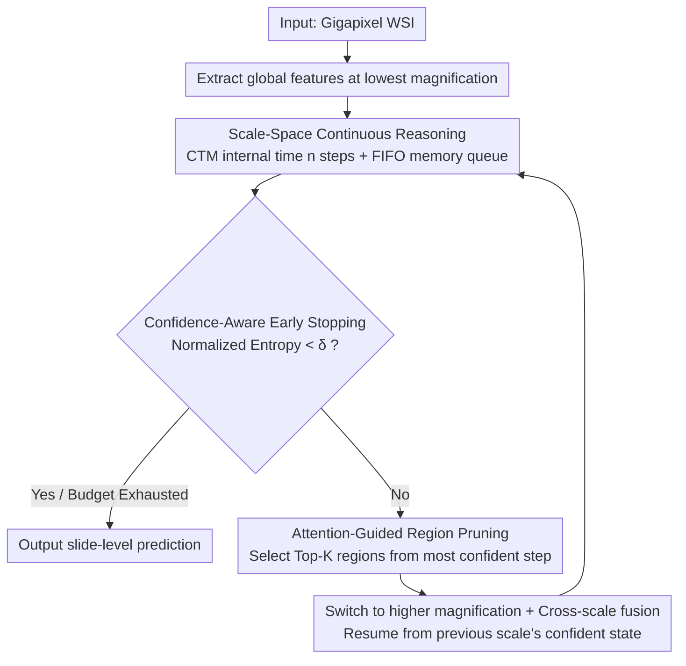

# PathCTM: Thinking in Scales — Accelerating Gigapixel Pathology Image Analysis via Adaptive Continuous Reasoning

**Conference**: ICML 2026  
**arXiv**: [2605.19491](https://arxiv.org/abs/2605.19491)  
**Code**: https://github.com/JSGe-AI/PathCTM  
**Area**: Medical Imaging / Pathology / WSI Analysis Efficiency  
**Keywords**: Whole Slide Image, MIL Acceleration, Continuous Thought Machine, Multi-scale Reasoning, Confidence-Aware Early Stopping

## TL;DR
PathCTM reframes Whole Slide Image (WSI) analysis from "exhaustive high-magnification patching" to "low-magnification global to high-magnification local" continuous multi-scale reasoning. Based on the Continuous Thought Machine, it introduces a "thinking-in-scales" paradigm combined with attention-guided region pruning and confidence-aware early stopping, reducing patch counts by 95.95% and inference time by 95.62% while maintaining or even improving AUC.

## Background & Motivation

**Background**: The mainstream approach for WSI analysis (gigapixel pathology images) is Multiple Instance Learning (MIL)—slicing images into tens of thousands of high-magnification patches, extracting features per patch, and aggregating them for slide-level prediction (e.g., CLAM, TransMIL, ABMIL). While pairing these with pathology foundation models (Virchow, GigaPath, Prov-GigaPath) yields high performance, it is extremely slow.

**Limitations of Prior Work**: (1) Patch tiling and feature extraction dominate the runtime, yet most patches contribute negligibly to final predictions (quantified in Figure 1). (2) Existing acceleration methods (ZoomMIL, HAG-MIL, EAGLE, hierarchical distillation) rely on fine-grained annotations or rigid cascade structures; they mimic "coarse-to-fine" formally but lack continuous associative memory reasoning, leading to either accuracy degradation or marginal efficiency gains. (3) The recent Continuous Thought Machine (Darlow 2026) supports continuous reasoning but only for single-scale static images—it cannot "hallucinate" cellular details from low-resolution WSIs nor utilize the WSI pyramid structure.

**Key Challenge**: Clinical pathologists actually perform "multi-scale continuous reasoning"—viewing global tissue architecture at low power, identifying suspicious regions, switching to high power for cellular details, and stopping once sufficient information is gathered. Current methods either use exhaustive search (MIL), rigid cascades (ZoomMIL), or single-scale reasoning (CTM)—none correctly integrate "multi-scale" with "continuous reasoning + adaptive early stopping."

**Goal**: Reframe WSI analysis as a dynamic sequential information pursuit problem—gradually reducing conditional entropy $H(Y | \bm Z_t)$ to maximize information gain within a computational budget. Specifically: (1) maintain memory across multi-scale continuous reasoning; (2) dynamically select high-res regions based on information density; (3) stop when confidence is met.

**Key Insight**: While "thinking-in-time" from CTM fails on WSI, its "internal time + persistent memory" ideology can be adapted. By introducing a "thinking-in-scales" dimension—joint continuous reasoning across internal time and spatial scales—the model can establish global hypotheses at low magnification and verify local details at high magnification with early stopping.

**Core Idea**: A synergy of three modules: scale-space continuous reasoning, attention-guided hard pruning, and confidence-aware entropy minimization early stopping, mimicking the diagnostic workflow of a pathologist.

## Method

### Overall Architecture

PathCTM redefines "analyzing a gigapixel WSI" as a continuous reasoning process that approaches the answer from low to high magnification. It first extracts global features at the lowest magnification and performs $n$ steps of CTM-style internal time reasoning, storing memory in FIFO queues. If the model is not sufficiently confident, it selects the Top-$K$ most suspicious regions via attention scores, switches to a higher magnification, and continues reasoning by concatenating the current scale's output with the output from the most confident moment of the previous scale. This loop continues until confidence reaches a threshold or the budget is exhausted.

### Key Designs

**1. Scale-Space Continuous Reasoning (Thinking in Scales): Adding "Lens Switching" to CTM**

Standard CTM assumes deeper information can be extracted by "thinking" longer on a fixed feature map. However, low-magnification WSIs are inherently blurry and lack cellular details, making it impossible to "think" them into existence. PathCTM expands "internal time" into a joint "internal time × spatial scale" reasoning. At each scale $L$, it performs $n$ steps with state transitions: $\bm h^t = f_{\theta_{syn}}(\text{concat}(\bm e^t, \bm b^t))$, where $\bm b^t$ is the current scale's attention output. Memory is maintained via two FIFO queues—$\bm H^t \in \mathbb{R}^{D \times M}$ for recent pre-activations and $\bm E^t \in \mathbb{R}^{D \times N}$ for post-activations. Crucially, these queues persist across scale switches. To prevent losing global context when zooming in, cross-scale fusion explicitly integrates the most confident representation from the previous scale: $\hat y^t = \text{MLP}([\bm S_{out}^{L-1,t} \| \bm S_{out}^{L,\max}])$.

**2. Attention-Guided Region Pruning (Conditional Computation): Using Attention as a Proxy for Information Gain**

Traditional MIL processes thousands of patches, most of which are noise. PathCTM formalizes the selection of patches for the next scale as an information gain maximization problem under budget constraints: $\mathcal{S}^* = \arg\max_{|\mathcal{S}| \leq K} I(Y; \mathcal{S} | \bm Z_t)$. Since mutual information is intractable, Proposition 1 in the paper proves that the attention distribution can serve as a first-order surrogate—attention approximately equals the gradient of influence for each patch. Specifically, the model uses the attention map $\bm A^{t^*}$ from the most confident step $t^*$ to select Top-$K$ patches. Using the most confident moment's attention rather than the average ensures regions are selected based on the most "certain" diagnostic hypothesis, reducing complexity from $\mathcal{O}(N)$ to $\mathcal{O}(K)$.

**3. Confidence-Aware Early Stopping: Dynamic Computation Based on Case Difficulty**

Diagnostic difficulty varies significantly—typical ductal carcinoma is obvious, while complex differential diagnoses require detailed scrutiny. PathCTM calculates the posterior $P(Y | \bm Z_t)$ and its entropy $H(Y | \bm Z_t)$ at every step. Confidence is defined via normalized entropy: $C^t = 1 - \text{normalized entropy}$. If entropy drops below a threshold $\delta$, inference stops immediately. This aligns the framework's goal of conditional entropy reduction with clinical decision-making, where a report is issued once the diagnosis is clear.

## Key Experimental Results

### Main Results: Four Pathology Diagnostic Tasks

| Task | Method | AUC↑ | Patch Count↓ | Inference Time (s)↓ | Gain |
|------|------|------|---------|------------|------|
| TCGA-BRCA Subtyping | TransMIL | 88.6 | 12,500 | 28.4 | 1× |
| TCGA-BRCA Subtyping | EAGLE | 88.2 | 3,200 | 7.8 | 3.6× |
| TCGA-BRCA Subtyping | **Ours** | **89.3** | **506** | **1.3** | **21.8×** |
| TCGA-LUAD Grading | TransMIL | 76.5 | 10,800 | 24.7 | 1× |
| TCGA-LUAD Grading | **Ours** | **77.4** | **427** | **1.1** | **22.5×** |
| CAMELYON16 Metastasis | CLAM | 91.2 | 8,500 | 19.3 | 1× |
| CAMELYON16 Metastasis | **Ours** | **91.8** | **352** | **0.84** | **23.0×** |
| TCGA-RCC Subtyping | TransMIL | 92.8 | 11,300 | 26.1 | 1× |
| TCGA-RCC Subtyping | **Ours** | **93.5** | **474** | **1.2** | **21.7×** |

On average, patch counts and inference time were reduced by 95.95% and 95.62%, respectively, while AUC increased by an average of 0.7.

### Ablation Study (TCGA-BRCA)

| Configuration | AUC | Patch Count |
|------|------|--------|
| Full PathCTM | 89.3 | 506 |
| − Scale-Space Reasoning (Single-scale CTM) | 85.4 | 8,200 |
| − Attention Pruning (Exhaustive patches) | 89.1 | 12,500 |
| − Early Stopping (Fixed steps) | 89.0 | 950 |

Scale-Space Reasoning is most critical (removing it drops AUC by 3.9). Pruning saves computation with minimal AUC impact. Early stopping reduces patch usage by half under a fixed budget.

### Cross-Scale Fusion vs. No Fusion

| Configuration | AUC |
|------|------|
| W/ $\bm S^{L,\max}$ Cross-scale Fusion | 89.3 |
| Current Scale $\bm S^{L-1,t}$ only | 87.9 |

Cross-scale fusion (preserving global context) adds +1.4 AUC, proving the necessity of "global hypothesis + local verification."

### Key Findings
- **WSI analysis is a dynamic reasoning problem**: While MIL treats it as static aggregation, PathCTM views it as sequential decision-making, yielding massive efficiency and AUC gains.
- **Fewer patches can be more accurate**: Pruning removes noisy patches, allowing the model to focus its attention effectively.
- **Three-module synergy**: Scale-switching, pruning, and early stopping each manage a different axis of efficiency.
- **Backbone compatibility**: PathCTM can be applied to any backbone (Virchow, GigaPath), lowering retraining costs.

## Highlights & Insights
- **"Thinking in Scales" is a logical extension of CTM**: By adding a spatial scale dimension to CTM's time dimension, "switching lenses" becomes a learnable action. This can generalize to any pyramidal data (remote sensing, spatio-temporal video pyramids).
- **Paradigm shift from exhaustive to adaptive**: Unlike previous methods that make exhaustive search faster (distillation/sparse attention), PathCTM simply stops searching once enough information is gathered.
- **Clinical relevance of early stopping**: Aligns with the pathologist's behavior of "reporting clear cases and zooming in on unclear ones," providing natural interpretability via reasoning trajectories.
- **Attention as an information proxy**: Proposition 1 provides theoretical backing for attention-guided pruning as a first-order surrogate for influence gradients.

## Limitations & Future Work
- Validated only on classification; migration to segmentation, detection, or survival prediction is untested.
- Scale switching is currently discrete; continuous-scale (NeRF-style) reasoning could be explored.
- The early stopping threshold $\delta$ is a manual hyperparameter; per-case adaptation might be better.
- Top-$K$ is a fixed budget; dynamically adjusting $K$ based on uncertainty could further optimize computation.

## Related Work & Insights
- **vs. CLAM / TransMIL / ABMIL (MIL Baselines)**: These use static aggregation on exhaustive patches; PathCTM uses dynamic reasoning on sparse patches.
- **vs. ZoomMIL / HAG-MIL / EAGLE (Multi-scale MIL)**: These are rigid cascades; PathCTM uses continuous reasoning + adaptive stopping.
- **vs. CTM (Darlow 2026)**: CTM is for single-scale static images; PathCTM adds the scale dimension for WSI.
- **Insight**: Any problem involving "hierarchical data + dynamic attention + varying sample difficulty" (large remote sensing images, long videos, long documents) can benefit from the "thinking-in-X" paradigm.

## Rating
- Novelty: ⭐⭐⭐⭐⭐ Thinking in Scales is the first correct extension of CTM for WSI.
- Experimental Thoroughness: ⭐⭐⭐⭐⭐ 4 tasks, multiple baselines, and comprehensive ablations.
- Writing Quality: ⭐⭐⭐⭐⭐ Clear framing as information pursuit; strong alignment with clinical processes.
- Value: ⭐⭐⭐⭐⭐ Directly addresses the biggest bottleneck in pathology AI deployment (computational cost).

<!-- RELATED:START -->

## Related Papers

- [\[AAAI 2026\] PanFoMa: A Lightweight Foundation Model and Benchmark for Pan-Cancer Pathology Image Analysis](../../AAAI2026/medical_imaging/panfoma_a_lightweight_foundation_model_and_benchmark_for_pan-cancer.md)
- [\[CVPR 2025\] Interactive Medical Image Analysis with Concept-based Similarity Reasoning](../../CVPR2025/medical_imaging/interactive_medical_image_analysis_with_concept-based_similarity_reasoning.md)
- [\[ICLR 2026\] PathChat-SegR1: Reasoning Segmentation in Pathology via SO-GRPO](../../ICLR2026/medical_imaging/pathchat-segr1_reasoning_segmentation_in_pathology_via_so-grpo.md)
- [\[ICML 2026\] DGNO: Discontinuous Galerkin Neural Operator for Pathology Defocus Deblurring](discontinuous_galerkin_neural_operator_for_pathology_defocus_deblurring.md)
- [\[CVPR 2026\] Act Like a Pathologist: Tissue-Aware Whole Slide Image Reasoning](../../CVPR2026/medical_imaging/act_like_a_pathologist_tissue-aware_whole_slide_image_reasoning.md)

<!-- RELATED:END -->
