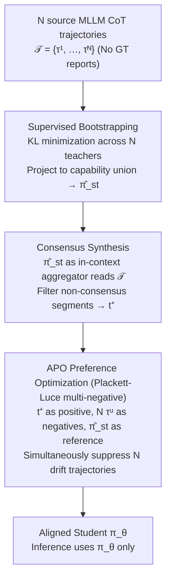

# Turning Drift into Constraint: Robust Reasoning Alignment in Non-Stationary Multi-Stream Environments

**Conference**: ICML 2026  
**arXiv**: [2510.04142](https://arxiv.org/abs/2510.04142)  
**Code**: https://github.com/XiaoyuYoung/APO (Available)  
**Area**: Medical Imaging / Multimodal VLM / Alignment RLHF  
**Keywords**: Multi-source Alignment, Concept Drift, Preference Optimization, Chest X-ray Diagnosis, Plackett-Luce

## TL;DR
This paper reinterprets reasoning "drift" among multiple MLLMs as negative constraints in DPO. By employing a Plackett-Luce preference loss to simultaneously suppress divergent trajectories from $N$ source models, a 7B student model outperforms all source teachers in chest X-ray classification and report generation tasks using only 10% of MIMIC-CXR data without requiring ground-truth reports.

## Background & Motivation

**Background**: Distilling CoT trajectories from multiple large models as "teachers" into a single student model is a standard approach in multi-source alignment and "collective intelligence." In specialized fields like medical QA, leveraging complementary multi-teacher knowledge is often the default strategy.

**Limitations of Prior Work**: The authors observe that reasoning distributions of different source MLLMs are inherently divergent—e.g., Qwen-VL-Max tends to be precise and concise, while GPT-4o favors high recall and verbosity. Directly concatenating these heterogeneous trajectories for SFT prevents the student from selectively learning strengths and instead forces the inheritance of all biases, leading to hallucinations and semantic inconsistency.

**Key Challenge**: Diversity among source models is both a benefit (broader coverage) and a risk (conflicts). Existing works treat conflicts as noise to be averaged out, but these conflict regions actually contain the most informative "decision boundaries." Averaging effectively erases this critical information.

**Goal**: To enable the student model to learn a robust reasoning manifold in environments where source reasoning trajectories continuously drift and ground-truth supervision is absent, while demonstrating that such drift can be explicitly utilized rather than merely treated as noise.

**Key Insight**: The evolution of multi-source reasoning is mapped into the concept drift framework—mapping autoregressive CoT steps to the "time axis" of drift theory. Divergence among models thus constitutes a non-stationary multi-stream environment. From this perspective, divergent regions define "what should be avoided."

**Core Idea**: Use the consensus between source models as positive samples and the individual drifted trajectories of each source as negative samples. By extending DPO to a Plackett-Luce multi-negative format, drift is transformed from noise into a "supervisory signal for active unlearning."

## Method

### Overall Architecture
APO decomposes the challenge of "conflicting teachers" into a two-stage process. The first stage (Supervised Bootstrapping with Consensus Synthesis) performs supervised distillation using all source reasoning trajectories to project the target model $\pi_\theta$ into the union of source capabilities, yielding $\hat{\pi}_{st}$. This $\hat{\pi}_{st}$ then acts as an in-context aggregator to refine a self-consistent consensus trajectory $t^+$ from $N$ source trajectories $\mathcal{T}=\{\tau^1,\ldots,\tau^N\}$. The second stage (Constraint-Aware Optimization) uses $t^+$ as the sole positive sample and the $N$ original source trajectories as negative samples for Plackett-Luce preference optimization, "pushing" the student away from the teachers' divergent regions. Inference utilizes only the final $\pi_\theta$.

### Key Designs

**1. Multi-stream Reasoning Modeling via Concept Drift**

Directly applying SFT to concatenated CoT trajectories causes the student to inherit all teacher biases. This paper assumes $N$ source models generate CoT sequences conditionally and independently, factorizing the joint distribution of step $j$ as $P_j(\mathcal{S}_j)=\prod_{u=1}^N P(t_{<j}^u|v,l) \cdot P(z_j^u|t_{<j}^u,v,l)$, where the first term represents accumulated historical divergence and the second represents instantaneous drift at the current step. When $P_j(\mathcal{S}) \neq P_{j+\Delta}(\mathcal{S})$, concept drift occurs, meaning the supervisory signal itself shifts as the student progresses. Traditional distillation assumes stable ground-truth; this factorization proves that teachers inevitably develop non-stationary disagreements, making naive SFT problematic.

**2. Consensus Synthesis: Creating a Positive Anchor Without Ground-Truth**

Preference optimization requires a positive sample. In medical scenarios lacking radiologist reports, positive samples must be synthesized. The bootstrapped $\hat{\pi}_{st}$, having absorbed the union of source knowledge, concatenates $N$ trajectories into its context to act as a "semantically-aware weighted aggregator." It generates $t^+ \sim \hat{\pi}_{st}(\cdot|v,l,\text{Context}=\mathcal{T})$, retaining tokens supported by the majority and filtering incoherent segments lacking cross-model support. This is essentially implicit voting at the trajectory level, entirely student-generated and thus capable of unsupervised iteration.

**3. APO Loss with Plackett-Luce Multi-Negatives**

Given one positive sample $t^+$ and $N$ negative samples $\{\tau^u\}$, the objective is to suppress all $N$ divergent trajectories. Standard DPO handles only one positive-negative pair, whereas source drift is inherently a 1:N multi-modal conflict. APO uses $\hat{\pi}_{st}$ as the reference policy to define implicit reward $r(v,l,t)=\beta \log \frac{\pi_\theta(t|v,l)}{\hat{\pi}_{st}(t|v,l)}$ and generalizes the binary DPO preference to the Plackett-Luce form:

$$P(t^+ \succ \mathcal{T}|v,l)=\frac{\exp(r(v,l,t^+))}{\exp(r(v,l,t^+))+\sum_{u=1}^N \exp(r(v,l,\tau^u))}$$

The final loss is $-\mathbb{E}[\log P(t^+ \succ \mathcal{T}|v,l)]$. Optimizing this pushes the probability of $t^+$ up while simultaneously suppressing each $\tau^u$. This treats the negative samples as competing hypotheses, making "active unlearning of $N$ biases" an explicit first-order objective.

### Loss & Training
The model uses Qwen2.5-VL 7B trained in two stages. Stage 1 is SFT via KL minimization: $q^* = \arg\min_q \sum_u \mathbb{D}_{\text{KL}}(\pi_u || q)$. Stage 2 uses the APO objective. Each stage runs for 1 epoch with batch size 2. The dataset, CXR-MAX, comprises 1/10 of MIMIC-CXR (approx. 170k trajectories across 14 pathologies) and utilizes multi-teacher drift as supervision instead of radiologist reports.

## Key Experimental Results

### Main Results

| Dataset | Task | Metric | Ours 7B | Prev. SOTA | Gain |
|---------|------|------|---------|-----------|------|
| MS-CXR-T | Multi-label Class. (Avg) | Top-1 Acc | 0.78 | 0.69 (CoCa-CXR) | +0.09 |
| MS-CXR-T | Pneumothorax | Top-1 Acc | 0.96 | 0.73 | +0.23 |
| MS-CXR-T | Consolidation | Top-1 Acc | 0.84 | 0.70 | +0.14 |
| MIMIC-CXR | Report Gen. | BLEU-1 | 0.56 | 0.43 (CPO) | +0.13 |
| MIMIC-CXR | Report Gen. | ROUGE-L | – | 0.42 (CPO) | Gain |

Note: Ours uses 10% data + no ground-truth reports; comparison methods use full data + reports.

### Ablation Study

| Configuration | Key Phenomenon | Explanation |
|------|---------|------|
| Supervised Bootstrap Only | Inherits source bias, high hallucination | Confirms "naive distillation = bias inheritance." |
| Bootstrap + DPO (Pairwise) | Partial improvement | Highlights the need for multi-negative constraints. |
| Full APO (PL Multi-negative) | Avg. 0.78 | Drift-as-constraint is more robust than consensus-only. |
| Source Teachers | Avg. lower than Student 7B | Student outperforms teachers via ensemble + constraint. |

### Key Findings
- **Pneumothorax Outperformance (+0.23)**: Pleural lines are subtle; source models are often uncertain and exhibit maximum drift. APO sharpens sensitivity to visual cues by suppressing these uncertain regions.
- **Edema Performance**: High-variance drift regions are treated as "avoidance" zones, leading to conservative behavior and sacrificing some recall for safety.
- **7B Student Surpasses All Source Teachers**: Including GPT-4o and Qwen-VL-Max, proving that the combination of consensus and active unlearning is more effective than individual label quality.

## Highlights & Insights
- **Drift-as-constraint perspective**: Flips the "conflicting teachers" problem from a reconciliation task into a source for explicit negative constraints.
- **Transition to Plackett-Luce**: Extending DPO to a 1:N preference framework is a natural fit for multi-source environments, and this work is the first to bridge it with multi-teacher distillation.
- **Self-supervised alignment**: The framework is transferable to any scenario where multiple teachers disagree but ground-truth is missing (e.g., multi-LLM-as-a-judge, cross-model reward synthesis).

## Limitations & Future Work
- **Dependency on Consensus**: If teacher trajectories share zero consensus (extremely high-variance tasks), the extracted $t^+$ becomes unreliable.
- **Equal Weighting**: Currently, all sources are weighted equally in the PL loss; future work could weight negative samples by source reliability.
- **Domain Scope**: Evaluation is restricted to chest X-rays; efficacy in general reasoning (math, code) remains to be verified.

## Related Work & Insights
- **vs. DPO (Rafailov 2023)**: APO automatically constructs preference pairs and uses PL multi-negatives for active unlearning.
- **vs. WeakLM / Multi-teacher Distillation**: Unlike methods that average or pick the "best" teacher, APO utilizes the divergence between teachers as a training signal.
- **vs. Self-Refine / Self-consistency**: While self-consistency uses majority voting at inference, APO brings this logic to the RL/preference learning stage.

## Rating
- Novelty: ⭐⭐⭐⭐⭐ 
- Experimental Thoroughness: ⭐⭐⭐⭐ 
- Writing Quality: ⭐⭐⭐⭐⭐ 
- Value: ⭐⭐⭐⭐⭐ 

<!-- RELATED:START -->

## Related Papers

- [\[CVPR 2026\] CG-Reasoner: Centroid-Guided Positional Reasoning Segmentation for Medical Imaging with a Robust Visual-Text Consistency Metric](../../CVPR2026/medical_imaging/cg-reasoner_centroid-guided_positional_reasoning_segmentation_for_medical_imagin.md)
- [\[AAAI 2026\] DiA-gnostic VLVAE: Disentangled Alignment-Constrained Vision Language Variational AutoEncoder for Robust Radiology Reporting with Missing Modalities](../../AAAI2026/medical_imaging/dia-gnostic_vlvae_disentangled_alignment-constrained_vision_language_variational.md)
- [\[ICML 2026\] SynerMedGen: Synergizing Medical Multimodal Understanding with Generation via Task Alignment](synermedgen_synergizing_medical_multimodal_understanding_with_generation_via_tas.md)
- [\[CVPR 2026\] Dynamic Stream Network for Combinatorial Explosion Problem in Deformable Medical Image Registration](../../CVPR2026/medical_imaging/dynamic_stream_network_for_combinatorial_explosion_problem_in_deformable_medical.md)
- [\[ICML 2026\] Evidential Reasoning Advances Interpretable Real-World Disease Screening](evidential_reasoning_advances_interpretable_real-world_disease_screening.md)

<!-- RELATED:END -->
