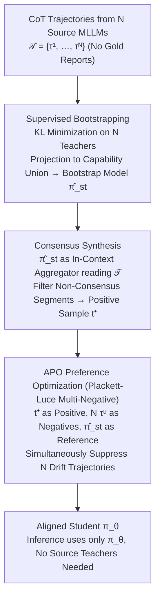

# Turning Drift into Constraint: Robust Reasoning Alignment in Non-Stationary Multi-Stream Environments

**Conference**: ICML 2026  
**arXiv**: [2510.04142](https://arxiv.org/abs/2510.04142)  
**Code**: https://github.com/XiaoyuYoung/APO (Available)  
**Area**: Medical Imaging / Multimodal VLM / Alignment RLHF  
**Keywords**: Multi-source Alignment, Concept Drift, Preference Optimization, Chest X-ray Diagnosis, Plackett-Luce

## TL;DR
This paper reinterprets the reasoning "drift" among multiple MLLMs as negative constraints in DPO. By utilizing a Plackett-Luce preference loss to simultaneously suppress divergent trajectories from $N$ source models, a 7B student model outperforms all source teachers in chest X-ray classification and report generation tasks using only 10% of MIMIC-CXR without requiring ground-truth reports.

## Background & Motivation

**Background**: Utilizing multiple large models as reasoning teachers to let a student model distill various CoT trajectories is a standard approach in multi-source alignment and "collective intelligence." In specialized fields like medical QA, leveraging complementary teachers is the default strategy.

**Limitations of Prior Work**: Different source MLLMs possess inherently divergent reasoning distributions—for instance, Qwen-VL-Max tends to be precise and concise, while GPT-4o favors high recall and verbosity. Concatenating these heterogeneous trajectories for SFT prevents the student from automatically extracting the strengths of each; instead, it inherits all individual biases, leading to hallucinations and semantic inconsistency.

**Key Challenge**: The diversity among source models is both a benefit (broader coverage) and a risk (mutual conflict). Existing works treat conflicts as noise to be averaged out, but these conflict zones actually contain the most informative "decision boundaries." Averaging effectively erases this information.

**Goal**: To enable the student model to learn a robust reasoning manifold under conditions where source model reasoning trajectories constantly drift and no ground-truth supervision is available, while explicitly demonstrating that such drift can be utilized rather than merely treated as noise.

**Key Insight**: The evolution of multi-source reasoning is mapped into the theoretical framework of concept drift. By mapping the auto-regressive steps of CoT to the "timeline" in drift theory, the divergence between multiple models becomes a non-stationary multi-stream environment. From this perspective, divergent regions define "what should be avoided."

**Core Idea**: Use the consensus among source models as positive samples and the individual drifted trajectories of each source as negative samples. This extends DPO to a Plackett-Luce multi-negative form, transforming drift from noise into an "active signal for unlearning supervision."

## Method

### Overall Architecture
APO decomposes the conflict between multiple teachers into two stages. The first stage (Supervised Bootstrapping with Consensus Synthesis) uses reasoning trajectories from all source models for supervised distillation, projecting the target model $\pi_\theta$ into the union of source capabilities to obtain $\hat{\pi}_{st}$. Then, $\hat{\pi}_{st}$ acts as an in-context aggregator to refine a self-consistent consensus trajectory $t^+$ from $N$ source trajectories $\mathcal{T}=\{\tau^1,\ldots,\tau^N\}$ for the same prompt. The second stage (Constraint-Aware Optimization) treats $t^+$ as the sole positive sample and the $N$ original source trajectories as negative samples. It applies Plackett-Luce preference optimization to "push" the student away from the teachers' divergent regions. At inference, only the final $\pi_\theta$ is used.

### Key Designs

**1. Modeling Multi-Stream Reasoning under Concept Drift**

Directly stacking CoT from $N$ teachers for SFT causes the student to inherit all collective biases. To theorize this, the paper assumes $N$ source models generate CoTs conditionally independent of each other, factorizing the joint distribution at step $j$ as $P_j(\mathcal{S}_j)=\prod_{u=1}^N P(t_{<j}^u|v,l) \cdot P(z_j^u|t_{<j}^u,v,l)$. The first term represents accumulated historical divergence, and the second represents instantaneous drift at the current step. When $P_j(\mathcal{S}) \neq P_{j+\Delta}(\mathcal{S})$, concept drift occurs, meaning the supervision signal shifts as the student progresses through reasoning steps. Traditional distillation assumes stable ground-truth; this factorization proves that teachers diverge non-stationarily, necessitating a framework change over naive SFT.

**2. Consensus Synthesis: Creating a Positive Anchor without Gold Labels**

Preference optimization requires a positive sample to align toward. In medical scenarios without radiologist reports, positive samples must be synthesized. Since the bootstrapped $\hat{\pi}_{st}$ has absorbed the union of source knowledge, $N$ source trajectories for the same sample are concatenated as context for $\hat{\pi}_{st}$. It acts as a "weighted aggregator with semantic understanding" to generate $t^+ \sim \hat{\pi}_{st}(\cdot|v,l,\text{Context}=\mathcal{T})$, retaining tokens supported by multiple models and filtering incoherent segments. This is essentially implicit voting via in-context capabilities, distinguished from token-level majority voting by being trajectory-level and semantically refined.

**3. Plackett-Luce Multi-Negative APO Loss**

Given one positive sample $t^+$ and $N$ negative samples $\{\tau^u\}$, the challenge is to suppress all $N$ divergent trajectories simultaneously. Standard DPO processes one pair at a time, whereas source drift is inherently a 1:N multi-modal conflict. APO uses the bootstrapped $\hat{\pi}_{st}$ as a reference policy and defines an implicit reward $r(v,l,t)=\beta \log \frac{\pi_\theta(t|v,l)}{\hat{\pi}_{st}(t|v,l)}$, generalizing the DPO binary preference to a Plackett-Luce form:

$$P(t^+ \succ \mathcal{T}|v,l)=\frac{\exp(r(v,l,t^+))}{\exp(r(v,l,t^+))+\sum_{u=1}^N \exp(r(v,l,\tau^u))}$$

The final loss is $-\mathbb{E}[\log P(t^+ \succ \mathcal{T}|v,l)]$. Optimization increases the probability of $t^+$ while decreasing the probability of each $\tau^u$. This treats the set of negative samples as competing hypotheses, making "active unlearning of $N$ biases" an explicit first-order objective.

### Loss & Training
Two-stage sequential training: Stage 1 involves KL-minimization SFT, $q^* = \arg\min_q \sum_u \mathbb{D}_{\text{KL}}(\pi_u || q)$; Stage 2 uses the APO objective. The model is Qwen2.5-VL 7B, trained for 1 epoch per stage with a batch size of 2. Data is CXR-MAX—using only 1/10 of MIMIC-CXR (approx. 170k trajectories across 14 pathologies) without any radiologist reports.

## Key Experimental Results

### Main Results

| Dataset | Task | Metric | Ours (7B) | Prev. SOTA | Gain |
| :--- | :--- | :--- | :--- | :--- | :--- |
| MS-CXR-T | Multi-label Class. (Avg 5) | Top-1 Acc | 0.78 | 0.69 (CoCa-CXR) | +0.09 |
| MS-CXR-T | Pneumothorax | Top-1 Acc | 0.96 | 0.73 | +0.23 |
| MS-CXR-T | Consolidation | Top-1 Acc | 0.84 | 0.70 | +0.14 |
| MIMIC-CXR | Report Generation | BLEU-1 | 0.56 | 0.43 (CPO) | +0.13 |
| MIMIC-CXR | Report Generation | ROUGE-L | – | 0.42 (CPO) | Improvement |

Note: Ours uses only 10% data and no radiologist reports, while comparison methods use full data and reports.

### Ablation Study

| Configuration | Key Phenomenon | Description |
| :--- | :--- | :--- |
| Supervised Bootstrap Only | Inherits source bias, significant hallucinations | Validates that "naive distillation = bias inheritance." |
| Bootstrap + DPO (pairwise) | Partial improvement but inferior to multi-negative | Demonstrates necessity of Plackett-Luce constraint. |
| Full APO (PL Multi-negative) | 0.78 Average | Drift-as-constraint is more robust than consensus training alone. |
| Source Teachers | Average lower than Student 7B | Student outperforms teachers, proving the effect of ensemble + constraints. |

### Key Findings
- **Pneumothorax Significant Lead (+0.23)**: Since pleural lines are subtle, individual source models are uncertain and show maximum drift. APO treats these uncertain regions as negative constraints, sharpening sensitivity to critical visual cues.
- **Edema Slightly Lower**: High-variance drift categories are treated as "to be avoided," causing the model to lean conservative and sacrificing some recall for safety.
- **7B Student Surpasses All Source Teachers**: The combination of consensus and explicit drift unlearning proves stronger than the "annotation quality" of any single teacher (including GPT-4o).

## Highlights & Insights
- **The drift-as-constraint perspective is ingenious**: It flips the problem of "teacher conflict" into "useful negative constraints," solving both unsupervised learning and robustness issues simultaneously.
- **Natural progression to Plackett-Luce**: DPO naturally requires pairs, while multi-source scenarios are inherently 1:N preferences. Extending PL to multi-teacher distillation is a logical yet novel application.
- **Transferable self-supervised alignment**: This framework is applicable to any scenario where multiple teachers disagree and gold labels are missing (e.g., multi-LLM-as-a-judge, cross-model reward synthesis).

## Limitations & Future Work
- **Reliance on Consensus Extractability**: If teacher trajectories have nearly zero consensus (extremely high-variance tasks), the extracted $t^+$ becomes unreliable.
- **Equal Weighting in Plackett-Luce Loss**: Currently, all sources are treated equally, whereas reliability varies (e.g., GPT-4o vs. smaller models). Dynamic weighting could be considered.
- **Domain Specificity**: Verification is needed to see if these gains hold in more general multi-source reasoning tasks like math or code.

## Related Work & Insights
- **vs DPO (Rafailov 2023)**: DPO uses static external preference labels for pairwise comparison; APO automatically constructs preference pairs and utilizes PL multi-negatives for active unlearning.
- **vs WeakLM Distillation / Multi-teacher**: Prior methods often average or pick the strongest teacher; APO utilizes the divergent regions between teachers as training signals.
- **vs Self-Refine / Self-consistency**: Self-consistency applies majority voting during inference without parameter updates; APO moves this logic into the preference learning phase and utilizes "minority" trajectories as constraints.

## Rating
- Novelty: ⭐⭐⭐⭐⭐ 
- Experimental Thoroughness: ⭐⭐⭐⭐ 
- Writing Quality: ⭐⭐⭐⭐⭐ 
- Value: ⭐⭐⭐⭐⭐ 

<!-- RELATED:START -->

## Related Papers

- [\[CVPR 2026\] CG-Reasoner: Centroid-Guided Positional Reasoning Segmentation for Medical Imaging with a Robust Visual-Text Consistency Metric](../../CVPR2026/medical_imaging/cg-reasoner_centroid-guided_positional_reasoning_segmentation_for_medical_imagin.md)
- [\[AAAI 2026\] DiA-gnostic VLVAE: Disentangled Alignment-Constrained Vision Language Variational AutoEncoder for Robust Radiology Reporting with Missing Modalities](../../AAAI2026/medical_imaging/dia-gnostic_vlvae_disentangled_alignment-constrained_vision_language_variational.md)
- [\[ICML 2026\] SynerMedGen: Synergizing Medical Multimodal Understanding with Generation via Task Alignment](synermedgen_synergizing_medical_multimodal_understanding_with_generation_via_tas.md)
- [\[CVPR 2026\] Dynamic Stream Network for Combinatorial Explosion Problem in Deformable Medical Image Registration](../../CVPR2026/medical_imaging/dynamic_stream_network_for_combinatorial_explosion_problem_in_deformable_medical.md)
- [\[ICLR 2026\] CARE: Towards Clinical Accountability in Multi-Modal Medical Reasoning with an Evidence-Grounded Agentic Framework](../../ICLR2026/medical_imaging/care_towards_clinical_accountability_in_multi-modal_medical_reasoning_with_an_ev.md)

<!-- RELATED:END -->
