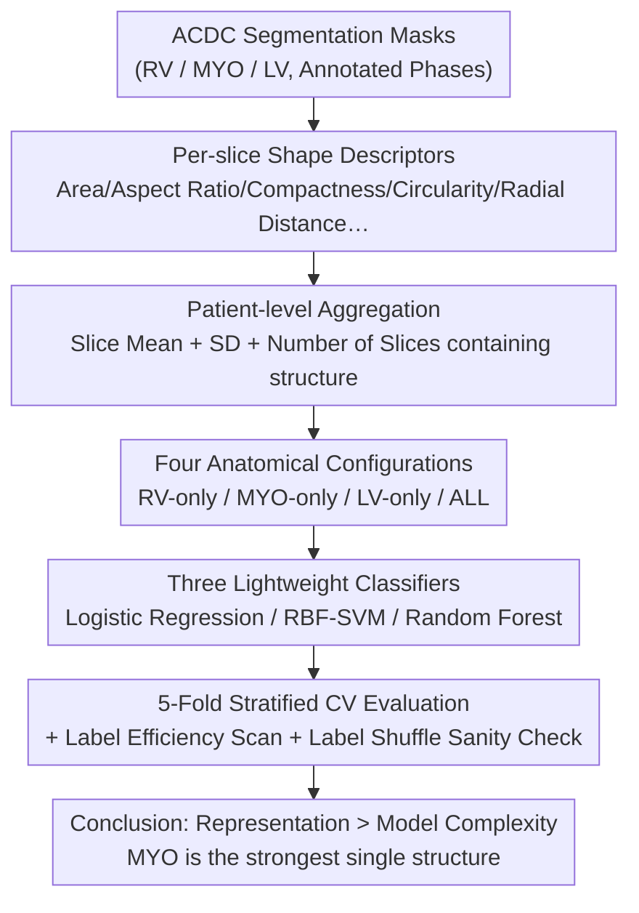

# Which Anatomy Matters Under Limited Labels? A Data-Efficient Anatomy-Aware Benchmark for Cardiac Pathology Prediction

**Conference**: ICML 2026  
**arXiv**: [2606.06509](https://arxiv.org/abs/2606.06509)  
**Code**: To be confirmed  
**Area**: Medical Imaging / Cardiac MRI / Low-label Benchmark  
**Keywords**: Anatomy-aware representation, low-label, cardiac pathology classification, ACDC, feature engineering

## TL;DR
This paper constructs a "low-label + constrained compute" anatomy-aware benchmark using the public ACDC cardiac MRI dataset. By performing 5-class cardiac pathology classification using patient-level shape descriptors derived from segmentation masks, it systematically demonstrates that when labels are scarce, **choosing the right anatomical representation is more important than increasing model complexity**—specifically, the myocardium (MYO) provides the strongest signal among single structures, while multi-structure combinations achieve the best overall performance.

## Background & Motivation
**Background**: In low-label medical imaging scenarios, researchers often instinctively "apply more complex models" to improve performance. However, in tasks like cardiac imaging, pathology is expressed through **anatomically meaningful structures** (the morphology of the right ventricle RV, myocardium MYO, and left ventricle LV) rather than arbitrary image variations.

**Limitations of Prior Work**: In reality, the bottleneck for medical AI often lies not in model design but in data preparation, annotation, and deployment infrastructure—especially in resource-constrained medical settings (e.g., regions with limited radiological infrastructure) where compute-intensive end-to-end pipelines are difficult to implement. However, whether performance issues stem from insufficient model complexity or poorly represented clinical structures has not been cleanly decoupled.

**Key Challenge**: Does performance gain primarily come from "more expressive models" or "better representation of clinically meaningful anatomy"? These two factors are entangled in previous works—switching to a stronger classifier and a richer representation often happens simultaneously, making attribution impossible.

**Goal**: To construct a **reproducible low-label benchmark** to answer four progressive questions under controlled conditions: ① Whether the benchmark remains discriminative under label scarcity; ② Which anatomical structure carries the strongest predictive signal; ③ Whether simple inter-phase dynamic features are more useful than static anatomical features; ④ Whether these gains can survive basic sanity checks.

**Key Insight**: The authors decompose a representative short-axis cardiac MR image into **four structural views: RV-only, MYO-only, LV-only, and ALL-structures**. They treat "anatomical representation" and "classifier complexity" as two independently ablatable axes to observe which axis exhibits greater variance.

**Core Idea**: Summarized as "Representation before complexity"—in low-label structured medical learning, identifying and explicitly representing the most informative anatomy is more worthwhile than switching to a more complex classifier.

## Method

### Overall Architecture
This is a **benchmark/empirical study** rather than a new model paper. The purpose of the entire pipeline is to "isolate the contribution of anatomical representation under controlled variables." The process starts from ACDC annotated segmentation masks $\to$ extracts manual shape descriptors for each anatomical structure $\to$ aggregates them into patient-level features $\to$ splits them into four anatomical configurations (RV/MYO/LV/ALL) $\to$ feeds them into three types of lightweight classifiers (Linear/Kernel/Tree) $\to$ evaluates under 5-fold stratified cross-validation, with additional label efficiency scans, dynamic feature enhancement, and label shuffling sanity checks. The design intentionally keeps "models lightweight and features transparent" so that observed performance differences can be cleanly attributed to "representation choice" rather than "model capacity."

### Key Designs

**1. Anatomy-aware representation ablation: Controlling "which anatomy matters"**

This is the core experimental design of the benchmark. The authors define four structural configurations for the same MRI slice: RV-only, MYO-only, LV-only, and ALL-structures (concatenating all three). This decomposition is chosen because cardiac pathologies (DCM, HCM, MINF, NOR, RV; 100 patients total, 20 per class, balanced) are highly structure-specific. By isolating representations by anatomy and fixing the classifiers for comparison, one can directly read whether the gain from switching from "RV-only to MYO-only" is larger than the gain from "switching between three types of classifiers." The conclusion is that the former is significantly larger, supporting the "Representation > Complexity" claim.

**2. Segmentation-derived manual shape descriptors + patient-level aggregation: Transparent features**

To isolate structure-specific signals, the authors **bypass end-to-end raw image learning** and instead extract a set of simple shape descriptors from binary segmentation masks: area, area ratio, aspect ratio, principal axis statistics, elongation, compactness, circularity, extent, and radial distance summaries. After extracting these for each annotated frame and anatomical structure per slice, they aggregate them by patient using the **mean and standard deviation** across slices, plus the "number of slices containing that structure." This intentional flattening of feature engineering keeps models lightweight and interpretable, enabling the subsequent "summing feature importance by structure" (using the sum of absolute logistic regression coefficients).

**3. Controlled evaluation protocol + sanity check: Ensuring true signals over leakage**

To ensure credibility, the authors use 5-fold stratified cross-validation. All preprocessing (median imputation, feature standardization) is **fitted only within the training fold** before being applied to the validation fold to prevent information leakage. Label fraction experiments involve repeated random sub-sampling reporting means and standard deviations. The most critical is the **label shuffling control**: after randomly shuffling labels, the balanced accuracy drops from $0.870\pm0.057$ to $0.230\pm0.057$ (close to the random baseline of 0.2 for a 5-class balanced task), proving the observed gains come from real anatomical signals rather than dataset leakage or shortcut cues. Additionally, a label efficiency scan and an end-to-end ResNet-18 baseline (which performs significantly worse than the three anatomy-aware baselines) further confirm the value of explicit anatomical representation under low labels.

**4. Static vs. Dynamic features: An honest negative result**

The authors also investigate whether "adding simple inter-phase dynamic information is better" by augmenting the features with explicit inter-phase delta and ratio descriptors. The result is that **these dynamic features do not outperform static multi-structure representations**. The authors interpret this cautiously: it may be that ACDC pathologies are already strongly expressed in static morphology (especially MYO structure), or that manual dynamic descriptors are too compressed, losing richer spatial deformations between phases. This should not be read as "dynamic information is useless" but rather that "simple low-dimensional inter-phase summaries cannot beat already strong anatomy-aware static representations."

## Key Experimental Results

### Main Results (Anatomy Ablation)
5-class ACDC pathology prediction, 5-fold cross-validation balanced accuracy (fixed classifier, comparing anatomical representations):

| Anatomy Configuration | Single/Multi-structure | Relative Performance | Conclusion |
|-----------------------|------------------------|----------------------|------------|
| RV-only               | Single Structure       | Weakest              | Limited signal from RV alone |
| LV-only               | Single Structure       | Medium               | Weaker than MYO |
| **MYO-only**          | Single Structure       | **Strongest Single** | MYO morphology concentrates strongest single signal |
| **ALL-structures**    | Multi-structure        | **Overall Best**     | Global optimum with three structures |

> Key Comparison: The gain from switching from RV-only to MYO-only is **much larger** than the gain brought by switching between Logistic Regression/RBF-SVM/Random Forest (once representation is fixed)—i.e., "Representation > Complexity."

### Ablation Study (Dynamic Features + Sanity Check)

| Configuration | Balanced Accuracy | Description |
|---------------|-------------------|-------------|
| ALL-structures (Static) | $0.870\pm0.057$ | Strong Baseline |
| + inter-phase delta/ratio (Dynamic) | No substantial Gain | Simple dynamic features provide no gain |
| Label Shuffle Control | $0.230\pm0.057$ | Close to random 0.2, excludes leakage |
| End-to-end ResNet-18 | Significantly lower | End-to-end is not superior under low labels |

### Key Findings
- **Myocardium (MYO) is the strongest single structure signal**: Summing the absolute values of logistic regression coefficients by anatomical group shows MYO is the highest (Fig. 5), quantitatively confirming that several ACDC pathologies are expressed through myocardial wall morphology rather than chamber geometry.
- **Representation > Complexity**: Kernel methods and tree models provide limited improvements over strong anatomy-aware representations; the variance from choosing the right anatomy is far greater than that from changing the classifier.
- **Dynamic features are an honest negative result**: Simple inter-phase summaries failed to beat static representations, which the authors explicitly note does not mean dynamic information itself is useless.

## Highlights & Insights
- **Turning vague methodology questions into controlled experiments**: Issues like "is the model not strong enough or is the representation poor" are often discussed abstractly; here, the authors cleanly decouple them using a "Anatomy Axis × Classifier Axis" dual ablation with reproducible answers.
- **Reporting negative results and conducting strong controls**: The lack of gain from dynamic features is reported faithfully; the drop from 0.87 to 0.23 in the label shuffle test makes the claim of "true signal" very robust.
- **Transferable practical principles**: In resource-constrained medical scenarios (the authors mention the Global South), rather than using heavy end-to-end models, priority should be given to identifying and explicitly representing anatomy that carries clinical signals (MYO here). This "representation before complexity" principle is transferable to other low-label structured medical tasks.

## Limitations & Future Work
- The authors acknowledge that the study uses only a single public dataset (ACDC, 100 patients), relies on manual segmentation-derived descriptors rather than end-to-end learning, and characterizes dynamics only via simple inter-phase summaries.
- Future Work: Extending to more datasets, introducing uncertainty-aware analysis, more complex temporal descriptors, and external validation across institutions.
- Ours: The scale of 100 patients (20 per class) is small, and the variance in 5-fold CV is naturally high (SD ~0.057). The "MYO is most important" conclusion depends on the choice of manual shape descriptors; whether this remains robust with different descriptors or pathology spectrums remains to be verified. The end-to-end ResNet-18 was trained only on "representative slices," which may not be fully fair to end-to-end methods.

## Related Work & Insights
- **vs. Isensee / Khened (ACDC segmentation + manual feature diagnosis)**: Prior works combined segmentation outputs with clinical features for automated disease assessment; this paper further focuses on "which anatomy has the strongest signal under low labels" and its importance relative to classifier complexity.
- **vs. Zheng et al. (Shape + motion interpretable classification)**: They combined shape and motion features; the negative dynamic result in this paper suggests "simple inter-phase summaries" might not replicate the value of motion information, requiring richer temporal descriptors.
- **vs. End-to-end Deep Models**: On low-label ACDC, end-to-end ResNet-18 is significantly weaker than anatomy-aware lightweight baselines, supporting the core argument that "explicit anatomical representation is more cost-effective when data is scarce."

## Rating
- Novelty: ⭐⭐⭐ Does not propose a new model; value lies in framing "Representation vs. Complexity" as a controlled, reproducible anatomy-aware benchmark with clear conclusions.
- Experimental Thoroughness: ⭐⭐⭐ Includes multi-dimensional analysis like label efficiency, anatomy ablation, dynamic features, and label shuffling, but limited to a single 100-sample dataset.
- Writing Quality: ⭐⭐⭐⭐ Problem-driven, clear conclusions, and honest reporting of negative results and controls.
- Value: ⭐⭐⭐⭐ Provides an actionable principle for resource-constrained medical AI (prioritize critical anatomy representation), with strong practical guidance.

<!-- RELATED:START -->

## Related Papers

- [\[ICLR 2026\] Anatomy-aware Representation Learning for Medical Ultrasound](../../ICLR2026/medical_imaging/anatomy-aware_representation_learning_for_medical_ultrasound.md)
- [\[AAAI 2026\] Vascular Anatomy-aware Self-supervised Pre-training for X-ray Angiogram Analysis](../../AAAI2026/medical_imaging/vascular_anatomy-aware_self-supervised_pre-training_for_x-ray_angiogram_analysis.md)
- [\[CVPR 2026\] RDFace: A Benchmark Dataset for Rare Disease Facial Image Analysis under Extreme Data Scarcity and Phenotype-Aware Synthetic Generation](../../CVPR2026/medical_imaging/rdface_a_benchmark_dataset_for_rare_disease_facial_image_analysis_under_extreme_.md)
- [\[ICML 2026\] MEG-XL: Data-Efficient Brain-to-Text via Long-Context Pre-Training](meg-xl_data-efficient_brain-to-text_via_long-context_pre-training.md)
- [\[AAAI 2026\] GuideGen: A Text-Guided Framework for Paired Full-Torso Anatomy and CT Volume Generation](../../AAAI2026/medical_imaging/guidegen_a_text-guided_framework_for_paired_full-torso_anatomy_and_ct_volume_gen.md)

<!-- RELATED:END -->
