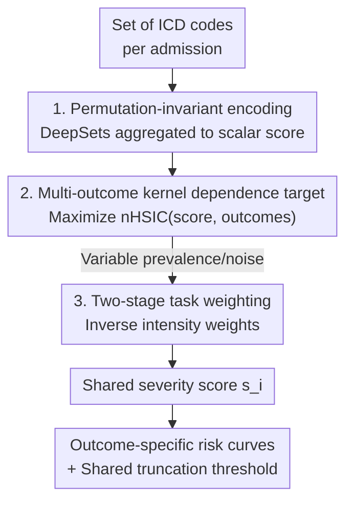

# A Machine-Learned Comorbidity Index

**Conference**: ICML2026  
**arXiv**: [2606.17450](https://arxiv.org/abs/2606.17450)  
**Code**: Not released  
**Area**: Medical NLP / Clinical Risk Modeling / Kernel Dependence Learning  
**Keywords**: Comorbidity Index, ICD Diagnosis Codes, HSIC, Multi-outcome Learning, Patient Stratification  

## TL;DR
Traditional comorbidity scores (Charlson, Elixhauser) are linear rules with weights manually calibrated for mortality, performing poorly on other clinical outcomes. This paper utilizes neural networks to compress ICD codes from an admission into a scalar score, trained by **maximizing the normalized HSIC (kernel dependence) between this score and multiple clinical outcomes**. This ensures the single score provides consistent severity ranking across mortality, readmission, length of stay, and ICU admission. The dependence metrics on MIMIC-III/IV significantly exceed those of traditional indices and various machine learning baselines.

## Background & Motivation

**Background**: In clinical risk adjustment and patient stratification, "comorbidity indices" are universally used to compress diagnostic information from an admission into a scalar score. The most common are the Charlson Comorbidity Index (CCI) and the van Walraven weighted Elixhauser Index (ECI), both of which map diagnostic codes to predefined indicator variables and sum them with fixed weights.

**Limitations of Prior Work**: These manual indices suffer from two major flaws. First, they were originally **calibrated for in-hospital mortality**, locking their weights to a single outcome and leading to poor generalization for ICU admission, length of stay (LOS), or readmission. However, clinical practice assumes that a patient's diagnostic burden should yield a severity ranking consistent across multiple outcomes. Manual indices lack a principled way to learn such cross-outcome consistency. Second, they are **linear and rule-based**, failing to capture non-linear relationships—where certain combinations of diagnoses amplify risk, or additional diagnoses show diminishing returns on an already severe baseline.

**Key Challenge**: Clinical practice requires a "single scalar score" (maintaining the ease of use of CCI/ECI) that simultaneously satisfies "consistent ranking across multiple outcomes" and "non-linear risk representation"—objectives that manual linear rules cannot achieve simultaneously.

**Goal**: The authors decompose this into three questions: (1) To what extent do common admission outcomes **share** an underlying admission-level severity ranking? (2) If such a ranking exists, can it be learned in a data-driven, principled manner while allowing outcome-specific non-linear risk curves? (3) Can a **truncation threshold** be learned to consistently identify high-severity populations across outcomes for intervention?

**Core Idea**: Replace "manual weighting for single-mortality" with "maximizing kernel dependence (nHSIC) between the score and multiple outcomes." A DeepSets-encoded scalar score captures shared, potentially non-linear severity signals without being dominated by any single outcome.

## Method

### Overall Architecture
The input to MLCI is a variable-length set of ICD diagnosis codes $X_i$ from an admission, and the output is a scalar severity score $s_i = s_\theta(X_i) \in \mathbb{R}$. The pipeline consists of four steps: normalizing and truncating ICD codes into tokens, aggregating them into a scalar using a permutation-invariant DeepSets encoder, maximizing the **normalized HSIC (nHSIC)** between this score and each clinical outcome, and using a two-stage task weighting to prevent dominance by specific outcomes. Finally, risk curves are estimated for each outcome to map the shared score back to specific probabilities.

### Key Designs

**1. Permutation-invariant Single-score Encoder: Compressing a bag of diagnoses into a scalar**

ICD codes are unordered variable-length sets. The encoder $s_\theta$ uses a DeepSets-style architecture: each token embedding $e_j$ passes through an element-wise MLP $\phi$ to obtain $h_j=\phi(e_j)$, followed by concatenated masked mean and max pooling. A final MLP $\rho$ produces the scalar $s_i = \rho(\mathrm{Agg}(\{\phi(e_j)\}))$. This ensures the score depends only on "which diagnoses are present" rather than their record order.

**2. Multi-outcome Normalized HSIC: Using kernel dependence instead of single-outcome likelihood**

Maximizing cross-entropy for a single outcome creates task-specific representations. Instead, the authors use HSIC to capture both linear and non-linear dependencies. On a mini-batch of size $n_b$, an RBF kernel Gram matrix $K_{ij}^{(b)}=k(s_i,s_j)$ is constructed for the scores, and a delta kernel $L_{ij}^{(b,t)}=\mathbb{I}\{y_i^{(t)}=y_j^{(t)}\}$ for each task $t$. The optimization target is:

$$\widehat{\mathrm{nHSIC}}(s,y^{(t)})=\frac{\langle K_c^{(b)},L_{t,c}^{(b)}\rangle_F}{\max\{\|K_c^{(b)}\|_F,\varepsilon_0\}\,\|L_{t,c}^{(b)}\|_F}.$$

This asks: do admissions with similar scores have similar outcomes? Normalization allows for direct summation across different outcomes.

**3. Two-stage Task Weighting: Preventing dominance by high-prevalence outcomes**

To prevent "easy-to-learn" outcomes from dominating, the objective is $\max_\theta \sum_{t=1}^T \alpha_t\,\widehat{\mathrm{nHSIC}}(s_\theta(X),y^{(t)})$. In stage one, individual models are trained to find the best validation nHSIC $\widehat{h}_t$. In stage two, stabilized inverse intensity weights are used:

$$\alpha_t \propto \left(\frac{\widehat{h}_{\max}}{\max(\widehat{h}_t,\varepsilon_{\mathrm{wt}})}\right)^{\gamma_{\mathrm{wt}}},$$

allocating more optimization resources to "harder" outcomes to force the learning of truly shared signals.

**4. Shared Severity Theory: When a single score suffices as a universal ranker**

The authors provide a finite-sample theoretical characterization. If an unobserved latent severity $z_i$ exists such that each outcome $t$ follows $\Pr\{y_i^{(t)}=1\mid z_i\}=f_t(z_i)$, the goal is to recover the rank of $z_i$. When the stacked centered label profiles are **approximately rank-one**, a single dominating admission-level direction $v$ exists. The multi-outcome objective then reduces to aligning the score kernel with $v$, justifying the use of a single scalar and threshold for cross-outcome stratification.

### Loss & Training
The objective is the **maximization** of weighted multi-task nHSIC. The RBF bandwidth $\sigma$ is set via a stabilized median heuristic. For missing labels, multi-task training utilizes the intersection cohort where all outcomes are observed, while evaluation uses full task-specific testing sets for fairness.

## Key Experimental Results

Experiments on MIMIC-III (ICD-9) and MIMIC-IV (ICD-10) evaluate four outcomes: in-hospital mortality (MORT), 30-day mortality (30M), length of stay (LOS), and ICU admission (ICU). Performance is measured via statistical dependence: distance correlation (dCorr) and mutual information (MI).

### Main Results: Distance Correlation (Table 1, values scaled by ×10²)

| Outcome (MIMIC-IV) | Charlson | Elixhauser | Best Baseline | MLCI (Ours) |
|---|---|---|---|---|
| MORT | 12.59 | 19.98 | 36.41 (FM) | **54.80** |
| 30M | 18.44 | 23.87 | 35.82 (FM) | **49.42** |
| LOS | 24.55 | 33.15 | 51.02 (LR) | **51.15** |
| ICU | 16.09 | 25.98 | 57.23 (LR) | **61.97** |

MLCI ranks first across all outcomes in MIMIC-IV, with the largest gains in mortality. In MIMIC-III, it leads in MORT, 30M, and LOS, but **underperforms the DeepSets baseline on ICU (18.55 vs 21.52)**—an identified failure point where the shared severity assumption may weaken.

### Key Findings
- **Kernel Objective + Architecture are both essential**: Compared to DeepSets (trained on single-outcome likelihood), MLCI nearly doubles mortality dCorr, indicating that **gains primarily stem from the nHSIC multi-outcome objective** rather than just the encoder.
- **Outcome Heterogeneity**: Gains are dominant for mortality but narrower for LOS/ICU, which are influenced by operational factors (e.g., bed availability) rather than pure clinical severity.
- **Traditional Indices are Surpassed**: CCI/ECI consistently rank last, quantitatively confirming that mortality-locked linear rules generalize poorly across outcomes.

## Highlights & Insights
- **Reframing Score Learning as Dependence Maximization**: Moving beyond regression/classification to optimize statistical dependence naturally supports non-linearity and avoids bias toward any single outcome.
- **Theoretical "Single-score" Verifiability**: The rank-one condition of the stacked label profile matrix provides a diagnostic tool to test if a shared severity axis truly exists in the data.
- **Principled Task Weighting**: The inverse intensity trick effectively balances multi-task learning without manual heuristic tuning.

## Limitations & Future Work
- **Shared Severity Assumption**: The assumption of a single shared axis may break down for outcomes like ICU/LOS, which are influenced by non-clinical factors.
- **Metric Focus**: Evaluation relies on dCorr/MI; clinical utility metrics such as AUC, calibration, and net benefit for specific decision-making tasks require further validation.
- **Transferability**: Validated only on MIMIC; performance across different hospital systems or broader coding systems (ICD-11) remains to be explored.

## Related Work & Insights
- **vs. Traditional Indices**: MLCI moves from fixed linear weights to data-driven non-linear alignment.
- **vs. Single-outcome ML**: Traditional ML produces task-specific scores; MLCI learns a "universal" severity signal.
- **vs. Kernel Learning**: While HSIC is often used for feature selection, this work applies it as a training signal for clinical severity scores with accompanying latent severity theory.

## Rating
- Novelty: ⭐⭐⭐⭐ Reframing comorbidity as multi-outcome nHSIC maximization is a fresh perspective.
- Experimental Thoroughness: ⭐⭐⭐ Strong multi-outcome evaluation, but lacking clinical decision-support metrics.
- Writing Quality: ⭐⭐⭐⭐ Clear motivation-to-theory chain.
- Value: ⭐⭐⭐⭐ Provides a principled framework for learnable comorbidity scores in clinical stratification.

<!-- RELATED:START -->

## Related Papers

- [\[ICLR 2026\] From Medical Records to Diagnostic Dialogues: A Clinical-Grounded Approach and Dataset for Psychiatric Comorbidity](../../ICLR2026/medical_nlp/from_medical_records_to_diagnostic_dialogues_a_clinical-grounded_approach_and_da.md)
- [\[ICML 2026\] Exploring Accurate and Transparent Domain Adaptation in Predictive Healthcare via Concept-Grounded Orthogonal Inference](exploring_accurate_and_transparent_domain_adaptation_in_predictive_healthcare_vi.md)
- [\[ICML 2026\] MedCase-Structured: A Text-to-FHIR Dataset for Benchmarking Diagnostic Reasoning in Clinically Realistic EHR Settings](medcase-structured_a_text-to-fhir_dataset_for_benchmarking_diagnostic_reasoning_.md)
- [\[ICML 2026\] ClinTutor-R1: Advancing Scalable and Robust One-to-Many Alignment in Clinical Socratic Education](clintutor-r1_advancing_scalable_and_robust_one-to-many_alignment_in_clinical_soc.md)
- [\[AAAI 2026\] GEM: Generative Entropy-Guided Preference Modeling for Few-shot Alignment of LLMs](../../AAAI2026/medical_nlp/gem_generative_entropy-guided_preference_modeling_for_few-shot_alignment_of_llms.md)

<!-- RELATED:END -->
