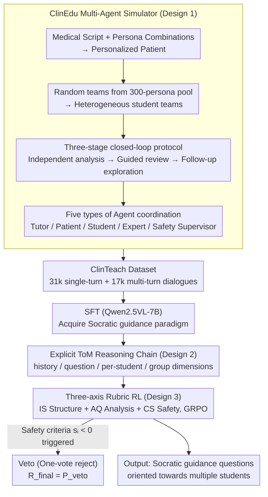

# ClinTutor-R1: Advancing Scalable and Robust One-to-Many Alignment in Clinical Socratic Education

**Conference**: ICML 2026 Spotlight  
**arXiv**: [2512.05671](https://arxiv.org/abs/2512.05671)  
**Code**: https://github.com/Zhitao-He/ClinTutor-R1  
**Area**: Medical NLP  
**Keywords**: Clinical Education, One-to-Many Alignment, Socratic Teaching, Multi-Agent Simulation, Vision-Language Models  

## TL;DR

This paper proposes ClinTutor-R1, the first vision-language agent for one-to-many alignment in clinical Socratic education. By constructing the 48k ClinTeach dialogue dataset via the ClinEdu multi-agent simulator, and utilizing explicit Theory of Mind (ToM) reasoning alongside three-axis rubric reinforcement learning, the model maintains stable teaching quality even when scaled to 10 students, outperforming baselines by 20% and reaching GPT-4o performance levels.

## Background & Motivation

**Background**: Current LLM alignment techniques (e.g., RLHF) have achieved significant success in one-on-one interaction scenarios. However, many real-world applications require AI to serve multiple users simultaneously, such as a tutor guiding multiple students during clinical rounds.

**Limitations of Prior Work**: Existing models face two core issues in one-to-many scenarios: (1) **Context dilution** — as the number of students increases, the model gradually loses the ability to track individual cognitive states; (2) **Goal misalignment** — difficulty in balancing personalized guidance with collective learning progress. Experiments show that baseline models hit a "performance cliff" when students exceed 3, with quality dropping by nearly 15%.

**Key Challenge**: Standard alignment methods only optimize reward signals for a single user and lack Theory of Mind (ToM) modeling capabilities. They cannot simultaneously maintain each student's cognitive state while coordinating group consensus, which is particularly critical in clinical scenarios requiring both safety and pedagogical depth.

**Goal**: Construct a scalable one-to-many alignment framework that enables an AI tutor to provide high-quality Socratic personalized teaching as student numbers grow.

**Key Insight**: The authors select clinical rounds as the testbed. This scenario naturally features heterogeneous cognitive states (from novices to senior residents) and dual clinical-pedagogical objectives (deep reasoning vs. safety baselines), making it an ideal experimental environment for one-to-many alignment.

**Core Idea**: Generate large-scale pedagogical dialogue data through a multi-agent simulator. Combined with an explicit ToM reasoning mechanism and multi-axis rubric reinforcement learning, train a vision-language agent capable of maintaining stable teaching quality in one-to-many scenarios.

## Method

### Overall Architecture

This paper addresses the alignment challenge when "one AI tutor leads multiple students." As the number of students increases, models struggle to track individual cognitive states and coordinate group progress. ClinTutor-R1 decomposes the pipeline into three components: first, the **ClinEdu** multi-agent simulator generates high-fidelity pedagogical dialogues for clinical rounds, creating the 48k-dialogue **ClinTeach** dataset (31k single-turn + 17k multi-turn); second, Qwen2.5VL-7B is fine-tuned (SFT) on this data to acquire the basic Socratic guiding paradigm (including "reason-before-act" ToM reasoning); finally, three-axis rubric reinforcement learning refines its dynamic adaptability to varying student scales. The model processes clinical cases (text + medical imaging like X-ray/CT) and outputs guided questions for multiple students.

### Key Designs

**1. ClinEdu Multi-Agent Simulator: Bypassing Data Scarcity and Privacy Walls via Decoupled Synthesis**

Actual clinical teaching dialogues are restricted by privacy regulations and are naturally scarce; data synthesized from static templates fails to capture pedagogical conflicts emerging in groups. ClinEdu solves this by decoupling the patient into two layers: an objective medical script (Patient Script) and a subjective Persona. Flexible combinations of these allow for almost infinite clinical scenarios. On the student side, teams are randomly sampled from a 300-persona pool, with each student bringing different knowledge levels, cognitive styles, and learning methods. The interaction follows a three-stage closed-loop protocol: students analyze cases independently, the tutor provides Socratic guidance (reviewed by expert and safety agents), and students initiate follow-up explorations.

**2. Explicit Theory of Mind (ToM) Reasoning: Individually "Reasoning" for Each Student Before Responding**

The root of context dilution is that information from multiple students becomes conflated in long contexts, making it difficult for the model to identify specific student bottlenecks. ClinTutor-R1's strategy is structured internal reasoning before generating guidance, explicitly decomposing multi-agent interactions into individual analyses. The reasoning chain spans four dimensions: `<think history>` tracks dialogue progress, `<think question>` aligns pedagogical goals, `<think student student_id="X">` generates an independent reasoning trajectory for each student to judge their current understanding, and `<think group>` synthesizes these to identify collective blind spots. These per-student trajectories prevent information overlap as student numbers grow.

**3. Three-axis Rubric Reinforcement Learning: Decoupling "Pedagogical Flexibility" and "Safety Rigidity" with Veto**

SFT only learns the paradigm and lacks flexibility for diverse student inputs; a single holistic score conflates "flexible pedagogy" with "non-negotiable safety." Consequently, rewards are decomposed along three axes: **Instructional Structure Fidelity** (IS), **Analysis Quality** (AQ), and **Clinical Safety** (CS). Crucially, a veto mechanism is implemented: if any safety-related criterion $s_i < 0$ in $\{CS-1, CS-2, IS-1\}$, the final reward is crushed to a large negative value $R_{\text{final}} = P_{\text{veto}}$. Optimized via the GRPO algorithm, this ensures safety is a hard floor rather than a tradeable component, while preserving the diversity required for Socratic teaching.

## Key Experimental Results

### Main Results

| Model | MedXpertQA Avg | MVME Avg | MSM (MedXpert) | MSM (MVME) |
|------|---------------|----------|----------------|------------|
| LLaVA-v1.6 | 5.87 | 5.56 | 6.15 | 5.74 |
| Qwen2.5VL (Baseline) | 6.96 | 6.83 | 7.04 | 7.13 |
| TutorRL | 7.42 | 7.13 | 7.49 | 7.01 |
| Med-SocraticLM | 7.41 | 7.28 | 7.33 | 7.18 |
| GPT-4o | 8.36 | 8.47 | 8.26 | 8.39 |
| o3 | 8.42 | 8.45 | 8.18 | 8.23 |
| **Ours (ClinTutor-R1)** | **8.35** | **8.49** | **8.41** | **8.55** |

Ours exceeds GPT-4o on MVME (8.49 vs 8.47) and significantly outperforms GPT-4o in the Multi-Student Management (MSM) dimension (8.55 vs 8.39). In human expert evaluations, Ours scored 8.73, surpassing o3's 8.41; in a 200-person user study, it achieved a recommendation score of 8.70.

### Ablation Study

| Configuration | MedXpertQA Avg | MVME Avg | Description |
|------|---------------|----------|-------------|
| Full model | 8.35 | 8.49 | Complete model |
| w/o RL | 7.69 | 7.58 | Largest drop (0.66/0.91) without RL |
| w/o Thinking | 7.94 | 7.79 | Drop of 0.41/0.70 without ToM reasoning |
| w/ Vanilla reward | 8.01 | 7.88 | Single reward instead of three-axis rubric |
| w/o reward veto | 7.87 | 8.03 | MPS (Safety) plummeted (8.26→6.92) without veto |
| w/ One-Student | 7.86 | 7.69 | Poor generalization when trained on single students |

### Key Findings

- **RL contributes the most**: Removing reinforcement learning results in the largest performance decline, indicating SFT alone is insufficient for adapting to diverse student inputs.
- **Veto mechanism is critical for safety**: Removing the veto caused the MPS (Medical Safety) dimension to plunge from 8.26 to 6.92, suggesting the policy learns "reward hacking" without hard constraints.
- **Scalability advantage**: When scaling from 1 to 10 students, ClinTutor-R1 maintains an average score above 8.20, whereas Med-SocraticLM drops by 15% after 3 students.
- **Correction capability**: In error injection experiments, ClinTutor-R1 achieved an 88.50% Correction Success Rate (CSR), particularly in "premature closure" (89.10%) and "safety/ethics risk" (88.60%) categories.

## Highlights & Insights

- **Explicit Decoupling of ToM Reasoning**: Writing independent `<think student>` trajectories for each student is an elegant solution to context dilution in one-to-many scenarios. This "think-before-act" design not only improves performance but also makes the AI tutor's decisions auditable and interpretable.
- **"Safety Floor" Design of Veto Mechanism**: Treating safety as a hard constraint rather than a soft reward component ensures clinical safety baselines without suppressing pedagogical diversity. The veto trigger rate dropped from 12% to 2%, showing the policy learned the safety boundaries rather than being passively constrained.
- **Decoupled Data Generation**: The Patient Script/Persona decoupling approach can be migrated to any role-playing training scenario (e.g., legal consultation, management training) to achieve exponential growth in data diversity through flexible combinations.

## Limitations & Future Work

- Perception is limited to text and static medical images; it lacks dynamic environment perception (e.g., patient expressions, physical exam maneuvers) present in real clinical rounds.
- While high-fidelity, simulator data still differs from real classroom environments (e.g., unmodeled student distraction or emotional shifts).
- Training and evaluation are primarily based on MedXpertQA; generalization across different medical systems (e.g., non-USMLE standards) remains to be verified.
- Future work could explore combining ToM reasoning with online learning to allow the model to continuously update its cognitive models of students during real interactions.

## Related Work & Insights

- **SocraticLM** (Liu et al., 2024b): Uses a Dean-Teacher-Student multi-agent pipeline for math teaching dialogues, but limited to one-on-one scenarios.
- **TutorRL** (Dinucu-Jianu et al., 2025): An RL framework balancing pedagogical guidance and answer leakage, but does not handle multi-student management.
- **MEDCO** (Wei et al., 2024): Multi-agent clinical team simulation, but with one-to-one patient-doctor mapping and no Script/Persona decoupling.
- The three-axis rubric + veto RL framework could be generalized to any RLHF task requiring multi-dimensional quality constraints (e.g., correctness-safety-readability in code generation).

<!-- RELATED:START -->

## Related Papers

- [\[ICLR 2026\] Doctor-R1: Mastering Clinical Inquiry with Experiential Agentic Reinforcement Learning](../../ICLR2026/medical_nlp/doctor-r1_mastering_clinical_inquiry_with_experiential_agentic_reinforcement_lea.md)
- [\[ACL 2026\] CURA: Clinical Uncertainty Risk Alignment for Language Model-Based Risk Prediction](../../ACL2026/medical_nlp/cura_clinical_uncertainty_risk_alignment_for_language_model-based_risk_predictio.md)
- [\[ACL 2026\] PrinciplismQA: A Philosophy-Grounded Approach to Assessing LLM-Human Clinical Medical Ethics Alignment](../../ACL2026/medical_nlp/principlismqa_a_philosophy-grounded_approach_to_assessing_llm-human_clinical_med.md)
- [\[AAAI 2026\] Learning Cell-Aware Hierarchical Multi-Modal Representations for Robust Molecular Modeling](../../AAAI2026/medical_nlp/learning_cell-aware_hierarchical_multi-modal_representations.md)
- [\[ICLR 2026\] MedAgentGym: A Scalable Agentic Training Environment for Code-Centric Reasoning in Biomedical Data Science](../../ICLR2026/medical_nlp/medagentgym_agentic_training_biomedical.md)

<!-- RELATED:END -->
