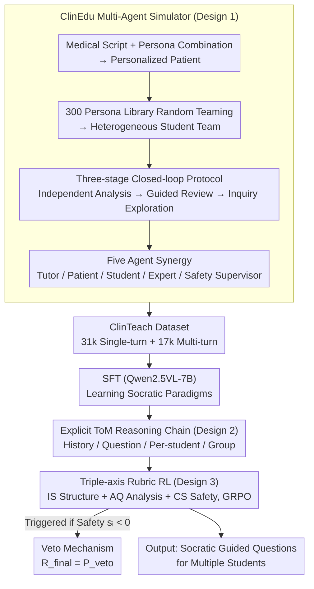

# ClinTutor-R1: Advancing Scalable and Robust One-to-Many Alignment in Clinical Socratic Education

**Conference**: ICML 2026 Spotlight  
**arXiv**: [2512.05671](https://arxiv.org/abs/2512.05671)  
**Code**: https://github.com/Zhitao-He/ClinTutor-R1  
**Area**: Medical NLP  
**Keywords**: Clinical Education, One-to-Many Alignment, Socratic Teaching, Multi-Agent Simulation, Vision-Language Models  

## TL;DR

This paper proposes ClinTutor-R1, the first vision-language Agent for one-to-many alignment in clinical Socratic teaching. By constructing a 48k dialogue dataset (ClinTeach) via the multi-agent simulator ClinEdu, and utilizing explicit Theory of Mind (ToM) reasoning with triple-axis rubric reinforcement learning, the model maintains stable teaching quality even when scaled to 10 students, outperforming baselines by 20% and achieving performance comparable to GPT-4o.

## Background & Motivation

**Background**: Current LLM alignment techniques (e.g., RLHF) have achieved significant success in one-to-one interaction scenarios. However, many real-world scenarios require AI to serve multiple users simultaneously, such as a mentor instructing multiple students during clinical rounds.

**Limitations of Prior Work**: Existing models face two core issues in one-to-many scenarios: (1) **Context dilution**—as the number of students increases, the model loses the ability to track individual cognitive states; (2) **Goal misalignment**—it is difficult to balance personalized guidance with collective learning progress. Experiments show that baseline models experience a "performance cliff" when the number of students exceeds three, with quality dropping by nearly 15%.

**Key Challenge**: Standard alignment methods only optimize reward signals for a single user and lack Theory of Mind (ToM) modeling capabilities. They cannot simultaneously maintain the cognitive state of each student while coordinating group consensus, which is particularly critical in clinical scenarios where safety and depth of reasoning must be balanced.

**Goal**: To build a scalable one-to-many alignment framework that allows the AI tutor to provide high-quality Socratic personalized teaching as student numbers grow.

**Key Insight**: The authors chose clinical rounds as the testbed—this scenario naturally features heterogeneous cognitive states (from novices to senior residents) and dual clinical-educational goals (deep reasoning vs. safety baselines), making it an ideal environment for one-to-many alignment.

**Core Idea**: Generate large-scale teaching dialogue data through a multi-agent simulator, combined with an explicit ToM reasoning mechanism and triple-axis rubric reinforcement learning, to train a vision-language Agent that maintains stable teaching quality in one-to-many scenarios.

## Method

### Overall Architecture

This paper addresses the alignment challenge when "one AI tutor leads multiple students": as students increase, the model fails to track individual cognitive states or coordinate group progress. ClinTutor-R1 decomposes the pipeline into three parts: first, the **ClinEdu** multi-agent simulator generates high-fidelity dialogues for clinical rounds to create the **ClinTeach** dataset (48k dialogues: 31k single-turn + 17k multi-turn); then, SFT is performed on Qwen2.5VL-7B to teach the basic paradigm of Socratic guidance (including "think-before-talk" ToM reasoning); finally, triple-axis rubric reinforcement learning is used to refine its dynamic adaptability under varying student scales. The model takes clinical cases (text + medical imaging like X-ray/CT) and outputs guided Socratic questions for multiple students.

### Key Designs

**1. ClinEdu Multi-Agent Simulator: Decoupled synthesis to bypass data scarcity and privacy walls**

Real clinical teaching dialogues are limited by privacy regulations and are naturally scarce. Data constructed from static templates fails to capture teaching conflicts emerging within groups. ClinEdu solves this by splitting the patient into two layers—an objective Patient Script and a subjective Persona. Combining these allows for near-infinite clinical scenarios. Students are randomly sampled from a library of 300 personas, each with different knowledge levels, cognitive styles, and learning methods. The interaction follows a three-stage closed-loop protocol: students analyze cases independently, the tutor provides Socratic guidance (reviewed by expert and safety agents), and students explore via follow-up questions.

**2. Explicit Theory of Mind (ToM) Reasoning: "Think" for each student individually before speaking**

Context dilution stems from multiple students' information mixing in long contexts, making it hard for the model to distinguish individual progress. ClinTutor-R1's strategy is "think before you talk": generating a structured internal reasoning chain before the guidance. This reasoning is split into four dimensions: `<think history>` to track dialogue progress, `<think question>` to align with teaching goals, `<think student student_id="X">` to write an independent reasoning trajectory for each student to judge their understanding, and `<think group>` to synthesize the group state and identify collective blind spots. These per-student trajectories prevent information overlap as students increase.

**3. Triple-axis Rubric Reinforcement Learning: Scoring "Flexibility" and "Safety" separately with a veto floor**

SFT only learns the paradigm and lacks flexibility for diverse student inputs. However, a single holistic score merges the need for "strategic flexibility" with "safety rigidity." Rewards are decomposed along three axes: **Instruction Structure** (IS), **Analysis Quality** (AQ), and **Clinical Safety** (CS). Crucially, a **veto mechanism** is implemented—if any safety or structural rubric $\{CS\text{-}1, CS\text{-}2, IS\text{-}1\}$ scores $s_i < 0$, the final reward is crushed to a large negative value $R_{\text{final}} = P_{\text{veto}}$, regardless of other scores. Optimized with the GRPO algorithm, this ensures safety is a hard floor rather than a tradeable component.

## Key Experimental Results

### Main Results

| Model | MedXpertQA Avg | MVME Avg | MSM (MedXpert) | MSM (MVME) |
|------|---------------|----------|----------------|------------|
| LLaVA-v1.6 | 5.87 | 5.56 | 6.15 | 5.74 |
| Qwen2.5VL (Baseline) | 6.96 | 6.83 | 7.04 | 7.13 |
| TutorRL | 7.42 | 7.13 | 7.49 | 7.01 |
| Med-SocraticLM | 7.41 | 7.28 | 7.33 | 7.18 |
| GPT-4o | 8.36 | 8.47 | 8.26 | 8.39 |
| o3 | 8.42 | 8.45 | 8.18 | 8.23 |
| **ClinTutor-R1** | **8.35** | **8.49** | **8.41** | **8.55** |

ClinTutor-R1 outperforms GPT-4o on MVME (8.49 vs 8.47) and is significantly superior in Multi-Student Management (MSM) with a score of 8.55 vs 8.39. In human expert evaluations, ClinTutor-R1 averaged 8.73, surpassing o3 (8.41).

### Ablation Study

| Configuration | MedXpertQA Avg | MVME Avg | Description |
|------|---------------|----------|------|
| Full model | 8.35 | 8.49 | Complete model |
| w/o RL | 7.69 | 7.58 | Largest drop (0.66/0.91) |
| w/o Thinking | 7.94 | 7.79 | Removing ToM chain drops 0.41/0.70 |
| w/ Vanilla reward | 8.01 | 7.88 | Single reward instead of triple-axis |
| w/o reward veto | 7.87 | 8.03 | MPS (Medical Safety) plunges (8.26→6.92) |
| w/ One-Student | 7.86 | 7.69 | Trained only on single students; poor generalization |

### Key Findings

- **RL contributes the most**: Removing RL leads to the largest performance drop, showing SFT is insufficient for dynamic adaptation.
- **Veto mechanism is vital for safety**: Removing the veto mechanism causes the MPS (Medical Safety) dimension to plunge, suggesting the policy learns "reward hacking" without hard constraints.
- **Scalability Advantage**: ClinTutor-R1 maintains an average score above 8.20 as students scale from 1 to 10, whereas Med-SocraticLM drops by 15% after 3 students.
- **Correction Capability**: In error injection experiments, ClinTutor-R1 achieved a Corrective Success Rate (CSR) of 88.50%.

## Highlights & Insights

- **Explicit Decoupling of ToM Reasoning**: Writing independent `<think student>` trajectories is an elegant solution to context dilution in one-to-many scenarios. This "think-before-talk" design not only improves performance but also makes the AI tutor's decisions auditable.
- **"Safety Floor" Design via Veto**: Treating safety as a hard constraint rather than a soft reward manages clinical boundaries without suppressing the diversity of teaching strategies.
- **Decoupled Data Generation**: The Patient Script/Persona decoupling can be transferred to any scenario requiring role-playing training data (e.g., legal consulting, management training).

## Limitations & Future Work

- Perception is limited to text and static medical images (X-ray, CT), lacking dynamic environment perception (e.g., patient expressions).
- While high-fidelity, the simulator data still has a gap with real classrooms (e.g., unmodeled student distraction or emotional volatility).
- Generalization across different medical systems (e.g., non-USMLE standards) remains to be validated.
- Potential to explore combining ToM reasoning with online learning to continuously update cognitive models of students during real interactions.

## Related Work & Insights

- **SocraticLM** (Liu et al., 2024b): Dean-Teacher-Student multi-agent pipeline for math dialogues, but limited to single-student scenarios.
- **TutorRL** (Dinucu-Jianu et al., 2025): RL framework to balance guidance vs. answer leakage, but lacks multi-student management.
- **MEDCO** (Wei et al., 2024): Multi-agent clinical team simulation, but with 1:1 doctor-patient mapping without Script/Persona decoupling.
- The triple-axis rubric + veto RL framework can be generalized to any RLHF task requiring multi-dimensional quality constraints (e.g., Correctness-Safety-Readability in code generation).

<!-- RELATED:START -->

## Related Papers

- [\[ACL 2026\] CURA: Clinical Uncertainty Risk Alignment for Language Model-Based Risk Prediction](../../ACL2026/medical_nlp/cura_clinical_uncertainty_risk_alignment_for_language_model-based_risk_predictio.md)
- [\[ACL 2026\] PrinciplismQA: A Philosophy-Grounded Approach to Assessing LLM-Human Clinical Medical Ethics Alignment](../../ACL2026/medical_nlp/principlismqa_a_philosophy-grounded_approach_to_assessing_llm-human_clinical_med.md)
- [\[AAAI 2026\] Learning Cell-Aware Hierarchical Multi-Modal Representations for Robust Molecular Modeling](../../AAAI2026/medical_nlp/learning_cell-aware_hierarchical_multi-modal_representations.md)
- [\[ACL 2025\] A Modular Approach for Clinical SLMs Driven by Synthetic Data with Pre-Instruction Tuning, Model Merging, and Clinical-Tasks Alignment](../../ACL2025/medical_nlp/a_modular_approach_for_clinical_slms_driven_by_synthetic_data_with_pre-instructi.md)
- [\[ICLR 2026\] MedAgentGym: A Scalable Agentic Training Environment for Code-Centric Reasoning in Biomedical Data Science](../../ICLR2026/medical_nlp/medagentgym_agentic_training_biomedical.md)

<!-- RELATED:END -->
