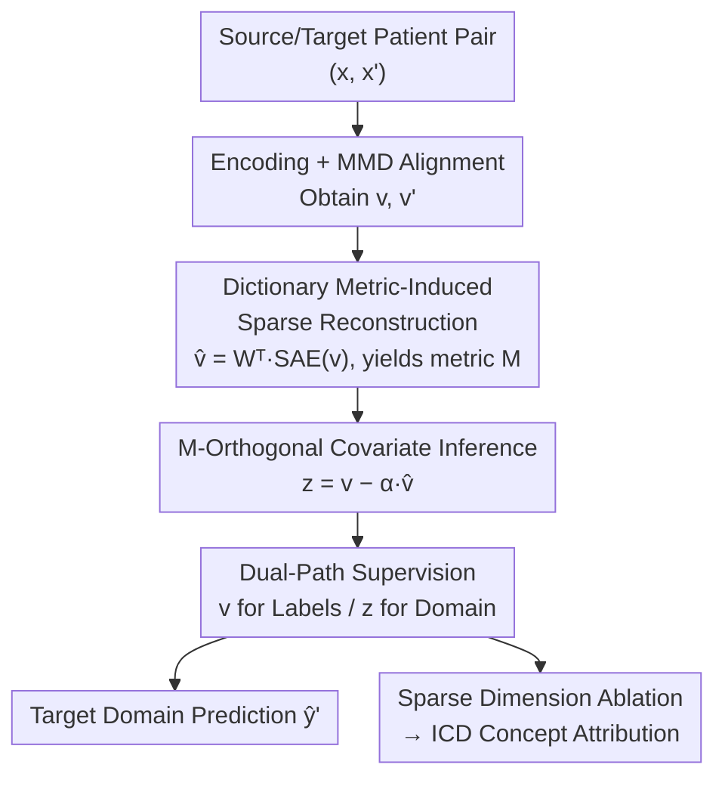

# Exploring Accurate and Transparent Domain Adaptation in Predictive Healthcare via Concept-Grounded Orthogonal Inference

**Conference**: ICML2026  
**arXiv**: [2602.12542](https://arxiv.org/abs/2602.12542)  
**Code**: To be confirmed  
**Area**: Medical NLP / Domain Adaptation / Interpretability  
**Keywords**: EHR Prediction, Domain Adaptation, Sparse Autoencoders, Orthogonal Decomposition, Concept Attribution

## TL;DR
ExtraCare utilizes a "dictionary metric-induced orthogonal decomposition" to decouple Electronic Health Record (EHR) patient representations into "cross-domain invariant label information" and "domain-specific covariate residuals." It surpasses existing domain adaptation baselines on two real-world EHR datasets while mapping each latent variable back to specific ICD medical concepts via sparse dimension ablation. This informs clinicians exactly what was "preserved" and "discarded" during the adaptation process.

## Background & Motivation

**Background**: Deep learning has proven effective for clinical event prediction in EHR (e.g., diagnosis prediction, heart failure prediction). However, model performance often degrades significantly when trained at Hospital A and deployed at Hospital B or in a different time period due to distribution shift. Domain Adaptation (DA) methods have been introduced to address this, primarily through **feature alignment**: using Maximum Mean Discrepancy (MMD) or adversarial training to pull source and target features into a shared space, forcing the model to focus on "cross-domain shared" components.

**Limitations of Prior Work**: Clinicians rarely adopt these DA methods in routine practice, fundamentally due to **opacity**. DA is essentially a "selection process on patient representations"—deciding which information to keep (invariant) and which to discard as domain noise (covariant). However, most DA methods operate strictly in latent spaces; doctors cannot understand what the "preserved" and "discarded" components represent medically. If the model fails, there is no way to verify or debug it.

**Key Challenge**: Connecting interpretability to DA faces two specific obstacles. First, interpretability tools like Sparse Autoencoders (SAEs) are typically applied **post hoc**—the reconstruction goal is decoupled from the training goal, yielding explanations that are "mirrors of model parameters" rather than "reflections of real medical records," leading to bias. Second, almost all DA methods emphasize "which invariant concepts were learned" but **fail to visualize the discarded domain-specific information**. In clinical settings, knowing "what the model ignored" is as critical as knowing "what the model relies on" (otherwise, adaptation might silently erase meaningful subgroup patterns).

**Goal**: To develop a clinical DA framework that is both accurate and transparent, capable of: (1) explicitly decomposing patient representations into invariant and covariant components, (2) providing supervision for both, and (3) mapping sparse dimensions back to medical concepts while distinguishing whether a concept "drives label prediction" or "reflects domain shift."

**Key Insight**: many clinical prediction tasks are "code-level predictions" (e.g., diagnosis prediction outputs standardized ICD codes), naturally suited for SAEs to decompose latent representations into a set of sparse factors aligned with medical concepts. The authors transform the SAE from a "post-hoc tool" into an "in-training geometric prior" and perform orthogonal decomposition within the geometry induced by it.

**Core Idea**: Use a metric $M=W_\theta^\top W_\theta$ induced by the SAE dictionary weights to define "orthogonality." Decompose the patient representation $v$ under this metric into an "invariant part along the reconstruction direction" + a "domain residual $z$ that is $M$-orthogonal to it." Apply label supervision to $v$ and domain supervision to $z$. Functional separation between invariance and covariance is achieved through geometric projection rather than extra neural modules.

## Method

### Overall Architecture

The input to ExtraCare is a pair of patient sequences $(x, x')$ from source domain $\mathcal{D}_s$ (labeled) and target domain $\mathcal{D}_t$ (unlabeled). Each patient $x_i \in \mathbb{R}^{T\times|\mathcal{C}|}$ is a sequence of medical codes. The output is a clinical event prediction on the target domain (next-visit diagnosis / heart failure binary classification), plus a concept-level explanation of which medical concepts drive the prediction and which reflect domain shift.

The pipeline consists of four stages: First, an encoder $f_\phi$ encodes $x, x'$ into representations $v, v'$, paired with a label prediction head $p_\zeta$ and MMD alignment (feature extraction and alignment). Second, an SAE $h_\theta$ reconstructs $v$ as $\hat v$, while its dictionary weights induce a metric $M$ (aligned feature reconstruction). Third, $v$ is projected onto the $\hat v$ direction under the $M$ metric, where the residual $z = v - \alpha\hat v$ represents domain covariates $M$-orthogonal to the invariant part (orthogonal covariate inference). Finally, a domain classifier $d_\omega$ is applied to $z$ to force it to carry domain information, while $v$ remains dedicated to label prediction (domain supervision and training). During inference, only the $f_\phi \to p_\zeta$ backbone is used; during explanation, sparse dimensions are ablated to map outputs back to ICD concepts.

### Key Designs

**1. Dictionary Metric-Induced Sparse Reconstruction: Embedding Explanations into Training**

The bias of post-hoc SAEs stems from the decoupling of reconstruction and training goals. ExtraCare embeds the SAE directly into training: using tied weights to encode representation $v$ into a sparse code $s = h_\theta(v) = \text{ReLU}(W_\theta v)$ and reconstruct $\hat v = W_\theta^\top s$. ReLU and L1 sparse constraints force each dimension to capture a semantically independent, interpretable factor.

The key innovation is replacing the standard Euclidean inner product with a **dictionary-induced latent metric** $M = W_\theta^\top W_\theta$ (a symmetric semi-definite matrix forming a valid pseudo-inner product), calculating reconstruction loss under this metric:

$$\mathcal{L}_{\mathrm{rec}} = \|v - \hat v\|_M^2 + \gamma\|s\|_1, \quad \|v-\hat v\|_M^2 = (v-\hat v)^\top M (v-\hat v).$$

**Design Motivation**: Different directions in the SAE dictionary correspond to semantic factors with varying scales and correlations. Using Euclidean inner products to measure "similarity/orthogonality" would be inconsistent with the learned dictionary structure. The $M$ metric ensures self-consistency between decomposition and reconstruction geometry. The authors prove Lemma 1 ($M$-orthogonal projection stability): when $\|v-\hat v\|_M \le \delta$, the projection becomes stable against reconstruction errors, securing the reliability of decomposition.

**2. M-Orthogonal Covariate Inference: Explicit Construction of Domain Residuals**

Label supervision + MMD encourages $v$ to be invariant, but domain-related factors may remain. Instead of using an adversarial discriminator to "confuse" domain information, ExtraCare defines domain covariates as the $M$-orthogonal residual of $v$ relative to its reconstruction $\hat v$:

$$\alpha = \frac{\langle v, \hat v\rangle_M}{\|\hat v\|_M^2 + \varepsilon}, \quad z = v - \alpha\hat v.$$

Here $\alpha$ measures the alignment of $v$ with the reconstruction direction under $M$ geometry. Proposition 1 shows $\alpha$ is the unique closed-form solution to the 1D $M$-weighted least squares $\arg\min_\alpha(\|v-\alpha\hat v\|_M^2 + \varepsilon\alpha^2)$. As $\varepsilon\to 0$, $z$ strictly satisfies $\langle z, \hat v\rangle_M = 0$. Invariant and covariant functional separation is naturally guaranteed by projection geometry without additional neural modules.

**3. Residual Domain Supervision & Information Allocation: Concentrating Domain Info in $z$**

Once $z$ is constructed, a domain classifier $d_\omega$ is applied with binary indicator $\delta\in\{0,1\}$ (source 0, target 1) using cross-entropy:

$$\mathcal{L}_{\mathrm{dcl}} = \mathbb{E}_{P_s}[\ell_{\text{CE}}(\omega; z, 0)] + \mathbb{E}_{P_t}[\ell_{\text{CE}}(\omega; z', 1)].$$

Unlike adversarial methods, this **explicitly makes $z$ domain-separable**. The authors provide an intuitive Remark: if alignment keeps MMD small ($\mathrm{MMD}(P_s^v, P_t^v)\le\eta$), then $I(\delta; z)\gtrsim 1 - h(e_z)$ and $I(\delta; v)\lesssim C\eta^2$ ($h$ is binary entropy, $e_z$ is Bayesian error). As $\eta\to 0$ ($v$ cannot distinguish domains) and $e_z\to 0$ ($z$ becomes more separable), domain information is squeezed into $z$ rather than $v$. (Note: $\gtrsim/\lesssim$ are informal relations).

**4. Three-Phase Training & Attribution: Stabilize, Embed, and Decompose**

Training follows three stages: ① Update $f_\phi, p_\zeta$ using $\mathcal{L}_{\mathrm{label}}$ (including MMD) to stabilize predictions; ② Add the SAE and minimize $\mathcal{L}_{\mathrm{label}} + \lambda_2\mathcal{L}_{\mathrm{rec}}$; ③ Add domain classification and minimize $\mathcal{L}_{\mathrm{label}} + \lambda_2\mathcal{L}_{\mathrm{rec}} + \lambda_3\mathcal{L}_{\mathrm{dcl}}$. The label loss includes a rescaled MMD regularizer:

$$\mathcal{L}_{\mathrm{label}} = \mathbb{E}_{P_s}[\ell_{\text{CE}}(\phi,\zeta; x, y)] + \lambda_1\frac{\text{MMD}(v'_\mu, v_\mu)}{\|\mathrm{sg}(v_\mu)\|_\mathcal{F}^2},$$

using the stop-gradient $\mathrm{sg}(v_\mu)$ for scale normalization. For explanation, top-$k$ active sparse dimensions are ablated to produce $\tilde s^{(i,k)}$, reassessing class probabilities to calculate absolute changes $\Delta\text{prob}^{(i,k)}(c)$, which attributes dimensions back to ICD codes.

## Key Experimental Results

### Main Results

Evaluated on two real-world datasets: eICU (spatial shift) and OCHIN (temporal shift). Tasks include diagnosis prediction (multi-label, w-F1 / R@k) and heart failure prediction (binary, AUROC / F1). 

| Dataset | Task / Metric | Base (LB) | Prev. SOTA | ExtraCare | Oracle (UB) |
|--------|-------------|-----------|-------------|-----------|-------------|
| eICU | Diag w-F1 | 61.09 | 64.34 (RMMD) | **68.61** | 69.72 |
| eICU | Diag R@10 | 76.54 | 79.07 (RMMD) | **82.19** | 84.66 |
| eICU | HF AUROC | 84.52 | 89.77 (BUA) | **91.88** | 92.54 |
| OCHIN | Diag w-F1 | 63.77 | 71.77 (BUA) | **74.05** | 76.14 |
| OCHIN | HF AUROC | 91.40 | 95.05 (BUA) | **95.48** | 97.22 |
| OCHIN | HF F1 | 74.88 | 83.04 (SSRT) | **85.38** | 86.52 |

ExtraCare leads across both distribution shifts and tasks, closely approaching the Oracle upper bound.

### Ablation Study

| Configuration | eICU Diag w-F1 | OCHIN HF F1 | Description |
|------|---------------|--------------|------|
| ExtraCare (Full) | **68.61** | **85.38** | Full Model |
| w/o $\mathcal{L}_2\,\&\,\mathcal{L}_3$ | 64.87 | 81.36 | Pure alignment |
| w/o $W, z\,\&\,\mathcal{L}_3$ | 66.73 | 83.92 | Remove dictionary & residual |
| w/o $M, z_{\perp p}$ | 67.58 | 84.72 | Euclidean vs. M-orthogonal |
| w/o $\mathcal{L}_3$ | 66.14 | 83.34 | No domain supervision |

### Key Findings

- **Orthogonal Decomposition + Domain Supervision is critical**: Removing both leads to the largest drop, showing that explicit modeling of domain residuals outweighs pure feature alignment.
- **Geometric Metric $M$ ensures self-consistency**: While Euclidean orthogonality only yields a minor performance drop, $M$ is necessary for the interpretability of the learned dictionary.
- **Concept Attribution is actionable**: By ablating top-3 dimensions, ICD10-CM codes can be categorized into "transferable evidence" vs. "shift-sensitive features."

## Highlights & Insights
- **SAE as a Geometric Prior**: Using $M=W_\theta^\top W_\theta$ for both reconstruction and orthogonality couples explanations with training objectives, avoiding the biases of post-hoc interpretation.
- **Geometric Separation vs. Adversarial Confusion**: Instead of "hiding" domain info via adversarial training, the model "exposes" it via $M$-orthogonal residuals. This geometric separation is more stable and auditable.
- **Clinical Visibility of Discarded Info**: Traditional DA only reveals what was kept. ExtraCare exposes what was discarded as domain noise ($z$), allowing clinicians to audit whether meaningful subgroup patterns were accidentally removed.

## Limitations & Future Work
- **Strong Covariate Shift Assumption**: Assumes label conditional distributions are consistent across domains; decomposition may falter under label shift or concept drift.
- **Informal Information Allocation**: The mutual information relationships are intuitive rather than strictly bounded.
- **Sensitivity to Ablation Thresholds**: Attribution depends on the choice of $k$ and the $\Delta\text{prob}$ threshold.

## Related Work & Insights
- **vs. Domain Separation Networks (DSN/DAL)**: DSN uses Euclidean orthogonality and treats private components as noise; ExtraCare uses dictionary-induced $M$-geometry and supervises residuals to ensure separability.
- **vs. Adversarial Alignment (DANN/BUA)**: While adversarial methods are black-boxes, ExtraCare provides concept-level explanations at comparable or superior accuracy.

## Rating
- Novelty: ⭐⭐⭐⭐ (Dictionary metric + closed-form orthogonal residuals for interpretable DA).
- Experimental Thoroughness: ⭐⭐⭐⭐ (Large-scale EHR, spatial/temporal shifts, comprehensive ablations).
- Writing Quality: ⭐⭐⭐⭐ (Clear motivation-method-theory-experiment chain).
- Value: ⭐⭐⭐⭐ (Addresses clinical "accuracy + transparency" requirements).

<!-- RELATED:START -->

## Related Papers

- [\[ACL 2026\] Language Reconstruction with Brain Predictive Coding from fMRI Data](../../ACL2026/medical_nlp/language_reconstruction_with_brain_predictive_coding_from_fmri_data.md)
- [\[ACL 2026\] Text-Attributed Knowledge Graph Enrichment with Large Language Models for Medical Concept Representation](../../ACL2026/medical_nlp/text-attributed_knowledge_graph_enrichment_with_large_language_models_for_medica.md)
- [\[AAAI 2026\] MIRAGE: Scaling Test-Time Inference with Parallel Graph-Retrieval-Augmented Reasoning Chains](../../AAAI2026/medical_nlp/mirage_scaling_test-time_inference_with_parallel_graph-retrieval-augmented_reaso.md)
- [\[ICLR 2026\] SimpleToM: Exposing the Gap between Explicit ToM Inference and Implicit ToM Application in LLMs](../../ICLR2026/medical_nlp/simpletom_exposing_the_gap_between_explicit_tom_inference_and_implicit_tom_appli.md)
- [\[ICLR 2026\] Can SAEs Reveal and Mitigate Racial Biases of LLMs in Healthcare?](../../ICLR2026/medical_nlp/can_saes_reveal_and_mitigate_racial_biases_of_llms_in_healthcare.md)

<!-- RELATED:END -->
