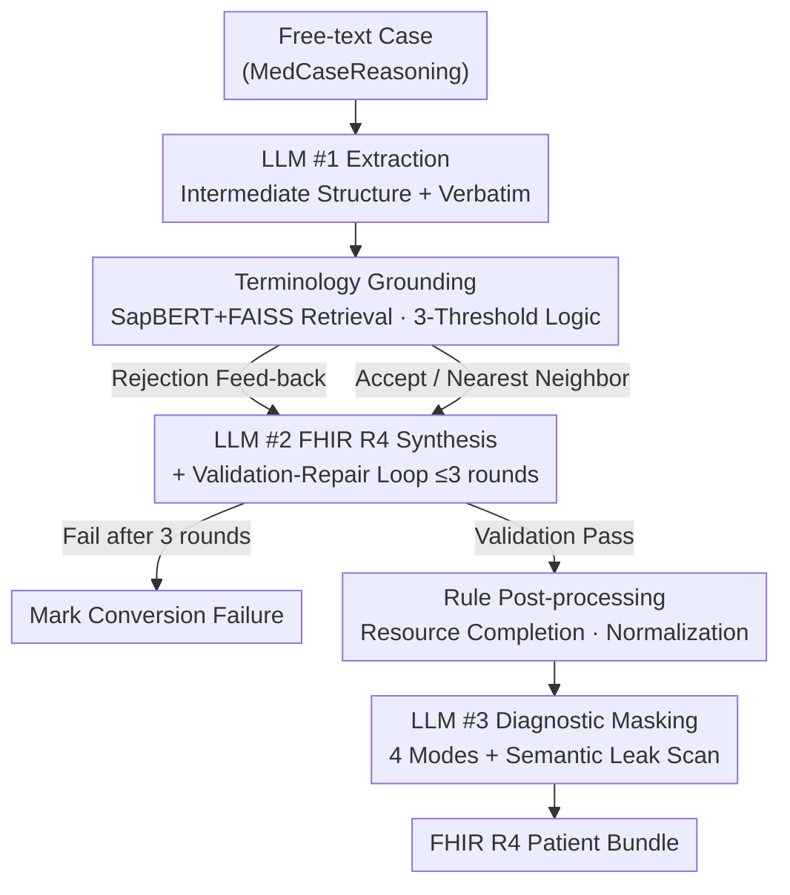

# MedCase-Structured: A Text-to-FHIR Dataset for Benchmarking Diagnostic Reasoning in Clinically Realistic EHR Settings

**Conference**: ICML2026  
**arXiv**: [2605.30295](https://arxiv.org/abs/2605.30295)  
**Code**: https://github.com/SystemInternal/MedCase-Structured (Available)  
**Area**: Medical NLP  
**Keywords**: FHIR, Clinical Decision Support, Terminology Grounding, Synthetic EHR, Diagnostic Reasoning

## TL;DR
The authors propose a "multi-stage LLM + terminology grounding + repair loop" pipeline to convert free-text medical cases into HL7 FHIR R4 standard bundles. Using this, they construct the MedCase-Structured dataset (1,408 cases, 82.5% success rate) from MedCaseReasoning. Experiments demonstrate that diagnostic accuracy for GPT-5.4, Gemini-3.1-Pro, and Claude-Opus-4.6 consistently drops by 4–23% when using structured FHIR inputs compared to raw text.

## Background & Motivation

**Background**: LLM-based Clinical Decision Support Systems (CDSS) are increasingly discussed. Standard evaluations typically use either plain-text QA (e.g., MedQA) or restricted real-world EHRs (e.g., MIMIC-IV). However, modern hospital systems predominantly exchange patient data between modules using HL7 FHIR resource objects.

**Limitations of Prior Work**: Existing benchmarks do not align with real-world deployment formats: (1) Plain-text cases fail to test model robustness on structured, interoperable formats; (2) MIMIC-IV-FHIR relies on offline "reverse mapping," leading to limited distributions and privacy restrictions; (3) Synthea generates data based on rule templates, limiting clinical diversity and stress-testing dimensions; (4) Methods like FHIR-GPT or Infherno focus on "faithful reconstruction" of existing cases rather than generating controllable, high-volume evaluation samples.

**Key Challenge**: To perform "deployment-aligned" CDSS evaluation, a large-scale, structured, difficulty-controllable, and privacy-free synthetic FHIR dataset is required. However, directly querying LLMs to write FHIR results in significant **hallucinated medical codes** (fictitious LOINC/RxNorm/SNOMED codes) and **structurally invalid** resource objects, rendering the output unusable.

**Goal**: The objective is two-fold: (a) Build a pipeline capable of controllably generating clinically realistic FHIR R4 bundles from free text while suppressing hallucinations and structural errors; (b) Use this pipeline to transform MedCaseReasoning into the public dataset MedCase-Structured and compare the diagnostic accuracy of LLMs under "plain text" vs. "structured FHIR" inputs.

**Key Insight**: Failure modes in free-form FHIR generation are concentrated in two categories: "hallucinated/non-standard terminology codes" and "structural/semantic inconsistencies between resources." The former can be addressed via **deterministic terminology databases + embedding retrieval** (grounding), while the latter can be constrained through **multi-stage decomposition + validation-repair loops**.

**Core Idea**: The text→FHIR process is divided into four stages: "Information Extraction → Terminology Grounding → FHIR Synthesis & Validation → Diagnostic Masking." LLMs are utilized only at three fixed anchor points (extraction, synthesis, semantic leak scanning). In between, a terminology database using SapBERT+FAISS provides hard grounding with a three-threshold logic (accept/replace/reject). The synthesis stage incorporates a "validation failure → LLM rewrite" repair loop of up to 3 rounds.

## Method

### Overall Architecture
The pipeline converts English free-text cases (from MedCaseReasoning) into validated HL7 FHIR R4 patient bundles while optionally removing diagnostic conclusions for evaluation. It consists of four serial stages: First, LLM #1 extracts text into a flat intermediate structure (demographics, symptoms, signs, vitals, labs, medications, procedures, history) with verbatim quotes for traceability. Second, a terminology database grounds all codes deterministically. Third, LLM #2 assembles these into FHIR resources following R4 templates and executes a validation-repair loop. Finally, LLM #3 masks diagnostic conclusions. The process uses Claude (claude-sonnet-4-20250514) with temperature 0 for reproducibility, restricting LLM intervention to extraction, synthesis, and scanning, while rules and retrieval handle constraints.

### Key Designs

**1. Terminology Grounding: Using SapBERT + FAISS + 3-Threshold Logic to Eliminate Hallucinated Codes**

The authors report that terminology hallucination is the primary failure mode (e.g., 183 LOINC and 126 RxNorm hallucinations). LLMs struggle to generate valid SNOMED CT/LOINC/RxNorm/CVX codes autonomously. The solution converts "code validity" from a probabilistic generation problem into a tunable retrieval task: candidates are retrieved for LLM-extracted terms, and both candidates and the terminology database (OMOP + SNOMED/LOINC/RxNorm/CVX) are indexed using SapBERT in FAISS. Using cosine similarity thresholds, candidates are either accepted, replaced by the nearest neighbor, or rejected and sent back to the repair loop.

**2. Three Fixed Anchor Points + Validation-Repair Loop: Trading Agent Flexibility for Debuggability**

Unlike agentic styles where LLMs dynamically decide when to use tools, this pipeline fixes LLM calls to three stages (extraction, synthesis, leak scanning). Intermediate steps like terminology grounding and structural validation are deterministic. During the synthesis stage, if a bundle fails the FHIR validator, the errors are fed back to LLM #2 for up to 3 rewrite attempts. If it still fails, the case is discarded. This design ensures reproducibility via temperature 0 and enforces deterministic constraints (syntax/terminology) through rules rather than LLM intuition.

**3. Four-Mode Configurable Diagnostic Masking + LLM Leak Scanning: Preventing Information Leakage in Narratives**

CDSS evaluation validity depends on the absence of answers in the input. FHIR `narrative` fields often contain diagnostic information via abbreviations or synonyms. Masking follows four levels: NONE (full removal), HIDDEN (removes primary diagnosis), EXPLICIT (retains only patient-reported codes), and FULL (retains all). While NONE/HIDDEN use hard filtering for codes/substrings, LLM #3 performs an additional semantic scan on all narrative fields to redact implicit leaks (e.g., suggestive conclusions or non-indexed synonyms).

### Loss & Training
No models were trained for this work. The pipeline utilizes off-the-shelf Claude APIs, SapBERT embeddings, and FAISS indexing. Temperature is fixed at 0 to ensure reproducibility. The system is a non-fine-tuned synthesis pipeline combining LLMs, retrieval, and rule-based validation.

## Key Experimental Results

### Main Results

Dataset construction results: Original MedCaseReasoning cases (14,489) were filtered by rules (removing non-human, multi-patient, and imaging-reliant cases) before entering the pipeline:

| Dataset Split | Original Total | Imaging Excl. | Code Error Excl. | Other Excl. | Final |
|---|---|---|---|---|---|
| Train | 13,092 | 11,568 | 232 | 28 | 1,263 |
| Val | 500 | 438 | 10 | 2 | 50 |
| Test | 897 | 777 | 14 | 11 | 95 |
| **Total** | **14,489** | **12,783** | **256** | **41** | **1,408** |

The success rate for generating FHIR bundles from input cases was **82.5%**.

LLM Diagnostic Accuracy Comparison: Comparing performance on "Plain Text (MCR)" vs. "Structured FHIR (MCS)" across zero/1/5-shot settings:

| Model | Setting | MCR (%) | MCS (%) | Δ |
|---|---|---|---|---|
| GPT-5.4 | zero-shot | 65.26 | 61.05 | −4.21 |
| GPT-5.4 | 1-shot | 74.74 | 51.58 | −23.16 |
| GPT-5.4 | 5-shot | 74.74 | 53.68 | −21.06 |
| Gemini-3.1-Pro | zero-shot | 58.95 | 52.63 | −6.32 |
| Gemini-3.1-Pro | 1-shot | 65.26 | 53.68 | −11.58 |
| Gemini-3.1-Pro | 5-shot | 63.16 | 57.89 | −5.28 |
| Claude-Opus-4.6 | zero-shot | 68.42 | 53.63 | −14.79 |
| Claude-Opus-4.6 | 1-shot | 69.47 | 54.74 | −14.73 |
| Claude-Opus-4.6 | 5-shot | 66.32 | 58.95 | −7.37 |

All models performed significantly worse on structured FHIR inputs compared to plain text, with GPT-5.4 (1-shot) showing the largest drop of 23.16%.

### Failure Mode Analysis

The study categorized pipeline failures on MedCaseReasoning as follows:

| Category | Failure Type | Count | Example |
|---|---|---|---|
| Terminology | LOINC Hallucination | 183 | "septic workup", "pharmacological challenge test" |
| Terminology | RxNorm Hallucination | 126 | Re-hallucinated invalid codes after repair |
| Terminology | Coarse Drug Granularity | 103 | "oral antibiotics", "topical corticosteroid paste" |
| Terminology | CVX Synonym Gap | 12 | "Moderna booster", "fully immunized" |
| Semantic | Overly Specific Desc. | 32 | "loosening of lower teeth requiring dental implants" |
| Semantic | SNOMED Mismatch | 33 | Procedure code assigned to clinical finding |
| Exclusion | Missing Demographics | 4 | No age in raw text |
| Exclusion | Multi-patient | 9 | Multiple patients in one record |
| Exclusion | Non-human | 25 | Veterinary records |

### Key Findings
- **Terminology hallucination remains the primary bottleneck** despite 3-round repair loops (>410 code-level errors). Grounding handles "fake-looking" codes but fails when descriptions are too broad to map to specific standard codes.
- The performance gap between structured FHIR and plain text **widens in few-shot settings**. For GPT-5.4, 1-shot increased MCR performance to 74.74% but MCS remained stagnant at 51-53%, suggesting examples do not bridge the unfamiliarity with FHIR resources.
- Imaging cases account for a massive portion of MedCaseReasoning (88% excluded). Since the pipeline lacks `ImagingStudy` modeling, this represents a significant area for future work.

## Highlights & Insights
- **Standard Paradigm for Structured Generation**: The "LLM Anchor + Retrieval Terminology + Repair Loop" framework is a robust template for any non-natural language structured generation (legal contracts, tax forms, API schemas).
- **Two-Stage Masking**: The "Hard Filtering + LLM Semantic Scanning" approach for diagnostic masking is critical for synthesized benchmarks where narrative fields often leak answers through synonyms or implications.
- **Deployment-Alignment Gap**: The empirical proof that state-of-the-art models like GPT-5.4 drop 20+ points simply by changing data representation suggests that current leaderboard rankings (on plain-text MedQA) may not reflect real-world utility in EHR systems.

## Limitations & Future Work
- The pipeline covers only 10 FHIR resource types; missing types like `ImagingStudy` led to the exclusion of 88% of potential cases.
- Longitudinal trajectories are not modeled; the dataset uses "date-aware repeating resources" rather than complex temporal sequences.
- Terminology grounding fails on coarse-grained descriptions or specific English synonyms, requiring better context-aware validation.
- The evaluation relied heavily on the Claude-Sonnet-4 family for synthesis and masking, which may introduce model-specific biases.

## Related Work & Insights
- **vs. Synthea**: Synthea is rule-based and lacks the diversity of free-text cases; this work is text-driven and controllable. They are complementary: Synthea for large-scale training, this method for difficult-case evaluation.
- **vs. FHIR-GPT / Infherno**: Prior works focus on clinical system integration; this work focuses on a "sample factory" for controllable evaluation and diagnostic masking.
- **vs. FHIR-AgentBench**: Where others provide fixed benchmarks, MedCase-Structured provides a pipeline for on-demand generation with controllable complexity and masking levels.

## Rating
- **Novelty**: ⭐⭐⭐⭐ Controllable evaluation-grade FHIR generation from text is a novel application of established components.
- **Experimental Thoroughness**: ⭐⭐⭐ Detailed failure analysis is provided, though comparisons are limited to closed-source models and lack cross-source (e.g., MIMIC) ablation.
- **Writing Quality**: ⭐⭐⭐⭐ Logic flow from motivation to failure analysis is clear and high-density.
- **Value**: ⭐⭐⭐⭐ 1,408 cases and an open repository provide high utility for clinical LLM benchmarking and alignment research.

<!-- RELATED:START -->

## Related Papers

- [\[ACL 2026\] Dr. Assistant: Enhancing Clinical Diagnostic Inquiry via Structured Diagnostic Reasoning Data and Reinforcement Learning](../../ACL2026/medical_nlp/dr_assistant_enhancing_clinical_diagnostic_inquiry_via_structured_diagnostic_rea.md)
- [\[ACL 2026\] RePrompT: Recurrent Prompt Tuning for Integrating Structured EHR Encoders with Large Language Models](../../ACL2026/medical_nlp/reprompt_recurrent_prompt_tuning_for_integrating_structured_ehr_encoders_with_la.md)
- [\[ICLR 2026\] From Conversation to Query Execution: Benchmarking User and Tool Interactions for EHR Database Agents](../../ICLR2026/medical_nlp/from_conversation_to_query_execution_benchmarking_user_and_tool_interactions_for.md)
- [\[ACL 2025\] Evaluation of LLMs in Medical Text Summarization: The Role of Vocabulary Adaptation in High OOV Settings](../../ACL2025/medical_nlp/evaluation_of_llms_in_medical_text_summarization_the_role_of_vocabulary_adaptati.md)
- [\[ACL 2026\] MultiDx: A Multi-Source Knowledge Integration Framework towards Diagnostic Reasoning](../../ACL2026/medical_nlp/multidx_a_multi-source_knowledge_integration_framework_towards_diagnostic_reason.md)

<!-- RELATED:END -->
