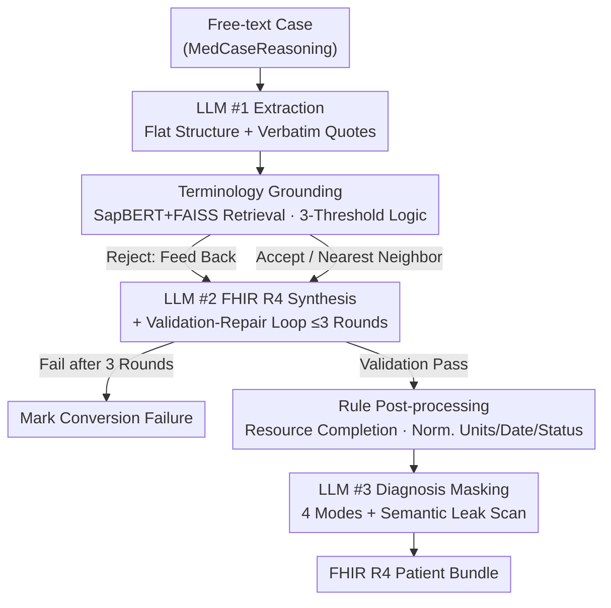

# MedCase-Structured: A Text-to-FHIR Dataset for Benchmarking Diagnostic Reasoning in Clinically Realistic EHR Settings

**Conference**: ICML2026  
**arXiv**: [2605.30295](https://arxiv.org/abs/2605.30295)  
**Code**: https://github.com/SystemInternal/MedCase-Structured (Available)  
**Area**: Medical NLP  
**Keywords**: FHIR, Clinical Decision Support, Terminology Grounding, Synthetic EHR, Diagnostic Reasoning

## TL;DR
The authors propose a "staged LLM + terminology grounding + repair loop" pipeline to convert free-text clinical cases into HL7 FHIR R4 standard bundles. Based on this, they construct the MedCase-Structured dataset (1,408 structured synthetic cases with an 82.5% success rate) from MedCaseReasoning. Experiments demonstrate that the diagnostic accuracy of GPT-5.4 / Gemini-3.1-Pro / Claude-Opus-4.6 consistently drops by 4–23 percentage points when using structured FHIR inputs compared to pure text inputs.

## Background & Motivation

**Background**: LLM-based Clinical Decision Support Systems (CDSS) are increasingly discussed. Standard evaluations typically use pure text QA like MedQA or restricted real-world EHRs like MIMIC-IV. Modern hospital systems generally exchange patient data between different modules using HL7 FHIR resource objects.

**Limitations of Prior Work**: Existing benchmarks do not match real-world deployment formats—(1) Pure text cases cannot test model robustness on structured, interoperable formats; (2) MIMIC-IV-FHIR is based on offline "reverse mapping," with a single distribution and privacy restrictions; (3) Synthea is generated from rule-based templates, providing limited clinical diversity and insufficient pressure testing; (4) Methods like FHIR-GPT or Infherno target "faithful reconstruction" of existing cases rather than generating controllable, mass-producible evaluation samples.

**Key Challenge**: To perform "deployment-aligned" CDSS evaluation, it is necessary to have large-scale, structured, difficulty-controllable, and privacy-free synthetic FHIR cases. However, directly prompting LLMs to write FHIR often results in **hallucinated medical codes** (unable to generate correct LOINC / RxNorm / SNOMED codes) and **structurally non-compliant** resource objects, making the quality unusable.

**Goal**: To achieve two objectives—(a) Build a pipeline for controllable generation of clinically realistic FHIR R4 bundles from free text, suppressing hallucinated codes and structural errors; (b) Use this pipeline to convert MedCaseReasoning into a public dataset, MedCase-Structured, and compare the difference in LLM diagnostic accuracy between "pure text" and "structured FHIR" inputs.

**Key Insight**: It is observed that failure modes in freely generating FHIR are concentrated in two categories—"hallucinated/non-standard terminology codes" and "structural/semantic inconsistencies between resources." The former can be addressed via **deterministic terminology databases + embedding retrieval** for grounding, while the latter can be constrained via **multi-stage splitting + validation-repair loops**.

**Core Idea**: The text→FHIR process is split into four stages: "Information Extraction → Terminology Grounding → FHIR Synthesis & Validation → Diagnosis Masking." LLMs are only utilized at three fixed anchor points (extraction, synthesis, semantic leak scanning). In between, a terminology database with SapBERT+FAISS is used for hard grounding with a three-threshold decision (Accept/Replace/Reject). In the synthesis stage, a "validation failure → LLM rewrite" repair loop of up to 3 rounds is integrated.

## Method

### Overall Architecture
The pipeline aims to enable LLMs to controllably convert free-text cases into compliant FHIR while preventing the fabrication of medical codes. Given an English free-text case (from MedCaseReasoning), it outputs a validated HL7 FHIR R4 patient bundle, optionally masking diagnostic conclusions for downstream evaluation. The task is split into four serial stages: first, LLM #1 extracts text into a flat intermediate structure (demographics/symptoms/signs/vitals/labs/meds/procedures/history, retaining verbatim quotes for traceability); second, all codes are grounded deterministically using an internal terminology database; third, LLM #2 assembles FHIR resources based on R4 templates and executes a validation-repair loop; finally, LLM #3 masks diagnostic conclusions according to configuration. Claude (claude-sonnet-4-20250514) is used throughout with temperature 0 for reproducibility—LLMs operate only at the extraction, synthesis, and semantic scanning anchors, while all other constraints are handled by retrieval and rules.

### Key Designs

**1. Terminology Grounding: Pinning Down Hallucinated Codes with SapBERT + FAISS + Three-Threshold Logic**

The authors report in Table 2 that terminology hallucinations are the primary failure mode—183 LOINC hallucinations, 126 RxNorm hallucinations, and 103 cases of over-coarse drug granularity. Allowing LLMs to freely write SNOMED CT / LOINC / RxNorm / CVX codes is uncontrollable. The approach reframes "is the code valid" from a probabilistic generation problem into a retrieval matching problem with adjustable thresholds. For every code extracted by the LLM, keyword search retrieves candidates. Then, SapBERT indexes both candidates and all preferred terms from the internal terminology database (aggregated OMOP + SNOMED CT / LOINC / RxNorm / CVX) into FAISS. Three cosine similarity thresholds determine if the original code is "Accepted," "Replaced by Nearest Neighbor," or "Rejected and returned to the repair loop." SapBERT provides strong biomedical entity embeddings, and FAISS maintains low latency, allowing the system to block fabricated codes while normalizing synonyms to existing terms.

**2. Three-Stage Fixed Anchors + Validation-Repair Loop: Trading Flexibility for Controllability**

Contrary to agentic styles like Infherno where the LLM dynamically decides when to call tools, this work fixes the LLM calls into three stages (extraction, synthesis, semantic leak scanning). Intermediate steps like grounding, clinical consistency checks, and rule post-processing do not involve the LLM. The critical loop occurs during synthesis: LLM #2 assembles the bundle and runs a FHIR validator. Validation failures are fed back as an error list to the LLM for rewriting (up to 3 rounds). If it still fails, the case is marked as a conversion failure. After passing validation, rules are used to complete missing resources and normalize fields. Fixed anchors and temperature 0 make the pipeline reproducible and debuggable, reclaiming deterministic constraints (syntax/terminology) from the LLM and delegating them to rules and databases.

**3. Four-Mode Diagnosis Masking + LLM Semantic Leak Scanning: Blocking Answer Residue in Narrative Fields**

The credibility of CDSS evaluation depends on "no answers hidden in the input." Narrative fields in FHIR bundles are common places for diagnostic information to persist via abbreviations or synonyms. Masking is configured into four levels: NONE (removes all diagnostic conclusions), HIDDEN (removes only the primary diagnosis), EXPLICIT (retains only patient-reported conditions), and FULL (retains everything). NONE and HIDDEN modes use hard filtering based on codes and substrings. However, hard filtering misses implicit leaks like abbreviations, suggestive conclusions, or synonyms not in the dictionary. LLM #3 is therefore used to perform a semantic scan on all narrative fields to redact them. This two-stage approach—"hard filtering for certainty, LLM for semantics"—acknowledges that rule-based redaction inevitably misses natural language leaks.

### Training Strategy
No models are trained in this paper: the pipeline uses off-the-shelf Claude closed-source APIs + SapBERT embeddings + FAISS indexing. Temperature is fixed at 0 for reproducibility. There is no fine-tuning or RLHF; the system is a synthetic data pipeline combining LLMs, retrieval, and rule validation.

## Key Experimental Results

### Main Results

Dataset construction results—Original 14,489 cases from MedCaseReasoning were first filtered by rules (removing non-human, multi-patient, and imaging-dependent cases) before entering the pipeline:

| Dataset Split | Original Total | Imaging Exclusions | Coding Error Excl. | Other Exclusions | Final |
|---|---|---|---|---|---|
| Train | 13,092 | 11,568 | 232 | 28 | 1,263 |
| Val | 500 | 438 | 10 | 2 | 50 |
| Test | 897 | 777 | 14 | 11 | 95 |
| Total | 14,489 | 12,783 | 256 | 41 | 1,408 |

The pipeline successfully generated FHIR bundles for **82.5%** of the processed samples.

LLM Diagnostic Accuracy Comparison—The same set of cases was provided in "Pure Text (MCR)" and "Structured FHIR (MCS)" formats to the same models, comparing across zero / 1 / 5-shot settings:

| Model | Setting | MCR (%) | MCS (%) | Δ |
|---|---|---|---|---|
| GPT-5.4 | zero-shot | 65.26 | 61.05 | −4.21 |
| GPT-5.4 | 1-shot | 74.74 | 51.58 | −23.16 |
| GPT-5.4 | 5-shot | 74.74 | 53.68 | −21.06 |
| Gemini-3.1-Pro | zero-shot | 58.95 | 52.63 | −6.32 |
| Gemini-3.1-Pro | 1-shot | 65.26 | 53.68 | −11.58 |
| Gemini-3.1-Pro | 5-shot | 63.16 | 57.89 | −5.28 |
| Claude-Opus-4.6 | zero-shot | 68.42 | 53.63 | −14.79 |
| Claude-Opus-4.6 | 1-shot | 69.47 | 54.74 | −14.73 |
| Claude-Opus-4.6 | 5-shot | 66.32 | 58.95 | −7.37 |

All models performed significantly worse with "Structured FHIR" inputs than with "Pure Text" across all shot settings, with the largest drop being 23 points for GPT-5.4 in the 1-shot setting.

### Failure Mode Analysis

The paper provides a fine-grained analysis of failures on MedCaseReasoning (serving as an implicit ablation):

| Category | Failure Type | Count | Example |
|---|---|---|---|
| Terminology | LOINC Hallucination | 183 | "septic workup", "pharmacological challenge test" |
| Terminology | RxNorm Hallucination | 126 | Hallucinated invalid code after repair |
| Terminology | Coarse Granularity | 103 | "oral antibiotics", "topical corticosteroid paste" |
| Terminology | CVX Synonym Gap | 12 | "Moderna booster", "fully immunized" |
| Semantic | Overly Specific Desc. | 32 | "loosening of lower teeth requiring dental implants" |
| Semantic | SNOMED Type Mismatch | 33 | Procedure code assigned to clinical finding |
| Exclusion | Missing Demographics | 4 | No age in original text |
| Exclusion | Multi-patient | 9 | Multiple patients in one record |
| Exclusion | Non-human | 25 | Veterinary records |

### Key Findings
- Even with a 3-round repair loop, **terminology hallucination (LOINC + RxNorm + Coarse Granularity) remains the biggest bottleneck** (>410 code-level errors), far exceeding structural/semantic errors. This suggests SapBERT+FAISS retrieval is useful for stopping "fabricated but realistic-looking codes" but cannot solve for "descriptions too broad to map to specific codes."
- The performance gap between "Structured FHIR" and "Pure Text" **widens rather than narrows with few-shot prompting**: For GPT-5.4, MCR accuracy rose to 74.74% with 1-shot/5-shot, while MCS accuracy stagnated around 51–53%—examples do not compensate for the model's unfamiliarity with FHIR resource objects.
- Imaging-based cases represent the majority of MedCaseReasoning (11,568 out of 13,092 were excluded, 88%) because the pipeline does not yet model ImagingStudy/DiagnosticReport-imaging resources. This is the primary area for future work.

## Highlights & Insights
- **"LLM Anchors + Retrieval Terminology + Validation Loop" is a standard paradigm for structured generation**: Delegating the "Narrative → Intermediate Representation" mapping to LLMs while leaving "Is it a valid code / Is the structure compliant" to rules and retrieval is a reusable template beyond EHRs (e.g., contracts, tax forms, API schemas).
- **The two-stage "Hard Filtering + LLM Semantic Scan" for diagnostic masking is an undervalued design**: Naive evaluations often use code blacklists, but narrative fields leak answers through abbreviations and synonyms. This approach can be applied to any synthetic data scenario requiring answer redaction.
- **Aligning evaluation distributions with deployment formats has high ROI**: Using different representations for the same cases caused GPT-5.4 to drop 20+ points. This implies that academic leaderboards on MedQA / MedCaseReasoning might be decoupled from real-world EHR utility, providing strong evidence for reforming clinical LLM evaluation.

## Limitations & Future Work
- The pipeline only covers 10 FHIR resource types; critical resources like ImagingStudy / Specimen / Goal are missing, leading to the exclusion of 88% of original cases.
- True longitudinal trajectories (multiple visits over time) are not modeled; "date-aware duplicate resources" are used instead, which does not fully test temporal reasoning.
- Terminology grounding remains a bottleneck: Coarse descriptions ("oral antibiotics") and synonym gaps ("Moderna booster") cannot be solved by SapBERT+FAISS alone; stronger context-aware validation or broader terminology expansions are needed.
- Evaluation is limited to three closed-source models and a single upstream source; the performance gap between MCS and MCR is not fully decoupled from potential noise introduced by the synthesis process.
- The use of Claude-Sonnet-4 for self-evaluation (synthesis, masking, and being a test subject) introduces a risk of intra-family model bias.

## Related Work & Insights
- **vs. Synthea**: Synthea is template-driven, offering breadth and realistic clinical structure but limited diversity and no text-driven generation. This work is text-driven, offering controllable clinical complexity. The two are complementary.
- **vs. FHIR-GPT / Infherno**: Those systems focus on faithful reconstruction for system integration; this work focuses on controllable evaluation sample production, emphasizing masking and mass production.
- **vs. FHIR-AgentBench / EHRStruct**: Those provide benchmarks for LLM ability on FHIR/EHR but use fixed datasets; MedCase-Structured turns the dataset into a text-driven "sample factory" for controllable perturbations.

## Rating
- Novelty: ⭐⭐⭐⭐ The positioning of "controllable evaluation-ready FHIR generation from text" is new. Components like grounding and repair loops are established but unified here to solve a practical problem.
- Experimental Thoroughness: ⭐⭐⭐ Detailed pipeline statistics and failure modes are provided, but lack of parallel comparison with Synthea/MIMIC-IV-FHIR and missing ablation studies are notable.
- Writing Quality: ⭐⭐⭐⭐ Logical flow from motivation to failure analysis is clear. Tables 1-3 are high-density and informative.
- Value: ⭐⭐⭐⭐ 1,408 samples + public repo + controllable masking make this directly useful for researchers. The evidence for "deployment-alignment" in evaluation is significant.

<!-- RELATED:START -->

## Related Papers

- [\[ACL 2026\] Dr. Assistant: Enhancing Clinical Diagnostic Inquiry via Structured Diagnostic Reasoning Data and Reinforcement Learning](../../ACL2026/medical_nlp/dr_assistant_enhancing_clinical_diagnostic_inquiry_via_structured_diagnostic_rea.md)
- [\[ACL 2026\] RePrompT: Recurrent Prompt Tuning for Integrating Structured EHR Encoders with Large Language Models](../../ACL2026/medical_nlp/reprompt_recurrent_prompt_tuning_for_integrating_structured_ehr_encoders_with_la.md)
- [\[ICLR 2026\] From Conversation to Query Execution: Benchmarking User and Tool Interactions for EHR Database Agents](../../ICLR2026/medical_nlp/from_conversation_to_query_execution_benchmarking_user_and_tool_interactions_for.md)
- [\[ICLR 2026\] BiomedSQL: Text-to-SQL for Scientific Reasoning on Biomedical Knowledge Bases](../../ICLR2026/medical_nlp/biomedsql_text-to-sql_for_scientific_reasoning_on_biomedical_knowledge_bases.md)
- [\[ACL 2026\] MultiDx: A Multi-Source Knowledge Integration Framework towards Diagnostic Reasoning](../../ACL2026/medical_nlp/multidx_a_multi-source_knowledge_integration_framework_towards_diagnostic_reason.md)

<!-- RELATED:END -->
