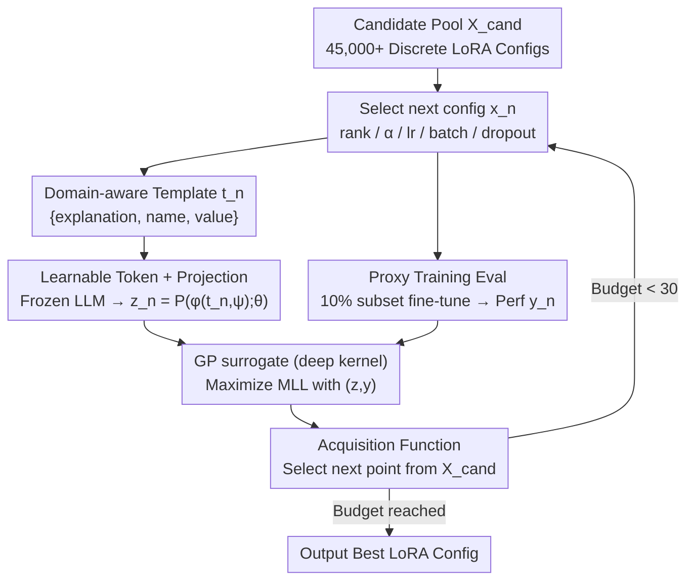

# A Language-Guided Bayesian Optimization for Efficient LoRA Hyperparameter Search

**Conference**: ICML2026  
**arXiv**: [2602.11171](https://arxiv.org/abs/2602.11171)  
**Code**: Project Page: https://baekseongeun.github.io/lora-bo/ (Repository not found in cache)  
**Area**: Model Compression / LLM Efficiency / Parameter-Efficient Fine-Tuning  
**Keywords**: LoRA Tuning, Bayesian Optimization, LLM Embeddings, Proxy Training, PEFT

## TL;DR
The paper converts LoRA hyperparameter configurations into text with domain explanations, using a frozen LLM, learnable tokens, and a projection layer to construct a continuous search space for Bayesian Optimization (BO). By employing 10% of the data for proxy evaluation to reduce trial costs, it significantly outperforms default LoRA configurations and conventional HPO methods within approximately 30 search iterations.

## Background & Motivation
**Background**: LoRA and its variants have become the most common parameter-efficient solutions for fine-tuning large models. In practice, the original model weights are frozen, and only low-rank adapters are trained, utilizing a few hyperparameters such as rank, scaling factor, learning rate, batch size, and dropout to control adaptation capability, stability, and computational overhead.

**Limitations of Prior Work**: While LoRA's advantage lies in having fewer trainable parameters, it does not imply that hyperparameter tuning is simple. The paper notes that combinations of rank-to-alpha ratios, learning rates, batch sizes, and dropout strongly affect final performance, while the full grid space exceeds 45,000 configurations. Exhaustive training is costly, and directly applying random search, Optuna, standard BO, or discrete space optimization makes it difficult to explicitly incorporate LoRA's empirical rules into the search process.

**Key Challenge**: LoRA HPO faces two primary misalignments. First, the variables to be searched are mostly discrete hyperparameters, whereas Gaussian Process-based BO prefers continuous, smooth, and structured input spaces. Second, while significant human empirical knowledge exists regarding LoRA tuning—such as the relationship between alpha and rank or the impact of excessive batch size on generalization—traditional BO typically only perceives numerical encodings and cannot understand these domain semantics.

**Goal**: The authors aim to transform LoRA tuning experience into a representation usable by BO, enabling the search to leverage LLM prior knowledge while finding high-quality configurations within a few real training iterations. Additionally, they seek to reduce the cost per evaluation so that a budget of around 30 trials is sufficient to cover a large candidate pool.

**Key Insight**: Hyperparameter configurations are not just sets of numbers but can be represented as structured linguistic descriptions. Pre-trained LLMs can encode relationships and roles in natural language. By including names, values, roles, and inter-relationships of hyperparameters in a prompt and mapping the LLM hidden states to a continuous space, discrete configurations can be converted into continuous representations better suited for BO.

**Core Idea**: Replace standard numerical encoding with "verbalized LoRA domain knowledge + calibratable LLM embeddings," allowing Bayesian Optimization to select the next set of LoRA hyperparameters within a semantically structured space.

## Method
The proposed method is a closed-loop tuner for LoRA: in each round, a set of LoRA hyperparameters is first selected from a candidate pool; a performance score is obtained via proxy training on a small data subset; this configuration is then written into a text template with domain explanations, compressed into a continuous vector through a frozen LLM, learnable tokens, and a projection layer; these vectors and existing scores are then used to train a GP surrogate. Finally, an acquisition function scores the remaining candidates to select the configuration for the next round.

### Overall Architecture
The input is a set of discrete candidate configurations $\mathcal{X}_{cand}$, each containing rank, scaling factor, batch size, learning rate, and dropout rate; the output is the best LoRA configuration found within the budget. In round $n$, configuration $x_n$ is evaluated via proxy training to get performance $y_n$; $x_n$ is transformed into an explanatory text template $t_n$; a frozen LLM $\phi$ processes $t_n$ and learnable tokens $\psi$, and a projection layer $P(\cdot;\theta)$ maps the hidden state to BO features $z_n=P(\phi(t_n, \psi);\theta)$. The GP surrogate uses all $(z, y)$ to maximize marginal log-likelihood to update the kernel, projection layer, and tokens. Every unevaluated configuration in the candidate pool is similarly encoded as $z_j$ for selection by the acquisition function. The key is not "letting the LLM generate hyperparameters" but letting the LLM construct a continuous embedding space with LoRA domain structure, leaving the exploration/exploitation tradeoff to BO.

### Key Designs

**1. Domain-Aware Text Templates: Verbalizing Numerical Configs with Empirical Explanations**

LoRA tuning relies heavily on manual experience, which is lost in GP-based BO that only sees numerical encodings. This method replaces simple `{name, value}` templates with `{explanation, name, value}`, adding text explaining roles and relationships next to each hyperparameter. The LLM processes descriptions of "why this hyperparameter matters," allowing the embedding space to organize configurations more reasonably based on semantics rather than just numerical proximity. This serves as the entry point for injecting human priors.

**2. Calibration via Learnable Tokens and Projection Layers: Aligning General Representations with LoRA Performance**

Raw embeddings from a frozen LLM are arranged by linguistic generality, not necessarily by "LoRA performance," making them insufficient for BO features. The method appends learnable tokens $\psi$ to the prompt, takes the hidden state at the last token position, and passes it through a projection layer $z=P(\phi(t,\psi);\theta)$. While the LLM remains frozen, $\psi$, $\theta$, and the GP kernel parameters $\omega$ are trained to maximize the GP marginal log-likelihood. The projection layer reshapes the embedding geometry to be more sensitive to performance, while learnable tokens act as task-adaptive latent variables.

**3. Proxy Training Evaluation: Approximating Full Data with Small Subsets**

The bottleneck in HPO is the actual training of each candidate. Instead of full fine-tuning on a 100K dataset, each round uses a randomly sampled 10K (10%) subset. The authors validated that the 10% random subset has a correlation of 0.8713 on MATH and 0.9427 on code generation compared to full training, which is sufficient for decision-making. This allows the 30-trial budget to effectively scan a pool of 45,000+ candidates.

### Loss & Training
The BO surrogate is a GP using deep kernel learning via LLM embeddings: the standard kernel $k(x,x'|\omega)$ is replaced by $k(g(x;\theta,\psi),g(x';\theta,\psi)|\omega,\theta,\psi)$. Training maximizes the marginal log-likelihood $\mathcal{L}(\Phi)=\log p(y|X,\Phi)$, where $\Phi=\{\omega,\theta,\psi\}$. Iterations are limited to 30. Tasks include mathematical reasoning (MetaMathQA), code generation (CodeFeedback), and dialogue (WizardLM-Evol-Instruct).

## Key Experimental Results

### Main Results
The method improves various LoRA variants and works across different backbones. Gains shown below are absolute improvements over default/recommended configurations.

| Variant | GSM8K Acc | MATH Acc | HumanEval Pass@1 | MBPP Pass@1 | MT-Bench |
|------|-----------|----------|------------------|-------------|----------|
| LoRA Default | 41.47 | 5.24 | 16.31 | 35.47 | 7.181 |
| LoRA + Ours | 62.93 (+21.46) | 12.88 (+7.64) | 30.49 (+14.18) | 42.59 (+7.12) | 7.350 (+0.169) |
| rsLoRA Default | 41.16 | 5.46 | 16.46 | 35.72 | 7.300 |
| rsLoRA + Ours | 58.15 (+16.99) | 10.76 (+5.30) | 29.87 (+13.41) | 42.06 (+6.34) | 7.662 (+0.362) |
| DoRA Default | 40.11 | 5.36 | 17.07 | 36.51 | 7.125 |
| DoRA + Ours | 57.01 (+16.90) | 10.78 (+5.42) | 30.58 (+13.51) | 42.33 (+5.82) | 7.475 (+0.350) |
| PiSSA Default | 52.46 | 7.34 | 22.56 | 40.48 | 7.200 |
| PiSSA + Ours | 60.88 (+8.42) | 12.06 (+4.72) | 31.71 (+9.15) | 41.53 (+1.05) | 7.475 (+0.275) |

Under the same 30-iteration budget, the method outperforms common HPO baselines.

| Search Method| GSM8K Acc | MATH Acc | HumanEval Pass@1 | MBPP Pass@1 |
|----------|-----------|----------|------------------|-------------|
| Random | 59.14 | 10.51 | 23.17 | 36.77 |
| Optuna | 54.13 | 10.50 | 27.44 | 38.62 |
| BO | 57.32 | 11.42 | 20.12 | 35.19 |
| LBO | 59.51 | 11.88 | 26.83 | 37.83 |
| Ours | 62.93 | 12.88 | 30.49 | 42.59 |

### Ablation Study
Ablations confirm that all three components are effective, with domain-aware prompting being the most critical.

| Projection | Domain-aware prompt | Learnable token | GSM8K Acc | MATH Acc | Note |
|--------|-----------------|--------------|-----------|----------|------|
| ✗ | ✗ | ✗ | 47.76 | 8.72 | Frozen LLM embeddings used directly for BO |
| ✓ | ✗ | ✗ | 53.98 | 9.16 | Projection provides calibration, lacks semantics |
| ✓ | ✓ | ✗ | 61.41 | 12.46 | Performance jumps with tuning knowledge |
| ✓ | ✓ | ✓ | 62.93 | 12.88 | Tokens capture info not easily verbalized |

Proxy training correlations show that a 10% random subset adequately tracks full training trends.

| Sampling Method | MATH Correlation | Code Correlation | Conclusion |
|----------|----------------------|------------------------|------|
| Random 1% | 0.7031 | 0.7429 | Shows trend but high noise |
| Random 5% | 0.8360 | 0.9282 | Already stable |
| Random 10% | 0.8713 | 0.9427 | Adopted; highest code correlation |
| TSDS 10% by test | 0.8754 | 0.9290 | Slightly higher for MATH |
| TSDS 10% by train | 0.8649 | 0.9278 | Similar to Random 10% |

### Key Findings
- **Domain-aware prompting provides the largest contribution**: Performance jumped from 53.98/9.16 to 61.41/12.46 when prompts were added, confirming that verbalizing LoRA knowledge fundamentally changes the information available to BO.
- **High-performance configurations do not always follow traditional wisdom**: For example, alpha sometimes reached 16x or 32x the rank, rather than the common 2x.
- **Proxy training is not just a computational trick**: The high correlation (e.g., 0.9427 for code) between 10% subsets and full training results justifies its use for BO point selection.
- **Hyperparameters do not transfer easily across models**: Searching per model is more reliable than manually reusing configurations.

## Highlights & Insights
- The ingenious aspect is not using the LLM to "guess" hyperparameters, but to act as a representation function for BO. The LLM provides semantic structure, while BO handles black-box optimization.
- Learnable tokens are a lightweight calibration tool. Prompts express known human rules, while tokens captured residual task-specific information via marginal likelihood updates.
- This approach can be extended to other discrete HPO problems, such as quantization, distillation, or RAG parameters, wherever verbalizable expert knowledge exists.

## Limitations & Future Work
- The study primarily focuses on LoRA and its variants; whether this verbalized BO representation generalizes to all PEFT methods or non-LLM tasks is unproven.
- The method depends on the embedding quality of the pre-trained LLM. Weak embedding models might degrade performance.
- The 30-iteration budget works well, but search is still limited to a predefined discrete candidate range.
- Proxy training assumes high correlation with full training. This may fail for small datasets or heavy distribution shifts, suggesting potential for multi-fidelity BO.

## Related Work & Insights
- **vs. Traditional BO / Optuna / LBO**: These treat configs as numbers; this method leverages domain knowledge and LLM understanding, finding better configs within the same 30-trial budget.
- **vs. NOMAD**: NOMAD also targets LoRA HPO, but this method achieves better results on GSM8K/MATH within 24 hours than NOMAD does in 180 hours.
- **vs. Manual Tuning**: Manual rules often suggest fixed ratios; this method finds that larger alpha/rank ratios are sometimes superior, potentially updating existing heuristics.
- **vs. LLM-Agent Tuning**: Direct LLM proposals are unstable; this method uses LLMs only for representation, while optimization is handled by the acquisition function.

## Rating
- Novelty: ⭐⭐⭐⭐☆ Combines LLM representation, domain prompts, tokens, and BO for practical LoRA HPO.
- Experimental Thoroughness: ⭐⭐⭐⭐☆ Covers variants, model backbones, and HPO baselines.
- Writing Quality: ⭐⭐⭐⭐☆ Clear methodology; tables are well-supported.
- Value: ⭐⭐⭐⭐⭐ Highly valuable for frequent LLM fine-tuning; core ideas are transferable to other discrete search problems.

<!-- RELATED:START -->

## Related Papers

- [\[CVPR 2026\] TAS-LoRA: Transformer Architecture Search with Mixture-of-LoRA Experts](../../CVPR2026/model_compression/tas-lora_transformer_architecture_search_with_mixture-of-lora_experts.md)
- [\[AAAI 2026\] Renormalization Group Guided Tensor Network Structure Search](../../AAAI2026/model_compression/renormalization_group_guided_tensor_network_structure_search.md)
- [\[ICLR 2026\] E²LoRA: Efficient and Effective Low-Rank Adaptation with Entropy-Guided Adaptive Sharing](../../ICLR2026/model_compression/e²lora_efficient_and_effective_low-rank_adaptation_with_entropy-guided_adaptive_.md)
- [\[NeurIPS 2025\] Learning to Better Search with Language Models via Guided Reinforced Self-Training](../../NeurIPS2025/model_compression/learning_to_better_search_with_language_models_via_guided_reinforced_self-traini.md)
- [\[CVPR 2026\] SG-LoRA: Semantic-guided LoRA Parameters Generation](../../CVPR2026/model_compression/sg-lora_semantic-guided_lora_parameters_generation.md)

<!-- RELATED:END -->
