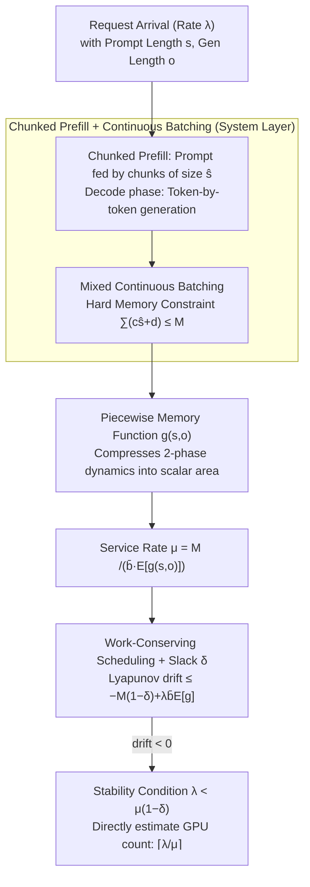

# A Queueing-Theoretic Framework for Stability Analysis of LLM Inference with KV Cache Memory Constraints

**Conference**: ICML 2026  
**arXiv**: [2605.04595](https://arxiv.org/abs/2605.04595)  
**Code**: Provided in paper appendix  
**Area**: LLM Inference Efficiency / Systems  
**Keywords**: Queueing theory, KV cache, memory constraints, stability conditions, throughput prediction

## TL;DR
The paper establishes the first queueing model for LLM inference that explicitly incorporates KV cache memory dynamics, deriving a closed-form stability condition $\lambda < \mu(1-\delta)$. This allows operators to directly calculate the required number of GPUs; validation on single GPU, 8-GPU clusters, and LongBench real-world data demonstrates errors $\leq 10\%$.

## Background & Motivation

**Background**: LLM inference services are simultaneously constrained by computation and memory. KV cache accelerates decoding but consumes significant memory under long-context scenarios. System design necessitates balancing throughput, latency, and hardware costs.

**Limitations of Prior Work**: Classic queueing theory only models computational constraints; existing LLM system literature (e.g., Wu/Yang/Li) focuses on scheduling algorithms but lacks closed-form stability criteria. KV cache memory exhibits non-linear dynamics—growing by chunks in the prompt phase and token-by-token in the decode phase—making it difficult to apply standard bin packing frameworks.

**Key Challenge**: Memory is not a static constraint but evolves over time. Different requests occupy different stages, and shared memory is highly coupled, causing simple average-rate approximations to fail.

**Goal**: Provide a rigorous, computable stability condition enabling designers to estimate the required number of GPUs directly based on $\lambda$ and system parameters.

**Key Insight**: Construct a discrete-time Markov chain where states are defined as the "set of in-flight requests + respective progress." Define a Lyapunov potential function as "remaining lifetime memory × time" and estimate the lower bound of the drift.

**Core Idea**: The "memory × time" overhead for each request is expressed as an explicit function $g(s,o)$. Consequently, the service rate is $\mu = M / (\bar b \mathbb E[g(s,o)])$, and the stability condition is $\lambda < \mu(1-\delta)$, where $\delta = \text{ess sup}(s+o)/M$ is a slack term.

## Method

### Overall Architecture

The paper models "LLM inference under memory constraints" as a two-layer queueing system: the system layer describes request entry/exit from GPUs, and the stability layer uses Lyapunov drift to determine queue stability. In the system layer, requests are scheduled via FCFS/SJF with mixed continuous batching—prompt chunks and decode tokens of multiple requests can be integrated into the same batch. The sole hard constraint is memory $\sum_{i\in S(t)} c_i^{(t)} \hat s + d_i^{(t)} \leq M$ (where $c_i^{(t)}$ is the number of processed chunks and $d_i^{(t)}$ is the number of generated tokens). The stability layer encapsulates the "remaining progress" of all running requests into a discrete-time Markov chain state. A potential function $V(t) = \sum_i g(s_i, o_i)$ measures total system load. The stability is determined by the drift $\mathbb E[V(t+1)-V(t)] = -M(1-\delta) + \lambda \bar b \mathbb E[g(s,o)]$; a negative drift ensures stability, leading to the closed-form condition $\lambda < \mu(1-\delta)$.

### Key Designs

**1. Chunked Prefill + Continuous Batching: Ensuring constant step time for queueing theory**

Queueing analysis assumes that single-step service time does not fluctuate wildly with request length; otherwise, $\mu$ cannot be defined. However, attention for long prompts is $O(\text{len}^2)$, violating this. This work utilizes chunked prefill: prompts are fed in fixed chunk sizes $\hat s$, causing per-batch attention computation to degrade to $O(M)$ (proportional to current total KV cache rather than squared prompt length). Continuous batching is layered on top—new requests are admitted dynamically if memory allows, or swapped to CPU if exceeded. Together, these smooth the quadratic overhead of long prompts, making per-step time approximately constant and validating the definition of service rate $\mu = M / (\bar b\,\mathbb E[g(s,o)])$.

**2. Piecewise Memory Function $g(s,o)$: Compressing non-linear dynamics into a scalar**

The failure of classic queueing theory stems from KV cache memory not being a static constraint. Memory grows by chunks in the prompt phase and by tokens in the decode phase. With requests at different stages, memory is highly coupled. This work defines a "memory × time" overhead function $g(s,o) = \frac{(1+s/\hat s)s}{2} + s\cdot o + \frac{(1+o)o}{2}$. The three terms represent prompt accumulation, prompt-decode overlap, and decode accumulation, respectively. This essentially calculates the "memory occupied × duration" area over a request's lifecycle. The potential function $V(t)=\sum_i g(s_i,o_i)$ represents the total area of all unfinished requests. Crucially, regardless of request stages, $V(t)$ decreases steadily by $M(1-\delta)$ per step when the system is fully loaded, converting non-linear dynamics into "linear area erasure."

**3. Work-Conserving Scheduling + Slack Term $\delta$: Incorporating realistic utilization into theory**

The remaining problem is identifying which scheduling strategies ensure stability and the required safety margin. The paper proves that any work-conserving strategy (where GPUs are not idle) is stable under a slack $\delta = \text{ess sup}(s+o)/M$. This $\delta$ is not a heuristic constant; its physical meaning is the "reserved proportion needed to accommodate one maximum-length request in the worst case," matching engineering defaults like vLLM's `gpu_memory_utilization=0.9`. Thus, $\lambda < \mu(1-\delta)$ is both rigorous and practical: operators can calculate $\lceil \lambda/\mu \rceil$ to determine GPU requirements without simulations.

## Key Experimental Results

### Single GPU Validation (Synthetic P:D Ratios)

| Prompt:Decode | $\mu_{\text{gpu}}$ (req/s) | $\mu_{\text{theory}}$ | Gap |
|--------------|-------|-------|------|
| 1:1 | 3.387 | 3.263 | 3.66% |
| 2:1 | 3.650 | 3.956 | 8.38% |
| 1:2 | 2.969 | 2.902 | 2.25% |
| Mixed (2:1→1:2 Time-varying) | 3.137 | 3.385 | 7.90% |

### Real-world Dataset (LongBench v2, Single GPU)

| Metric | Value | Description |
|------|----|------|
| $\mu_{\text{gpu}}$ | 0.610 req/s | Measured |
| $\mu_{\text{theory}}$ | 0.561 req/s | Predicted |
| Gap | 8.03% | Real long-context scenarios |

### 8-GPU Cluster

| Config | $\mu_{\text{gpu}}$ | $8\mu_{\text{theory}}$ | Gap |
|------|------|------|------|
| 1:1 P/D | 26.71 | 25.81 | 3.38% |

### Stability Experiment (Single GPU, 1:1)

| $\lambda$ | Relation | Queue Behavior | Prediction |
|---------|------|--------|--------|
| 1, 3 | $\lambda < \mu$ | Bounded (<5) | ✓ Stable |
| 5, 20, 50 | $\lambda > \mu$ | Linear Growth | ✓ Unstable |

### Key Findings
- **Theory-Physical Gap consistently $\leq 10\%$**: High predictive accuracy across synthetic/real scenarios and single/multi-GPU clusters.
- **Linear Scalability**: The 8-GPU cluster gap (3.38%) is of the same magnitude as single GPU, validating $\mu_{\text{multi}} = 8\mu_{\text{single}}$.
- **P:D Ratio Impact**: 1:2 (long generation) shows lower throughput than 2:1 (long prompt), matching theoretical signs.
- **Clear Stability Threshold**: Queue lengths diverge linearly once $\lambda$ exceeds $\mu$, validating the drift argument.

## Highlights & Insights
- **First KV Memory Queueing Model**: Bridges the gap between queueing theory and LLM inference with clear theoretical contributions.
- **Practical Closed-form Condition**: Allows operators to estimate GPU requirements via $\lceil \lambda/\mu \rceil$ without complex simulations.
- **Elegant Potential Function Construction**: Uses "memory × time area" to unify two-phase dynamics, simplifying drift analysis.
- **Rigorous Cross-scenario Validation**: Verified across synthetic, real, single-card, and multi-card setups with $\leq 10\%$ gap.

## Limitations & Future Work
- Assumes constant batch processing time, ignoring external fluctuations like CPU-GPU I/O or attention irregularities.
- Does not support parallelism strategies like TP/PP; requires replacing $M, \bar b$ with TP-effective values.
- Advanced scheduling like dynamic batch sizes, proactive preloading, or speculative decoding are not considered.
- Average arrival rate assumptions may be inaccurate under long-tail or bursty real-world traffic.
- Future directions: Online control for dynamic chunk sizes, fine-grained modeling for CPU swapping, and multi-model co-location.

## Related Work & Insights
- **vs. Classic Queueing Theory**: M/M/1 and M/G/1 do not model shared resources; this work introduces memory as a coupling variable.
- **vs. LLM Scheduling Literature (Wu/Yang/Li)**: Prior works design efficient scheduling; this paper provides stability upper bounds as a foundation for algorithmic analysis.
- **Inspiration**: The "lifecycle resource footprint" model could be extended to other constrained systems like data center power or cooling.

## Rating
- Novelty: ⭐⭐⭐⭐⭐ First to rigorously incorporate KV memory into a queueing framework.
- Experimental Thoroughness: ⭐⭐⭐⭐⭐ Comprehensive validation across synthetic, real, single GPU, and clusters.
- Writing Quality: ⭐⭐⭐⭐⭐ Rigorous mathematical derivation and clear system modeling.
- Value: ⭐⭐⭐⭐⭐ Directly informs resource planning for LLM services.

<!-- RELATED:START -->

## Related Papers

- [\[ACL 2026\] DASH-KV: Accelerating Long-Context LLM Inference via Asymmetric KV Cache Hashing](../../ACL2026/model_compression/dash-kv_accelerating_long-context_llm_inference_via_asymmetric_kv_cache_hashing.md)
- [\[ACL 2026\] HeteroCache: A Dynamic Retrieval Approach to Heterogeneous KV Cache Compression for Long-Context LLM Inference](../../ACL2026/model_compression/heterocache_a_dynamic_retrieval_approach_to_heterogeneous_kv_cache_compression_f.md)
- [\[NeurIPS 2025\] MUSTAFAR: Promoting Unstructured Sparsity for KV Cache Pruning in LLM Inference](../../NeurIPS2025/model_compression/mustafar_promoting_unstructured_sparsity_for_kv_cache_pruning_in_llm_inference.md)
- [\[NeurIPS 2025\] Ada-KV: Optimizing KV Cache Eviction by Adaptive Budget Allocation for Efficient LLM Inference](../../NeurIPS2025/model_compression/ada-kv_optimizing_kv_cache_eviction_by_adaptive_budget_allocation_for_efficient_.md)
- [\[ICML 2026\] xKV: Cross-Layer KV-Cache Compression via Aligned Singular Vector Extraction](xkv_cross-layer_kv-cache_compression_via_aligned_singular_vector_extraction.md)

<!-- RELATED:END -->
