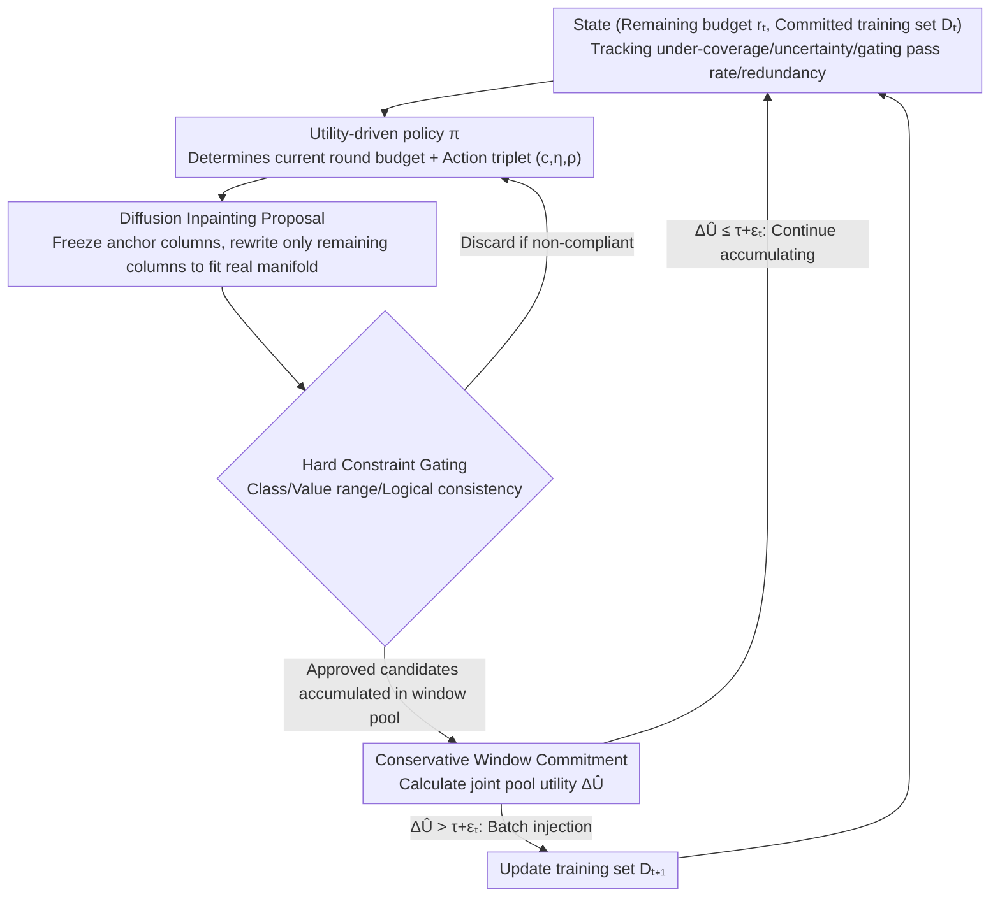

# Active Tabular Augmentation via Policy-Guided Diffusion Inpainting

**Conference**: ICML 2026  
**arXiv**: [2605.10315](https://arxiv.org/abs/2605.10315)  
**Code**: https://github.com/oooranz/TAP  
**Area**: Data Augmentation / Tabular Generation / Reinforcement Learning  
**Keywords**: Tabular Data Augmentation, Diffusion Inpainting, Utility-driven Selection, Conservative Commitment, Fidelity-Utility Gap

## TL;DR
This paper formalizes the "fidelity-utility gap" in tabular augmentation (where generators optimize for distribution matching, yet augmentation value stems from low-density regions). It proposes the TAP algorithm, which utilizes diffusion inpainting for manifold-constrained proposals, policy-guided utility-aligned selection, and hard-constraint gating with conservative window commitment. On 7 real-world tabular datasets, it achieves up to a 15.6% improvement in classification accuracy and a 32% reduction in regression RMSE compared to baselines.

## Background & Motivation

**Background**
Tabular data drives decision-making in healthcare, finance, and science, yet labeled data is often scarce. Data augmentation is a common improvement method, but its application to tables is fragile—heterogeneous features and strong inter-column dependencies mean even minor perturbations may violate constraints or introduce spurious relationships.

**Limitations of Prior Work**
1. **Fidelity-Utility Misalignment**: Existing generators (GANs, VAEs, Diffusion models) optimize distribution matching $P(X,Y)$, encouraging sampling from high-density regions. However, successful augmentation samples often originate from low-density boundaries or under-covered populations where the model is uncertain—running counter to the generation objective.
2.  **Insufficient Static Evaluation**: Samples generated by simple methods like SMOTE are statistically unrealistic, yet they often effectively improve classifiers, suggesting that fidelity is not a sufficient or necessary condition.

**Key Challenge**
The fundamental mismatch between the generator's training objective and the augmentation evaluation objective: the generator focuses on $\max_x\log P(x)$, while augmentation focuses on $\min_\theta L(\theta,D\cup S)$.

**Goal**
To learn not just "how to generate," but also "what to generate" and "when to inject," allowing samples to adapt dynamically to an evolving learner.

**Key Insight**
Formalize augmentation as a sequential control problem: in each round, maintain a commitment buffer and a temporary pool, using a policy to determine generation conditions and injection timing. Design is guided by influence function diagnostics—utility is approximately the product of the learner's loss gradient and the inverse Hessian.

**Core Idea**
Achieve utility-driven augmentation through three principles: (1) Manifold soft constraints (diffusion inpainting) + Hard constraint gating (checking valid value ranges) = Two-layer fidelity; (2) Policy learning (targeted at the learner's state) + Utility-aligned selection = Target focus; (3) Conservative window commitment (accumulating candidates and committing in batches only when pool gain exceeds a threshold) = Robustness against adversarial noise.

## Method

### Overall Architecture
TAP treats "what to generate and when to inject" as a finite-horizon, budget-constrained sequential control problem. In each round, it decides generation conditions and injection volume based on the current learner's state, rather than generating a large batch of samples at once. Formalized as an MDP, the state is $(r_t, D_t)$ (remaining budget and the committed training set). The policy $\pi$ outputs two items per round: the budget $b_t$ to spend and the generation conditions $(c,\eta,\rho)$ (target class, template, and exploration intensity). Greedy single-round allocation divides the budget into $k_i$ units for individual anchors $i$, while dynamic programming finds the optimal allocation across multiple rounds. Generated samples are not directly added to the training set but are placed in a temporary pool; they are only committed in batches once enough are collected and an overall gain is confirmed, thus linking "manifold-constrained generation → utility-aligned selection → conservative commitment" into a single pipeline.

### Key Designs

**1. Diffusion Inpainting + Triplet Action Space: Constraining generation near the real manifold while decoupling target/locality/diversity**

The problem with sampling from scratch using GAN/VAE/Diffusion is that samples may drift off the manifold or violate inter-column constraints. TAP uses "inpainting" generation instead: it freezes specific columns of a real sample to act as fixed anchors and performs reverse diffusion only on the remaining columns, guided by conditions (e.g., target class labels). Fixed columns are overwritten back to their original values at each step: $x_{\bar m}^{(s-1)}\leftarrow\sqrt{\bar\alpha_{s-1}}x_{\bar m}+\sqrt{1-\bar\alpha_{s-1}}\epsilon$. Anchors force new samples to be generated locally along the real manifold, and restricted rewriting minimizes spurious variations, providing the first layer of (soft) fidelity. On top of this, actions are split into a triplet $a=(c,\eta,\rho)$: $c$ controls class conditions, $\eta$ selects a conservative/explore template, and $\rho$ adjusts the proportion of rewritten columns within the template. These three components induce different proposal distributions $Q_a(\cdot|D_t)$. By decoupling the degrees of freedom for target, locality, and diversity, the policy can use different trade-offs at different stages of learning—exploring early and exploiting later.

**2. Utility-Driven Policy + Hard Constraint Gating: Aligning generation with current learner needs, backed by hard rules**

The misalignment where generators optimize distribution matching while augmentation gains come from low-density regions is the core contradiction addressed here. TAP handles this by letting a policy, targeted at the learner's real-time state, choose the generation conditions. The state vector observed by the policy comprises four components $(\delta_t,u_t,g_t,d_t)$, tracking under-coverage, uncertainty, recent gating pass rates, and redundancy. These four items happen to correspond to the gradient components of the learner's loss in influence function diagnostics. Consequently, when the policy maximizes KL-regularized marginal utility $\max_\pi \mathbb E[\hat A_t]-\beta\,\mathrm{KL}(\pi\|\pi_{\text{ref}})$, it is automatically pushed toward boundaries and under-covered regions rather than repeating high-density areas. Beyond the soft manifold, there is a second line of defense: every candidate must pass an acceptance function $G(x;D_t)\in\{0,1\}$, which performs hard checks on label validity, numerical ranges, and logical consistency (e.g., age cannot exceed age of death). The soft manifold ensures the sample "looks real," while the hard gating ensures it is "strictly compliant."

**3. Conservative Window Commitment: Accumulating candidates and committing only when joint utility exceeds a threshold**

In data-scarce scenarios, utility estimation for a single sample is highly noisy. Real-time injection on a per-sample basis can easily be misled by noise, introducing harmful samples into the training set. TAP maintains a sliding window $P_t$ of length $K$ and calculates the joint utility of the entire pool at commitment checkpoints: $\Delta\hat U(D_t,P_t^{(K)})=\hat L_\psi(D_t)-\hat L_\psi(D_t\cup P_t^{(K)})$ (measured using a TabPFN plug-in evaluator on a hard query set). Commitment happens only when $\Delta\hat U>\tau+\epsilon_t$, where $\tau$ is the minimum utility threshold and $\epsilon_t$ is a calibrated uncertainty interval. This requires the utility to be not just positive but significantly above the noise floor. Window accumulation makes the joint utility far more stable than single-sample estimation, which is an engineering key to resisting noise in scarce scenarios.

### Loss & Training
The trajectory objective for policy optimization is $J(\pi)=\mathbb E_\pi[\sum_{t\geq 1}\gamma^{t-1}\Delta U(D_t,P_t)]$, which is decomposed at commitment points into $\sum_i \Delta U(D_{t_i},P_i)$ for batch attribution. The plug-in utility evaluator $f_\psi$ is TabPFN (an in-context learner with fast evaluation), but it is used only for inner-loop candidate ranking. The final reported augmentation gain is obtained by retraining the full model on a validation set to ensure evaluator errors do not leak into the conclusions.

## Key Experimental Results

### Main Results

| Dataset | $N_{\text{Real}}$ | Metric | SMOTE | TVAE | CTGAN | ARF | SPADA | TabDDPM | TabDiff | TAP |
|--------|-------|------|-------|------|-------|-----|-------|---------|---------|-----|
| MiceProtein | 20 | Acc↑ | 36.21 | 41.34 | 36.93 | 32.35 | 36.91 | 37.59 | 34.05 | **44.60** |
| | 100 | Acc↑ | 71.96 | 71.27 | 63.59 | 65.13 | 65.01 | 68.86 | 66.95 | **73.06** |
| | 500 | Acc↑ | 96.44 | 96.65 | 93.75 | 93.71 | 94.56 | 96.13 | 93.81 | **96.11** |
| Credit-G | 20 | Acc↑ | 66.37 | 59.06 | 65.79 | 65.48 | 64.25 | 57.58 | 63.99 | **68.13** |
| | 100 | Acc↑ | 67.53 | 68.27 | 68.65 | 67.26 | 67.27 | 66.09 | 64.07 | **70.73** |
| Electricity | 50 | Acc↑ | 69.05 | 64.71 | 69.09 | 63.64 | 70.81 | 69.61 | 66.11 | **71.55** |
| | 100 | Acc↑ | 72.73 | 68.21 | 72.15 | 67.21 | 74.02 | 72.83 | 70.97 | **74.73** |
| Avg Gain | 20 | $\Delta$ | +3.5% | +5.8% | +4.2% | base | +2.1% | +1.8% | 0% | **+15.6%** |
| | 100 | $\Delta$ | +2.1% | -1.5% | -10.4% | base | -2.3% | -3.2% | -6.7% | **+3.8%** |

### Ablation Study

| Configuration | Val Acc | Description |
|------|-----------|------|
| Diffusion only w/o Policy | 71.2% | High fidelity but lacks targeting |
| Greedy Policy w/o Commitment | 70.8% | Real-time injection, susceptible to noise |
| Hard Gating w/o Soft Manifold | 68.5% | Filtering too strict, diversity drops |
| Full TAP | **74.3%** | All components synergistic |
| TAP w/o Window Commitment | 72.1% | Lacks conservative mechanism, prone to harmful injection |

### Key Findings
- **Fidelity is not a sufficient condition**: TabDDPM/TabDiff have the highest fidelity but limited or negative augmentation gains; TAP has lower fidelity but the highest augmentation utility.
- **Maximum gains in data scarcity**: For $N=20$, it achieves +15.6% over the best baseline; this drops to ~1% for $N=500$ as the space for augmentation narrows with sufficient data.
- **Two-layer constraints are effective**: Diffusion alone (71.2%) is inferior to the dual-layer approach (74.3%); hard gating alone (68.5%) damages diversity.
- **Policy learning outperforms fixed allocation**: The policy adaptively adjusts exploration vs. exploitation across different scarcity levels; fixed greedy (70.8%) is inferior to adaptive (74.3%).
- **Window commitment prevents harmful injection**: Windowed (74.3%) vs. non-windowed (72.1%) shows a more significant difference under high noise.

## Highlights & Insights
- **Depth of problem formalization**: Viewing augmentation as a sequential control problem and using influence function diagnostics provides an intuitive explanation for the design. Identifying the "fidelity-utility gap" is a fundamental insight into augmentation theory.
- **Thorough multi-layer design**: Soft manifold + Hard constraints + Utility policy + Conservative commitment form a complete defense, collectively addressing different failure modes.
- **Pragmatic uncertainty handling**: Window commitment and the $\tau+\epsilon_t$ threshold are elegant engineering responses to noise estimation in scarce data.

## Limitations & Future Work
- **Reliance on reference distribution**: Assumes an accurate $P$ can be learned from historical data; may fail under severe distribution shifts.
- **Estimator as an intermediate variable**: TabPFN evaluation accuracy directly affects policy training; the paper does not quantify the impact of estimator error on the policy.
- **Scale constraints**: Experiments are limited to $N\approx 10k$; performance on massive tables or ultra-high-dimensional features remains unknown.

## Related Work & Insights
- **vs SMOTE**: SMOTE's neighborhood interpolation has low fidelity but is often effective; TAP modernizes this into a learnable paradigm for "sampling from low-density, high-uncertainty regions."
- **vs GANs/VAEs/Diffusion**: These methods optimize distribution matching, which this paper reveals as the "wrong objective"; TAP corrects this misalignment with explicit utility optimization.
- **vs Influence Functions**: Koh & Liang 2017 used influence functions to understand sample impacts; this paper reverse-applies them to guide the direction of generation—a creative perspective shift.

## Rating
- Novelty: ⭐⭐⭐⭐⭐ The identification of the "fidelity-utility gap" is a new perspective; policy-guided tabular augmentation and conservative commitment are both novel methods.
- Experimental Thoroughness: ⭐⭐⭐⭐ Sufficient across 7 datasets, 5 scarcity levels, multiple baselines, and ablations; however, it does not cover other tasks like clustering or anomaly detection.
- Writing Quality: ⭐⭐⭐⭐ Clear problem formalization, well-defined design principles, and ample experimental details.
- Value: ⭐⭐⭐⭐⭐ Directly valuable in data-scarce scenarios such as healthcare and finance, breaking the "fidelity-first" myth.

<!-- RELATED:START -->

## Related Papers

- [\[ICML 2026\] Active Budget Allocation for Efficient Scaling Law Estimation via Surrogate-Guided Pruning](active_budget_allocation_for_efficient_scaling_law_estimation_via_surrogate-guid.md)
- [\[ICML 2026\] End-to-End Compression for Tabular Foundation Models](end-to-end_compression_for_tabular_foundation_models.md)
- [\[ICML 2026\] Entropy-Aware On-Policy Distillation of Language Models](entropy-aware_on-policy_distillation_of_language_models.md)
- [\[ICML 2026\] Advantage Collapse in Group Relative Policy Optimization: Diagnosis and Mitigation](advantage_collapse_in_group_relative_policy_optimization_diagnosis_and_mitigatio.md)
- [\[ICML 2026\] Auditing and Fixing Economic Validity in Tabular Foundation Models for Discrete Choice](auditing_and_fixing_economic_validity_in_tabular_foundation_models_for_discrete_.md)

<!-- RELATED:END -->
