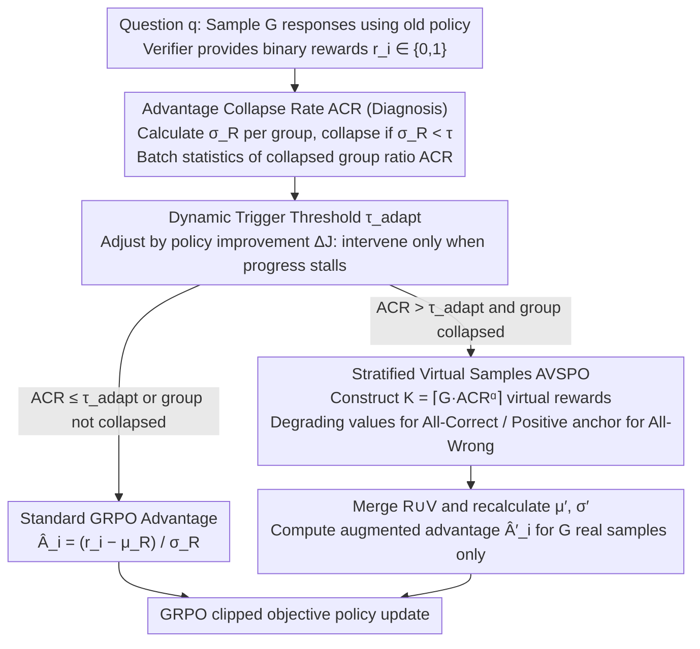

# Advantage Collapse in Group Relative Policy Optimization: Diagnosis and Mitigation

**Conference**: ICML 2026  
**arXiv**: [2605.21125](https://arxiv.org/abs/2605.21125)  
**Code**: https://github.com/hexixiang/Advantage-Collapse-Rate  
**Area**: Reinforcement Learning / LLM Reasoning  
**Keywords**: GRPO, RLVR, Advantage Collapse, Training Diagnosis, Virtual Samples

## TL;DR
This paper identifies that GRPO loses gradient signals under binary verifiable rewards when intra-group rewards are identical. It proposes the ACR metric for real-time diagnosis of this "advantage collapse" and introduces AVSPO to inject virtual reward samples, restoring intra-group variance. This approach consistently improves performance by 4-6 percentage points across various Qwen2.5 mathematical reasoning models.

## Background & Motivation
**Background**: Post-training for LLM mathematical reasoning increasingly relies on Reinforcement Learning from Verifiable Rewards (RLVR), which optimizes models using binary rewards provided by automated verifiers for final answers. GRPO is a representative algorithm in this paradigm; it avoids training a critic and instead estimates advantage by comparing multiple sampled responses for the same problem. Consequently, it is more memory-efficient than actor-critic methods like PPO and scales more easily to long-reasoning tasks.

**Limitations of Prior Work**: GRPO's advantage estimation depends on the mean and standard deviation of intra-group rewards. When the $G$ sampled responses for a problem are either all incorrect or all correct, the reward variance within the group becomes zero, causing the advantage for all samples to become zero. The issue is that such batches consume expensive LLM rollouts without providing effective gradients for policy updates. Furthermore, standard training logs—such as loss, average reward, or even accuracy—may fail to expose this inefficiency in a timely manner.

**Key Challenge**: Binary verifiable rewards are simple and reliable, but they are also highly prone to producing "all-0 / all-1" homogeneous rewards. Since GRPO eliminates the critic, it places its learning signal entirely on intra-group relative differences. Consequently, the sparser the reward—or the easier/more difficult the problem—the more likely it is that gradients become zero despite the computational effort expended.

**Goal**: The authors aim to solve two sub-problems. First, how to quantify the proportion of groups entering an ineffective gradient state during training. Second, how to enable these wasted samples to generate a learning signal without re-sampling or additional model calls once collapse is detected.

**Key Insight**: Instead of modifying the reward model or sampling strategy, the paper returns to the GRPO advantage formula itself. By monitoring the intra-group reward standard deviation, one can determine if a group will produce effective gradients. Injecting inexpensive virtual rewards to alter the normalization statistics can potentially restore non-zero advantages.

**Core Idea**: Use ACR to directly measure the ratio of "near-zero reward variance" in a GRPO batch and inject virtual rewards into the normalization statistics of collapsed groups, thereby transforming invalid rollouts into updatable samples.

## Method

### Overall Architecture
To address the waste of "computing an entire batch without gradients" in GRPO under binary rewards, the paper adds a diagnoser and a lightweight intervener. The diagnoser, ACR, answers "how much computation in the current batch was wasted," while the intervener, AVSPO, supplements a controllable normalization reference for these wasted groups, allowing real samples to regain directional advantage. Crucially, virtual samples are merely numerical values rather than new text outputs; they do not participate in the policy gradient themselves but only change the mean/std of the rewards, thus incurring no extra LLM forward overhead.

Specifically, training follows the GRPO backbone: for each query $q$, the old policy samples $G$ responses, and the verifier provides binary rewards $r_i \in \{0,1\}$. Standard GRPO calculates intra-group advantage as $\hat{A}_i=(r_i-\mu_R)/(\sigma_R+\epsilon)$ before entering the clipped objective. AVSPO inserts three intermediate steps: first, it calculates the reward standard deviation for each group; if $\sigma_R < \tau$, the group is identified as undergoing advantage collapse. Second, it aggregates the proportion of collapsed groups at the batch level to obtain the ACR and uses a dynamic threshold to decide whether to intervene. Finally, for collapsed groups that trigger intervention, it constructs $K$ virtual rewards to recalculate $\mu_{R'}$ and $\sigma_{R'}$, but computes new $\hat{A}'_i$ only for the real samples to update the model.

### Key Designs

**1. Advantage Collapse Rate: Turning "Wasted Training" into a Real-time Metric**

The pain point of GRPO is that when $G$ responses are all correct or all wrong, the intra-group reward variance is zero, the advantage becomes zero, and expensive rollouts yield zero gradient. ACR addresses this by checking $\sigma_{R_j} < \tau$ for each of the $N$ groups in a batch and calculating the proportion: $ACR = \frac{1}{N} \sum_j \mathbb{I}(\sigma_{R_j} < \tau)$. A value near 0 suggests most groups have reward variance, while a value near 1 implies almost all rollouts are stuck with zero gradients. Its utility lies in reusing existing GRPO reward statistics without requiring a critic or additional inference, transforming "training stagnation" from an ex-post accuracy observation into a real-time monitorable signal.

**2. Adaptive Virtual Samples (AVSPO): Supplementing Statistical References without Re-sampling**

Diagnosing collapse is only the first step; the goal is to make wasted groups generate learning signals without re-sampling. AVSPO constructs $K = \max(1, \min(G, \lceil G \cdot ACR^\alpha \rceil))$ virtual rewards when the ACR exceeds a dynamic threshold. If the real group is all-correct, virtual rewards are assigned in a stratified descending manner from a value near 1; if all-wrong, a small positive anchor reward is used to create non-zero virtual values. The combined set $R' = R \cup V$ is used to recalculate the mean and standard deviation, while the policy gradient is still applied only to the original $G$ real responses. This is effective because all-wrong or all-correct groups are not uninformative: all-wrong implies the strategy should move away from these trajectories, and all-correct implies successful trajectories deserve further reinforcement. Virtual rewards do not forge responses but provide a statistical reference so that directional information in homogeneous groups is not erased by the normalization formula.

**3. Dynamic Triggering and Bounded Bias Control: On-demand Intervention without Divergence**

Since virtual rewards modify the advantage normalization, it is critical to control when and how strongly to intervene. AVSPO sets the initial trigger threshold $\tau_{adapt}$ to 0.5 and adjusts it dynamically based on whether training is improving (using the change in average batch reward $\Delta J$). This makes it an on-demand repair mechanism that activates when progress stalls rather than a permanent reward-shaping term. Furthermore, the number of virtual samples scales with $ACR^\alpha$ ($\alpha=0.5$ by default), supplementing more samples only when collapse is widespread. Bias is controlled by a hard constraint $K \le G$, ensuring virtual samples never outnumber real ones to limit perturbations to the original gradient. The paper proves that recovered advantages in collapsed groups are standardized variables with a bounded magnitude ($|\hat{A}'_i| \le \sqrt{G+K}$). This represents a bias-variance tradeoff: introducing bounded bias is preferable to allowing the gradient to stagnate completely.

### Loss & Training
The objective for AVSPO remains the GRPO clipped surrogate, with the advantage $\hat{A}_i$ replaced by $\hat{A}'_i$ calculated from the augmented reward set. Virtual rewards only contribute to $\mu_{R'}$ and $\sigma_{R'}$ and do not generate $\nabla_\theta \log \pi_\theta$ terms. In experiments, the group size is 8, training temperature is 1.0, and greedy decoding is used for evaluation. Hyperparameters for AVSPO include an initial threshold of 0.5, $\alpha=0.5$, a threshold learning rate of 0.01, and a collapse threshold $\tau = 10^{-6}$ with an anchor reward of 0.1.

## Key Experimental Results

### Main Results
The paper conducts training for 500 steps across 6 Qwen2.5 series models using a Level 3-500 subset of the MATH training split. Evaluations cover MATH-500, GSM8K, Minerva, OlympiadBench, AMC, AIME24, and MMLU-Pro. The core conclusion is that AVSPO simultaneously reduces ACR and enhances average accuracy, with models exhibiting higher baseline ACR seeing more significant benefits.

| Model | GRPO ACR | AVSPO ACR | GRPO Avg Acc | AVSPO Avg Acc | Gain |
| :--- | :--- | :--- | :--- | :--- | :--- |
| Qwen2.5-0.5B | 0.45 | 0.18 | 16.5 | 21.0 | +4.5 |
| Qwen2.5-3B | 0.37 | 0.14 | 27.9 | 32.2 | +4.3 |
| Qwen2.5-3B-Instruct | 0.35 | 0.13 | 39.7 | 43.4 | +3.7 |
| Qwen2.5-14B | 0.28 | 0.11 | 49.9 | 54.5 | +4.6 |
| Qwen2.5-Math-1.5B | 0.40 | 0.15 | 33.5 | 39.6 | +6.1 |
| Qwen2.5-Math-7B | 0.33 | 0.14 | 42.2 | 45.9 | +3.7 |

Compared to other baselines, AVSPO demonstrates stronger average performance. The authors report that it outperforms DCPO by approximately +2.9 and surpasses INTUITOR and RENT by even larger margins. This suggests that directly fixing batch-level reward diversity is more stable than solely modifying clipping, encouraging low entropy, or using confidence-based rewards.

### Ablation Study
The construction method of virtual samples is the most critical ablation target. While random sampling, fixed partial credit, and exponential decay all reduce ACR, the stratified reward assignment performs best, indicating that mere variance is insufficient; the structure of virtual rewards also influences the direction and stability of the advantage.

| Configuration | ACR | MATH-500 | Description |
| :--- | :--- | :--- | :--- |
| GRPO (No Augmentation) | 0.40 | 58.6 | All collapsed groups have advantage 0 |
| Random Uniform Virtual Reward | 0.22 | 62.1 | Effectively reduces collapse but introduces random variance |
| Fixed Partial Credit | 0.19 | 63.5 | Simple and stable, but lacks reward granularity |
| Exponential Decay | 0.18 | 64.2 | More refined than fixed values, but inferior to stratified |
| AVSPO (Stratified Strategy) | 0.15 | 67.2 | Lowest ACR, highest accuracy |

Mechanism isolation experiments are also revealing. Repairing only all-wrong groups reduces all-wrong collapse from 24.8% to 9.1% (Accuracy: 63.2). Repairing only all-correct groups reduces all-correct collapse from 15.2% to 4.2% (Accuracy: 60.8). Full AVSPO reduces these to 8.7% and 6.3% respectively, reaching 67.2 on MATH-500. In threshold comparisons, the best fixed threshold reached 60% accuracy at 380 steps, whereas the adaptive threshold required only 295 steps and achieved a higher final accuracy of 67.2.

### Key Findings
- ACR is a powerful diagnostic signal: The correlation coefficient between the ACR of the first 100 steps and the final MATH-500 accuracy is $r = -0.785$ ($R^2 = 0.617$), meaning early ACR explains approximately 62% of the final performance variance.
- Collapse is not a rare anomaly: Standard GRPO experiences full advantage collapse in 28%-45% of batch groups in these mathematical reasoning settings, constituting a significant bottleneck for training efficiency.
- Medium difficulty samples are optimal for RLVR training: Samples that are too easy (all-correct) or too hard (all-wrong) both increase ACR. Level 3-4 difficulty allows for more natural reward diversity.
- Augmentation outperforms filtering: On Qwen2.5-Math-7B, "Filter-Drop" utilizes only 62.4% of samples, and DAPO increases costs by roughly 1.8x. AVSPO maintains 100% sample utility and 1.0x cost while reaching 69.7/74.1 on GSM8K/MATH.

## Highlights & Insights
- The most valuable contribution of this paper is formalizing the failure mode of GRPO as a measurable training diagnostic rather than merely reporting "RL instability." ACR is simple yet directly corresponds to the zero-variance condition in the advantage formula, making it highly explanatory.
- The design of virtual samples in AVSPO is clever: it avoids generating pseudo-text or introducing new reward models, instead merely altering normalization statistics. This keeps the engineering overhead near zero and avoids extra rollout costs.
- The discussion of all-correct collapse is important. While many focus on all-wrong groups lacking learning signals, all-correct groups similarly prevent GRPO from further reinforcing successful trajectories. AVSPO provides a unified treatment for both.
- The sensitivity analysis of ACR to data difficulty, temperature, and group size is directly transferable to other RLVR pipelines. Even without AVSPO, practitioners can use ACR to early-stop inefficient configurations or adjust sampling temperatures.
- The theoretical portion is not merely decorative. It demonstrates that virtual samples decrease the probability of the failure set in all-wrong groups and increase the probability of the success set in all-correct groups. PPO clipping further prevents over-reinforcement, addressing concerns about virtual rewards leading the policy astray.

## Limitations & Future Work
- Experiments primarily focus on mathematical reasoning and binary deterministic verifiers. Whether the ACR threshold and virtual reward design remain suitable for open-ended preference rewards, multi-level rewards, or noisy verifiers requires further validation.
- AVSPO fixes the issue of zero intra-group reward variance but cannot resolve verifier errors, data distribution bias, or insufficient model capacity. The authors observed smaller gains in competition-level tasks like AMC/AIME, suggesting the bottleneck there has shifted to model capability.
- Virtual rewards inherently change advantage normalization and introduce bounded bias. While the paper discusses upper bounds and convergence, whether this bias accumulates into policy preferences in long-term, multi-turn tool-use agent tasks warrants long-term training experiments.
- The current method assumes all collapsed groups can be repaired at a statistical level. Future work could combine process rewards, error-type diagnosis, or curriculum scheduling to intervene only on "learning-valuable" collapsed groups, avoiding signaling for truly uninformative or unreliable verifiers.

## Related Work & Insights
- **vs GRPO**: GRPO eliminates the critic using intra-group relative rewards but lacks gradients when rewards are identical. AVSPO maintains the main GRPO structure while modifying advantage statistics in collapsed groups, serving as a targeted fix for GRPO’s failure mode.
- **vs PPO/GAE**: PPO with GAE can mitigate some variance issues through value baselines but requires a critic, leading to higher VRAM and complexity. This work aims to retain GRPO’s critic-free advantage through reward-statistic intervention.
- **vs PRM / Dense Reward**: Process Reward Models provide fine-grained supervision but require extra labeling or reward model training. AVSPO uses only final answer verifiers, making it suitable for math and code tasks where deterministic checkers already exist.
- **vs DAPO / DCPO**: These methods improve GRPO via clipping, dynamic sampling, or optimization details. AVSPO acts at a lower level by focusing on batch-level reward diversity, making it complementary to systemic GRPO recipes.
- **Insights**: For all group-comparison RL algorithms, one should monitor the "effective gradient ratio" rather than just the reward mean. Metrics like ACR can be extended to other binary verification tasks such as code generation, tool calls, and automated theorem proving.

## Rating
- Novelty: ⭐⭐⭐⭐☆ The metric itself is simple, but systematically quantifying advantage collapse and repairing it with virtual rewards is a direct and effective supplement to the GRPO mechanism.
- Experimental Thoroughness: ⭐⭐⭐⭐☆ Covers multi-scale models, several math benchmarks, ACR correlation, ablations, and cost comparisons, though validation in open-ended RLHF or non-binary reward scenarios is missing.
- Writing Quality: ⭐⭐⭐⭐☆ Problem definitions are clear, and the method and experiments revolve around the collapse concept. Theoretical analysis serves the main arguments well.
- Value: ⭐⭐⭐⭐⭐ Extremely practical for anyone training with RLVR/GRPO. ACR is worth integrating into training logs as a diagnostic metric even regardless of the intervention method.

<!-- RELATED:START -->

## Related Papers

- [\[AAAI 2026\] MetaGDPO: Alleviating Catastrophic Forgetting with Metacognitive Knowledge through Group Direct Preference Optimization](../../AAAI2026/model_compression/metagdpo_alleviating_catastrophic_forgetting_with_metacognitive_knowledge_throug.md)
- [\[ICML 2026\] Entropy-Aware On-Policy Distillation of Language Models](entropy-aware_on-policy_distillation_of_language_models.md)
- [\[ICML 2026\] Active Tabular Augmentation via Policy-Guided Diffusion Inpainting](active_tabular_augmentation_via_policy-guided_diffusion_inpainting.md)
- [\[ICLR 2026\] Rethinking Continual Learning with Progressive Neural Collapse](../../ICLR2026/model_compression/rethinking_continual_learning_with_progressive_neural_collapse.md)
- [\[ICML 2025\] ConfPO: Exploiting Policy Model Confidence for Critical Token Selection in Preference Optimization](../../ICML2025/model_compression/confpo_exploiting_policy_model_confidence_for_critical_token_selection_in_prefer.md)

<!-- RELATED:END -->
