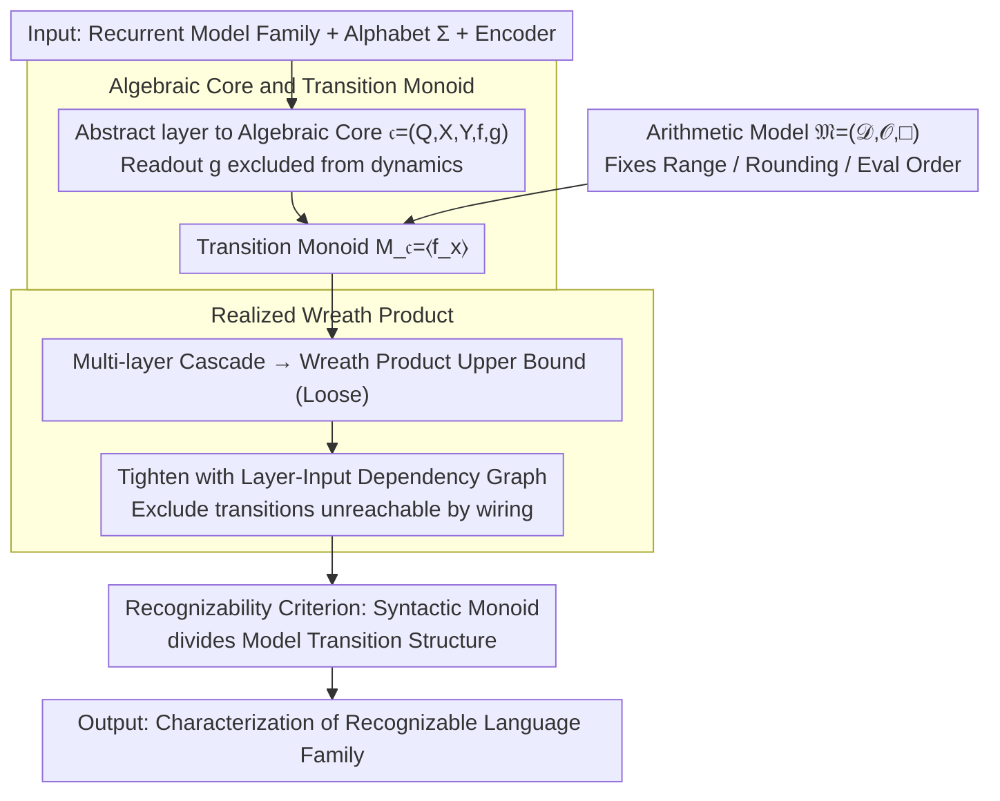

# An Algebraic View of the Expressivity of Recurrent Language Models

**Conference**: ICML2026  
**arXiv**: [2606.01765](https://arxiv.org/abs/2606.01765)  
**Code**: None  
**Area**: LLM/NLP  
**Keywords**: Recurrent Language Models, Formal Languages, Transition Monoids, Finite Precision, State Space Models  

## TL;DR
This paper unifies the formal language expressivity of RNN/SSMs into an algebraic problem: once numerical semantics are fixed, the languages a model can recognize are determined by its hierarchical transition monoids and their wreath products. Furthermore, the same architecture yields entirely different counting capabilities under floating-point versus unsigned integer semantics.

## Background & Motivation
**Background**: Recent analyses of language model expressivity often treat architectures like RNNs, SSMs, and Transformers as formal language recognizers to determine if they can perform tasks such as Dyck language recognition, modulo counting, or finite automaton simulation. Theoretical results in this direction often translate into architectural insights, such as whether linear RNNs or Mamba-like state space models can maintain counting information over long sequences.

**Limitations of Prior Work**: Conclusions in existing literature are inconsistent. Some works prove that RNNs possess strong computational power—even reaching Turing completeness—under exact real or rational arithmetic. Others demonstrate that under finite precision or resource-constrained assumptions, they can only simulate finite automata. The issue is not that one side is "wrong," but that these proofs default to different arithmetic models, rounding rules, overflow semantics, and evaluation orders.

**Key Challenge**: Neural network formulas appear to be continuous real-number operations, but real-world deployment occurs on discrete, finite numerical systems with rounding. If a theoretical proof relies on the associative law in the real field, infinite precision, or reorderable algebraic identities, it may not transfer to floating-point implementations. Conversely, stating "finite precision" without specifying exact operational semantics fails to produce reproducible expressivity conclusions.

**Goal**: **Ours** aims to provide a unified framework that decomposes the expressivity of recurrent language models into three replaceable components: the state transition structure of the architecture, the composition of inter-layer wiring, and the underlying arithmetic semantics. This allows for precise identification of whether conflicting conclusions arise from the architecture itself or from numerical semantics.

**Key Insight**: Starting from monoid theory in automata theory, the paper treats each recurrent core as a finite state transition system and the hierarchical composition of deep RNNs as the wreath product of transformation monoids. Recognizing a formal language is no longer about direct parameter construction, but about determining whether the syntactic monoid of the target language divides the monoid structure achievable by the model.

**Core Idea**: Replace ambiguous real-valued formulas with "transition monoids under fixed arithmetic semantics," thereby reducing RNN/SSM expressivity to a divisibility problem in finite algebra.

## Method

### Overall Architecture
This paper does not propose a new training algorithm but establishes an algebraic microscope for recurrent language models: a single recurrent module is abstracted as an algebraic core, a multi-layer network is abstracted as a cascade of cores, and all possible hierarchical transitions are captured using wreath products. The "realized input set" is used to tighten the analysis to parts reachable by actual wiring. Finally, "recognizing a formal language" is reduced to a checkable algebraic criterion: "can the syntactic monoid of the target language divide the transition structure of the model?" The input is a class of recurrent models, a finite alphabet, fixed encoders, and numerical semantics; the output is a structural characterization of the recognizable language family. The reduction pipeline is shown below:

### Key Designs

**1. Algebraic Core and Transition Monoid: Abstracting RNN Layers as Pure State Transition Systems**

Conflicting literature conclusions partly arise from mixing decoder expressivity with recurrent dynamics. To address this, the paper abstracts each recurrent layer into a core $\mathfrak{c}=(Q,X,Y,f,g)$—consisting of state set $Q$, input set $X$, output set $Y$, transition $f:Q\times X\to Q$, and readout $g:Q\times X\to Y$—retaining only the core structure of input-driven state changes. A crucial step is that each input $x\in X$ induces a self-map $f_x:Q\to Q$, and all such maps generate the transition monoid $M_{\mathfrak{c}}=\langle f_x\mid x\in X\rangle$ under function composition. The readout $g$ is intentionally excluded from this monoid because it determines how states are observed, not how they evolve. This separates "what dynamic information is stored" from "how the answer is read," avoiding the misattribution of decoder power to the recurrence.

**2. Realized Wreath Product: Counting Only Hierarchically Triggered Transitions**

Deep RNNs are not parallel direct products but cascaded systems where lower-layer states modify the current input of upper layers. Thus, the ambient upper bound is the iterated wreath product of each layer's transition monoid. However, this bound is too loose, as it allows upper layers to receive any input in $X_n$, including those never sent by the encoder or wiring. The paper defines a layer-input dependency map $\varphi_n^T$ to collect only reachable inputs from the initial set $T$, generating a tightened $M_n^T$ and the realized wreath product $\mathbb{W}_{\mathcal{R}}^T=(M_1^T,Q_1)\wr\cdots\wr(M_N^T,Q_N)$. This tightening eliminates "phantom" expressivity allowed by the architecture but never triggered by wiring, supporting precise non-expressibility proofs while allowing localized updates when the encoder or input distribution changes.

**3. Embedding Arithmetic Semantics into Model Definitions: Explaining Conflicting Conclusions**

The same RNN/SSM may appear Turing complete in one paper and equivalent to a finite automaton in another due to defaults in the arithmetic model. The paper explicitly defines the arithmetic model as $\mathfrak{M}=(\mathcal{D},\mathcal{O},\square)$, where $\mathcal{D}$ is the representable range, $\mathcal{O}$ is the operator set, and $\square$ is the rounding/truncation map. Every expression is forced to have a fixed evaluation tree, and recurrent updates must follow "recurrence-consistent evaluation" (completing time $t$ before $t+1$). This granularity is necessary because floating-point addition and multiplication are non-associative; reordering by compilers or hardware changes the single-step recurrence itself. Without fixing these semantics, the question of "recognizability" is not well-defined.

### Loss & Training
This work investigates expressivity rather than learnability and does not involve training losses or optimization strategies. Given an architecture family and numerical semantics, it asks whether there **exists** a parameterized instance capable of recognizing a target formal language. The authors clarify that the framework does not guarantee these parameters can be discovered via gradient descent.

## Key Experimental Results

### Main Results
The "Main Results" are theoretical findings and case studies rather than dataset benchmarks. The most central result compares expressivity differences across different arithmetic models within a unified algebraic table.

| Object | Criterion / Result | Conclusion | Impact |
|------|-------------|------|------|
| Single-layer Algebraic Core | $M_{\mathfrak{c}}=\langle f_x\rangle$ | Intra-layer dynamics determined by transition monoid | Maps architecture capability to monoid problems |
| Deep Algebraic RNN | $M_{\mathcal{R}}^T\leq W_{\mathcal{R}}^T$ | Global transitions embedded in realized wreath product | Allows wreath product analysis of hierarchical composition |
| Language Acceptor | $M(\mathcal{L})\prec M_{\mathcal{R}^+}^{e(\Sigma)}\leq W_{\mathcal{R}^+}^{e(\Sigma)}$ | Syntactic monoid must divide the model transition structure | Unified entry point for non-recognizability proofs and constructions |
| Non-negative Diagonal SSM + Float | Core monoid is aperiodic | Cannot implement modulo counting requiring non-trivial groups | Corrects overstatements about SSM counting abilities |
| Diagonal SSM + Unsigned Int Quantization | Can contain $\mathbb{Z}/2^k\mathbb{Z}$ | Supports even modulo counting structures | Numerical semantics changes expressivity |

### Ablation Study
The following table serves as an arithmetic semantics analysis: keeping the diagonal SSM form essentially constant while replacing the recurrence multiplier and numerical model to observe the group structures that can emerge in the core monoid.

| Configuration | Key Metric | Description |
|------|---------|------|
| Non-negative Recurrence + Float (fp) | Only trivial subgroups; core monoid is aperiodic | Non-negative floating-point affine updates are order-preserving maps on a finite chain; cannot generate non-trivial cycles |
| Signed Multiplier + Float (fp) | $\mathbb{Z}/2\mathbb{Z}$ can appear, but subgroups are at most elementary abelian 2-groups | Negative multipliers introduce order-reversing maps, allowing at most second-order flip structures |
| Non-negative Recurrence + Unsigned Int ($\mathrm{int}^p$) | Can implement $\mathbb{Z}/2^k\mathbb{Z}$, $k\leq p$ | Wraparound addition $q\mapsto q+1\bmod 2^p$ directly provides cyclic counters |
| Unfixed Evaluation Order | Expressivity statements become ill-defined | After reordering non-associative float operations, the single-step recurrence function itself may change |

### Key Findings
- The primary contribution is not a single new theorem but the decoupling of "architecture, wiring, and arithmetic semantics," allowing previously conflicting conclusions to be compared within a single coordinate system.
- For finite-precision models, all induced transition monoids are finite; thus, recognizable languages are at most regular. Discussions of non-regular capabilities must explicitly introduce precision, depth, or external resources that grow with sequence length.
- The diagonal SSM case study is highly insightful: the same formal recurrence cannot perform even modulo counting under non-negative floating-point semantics but can construct counters under unsigned integer wraparound semantics.

## Highlights & Insights
- The paper argues thoroughly that "numerical semantics are part of the model." Many expressivity proofs default to real algebraic identities, but rounding, overflow, and non-associativity in actual floating-point systems change the transition function itself, which is critical in long-sequence recurrence.
- The realized wreath product is a clean abstraction. It retains the "lower-layer controls upper-layer" hierarchy of deep RNNs while avoiding phantom monoids caused by unreachable inputs, facilitating precise non-expressibility proofs.
- The design of the acceptor treats the decoder as a layer in the network cascade rather than ephemeral post-processing, allowing language recognition to connect strictly to the syntactic monoid. This makes the interface between ML-style RNNs and classical automata theory more natural.
- **Novelty**: For practical architecture design, if a task depends on stable counting or group structures, a continuous formula that "looks like a recurrence" is insufficient; one must verify if the deployed numerical types actually support the corresponding algebraic cycles.

## Limitations & Future Work
- **Ours** analyzes existential expressivity rather than learnability. An architecture being algebraically capable of expressing a language does not imply that SGD will find those parameters.
- The framework primarily covers finite-precision semantics and thus naturally falls within the scope of regular languages; extensions to infinite monoids or resource-sensitive versions are needed for models with length-dependent precision or memory.
- The paper focuses on explicit recurrent architectures, specifically RNNs and diagonal SSMs. To incorporate Transformers, they must first be formalized as recurrent computations, which is not straightforward for global attention models.
- The case studies primarily re-analyze known controversies in diagonal SSM expressivity rather than systematically covering all modern sequence models. Future work could place linear attention, RWKV, RetNet, or chunked SSMs into the same algebraic template.

## Related Work & Insights
- **vs Siegelmann & Sontag's Turing Completeness**: Those results typically rely on exact real or infinite precision assumptions. This paper emphasizes that such assumptions do not automatically migrate to finite-precision deployments; the trade-off is more reproducible semantics for more conservative conclusions.
- **vs Merrill's Finite-Precision Analysis**: Prior work noted that finite precision limits expressivity. **Ours** goes further by requiring arithmetic models, evaluation orders, and transition monoids to be made explicit, translating limits into checkable algebraic divisibility conditions.
- **vs Sarrof et al. on SSM Counting**: This paper replicates and refines the limitations of non-negative diagonal SSMs while demonstrating that the same recurrence family can implement modulo counting under unsigned integer semantics, showing the core of the controversy lies in numerical semantics rather than the "SSM" label.
- **Insight**: Theoretical work on language models should report implementation semantics—numerical domain, rounding, overflow, NaN handling, eval order—with the same importance as the architecture. Otherwise, expressivity conclusions may only hold for formulas on paper.

## Rating
- Novelty: ⭐⭐⭐⭐⭐ Unifying RNN expressivity controversies through monoid divisibility and wreath products provides a very clear theoretical perspective.
- Experimental Thoroughness: ⭐⭐⭐⭐☆ As a theory paper, the case studies sufficiently support the claims, though more modern architecture instantiations could be analyzed.
- Writing Quality: ⭐⭐⭐⭐☆ Rigorous and complete, though the heavy algebraic background may pose a barrier to readers unfamiliar with formal language theory.
- Value: ⭐⭐⭐⭐⭐ Offers long-term reference value for RNN/SSM expressivity, finite-precision theory, and reproducible architecture analysis.

<!-- RELATED:START -->

## Related Papers

- [\[ACL 2026\] Why Steering Works: Toward a Unified View of Language Model Parameter Dynamics](../../ACL2026/model_compression/why_steering_works_toward_a_unified_view_of_language_model_parameter_dynamics.md)
- [\[ICML 2026\] Procedural Pretraining: Warming Up Language Models with Abstract Data](procedural_pretraining_warming_up_language_models_with_abstract_data.md)
- [\[ICML 2026\] WinQ: Accelerating Quantization-Aware Training of Language Models Around Saddle Points](winq_accelerating_quantization-aware_training_of_language_models_around_saddle_p.md)
- [\[ICML 2026\] IDLM: Inverse-distilled Diffusion Language Models](idlm_inverse-distilled_diffusion_language_models.md)
- [\[ICML 2026\] Entropy-Aware On-Policy Distillation of Language Models](entropy-aware_on-policy_distillation_of_language_models.md)

<!-- RELATED:END -->
